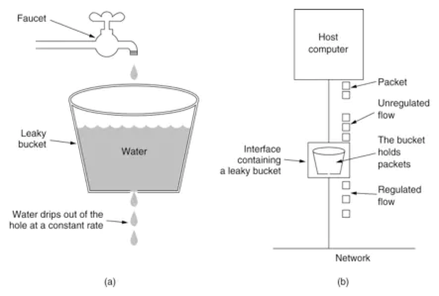
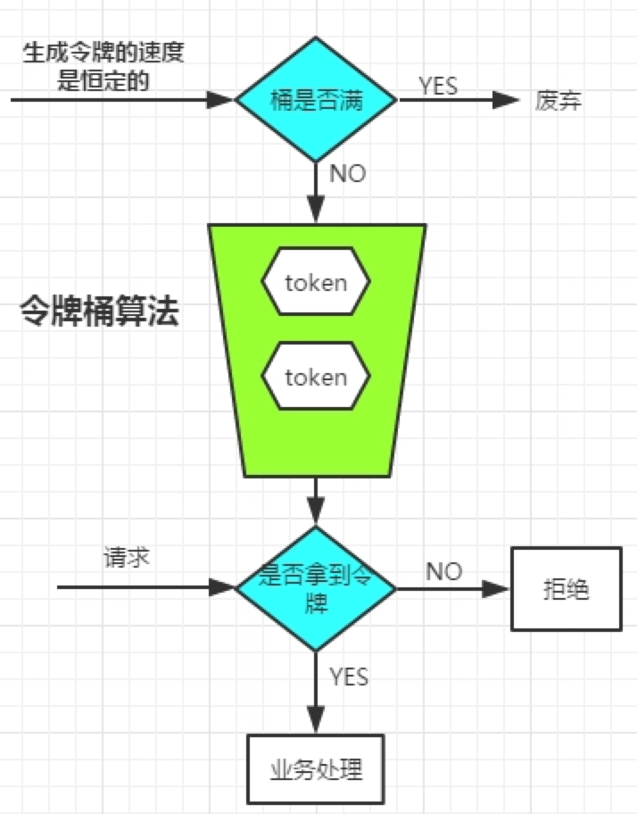

# 技术分享 | 一文了解高并发限流算法

**原文链接**: https://opensource.actionsky.com/20200917-python/
**分类**: 技术干货
**发布时间**: 2020-09-17T00:32:07-08:00

---

作者：杨奇龙
本文来源：原创投稿
*爱可生开源社区出品，原创内容未经授权不得随意使用，转载请联系小编并注明来源。
**一、前言**
作为热点频出的电商系统，经常遇到高并发，热点秒杀的场景。我们在开发设计高并发海量业务请求的系统时，通常利用三板斧：缓存、降级和限流来保障系统稳定性。
> 缓存：使业务数据更靠近数据的使用者，提升程序访问数据速度和增大系统QPS容量。
> 降级：当系统容量达到一定健康阈值时根据当前业务情况及流量对一些服务和页面有策略的降级，以此释放服务器资源以保证核心任务的正常运行。
> 限流：通过对并发访问/请求进行限速，或者对一个时间窗口内的请求进行限速来保护系统稳定可用，一旦达到限制速率则可以拒绝服务、排队或等待、降级等处理。
本文聊聊限流的常用算法，并且通过案例测试验证令牌桶算法。
**二、限流算法**
目前程序开发过程常用的限流算法有两个：**漏桶算法和令牌桶算法**。
漏桶算法
漏桶算法的原理比较简单，请求进入到漏桶中，漏桶以一定的速率漏水。当请求过多时，水直接溢出。可以看出，漏桶算法可以强制限制数据的传输速度。
如图所示，把请求比作是水滴，水先滴到桶里，通过漏洞并以限定的速度出水，当水来得过猛而**出水**不够快时就会导致水直接溢出，即拒绝服务。
											
图片来自网络
漏桶的出水速度是恒定的，那么意味着如果瞬时大流量的话，将有大部分请求被丢弃掉（也就是所谓的溢出）。
令牌桶算法
令牌桶算法的原理是系统以一定速率向桶中放入令牌，如果有请求时，请求会从桶中取出令牌，如果能取到令牌，则可以继续完成请求，否则等待或者拒绝服务。这种算法可以应对突发程度的请求，因此比漏桶算法好。
											
图片来自网络
漏桶算法和令牌桶算法的选择
两者的主要区别**漏桶算法能够强行限制处理数据的速率，不论系统是否空闲。而令牌桶算法能够在限制数据的平均处理速率的同时还允许某种程度的突发流量。**
如何理解上面的含义呢？
漏桶算法，比如系统吞吐量是 120/s，业务请求 130/s，使用漏斗限流 100/s，起到限流的作用，多余的请求将产生等待或者丢弃。
对于令牌桶算法，每秒产生 100 个令牌，系统容量 200 个令牌。正常情况下，业务请求 100/s 时，请求能被正常被处理。当有突发流量过来比如 200 个请求时，因为系统容量有 200 个令牌可以同一时刻处理掉这 200 个请求。如果是漏桶算法，则只能处理 100 个请求，其他的请求等待或者被丢弃。
**三、代码实现**
本案例使用 python 基于令牌桶算法进行测试。- 
- 
- 
- 
- 
- 
- 
- 
- 
- 
- 
- 
- 
- 
- 
- 
- 
- 
- 
- 
- 
- 
- 
- 
- 
- 
- 
- 
- 
- 
- 
- 
- 
- 
- 
- 
- 
- 
- 
- 
- 
- 
- 
- 
- 
- 
- 
- 
- 
- 
- 
- 
- 
- 
- 
- 
- 
- 
- 
- 
- 
- 
- 
- 
- 
- 
- 
- 
- 
- 
- 
- 
- 
`# encoding: utf-8``"""``author: yangyi@youzan.com``time: 2020/9/9 10:43 PM``func: ``"""``import time``import multiprocessing``
``TEST = {``    # 测试 {'test1': 20} 每秒产生的令牌数量``    'all': {``        'test1': {'test1': 20},``        'test2': {'test2': 50},``        'test3': {'test3': 80},``        'test4': {'test4': 100},#表示突发100个请求``        'test5': {'test5': 200},#表示突发200个请求``        'test6': {'test6': 20},``    }``}``
``
``class TokenBucket(object):``
``    # rate是令牌发放速度，capacity是桶的大小``    def __init__(self, rate, capacity):``        self._rate = rate``        self._capacity = capacity``        self._current_amount = 0``        self._last_consume_time = int(time.time())``
``    # token_amount是发送数据需要的令牌数``    def consume(self, token_amount):``        time.sleep(1)``        # 计算从上次发送到这次发送，新发放的令牌数量``        increment = (int(time.time()) - self._last_consume_time) * self._rate``        # 令牌数量不能超过桶的容量``        self._current_amount = min(``            increment + self._current_amount, self._capacity)``        # 如果没有足够的令牌，则不能发送数据``        if token_amount > self._current_amount:``            return False``        self._last_consume_time = int(time.time())``        self._current_amount -= token_amount``        return True``
``
``def job():``    i = 100``    while i>1:``        for result in result_dict.values():``            key = tuple(result.keys())[0]``            rate = tuple(result.values())[0]``            i = i-1``            if i <= 0:``                break``
``            if not limiter.consume(rate):``                print(key + ' 限流')``            else:``                print(key + ' 正常')``
``def run():``    threads = [multiprocessing.Process(target=job) for i in range(3)]``    for thread in threads:``        thread.start()``
``if __name__ == '__main__':``    result_dict = TEST["all"]``    RATE = 30``    CAPACITY = 120``    limiter = TokenBucket(RATE, CAPACITY)``    run()`
这段测试代码比较简单，大家可以结合自己的业务场景在编写工具时看看哪里可以使用到限流算法。
**四、参考文章**
https://github.com/titan-web/rate-limithttps://www.jianshu.com/p/c6b20845561ahttps://www.simpleapples.com/2018/03/20/implementation-of-the-token-bucket-algorithm-in-python/
相关推荐：
[新特性解读 | MySQL 8.0 之原子 DDL](https://opensource.actionsky.com/20200709-mysql/)
[社区投稿 | 如何正确理解 RT 并监控 MySQL 的响应时间](https://opensource.actionsky.com/20191030-mysql/)