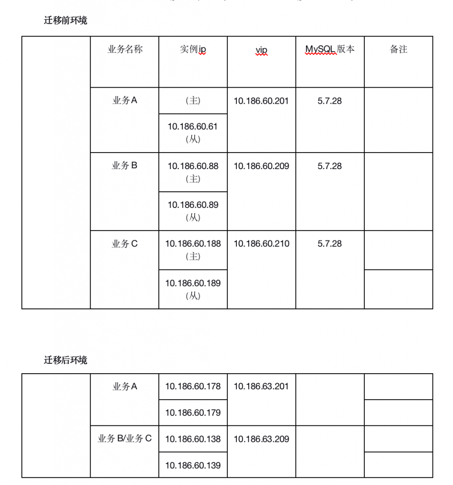
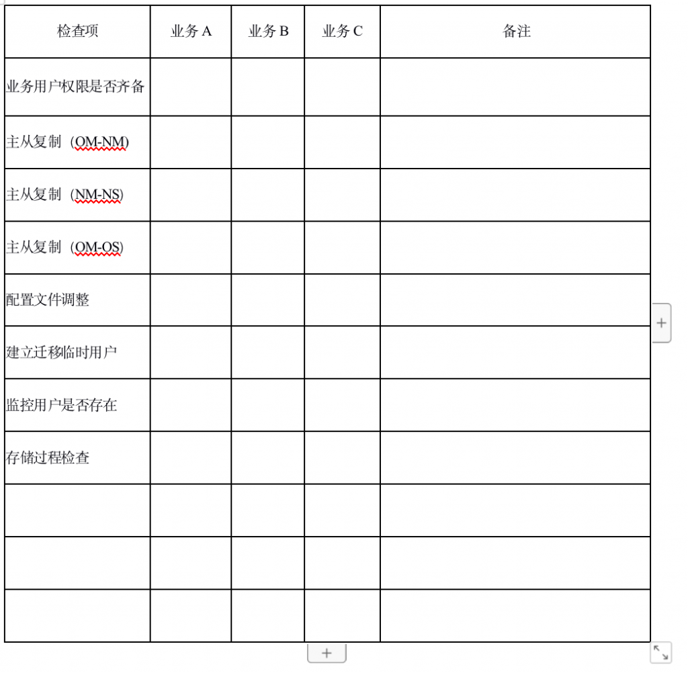

# 技术分享 | 一次数据库迁移

**原文链接**: https://opensource.actionsky.com/20210312-mysql/
**分类**: MySQL 新特性
**发布时间**: 2021-03-12T01:11:47-08:00

---

作者：姜晓宇
爱可生 DBA 团队成员，主要负责传播爱可生同学们的英雄事迹，比如租房子因为房东不好看退租。
本文来源：原创投稿*爱可生开源社区出品，原创内容未经授权不得随意使用，转载请联系小编并注明来源。
本文是对之前在客户进行的一次数据库迁移，中间遇到问题及经验的总结。
总的来说数据库迁移总共分三步，和把大象装冰箱差不多。
1.迁移前准备
2.进行迁移
3.数据验证
其中数据验证主要是业务部门进行，我们主要是在出现问题后进行协助。
## 背景描述
客户共有三套业务库，需要迁移至新的实例中，这里称为业务 A，业务 B，业务 C。其中业务 B 和业务 C 需要合并成一套。
#### 迁移前准备
迁移前准备包含：环境信息收集，数据同步，迁移前确认
这里我是列了个清单：
											
这样能比较清晰的看到迁移前以及迁移后的环境，主从关系，MySQL 版本，各实例的 ip。
数据同步的部分我们需要明确的是，当该步骤完成后应该保证旧实例与新实例数据实时同步，在迁移下发窗口只进行单纯的迁移以及数据验证。
**数据同步步骤**
1. 创建新实例
创建新的实例时，尤其需要注意对比旧实例的配置文件，防止由于配置不同，导致数据在新实例出现异常。
2. 备份旧实例数据，导入新实例
由于客户旧实例环境只能使用 mysqldump 备份，所以备份还原使用的是 mysqldump。
业务 A 是可以直接全库备份的，但需要注意，全库备份不仅要备份数据，还要备份触发器，存储过程，事件。
`#全库备份
mysqldump -h127.0.0.1 -P3306 -uroot -p --default-character-set=utf8mb4 --single-transaction --master-data=2 --flush-logs --hex-blob --triggers --routines --events --all-databases > all_db.sql
`业务 B 以及业务 C 由于需要进行合并，并且这两个业务在各自实例中都是使用了一个单独的库，所以备份时进行单库备份。
`#单库备份
mysqldump -h127.0.0.1 -uroot -P3306 -p --default-character-set=utf8mb4 --master-data=2 --flush-logs --single-transaction --set-gtid-purged=off --hex-blob --databases  databasename  > one_database.sql
`备份成功后，将旧实例数据拷贝到新实例的服务器中，进行导入操作。
`#导入数据
mysql -h127.0.0.1 -P3306 -uroot < all_db.sql
`在导入完成时需要注意，MySQL 5.7 全库备份时不会备份 mysql.proc 下的系统自身的存储过程，可以在执行完导入后先执行一次升级。
`#执行升级
mysql_upgrade --upgrade-system-tables --skip-verbose --force
`3. 建立复制保证数据实时同步。
将旧实例与新实例建立复制关系，保证数据实时同步 新实例与旧实例建立复制的地址建议使用 vip 进行，这样能够保证当前使用复制地址的可靠性，若无 vip 或者必须使用旧实例的从库地址进行级联复制，则一定要确保各级复制的正常运行。
首先需要有复制用户，用来建立复制，若无法提供则需要专门创建一个迁移用的复制用户，该用户建议迁移结束后进行回收。
业务 A 旧实例与新实例的复制建立比较简单直接正常建立就没问题。
`#新实例的主库执行，建立旧实例到新实例的复制
CHANGE MASTER TO MASTER_HOST='10.186.60.201',
MASTER_USER='repl',
MASTER_PORT=3307,
MASTER_PASSWORD='repl',
MASTER_AUTO_POSITION = 1;
start slave;
`业务 B 与 C 需要合并，所以这次保证数据实时同步采用了多源复制的方式。
`#在新实例的主库执行，将业务B与C的数据都复制到新实例中。
CHANGE MASTER TO MASTER_HOST='10.186.60.209',
MASTER_USER='repl',
MASTER_PORT=3307,
MASTER_PASSWORD='repl',
MASTER_AUTO_POSITION = 1 FOR CHANNEL 'channel1';
 
CHANGE MASTER TO MASTER_HOST='10.186.60.210',
MASTER_USER='repl',
MASTER_PORT=3307,
MASTER_PASSWORD='repl',
MASTER_AUTO_POSITION = 1 FOR CHANNEL 'channel2';
start slave;`
**迁移前确认**
迁移前确认事项我这边同样是列了清单，具体事项需要根据具体情况修改。
											
其中 OM 是旧主实例，NM 是新主实例，OS 是旧从实例，NS 是新从实例。
迁移检查需要在迁移前多次确认，比如在迁移准备完成时确认一次，迁移正式开始前再确认一次。
#### 进行迁移
1. 确认无流量写入
下发开始后首先需要确认业务是否全部停止，是否还有流量写入，
我们也可以查看 gtid 是否还有变化判断。
`#查看实例状态
 show master status\G
`2. 解绑旧集群的 VIP，设置旧实例为只读
在确认无流量写入后，解除旧集群 vip，设置旧实例为只读模式，防止有数据再次写入。
`#解绑vip
ip addr del 10.186.60.201/25 dev eth0
````
#设置旧实例为只读库，防止数据写入
show global variables like '%read_on%';
set global super_read_only=1;
show global variables like '%read_on%';
```
3. 断开新老集群复制
`#断开复制
stop slave;
`做完该步骤，新老集群状态应该完全一致，可以对比新老集群状态。
#### 数据验证
在确认新老集群状态一致后，可以由业务部门进行数据验证。
**相关推荐：**
[技术分享 | 使用OGG实现Oracle到MySQL数据平滑迁移](https://opensource.actionsky.com/20190530-ogg-oracle-mysql/)
[技术分享 | MariaDB 10.1.9 迁移到 MySQL 5.7.25](https://opensource.actionsky.com/20200608-mysql/)