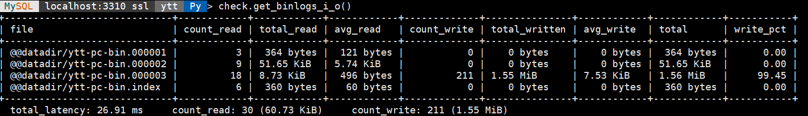

# 技术分享 | 一款功能全面的 MySQL Shell 插件

**原文链接**: https://opensource.actionsky.com/202314-mysql/
**分类**: MySQL 新特性
**发布时间**: 2023-01-04T22:06:45-08:00

---

作者：杨涛涛
资深数据库专家，专研 MySQL 十余年。擅长 MySQL、PostgreSQL、MongoDB 等开源数据库相关的备份恢复、SQL 调优、监控运维、高可用架构设计等。目前任职于爱可生，为各大运营商及银行金融企业提供 MySQL 相关技术支持、MySQL 相关课程培训等工作。
本文来源：原创投稿
*爱可生开源社区出品，原创内容未经授权不得随意使用，转载请联系小编并注明来源。
在 GITHUB 上闲逛，发现一款开源的 MySQL Shell 插件，安装配置好后，可以额外增加 MySQL Shell 的组件多样性以及类似早期 MySQL Utilities 工具集的各种功能（MySQL Utilities 已经不再开发了！ ）。
插件地址：https://github.com/lefred/mysqlshell-plugins
安装非常简单，创建对应的 MySQL Shell Plugins 目录，完了把插件整个拷贝到此即可。
mkdir -p ~/.mysqlsh/pluginsgit clone https://kgithub.com/lefred/mysqlshell-plugins.git ~/.mysqlsh/plugins
我的OS环境是 Fedora Server 37 ，拷贝完对应目录后，提示各种 Python 包依赖错误，可以根据日志~/.mysqlsh/mysqlsh.log 内容提示依次解决，此处省略步骤。
解决好各种依赖包后，进入 MySQL Shell 命令行，可以看到出现很多新的组件：audit、check、config 等等。这里就不贴这些内容了。
#### 我来简单演示其中几个组件：
##### 第一，复制组件：replication。
目前的拓扑是这样的：我本地搭了三个实例 127.0.0.1:3310 、127.0.0.1:3311 、127.0.0.1:3312 。这三个实例组建了一个副本集，3310是主，3311和3312是从。
MySQL  localhost:3311 ssl  Py > rs.status()
{
"replicaSet": {
"name": "rs1", 
"primary": "127.0.0.1:3310", 
...
"topology": {
"127.0.0.1:3310": {
"address": "127.0.0.1:3310", 
"instanceRole": "PRIMARY", 
"mode": "R/W", 
"status": "ONLINE"
}, 
"127.0.0.1:3311": {
"address": "127.0.0.1:3311", 
"instanceRole": "SECONDARY", 
"mode": "R/O", 
...
"status": "ONLINE"
}, 
"127.0.0.1:3312": {
"address": "127.0.0.1:3312", 
"instanceRole": "SECONDARY", 
"mode": "R/O", 
...
"status": "ONLINE"
}
}, 
"type": "ASYNC"
}
}
这里我主动制造了一个错误，完后连接到其中一台从库上使用 replication.status() 获取本机复制状态：此时 SQL 线程停止，并且显示延迟20秒。
MySQL  localhost:3312 ssl  Py > replication.status();
+--------------+-----------+------------+------------+
| channel_name | IO_thread | SQL_thread | lag_in_sec |
+--------------+-----------+------------+------------+
|              | ON        | OFF        | 20         |
+--------------+-----------+------------+------------+
使用 replication.error() 来获取详细错误：发现**GTID 923dad27-8528-11ed-8796-080027382b72:78** 执行失败，失败原因是主键重复。
MySQL  localhost:3312 ssl  Py > replication.error()
Applier error:
2022-12-26 22:37:35.146527 : Coordinator stopped because there were error(s) in the worker(s). The most recent failure being: Worker 1 failed executing transaction '923dad27-8528-11ed-8796-080027382b72:78' at master log ytt-pc-bin.000003, end_log_pos 1105. See error log and/or performance_schema.replication_applier_status_by_worker table for more details about this failure or others, if any.
2022-12-26 22:37:35.146532 : Worker 1 failed executing transaction '923dad27-8528-11ed-8796-080027382b72:78' at master log ytt-pc-bin.000003, end_log_pos 1105; Could not execute Write_rows event on table ytt.t1; Duplicate entry '10' for key 't1.PRIMARY', Error_code: 1062; handler error HA_ERR_FOUND_DUPP_KEY; the event's master log ytt-pc-bin.000003, end_log_pos 1105
再使用 replication.get_gtid_to_skip() 来确认具体的 GTID ：**确认无疑是923dad27-8528-11ed-8796-080027382b72:78**。
MySQL  localhost:3312 ssl  Py > replication.get_gtid_to_skip()
+--------------+-----------------------------------------+
| channel_name | gtid_to_skip                            |
+--------------+-----------------------------------------+
|              | 923dad27-8528-11ed-8796-080027382b72:78 |
+--------------+-----------------------------------------+
使用 replication.skip_error() 来跳过这个 GTID ：
MySQL  localhost:3312 ssl  Py > replication.skip_error();
skiping 923dad27-8528-11ed-8796-080027382b72:78 for replication channel ''...
完后在从库重启复制线程：**stop replica;start replica;**
MySQL  localhost:3312 ssl  SQL > stop replica;start replica;
Query OK, 0 rows affected (0.0194 sec)
Query OK, 0 rows affected (0.0347 sec)
再次查看复制是否有错误以及当前复制状态：**没有错误，一切恢复正常。**
MySQL  localhost:3312 ssl  Py > replication.error();
no error
MySQL  localhost:3312 ssl  Py > replication.status();
+--------------+-----------+------------+------------+
| channel_name | IO_thread | SQL_thread | lag_in_sec |
+--------------+-----------+------------+------------+
|              | ON        | ON         | 0          |
+--------------+-----------+------------+------------+
##### 第二、获取锁相关数据的组件：locks 。
locks 组件可以获取当前事务的锁数据，包括当前锁持有以及锁等待相关线程 ID 、锁持有时间、内存占用、锁的具体行数等。下面使用 locks.get_locks() 来获取当前锁相关数据：
MySQL  localhost:3310 ssl  Py > locks.get_locks()
+-----------------+--------------+-------------+-----------+----------------+-------------------+-------------------+-------------------------------------------------------------------+
| mysql_thread_id | trx_duration | cpu_latency | memory    | row_locks_held | row_locks_pending | tables_with_locks | current_statement                                                 |
+-----------------+--------------+-------------+-----------+----------------+-------------------+-------------------+-------------------------------------------------------------------+
|              25 | 4.43 min     |   0 ps      | 2.07 MiB  |              3 |                 0 | ytt.t1            | NULL                                                              |
|              29 | 17.51 s      |   0 ps      | 2.49 MiB  |              1 |                 0 | ytt.t1            | update t1 set r1 = 100 where id =10                               |
|               7 | 10.69 ms     |             | 15.66 KiB |              0 |                 0 | NULL              | NULL                                                              |
|              27 | 269.67 us    |   0 ps      | 10.31 MiB |              0 |                 0 | NULL              | SELECT thr.processlist_id AS m ... IT DESC               LIMIT 10 |
|              13 | 136.45 us    |   0 ps      | 1.19 MiB  |              0 |                 0 | NULL              | NULL                                                              |
+-----------------+--------------+-------------+-----------+----------------+-------------------+-------------------+-------------------------------------------------------------------+
根据后续提示，还可以获取更多的数据：比如线程25，持有 IX 意向锁以及 X 记录锁，以及当前等待此锁的 SQL 语句；线程29申请X记录锁却被线程25阻塞。
For which thread_id do you want to see locks ? (25) : 25
Metadata Locks:
---------------
GRANTED SHARED_WRITE on ytt.t1
Data Locks:
-----------
GRANTED TABLE (IX) LOCK ON ytt.t1
GRANTED RECORD (X) LOCK ON ytt.t1 (PRIMARY) (id=supremum pseudo-record)
(id=10)
BLOCKING RECORD (X,REC_NOT_GAP) LOCK ON ytt.t1 FOR 12 SECONDS (mysql_thread_id: 29)
Statement we are blocking:
--------------------------
update t1 set r1 = 100 where id =10
For which thread_id do you want to see locks ? (25) : 29
Metadata Locks:
---------------
GRANTED SHARED_WRITE on ytt.t1
Data Locks:
-----------
GRANTED TABLE (IX) LOCK ON ytt.t1
WAITING RECORD (X,REC_NOT_GAP) LOCK ON ytt.t1 (PRIMARY) (id=10)
BLOCKED FOR 8 SECONDS BY (mysql_thread_id: 25)
##### 第三、获取语句执行的 profiles 数据：profiling 组件。
先执行 profiling.start() ，完后执行些语句，再用 profiling.get() 来获取具体的 profiles 数据，最后再关闭 profiling 收集。
MySQL  localhost:3310 ssl  ytt  Py > profiling.get()
Last 5 events from the proccess list id: @@pseudo_thread_id
-----------------------------------------------------------
---Events before profiling was started are in orange---
1563 : select schema()
1555 : help 'profiling'
1551 : profiling.get()
1531 : select * from t1 order by rand() limit 10
1512 : select count(*) from t1
Which event do you want to profile ? : 1531
Profiling of:
-------------
select * from t1 order by rand() limit 10
duration: 0.0162
+------------------------------------------------+----------+
| Stage                                          | Duration |
+------------------------------------------------+----------+
| stage/sql/starting                             |   0.0000 |
| stage/sql/Executing hook on transaction begin. |   0.0000 |
| stage/sql/starting                             |   0.0000 |
| stage/sql/checking permissions                 |   0.0000 |
| stage/sql/Opening tables                       |   0.0000 |
| stage/sql/init                                 |   0.0000 |
| stage/sql/System lock                          |   0.0000 |
| stage/sql/optimizing                           |   0.0000 |
| stage/sql/statistics                           |   0.0000 |
| stage/sql/preparing                            |   0.0000 |
| stage/sql/Creating tmp table                   |   0.0000 |
| stage/sql/executing                            |   0.0160 |
| stage/sql/end                                  |   0.0000 |
| stage/sql/query end                            |   0.0000 |
| stage/sql/waiting for handler commit           |   0.0000 |
| stage/sql/closing tables                       |   0.0000 |
| stage/sql/freeing items                        |   0.0000 |
| stage/sql/cleaning up                          |   0.0000 |
+------------------------------------------------+----------+
Don't forget to stop the profiling when done.
##### 第四、连接主库使用 innodb 组件查看有碎片的表，并且获取表大小、索引大小、碎片率等数据。
MySQL  localhost:3310 ssl  ytt  Py > innodb.get_fragmented_tables_disk()
Warning: information_schema_stats_expiry is set to 86400.
Do you want to change it ? (y/N) : n
+--------+-------+-----------+------------+------------+-----------+-----------+-------------+--------+
| NAME   | ROWS  | DATA_SIZE | INDEX_SIZE | TOTAL_SIZE | DATA_FREE | FILE_SIZE | WASTED_SIZE | FREE   |
+--------+-------+-----------+------------+------------+-----------+-----------+-------------+--------+
| ytt/t1 | 28861 | 4.52 MiB  |    0 bytes | 4.52 MiB   | 4.00 MiB  | 12.00 MiB | 7.48 MiB    | 62.37% |
+--------+-------+-----------+------------+------------+-----------+-----------+-------------+--------+
Don't forget to run 'ANALYZE TABLE ...' for a more accurate result.
##### 第五、使用 check 组件来获取 binlog 的 IO 数据：由于格式不好看，我截了张图。可以展示现存所有 binlog 文件的读写频率、读写数据等信息。
