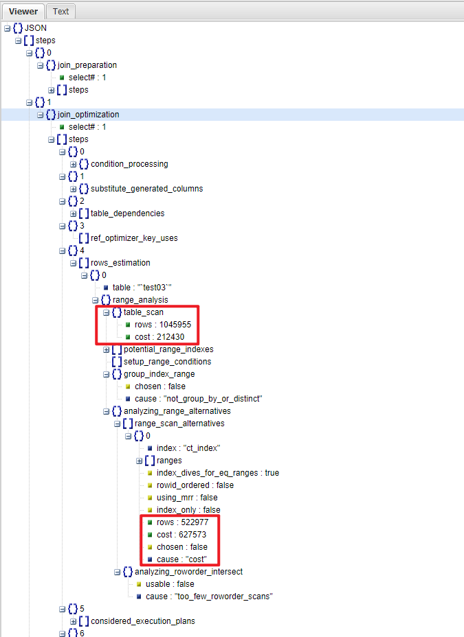
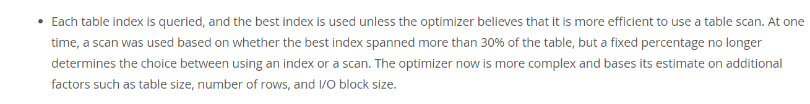

# 技术分享 | 为什么 SELECT 查询选择全表扫描，而不走索引？

**原文链接**: https://opensource.actionsky.com/20210926-select/
**分类**: 技术干货
**发布时间**: 2021-10-11T21:21:17-08:00

---

作者：Charizard
爱可生服务团队成员，主要负责公司数据库运维产品问题诊断；努力在数据库和 IT 领域里摸爬滚打中。
本文来源：原创投稿
*爱可生开源社区出品，原创内容未经授权不得随意使用，转载请联系小编并注明来源。
## 1、基本结论
SQL的执行成本（cost）是 MySQL 优化器选择 SQL 执行计划时一个重要考量因素。当优化器认为使用索引的成本高于全表扫描的时候，优化器将会选择全表扫描，而不是使用索引。
下面通过一个实验来说明。
## 2、问题现象
如下结构的一张表，表中约有104w行数据：
`CREATE TABLE `test03` (
`id` int(11) NOT NULL AUTO_INCREMENT COMMENT '自增主键',
`dept` tinyint(4) NOT NULL COMMENT '部门id',
`name` varchar(30) COLLATE utf8mb4_bin DEFAULT NULL COMMENT '用户名称',
`create_time` datetime NOT NULL COMMENT '注册时间',
`last_login_time` datetime DEFAULT NULL COMMENT '最后登录时间',
PRIMARY KEY (`id`),
KEY `ct_index` (`create_time`)
) ENGINE=InnoDB AUTO_INCREMENT=1048577 DEFAULT CHARSET=utf8mb4 COLLATE=utf8mb4_bin COMMENT='测试表'
`
查询1，并未用到ct_index(create_time)索引:
- 
type为ALL，而不是range
- 
rows行数和全表行数接近
`# 查询1
mysql> explain select * from test03 where create_time > '2021-10-01 02:04:36';
+----+-------------+--------+------------+------+---------------+------+---------+------+---------+----------+-------------+
| id | select_type | table  | partitions | type | possible_keys | key  | key_len | ref  | rows    | filtered | Extra       |
+----+-------------+--------+------------+------+---------------+------+---------+------+---------+----------+-------------+
|  1 | SIMPLE      | test03 | NULL       | ALL  | ct_index      | NULL | NULL    | NULL | 1045955 |    50.00 | Using where |
+----+-------------+--------+------------+------+---------------+------+---------+------+---------+----------+-------------+
1 row in set, 1 warning (0.00 sec)
`
而查询2，则用到了ct_index(create_time)索引:
`# 查询2
mysql> explain select * from test03 where create_time 
## 3、获得SQL优化器处理信息
这里使用optimizer trace工具，观察MySQL对SQL的优化处理过程：
`# 调大trace的容量，防止被截断
set global optimizer_trace_max_mem_size = 1048576;
# 开启optimizer_trace
set optimizer_trace="enabled=on";
# 执行SQL
select * from test03 where create_time > '2021-10-01 02:04:36';
# SQL执行完成之后，查看TRACE
select TRACE from INFORMATION_SCHEMA.OPTIMIZER_TRACE\G
`
获得关于此SQL的详细优化器处理信息：
`mysql> select TRACE from INFORMATION_SCHEMA.OPTIMIZER_TRACE\G                                                                                       
*************************** 1. row ***************************
TRACE: {
"steps": [
{
"join_preparation": {
"select#": 1,
"steps": [
{
"expanded_query": "/* select#1 */ select `test03`.`id` AS `id`,`test03`.`dept` AS `dept`,`test03`.`name` AS `name`,`test03`.`create_time` AS `create_time`,`test03`.`last_login_time` AS `last_login_time` from `test03` where (`test03`.`create_time` > '2021-10-01 02:04:36')"
}
]
}
},
{
"join_optimization": {
"select#": 1,
"steps": [
{
"condition_processing": {
"condition": "WHERE",
"original_condition": "(`test03`.`create_time` > '2021-10-01 02:04:36')",
"steps": [
{
"transformation": "equality_propagation",
"resulting_condition": "(`test03`.`create_time` > '2021-10-01 02:04:36')"
},
{
"transformation": "constant_propagation",
"resulting_condition": "(`test03`.`create_time` > '2021-10-01 02:04:36')"
},
{
"transformation": "trivial_condition_removal",
"resulting_condition": "(`test03`.`create_time` > '2021-10-01 02:04:36')"
}
]
}
},
{
"substitute_generated_columns": {
}
},
{
"table_dependencies": [
{
"table": "`test03`",
"row_may_be_null": false,
"map_bit": 0,
"depends_on_map_bits": [
]
}
]
},
{
"ref_optimizer_key_uses": [
]
},
{
"rows_estimation": [
{
"table": "`test03`",
"range_analysis": {
"table_scan": {
"rows": 1045955,
"cost": 212430
},
"potential_range_indexes": [
{
"index": "PRIMARY",
"usable": false,
"cause": "not_applicable"
},
{
"index": "ct_index",
"usable": true,
"key_parts": [
"create_time",
"id"
]
}
],
"setup_range_conditions": [
],
"group_index_range": {
"chosen": false,
"cause": "not_group_by_or_distinct"
},
"analyzing_range_alternatives": {
"range_scan_alternatives": [
{
"index": "ct_index",
"ranges": [
"0x99aac22124  '2021-10-01 02:04:36')",
"attached_conditions_computation": [
],
"attached_conditions_summary": [
{
"table": "`test03`",
"attached": "(`test03`.`create_time` > '2021-10-01 02:04:36')"
}
]
}
},
{
"refine_plan": [
{
"table": "`test03`"
}
]
}
]
}
},
{
"join_execution": {
"select#": 1,
"steps": [
]
}
}
]
}
1 row in set (0.00 sec)
`
通过逐行阅读，发现优化器在join_optimization（SQL优化阶段）部分的rows_estimation内容里：
- 
明确指出了使用索引ct_index(create_time)和全表扫描的成本差异
- 
同时指出了未选择索引的原因：cost

## 4、为什么使用索引的成本比全表扫描还高？
通过观察优化器的信息，不难发现，使用索引扫描行数约52w行，而全表扫描约为104w行。为什么优化器反而认为使用索引的成本比全表扫描还高呢？
因为当ct_index(create_time)这个普通索引并不包括查询的所有列，因此需要通过ct_index的索引树找到对应的主键id，然后再到id的索引树进行数据查询，即回表（通过索引查出主键，再去查数据行），这样成本必然上升。尤其是当回表的数据量比较大的时候，经常会出现MySQL优化器认为回表查询代价过高而不选择索引的情况。
这里可以回头看查询1 和 查询2的数据量占比：
- 
查询1的数据量占整个表的60%，回表成本高，因此优化器选择了全表扫描
- 
查询2的数据量占整个表的0.02%，因此优化器选择了索引
`mysql> select (select count(*) from test03 where create_time > '2021-10-01 02:04:36')/(select count(*) from test03) as '>20211001', (select count(*) from test03 where create_time 20211001 | 
另外，在MySQL的官方文档中对此也有简要的描述：
- 
当优化器任务全表扫描成本更低的时候，就不会使用索引
- 
并没有一个固定的数据量占比来决定优化器是否使用全表扫描（曾经是30%）
- 
优化器在选择的时候会考虑更多的因素，如：表大小，行数量，IO块大小等
https://dev.mysql.com/doc/refman/5.7/en/where-optimization.html

参考文档：
> [第27问：information_schema.columns 表上做查询慢，为什么？](https://opensource.actionsky.com/20201127-mysql/)
https://blog.csdn.net/CSDNcircular/article/details/107253747