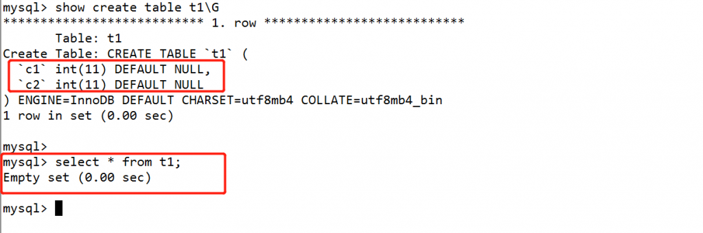
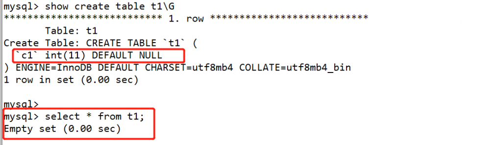
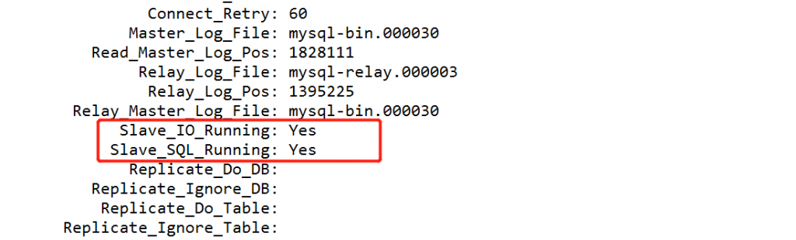
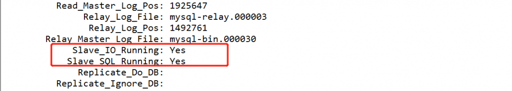
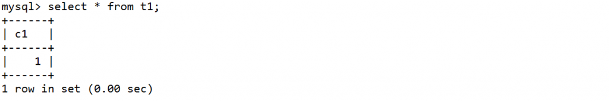
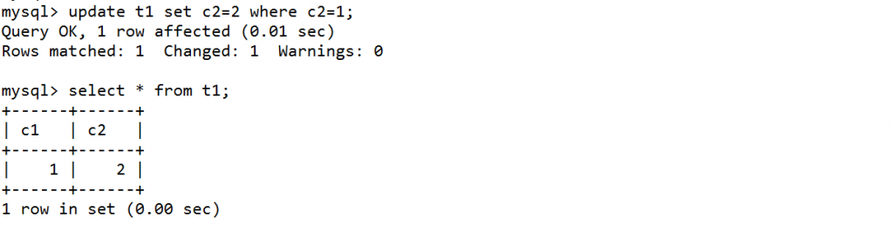
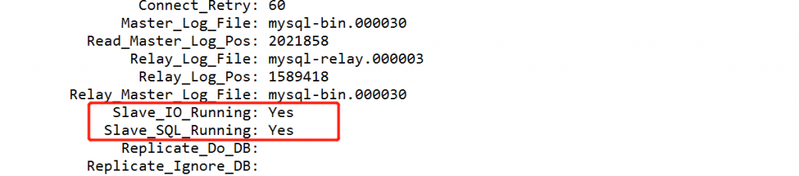
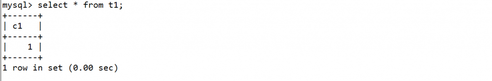

# 技术分享 | 主从表的列不一致，复制是否会受影响

**原文链接**: https://opensource.actionsky.com/20210204-innodb/
**分类**: 技术干货
**发布时间**: 2021-02-03T23:47:08-08:00

---

作者：郭斌斌
爱可生 DBA 团队成员，负责项目日常问题处理及公司平台问题排查。
本文来源：原创投稿
*爱可生开源社区出品，原创内容未经授权不得随意使用，转载请联系小编并注明来源。
关于主从复制，目前用的比较普遍的是 RBR（Row-base replication） 这种方式，有这么一个问题大家可以一起思考一下。
#### 问题：
RBR 主从复制，主库表 A 有两个字段 (c1 int,c2 int)，从库表 A 有一个字段 （c1 int），主库对表 A 的 c2 字段执行插入或者更新操作，主从复制是否会受影响？
#### 结论：
结论是复制不受影响。
#### 验证（版本 MySQL 5.7.25）：
主库 t1 表结构和数据，
											
从库 t1 表结构和数据，
											
从库复制状态：
											
主库执行 insert 操作：
											
从库查看复制状态和同步的结果：
											
											
主库执行 update 操作，
											
从库查看复制状态，并查看 t1 数据，
											
											
#### 原因：
对于主从复制，主从同步的表结构其实是可以不一致的，主库表的列数可以比从库表的多，也可以比从库表的少，但是这种场景对于复制无影响也是有条件的。
#### 条件：
1. 相同列的定义顺序必须完全一致。
2. 相同列的定义一定在在差异列之前。
3. 差异的列必须要有默认值。
> 参考链接：
https://dev.mysql.com/doc/refman/5.7/en/replication-features-differing-tables.html
**文章推荐：**
[技术分享 | EXPLAIN 执行计划详解（1）](https://opensource.actionsky.com/20210202-explain/)
[技术分享 | MySQL Hang 了，如何快速分析 Call Stack 有效信息](https://opensource.actionsky.com/20210129-mysql/)
[技术分享 | mysqlsh 命令行模式 & 密码保存](https://opensource.actionsky.com/20210126-mysqlsh/)