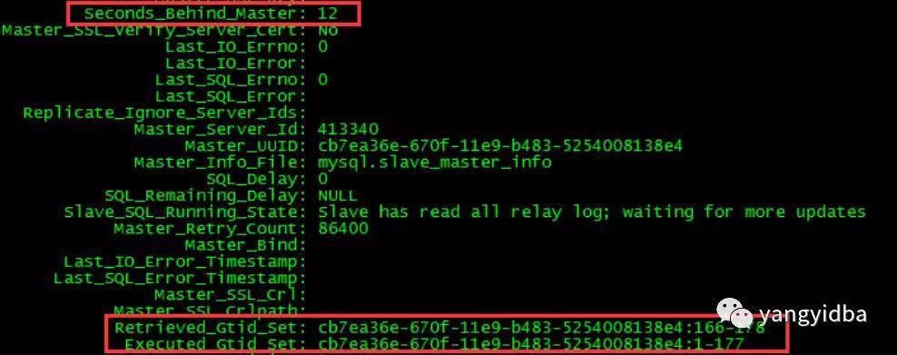
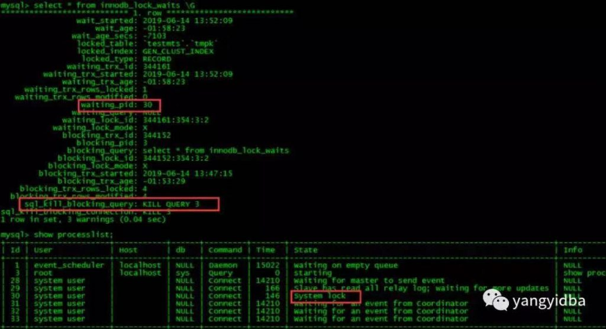
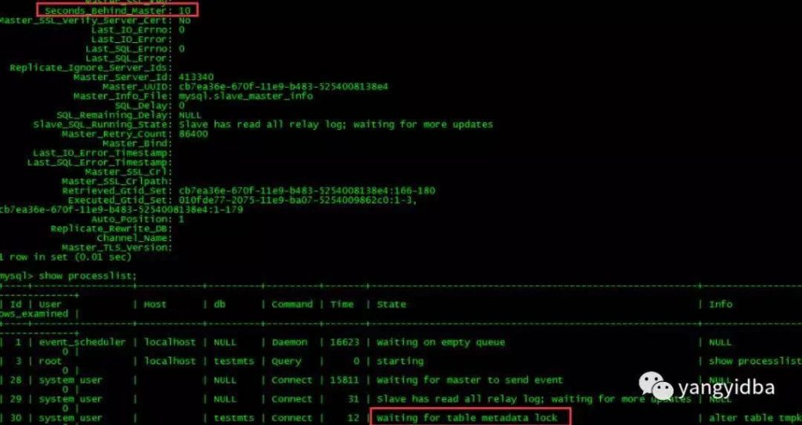
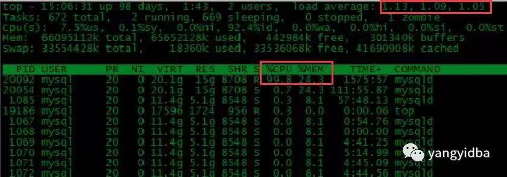

# 技术分享 | 从库 Seconds_Behind_Master 延迟总结

**原文链接**: https://opensource.actionsky.com/20190926-mysql/
**分类**: MySQL 新特性
**发布时间**: 2019-09-25T23:38:55-08:00

---

** 作者：****高鹏**
文章末尾有他著作的《深入理解 MySQL 主从原理 32 讲》，深入透彻理解 MySQL 主从，GTID 相关技术知识。本文节选自《深入理解 MySQL 主从原理》第 32 节
到这里本系列已经接近尾声了，是时候对常见引起主从延迟的情形进行一个总结了。我想如果我一开始就把这些情形拿出来也许大家对具体的原因不是那么清楚，但是经过本系列的学习，我相信当我说起这些情形的时候大家都很清楚它的原因了。当然如果还有其他造成延迟的情形也欢迎大家一起讨论。
### 一、总结
有了前面的知识我们就能够从本质上了解造成延迟的可能有哪些，我先来总结一下这些可能，我将其分为两类：
**第一类：**
这一类延迟情况可能造成服务器有较高的负载，可能是 CPU/IO 的负载。因为从库在实际执行 Event，如果我们服务器的负载比较高应该考虑这几种情况，关于如何查看线程的负载可以参考 29 节（[线程简介和 MySQL 调试环境搭建](https://opensource.actionsky.com/20190919-mysql/)）。
- 
大事务造成的延迟，其延迟不会从 0 开始增加，而是直接从主库执行了多久开始。比如主库执行这个事务花费的 20 秒，那么延迟就会从 20 开始，可以自己细心观察一下很容易看到。这是因为 Query Event 中没有准确的执行时间，这个在上一节的计算公式中详细描述过了 ，可以参考第 8 节和第 27 节。
- 
大表 DDL 造成的延迟，其延迟会从 0 开始增加，因为 Query Event 记录了准确的执行时间。这个在上一节的计算公式中也详细描述过了，可以参考第 8 节和第 27 节。
- 
表没有合理的使用主键或者唯一键造成的延迟。这种情况不要以为设置 slave_rows_search_algorithms 参数为 INDEX_SCAN,HASH_SCAN 就可以完全解决问题，原因我们在第 24 节（[从库数据的查找和参数 slave_rows_search_algorithms](https://opensource.actionsky.com/20190911-mysql/)）进行了描述。
- 
由于参数 sync_relay_log，sync_master_info，sync_relay_log_info 不合理导致，特别是 sync_relay_log 会极大的影响从库的性能。原因我们在第 26 节进行过描述，因为 sync_relay_log 设置为 1 会导致大量 relay log 刷盘操作。
- 
是否从库开启了记录 binary log 功能即 log_slave_updates 参数开启，如果不是必要可以关闭掉。这种情况我遇到很多次了。
**第二类：**
这一类延迟情况往往不会造成服务器有较高的负载。它们要么没有实际的执行 Event ，要么就是做了特殊的操作造成的。
- 长期未提交的事务可能造成延迟瞬间增加，因为 GTID_EVENT 和 XID_EVENT 是提交时间其他 Event 是命令发起的时间。这个我们在第 27 节中举例描述过了。
- Innodb 层的行锁造成的延迟，这种是在从库有修改操作并且和 SQL 线程修改的数据有冲突的情况下造成的，因为我们前面 23 节说过 SQL 线程执行 Event 也会开启事务和获取行锁，下面我们进行测试。
- MySQL 层的 MDL LOCK 造成的延迟，这种情况可能是由于 SQL 线程执行某些 DDL 操作但是从库上做了锁表操作造成，原因我们已经在 23 节描述过了，下面我们进行测试。
- MTS 中不合理的设置参数 slave_checkpoint_period 参数导致，这个在第 27 节已经测试过了。
- 在从库运行期间手动改大了从库服务器时间，这个也在第 27 节已经测试过了。
**二、相关测试******因为上面的延迟情形很多我们都已经测试和讲述过了。下面我们测试锁造成的延迟情形。
**Innodb 层的行锁造成的延迟**
这个很容测试，我只要先在从库做一个事务和 SQL 线程修改的数据相同即可以出现，大概测试如下：- `从库：`
- 
- `mysql> begin;`
- `Query OK, 0 rows affected (0.00 sec)`
- 
- `mysql> delete from tmpk;`
- `Query OK, 4 rows affected (0.00 sec)`
- `不要提交`
- 
- `主库执行同样的语句`
- `mysql> delete from tmpk;`
- `Query OK, 4 rows affected (0.30 sec)`
这个时候你会观察到延迟如下：
											
如果查看 sys.innodb_lock_waits 能看到如下的结果：
											
当然如果查看 INNODB_TRX 也可以观察到事务的存在，这里就不截图了，大家可以自己试试。
**MySQL 层的 MDL LOCK 造成的延迟**这种情况也非常容易测试，我们只需要开启一个事务做一个 select ，然后主库对同样的表做 DDL 就可以出现如下：
- `从库：`
- `mysql> begin;`
- `Query OK, 0 rows affected (0.00 sec)`
- 
- `mysql>`
- `mysql>`
- `mysql> select * from tkkk limit 1;`
- `+------+------+------+`
- `| a    | b    | c    |`
- `+------+------+------+`
- `|    3 |    3 |  100 |`
- `+------+------+------+`
- `1 row in set (0.00 sec)`
- 
- `不要提交，表上MDL LOCK就不会释放`
- 
- `主库执行语句：`
- 
- `mysql> alter table tmpk add testc int ;`
- `Query OK, 0 rows affected (1.14 sec)`
- `Records: 0  Duplicates: 0  Warnings: 0`
这个时候你将会看到如下的信息：
											
我们可以通过 state 看到这是等待 MDL lock 获取而导致的延迟，关于 MDL lock 的详情可以参考我的文章：http://blog.itpub.net/7728585/viewspace-2143093/
**三、总结******通过整个系列，我们应该清楚了 Seconds_Behind_Master 计算的方法，同时如果出现了延迟，我们首先查看从库是否有负载，根据是否有负载进行区别对待，注意这里的负载一定要使用 **top -H **查看 io/sql/worker 线程的负载。我曾不止一次的遇到朋友问我延迟问题，当我问他负载如何的时候他告诉我负载不高啊整体负载也就不到 2，这里我们应该注意的是对于一个线程只能使用到一个 CPU 核，虽然整体负载不到 2 但是可能 io/sql/worker 线程已经跑满了，实际上负载已经很高了，我们来看下面的这个截图就是 sql 线程负载高的截图如下：
											
这个截图我们发现虽然整体负载不高在 1 多一点，但是 Lwp 号 20092 的线程已经跑满了，这个线程就是我们的 sql 线程，这个时候出现延迟是很可能的，这个截图正是来自一个没有合理使用主键或者唯一键造成的延迟的案例，案例如下：https://www.jianshu.com/p/56e8ca2223a0我们查看 CPU 负载应该使用 **top -H **去查看，查看 io 负载可以使用 iotop，iostat 等工具。我需要强调一下看 MySQL 负载的时候我们必须用**线程**的眼光去看，第 29 节将让你获得这种能力。到这里整个系列接近尾声，大家会发现主从的原理的还是比较复杂的，这可能颠覆了以前我们的认知，以前我们认为主从无非就是搭建起来能跑同时知道有 io/sql 线程就可以了（这确实很简单）。整个系列结论很简单，我们无非就是想配置出安全高效的从库同时知道延迟是怎么导致的，出现延迟后我们如何处理，我自认为本系列还是将这些问题讲解得很清楚了。当然如果本系列的原理部分都能够理解得很好，那么工作中解决主从问题一定会更加得心应手。
最后推荐高鹏的专栏《深入理解 MySQL 主从原理 32 讲》，想要透彻了解学习 MySQL 主从原理的朋友不容错过。
											
**社区近期动态**
**No.1**
**10.26 DBLE 用户见面会 北京站**
											
爱可生开源社区将在 2019 年 10 月 26 日迎来在北京的首场 DBLE 用户见面会，以线下**互动分享**的会议形式跟大家见面。
时间：10月26日 9:00 &#8211; 12:00 AM
地点：HomeCafe 上地店（北京市海淀区上地二街一号龙泉湖酒店对面）
重要提醒：
1. 同日下午还有 dbaplus 社群举办的沙龙：聚焦数据中台、数据架构与优化。
2. 爱可生开源社区会在每年10.24日开源一款高质量产品。本次在 dbaplus 沙龙会议上，爱可生的资深研发工程师闫阿龙，将为大家带来《金融分布式事务实践及txle概述》，并在现场开源。
**No.2**
**Mycat 问题免费诊断**
诊断范围支持：
Mycat 的故障诊断、源码分析、性能优化
服务支持渠道：
- 技术交流群，进群后可提问
QQ群（669663113）
- 社区通道，邮件&电话
osc@actionsky.com
- 现场拜访，线下实地，1天免费拜访
关注“爱可生开源社区”公众号，回复关键字“Mycat”，获取活动详情。
**No.3**
**社区技术内容征稿**
征稿内容：
- 格式：.md/.doc/.txt
- 主题：MySQL、分布式中间件DBLE、数据传输组件DTLE相关技术内容
- 要求：原创且未发布过
- 奖励：作者署名；200元京东E卡+社区周边
投稿方式：
- 邮箱：osc@actionsky.com
- 格式：[投稿]姓名+文章标题
- 以附件形式发送，正文需注明姓名、手机号、微信号，以便小编及时联系