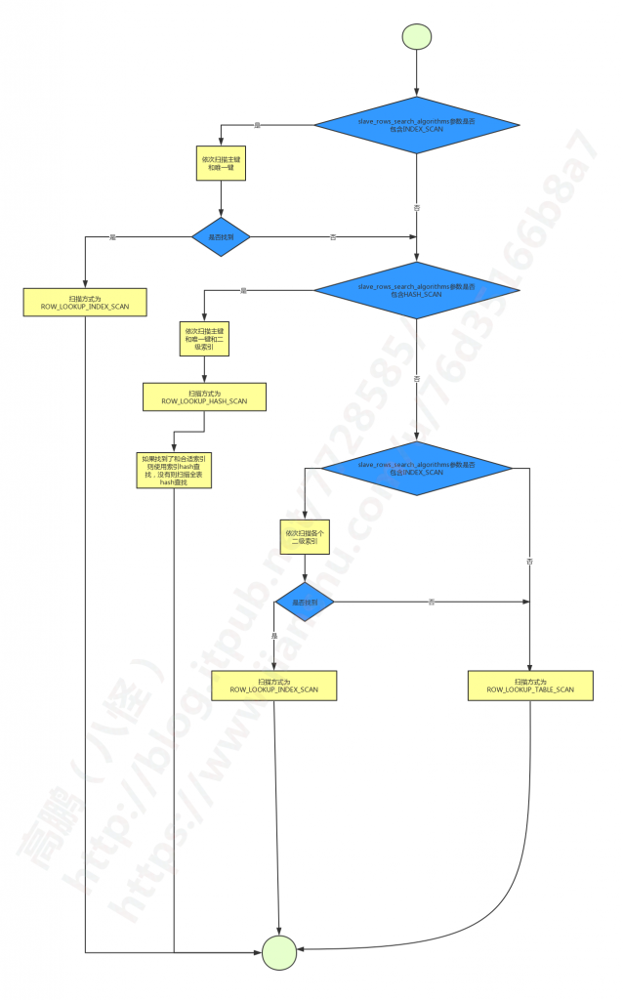
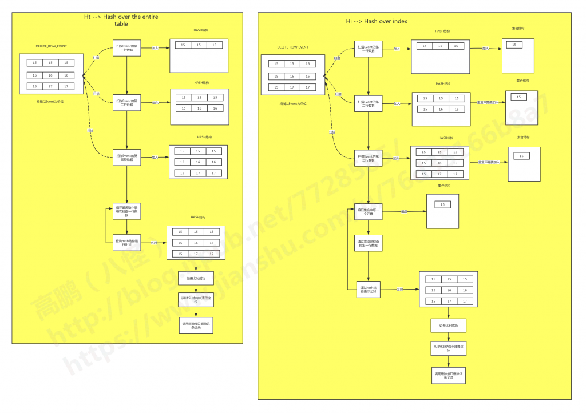

# 技术分享 | 从库数据的查找和参数 slave_rows_search_algorithms

**原文链接**: https://opensource.actionsky.com/20190911-mysql/
**分类**: MySQL 新特性
**发布时间**: 2019-09-11T01:12:07-08:00

---

作者：高鹏 
文章末尾有他著作的《深入理解MySQL主从原理 32讲》，深入透彻理解MySQL主从，GTID相关技术知识。**本文节选自《深入理解MySQL主从原理》第24节**注意：本文分为正文和附件两部分，都是图片格式，如果正文有图片不清晰可以将附件的图片保存到本地查看。本节包含一个笔记如下：https://www.jianshu.com/p/5183fe0f00d8
**背景**我们前面已经知道了对于 DML 语句来讲，其数据的更改将被放到对应的 Event 中。比如 Delete 语句会将所有删除数据的 before_image 放到 DELETE_ROWS_EVENT 中，从库只要读取这些 before_image 进行数据查找，然后调用相应的 Delete 的操作就可以完成数据的删除了。下面我们来讨论一下从库是如何进行数据查找的。本节我们假定参数 binlog_row_image 设置为 FULL 也就 是默认值，关于 binlog_row_image 参数的影响在第11节已经描述过了。
**一、从一个列子出发**在开始之前我们先假定参数 slave_rows_search_algorithms 为默认值，即：- TABLE_SCAN,INDEX_SCAN
因为这个参数会直接影响到对索引的利用方式。
我们还是以 Delete 操作为例，实际上对于索引的选择 Update 操作也是一样的，因为都是通过 before_image 去查找数据。我测试的表结构、数据和操作如下：- `mysql> show create table tkkk \G`
- `*************************** 1. row ***************************`
- `       Table: tkkk`
- `Create Table: CREATE TABLE `tkkk` (`
- `  `a` int(11) DEFAULT NULL,`
- `  `b` int(11) DEFAULT NULL,`
- `  `c` int(11) DEFAULT NULL,`
- `  KEY `a` (`a`)`
- `) ENGINE=InnoDB DEFAULT CHARSET=utf8`
- `1 row in set (0.00 sec)`
- 
- `mysql> select * from tkkk;`
- `+------+------+------+`
- `| a    | b    | c    |`
- `+------+------+------+`
- `|    1 |    1 |    1 |`
- `|    2 |    2 |    2 |`
- `|    3 |    3 |    3 |`
- `|    4 |    4 |    4 |`
- `|    5 |    5 |    5 |`
- `|    6 |    6 |    6 |`
- `|    7 |    7 |    7 |`
- `|    8 |    8 |    8 |`
- `|    9 |    9 |    9 |`
- `|   10 |   10 |   10 |`
- `|   11 |   11 |   11 |`
- `|   12 |   12 |   12 |`
- `|   13 |   13 |   13 |`
- `|   15 |   15 |   15 |`
- `|   15 |   16 |   16 |`
- `|   15 |   17 |   17 |`
- `+------+------+------+`
- `16 rows in set (2.21 sec)`
- `mysql> delete from tkkk where a=15;`
- `Query OK, 3 rows affected (6.24 sec)`
- `因为我做了debug索引这里时间看起来很长`
对于这样一个 Delete 语句来讲主库会利用到索引 KEY a，删除的三条数据我们实际上只需要一次索引的定位（参考 btr_cur_search_to_nth_level 函数），然后顺序扫描接下来的数据进行删除就可以了。大概的流程如下图：
											
这条数据删除的三条数据的 before_image 将会记录到一个 DELETE_ROWS_EVENT 中。从库应用的时候会重新评估应该使用哪个索引，**优先使用主键和唯一键**。对于 Event 中的每条数据都需要进行索引定位操作，并且对于非唯一索引来讲第一次返回的第一行数据可能并不是删除的数据，还需要需要继续扫描下一行，在函数 Rows_log_event::do_index_scan_and_update 中有如下代码：- `while (record_compare(m_table, &m_cols))//比较每一个字段 如果不相等 扫描下一行`
- `  {`
- `    while((error= next_record_scan(false)))//扫描下一行`
- `    {`
- `      /* We just skip records that has already been deleted */`
- `      if (error == HA_ERR_RECORD_DELETED)`
- `        continue;`
- `      DBUG_PRINT("info",("no record matching the given row found"));`
- `      goto end;`
- `    }`
- `  }`
这些代价是比主库更大的。在这个列子中没有主键和唯一键，因此依旧使用的是索引 KEY a，大概流程如下图：
											
但是如果我们在从库增加一个主键，那么在从库进行应用的时候流程如下：
											
我们从上面的流程来看，主库 Delete 操作和从库 Delete 操作主要的区别在于：- 从库每条数据都需要索引定位查找数据。
- 从库在某些情况下通过非唯一索引查找的数据第一条数据可能并不是删除的数据，因此还需要继续进行索引定位和查找。
对于主库来讲一般只需要一次数据定位查找即可，接下来访问下一条数据就好了。其实对于真正的删除操作来讲并没有太多的区别。如果合理的使用了主键和唯一键可以将上面提到的两点影响降低。在造成从库延迟的情况中，没有合理的使用主键和唯一键是一个比较重要的原因。最后如果表上一个索引都没有的话，那么情况变得更加严重，简单的图如下：
											
我们可以看到每一行数据的更改都需要进行全表扫描，这种问题就非常严重了。这种情况使用参数 slave_rows_search_algorithms 的 HASH_SCAN 选项也许可以提高性能，下面我们就来进行讨论。
**二、确认查找数据的方式**前面的例子中我们接触了参数 slave_rows_search_algorithms ，这个参数主要用于确认如何查找数据。其取值可以是下面几个组合（来自官方文档），源码中体现为一个位图：- TABLE_SCAN,INDEX_SCAN（默认值）
- INDEX_SCAN,HASH_SCAN
- TABLE_SCAN,HASH_SCAN
- TABLE_SCAN,INDEX_SCAN,HASH_SCAN
在源码中有如下的说明，当然官方文档也有类似的说明：- `/*`
- `  Decision table:`
- `  - I  --> Index scan / search`
- `  - T  --> Table scan`
- `  - Hi --> Hash over index`
- `  - Ht --> Hash over the entire table`
- 
- `  |--------------+-----------+------+------+------|`
- `  | Index\Option | I , T , H | I, T | I, H | T, H |`
- `  |--------------+-----------+------+------+------|`
- `  | PK / UK      | I         | I    | I    | Hi   |`
- `  | K            | Hi        | I    | Hi   | Hi   |`
- `  | No Index     | Ht        | T    | Ht   | Ht   |`
- `  |--------------+-----------+------+------+------|`
- 
- `*/`
实际上源码中会有三种数据查找的方式，分别是：- ROW_LOOKUP_INDEX_SCAN
对应函数接口： Rows_log_event::do_index_scan_and_update
- ROW_LOOKUP_HASH_SCAN
对应函数接口： Rows_log_event::do_hash_scan_and_update
它又包含：
（1）Hi &#8211;> Hash over index
（2）Ht &#8211;> Hash over the entire table
后面讨论- ROW_LOOKUP_TABLE_SCAN
对应函数接口： Rows_log_event::do_table_scan_and_update
在源码中如下：- `switch (m_rows_lookup_algorithm)//根据不同的算法决定使用哪个方法`
- `    {`
- `      case ROW_LOOKUP_HASH_SCAN:`
- `        do_apply_row_ptr= &Rows_log_event::do_hash_scan_and_update;`
- `        break;`
- 
- `      case ROW_LOOKUP_INDEX_SCAN:`
- `        do_apply_row_ptr= &Rows_log_event::do_index_scan_and_update;`
- `        break;`
- 
- `      case ROW_LOOKUP_TABLE_SCAN:`
- `        do_apply_row_ptr= &Rows_log_event::do_table_scan_and_update;`
- `        break;`
决定如何查找数据以及通过哪个索引查找正是通过参数 slave_rows_search_algorithms 的设置和**表中是否有合适的索引**共同决定的，并不是完全由 slave_rows_search_algorithms 参数决定。
下面这个图就是决定的过程，可以参考函数 decide_row_lookup_algorithm_and_key （图24-1，高清原图包含在文末原图中）。
											
**三、ROW_LOOKUP_HASH_SCAN 方式的数据查找**总的来讲这种方式和 ROW_LOOKUP_INDEX_SCAN 和 ROW_LOOKUP_TABLE_SCAN 都不同，它是通过表中的数据和 Event 中的数据进行比对，而不是通过 Event 中的数据和表中的数据进行比对，下面我们将详细描述这种方法。假设我们将参数 slave_rows_search_algorithms 设置为 INDEX_SCAN,HASH_SCAN ，且表上没有主键和唯一键的话，那么上图的流程将会把数据查找的方式设置为 ROW_LOOKUP_HASH_SCAN。在 ROW_LOOKUP_HASH_SCAN 又包含两种数据查找的方式：- Hi &#8211;> Hash over index
- Ht &#8211;> Hash over the entire table
对于 ROW_LOOKUP_HASH_SCAN 来讲，其首先会将 Event 中的每一行数据读取出来存入到 HASH 结构中，如果能够使用到 Hi 那么还会额外维护一个集合（set），将索引键值存入集合，作为索引扫描的依据。如果没有索引这个集合（set）将不会维护直接使用全表扫描，即 Ht。Ht &#8211;> Hash over the entire table 会全表扫描，其中每行都会查询 hash 结构来比对数据。Hi &#8211;> Hash over index 则会通过前面我们说的集合（set）来进行索引定位扫描，每行数据也会去查询 hash 结构来比对数据。需要注意一点这个过程的单位是 Event，我们前面说过一个 DELETE_ROWS_EVENT 可能包含了多行数据，Event 最大为 8K 左右。**因此使用 Ht &#8211;> Hash over the entire table 的方式，将会从原来的每行数据进行一次全表扫描变为每个 Event 才进行一次全表扫描。**但是对于 Hi &#8211;> Hash over index 来讲效果就没有那么明显了，因为如果删除的数据重复值很少的情况下，依然需要足够多的索引定位查找才行，但是如果删除的数据重复值较多那么构造的集合（set）元素将会大大减少，也就减少了索引查找定位的开销。考虑另外一种情况，如果我的每条 delete 语句一次只删除一行数据而不是 delete 一条语句删除大量的数据，那这种情况每个 DELETE_ROWS_EVENT 只有一条数据存在，那么使用 ROW_LOOKUP_HASH_SCAN 方式并**不会提高性能**，因为这条数据还是需要进行一次全表扫描或者索引定位才能查找到数据，和默认的方式没什么区别。整个过程参考如下接口：- Rows_log_event::do_hash_scan_and_update：总接口，调用下面两个接口。
- Rows_log_event::do_hash_row：将数据加入到 hash 结构，如果有索引还需要维护集合（set）。
- Rows_log_event::do_scan_and_update：查找并且进行删除操作，会调用 Rows_log_event::next_record_scan 进行数据查找。
- Rows_log_event::next_record_scan：具体的查找方式实现了 Hi &#8211;> Hash over index 和 Ht &#8211;> Hash over the entire table 的查找方式
下面我们还是用最开始的列子，我们删除了三条数据，因此 DELETE_ROW_EVENT 中包含了三条数据。假设我们参数 slave_rows_search_algorithms 设置为 INDEX_SCAN,HASH_SCAN。因为我的表中没有主键和唯一键，因此会最终使用 ROW_LOOKUP_HASH_SCAN 进行数据查找。但是因为我们有一个索引 key a，因此会使用到 Hi &#8211;> Hash over index。为了更好的描述 Hi 和 Ht 两种方式，我们也假定另一种情况是表上一个索引都没有，我将两种方式放到一个图中方便大家发现不同点，如下图（图24-2，高清原图包含在文末原图中）：
											
**四、总结**我记得以前有位朋友问我主库没有主键如果我在从库建立一个主键能降低延迟吗？这里我们就清楚了答案是肯定的，因为从库会根据 Event 中的行数据进行使用索引的选择。那么总结一下：- slave_rows_search_algorithms 参数设置了 HASH_SCAN 并不一定会提高性能，只有满足如下两个条件才会提高性能：
（1）（表中没有任何索引）或者（有索引且本条 update/delete 的数据关键字重复值较多）。
（2）一个 update/delete 语句删除了大量的数据，形成了很多个 8K 左右的 UPDATE_ROW_EVENT/DELETE_ROW_EVENT。update/delete 语句只修改少量的数据（比如每个语句修改一行数据）并不能提高性能。
- 从库索引的利用是自行判断的，顺序为主键->唯一键->普通索引。
- 如果 slave_rows_search_algorithms 参数没有设置 HASH_SCAN ，并且没有主键/唯一键那么性能将会急剧下降造成延迟。如果连索引都没有那么这个情况更加严重，因为更改的每一行数据都会引发一次全表扫描。
因此我们发现在 MySQL 中强制设置主键又多了一个理由。
最后推荐高鹏的专栏《深入理解MySQL主从原理 32讲》，想要透彻了解学习MySQL 主从原理的朋友不容错过。
											
**社区近期动态**
**No.1**
**Mycat 问题免费诊断**
诊断范围支持：
Mycat 的故障诊断、源码分析、性能优化
服务支持渠道：
- 技术交流群，进群后可提问
QQ群（669663113）
- 社区通道，邮件&电话
osc@actionsky.com
- 现场拜访，线下实地，1天免费拜访
关注“爱可生开源社区”公众号，回复关键字“Mycat”，获取活动详情。
**No.2**
**社区技术内容征稿**
征稿内容：
- 格式：.md/.doc/.txt
- 主题：MySQL、分布式中间件DBLE、数据传输组件DTLE相关技术内容
- 要求：原创且未发布过
- 奖励：作者署名；200元京东E卡+社区周边
投稿方式：
- 邮箱：osc@actionsky.com
- 格式：[投稿]姓名+文章标题
- 以附件形式发送，正文需注明姓名、手机号、微信号，以便小编及时联系