# 技术分享 | 企业版监控工具 MEM 初探

**原文链接**: https://opensource.actionsky.com/20200723-mem/
**分类**: 技术干货
**发布时间**: 2020-07-23T00:25:56-08:00

---

作者：姚远
专注于 Oracle、MySQL 数据库多年，Oracle 10G 和 12C OCM，MySQL 5.6 ，5.7，8.0 OCP。现在鼎甲科技任顾问，为同事和客户提高数据库培训和技术支持服务。
本文来源：原创投稿
*爱可生开源社区出品，原创内容未经授权不得随意使用，转载请联系小编并注明来源。
MySQL 企业版里的 MySQL Enterprise Monitor 工具可用于监控 MySQL 实例和主机性能。现实验如下：
**一、安装**
1.1 下载
到 https://edelivery.oracle.com/ 网站下软件：
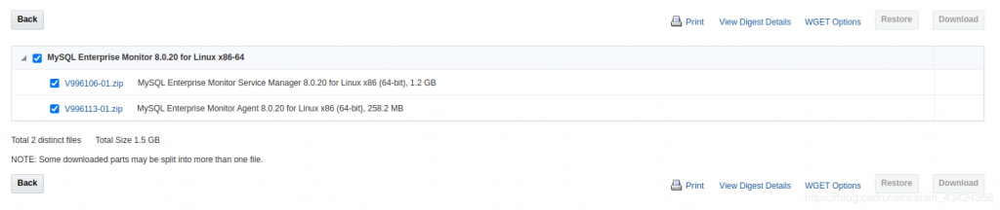											
1.2 安装服务端- 
- 
- 
- 
- 
- 
- 
- 
- 
- 
- 
- 
- 
- 
- 
- 
- 
`unzip mysql_monitor.zip `` ./mysqlmonitor-8.0.20.1237-linux-x86_64-installer.bin scutech@scutech:~/install$ ll``total 2819608``drwxrwxr-x  2 scutech scutech       4096 Jun  1 23:45 ./``drwxr-xr-x 30 scutech scutech       4096 Jun  1 23:43 ../``-rw-r-xr--  1 scutech scutech        975 Apr 23 05:50 README_en.txt*``-rw-r-xr--  1 scutech scutech        975 Apr 23 05:51 READ_ME_ja.txt*``-rw-r--r--  1 scutech scutech    6370627 Apr 22 08:14 monitor.a4.pdf``-rw-r--r--  1 scutech scutech    6377434 Apr 22 08:13 monitor.pdf``-rw-r--r--  1 scutech scutech    5277767 Apr 22 08:12 mysql-monitor-html.tar.gz``-rw-r--r--  1 scutech scutech    5302202 Apr 22 08:12 mysql-monitor-html.zip``-rw-r--r--  1 scutech scutech 1297382933 Jun  1 23:44 mysql_monitor.zip``-rw-r--r--  1 scutech scutech  270694162 Jun  1 23:44 mysql_monitor_agent.zip``-rwxrwxr-x  1 scutech scutech  647902090 Apr 22 12:26 mysqlmonitor-8.0.20.1237-linux-x86_64-installer.bin*``-rwxrwxr-x  1 scutech scutech  647923832 Apr 22 12:35 mysqlmonitor-8.0.20.1237-linux-x86_64-update-installer.bin*``
`` ./mysqlmonitor-8.0.20.1237-linux-x86_64-installer.bin`
运行上面的命令后出现以下画面，
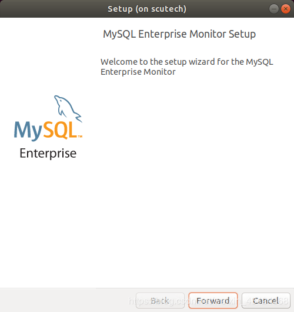											
选择小型模式，
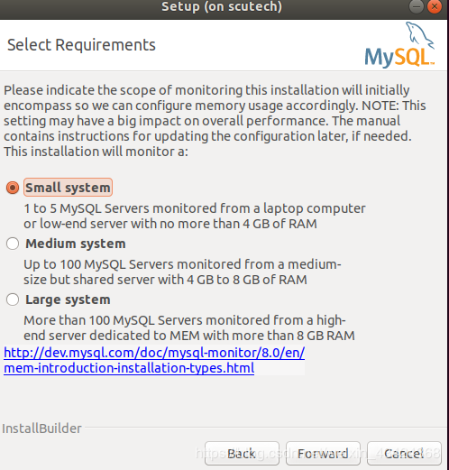											
使用安装软件自带的 MySQL 数据库作为 repository 数据库，
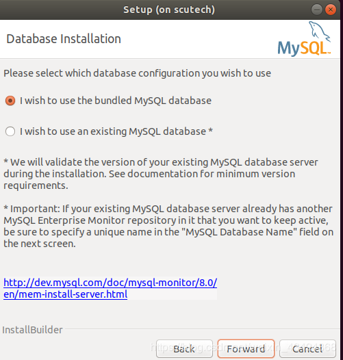											
这个用户（service_manager）和密码等相关信息要记录下来，
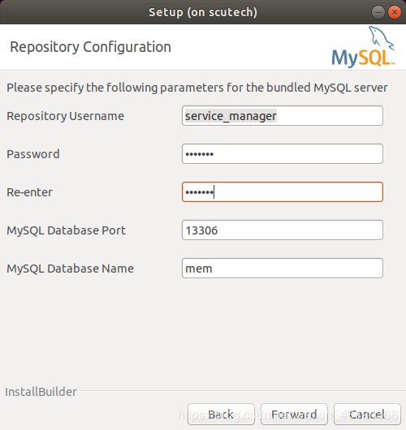											
You have not installed the MySQL Enterprise Monitor as the root user. Therefore it could not be configured to auto-start on reboot. See the Installation section of the MySQL Enterprise Monitor documentation for instructions on how to do this manually.
> 提示信息中提到的 root 用户是 OS 用户，不是 MySQL 用户！
开始安装，
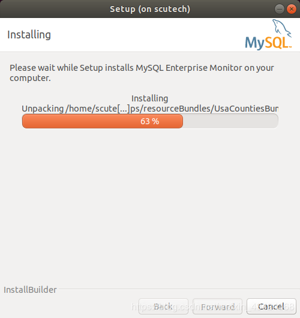											
安装完成提示，- 
- 
- 
- 
- 
`Setup has completed installing the MySQL Enterprise Monitor files on your computer``Uninstalling the MySQL Enterprise Monitor files can be done by invoking:``/home/scutech/mysql/enterprise/monitor/uninstall``To complete the installation, launch the MySQL Enterprise Monitor UI and complete the initial setup. Refer to the readme file for additional information and a list of known issues.``Please press next to launch the Monitor UI.`
管理脚本，- 
- 
- 
- 
- 
- 
- 
- 
- 
- 
```
usage: ./mysqlmonitorctl.sh help`       ./mysqlmonitorctl.sh (start|stop|status|restart)``       ./mysqlmonitorctl.sh (start|stop|status|restart) mysql``       ./mysqlmonitorctl.sh (start|stop|status|restart) tomcat``
``help       - this screen``start      - start the service(s)``stop       - stop  the service(s)``restart    - restart or start the service(s)``status     - report the status of the service(s)
```
1.3 安装客户端
客户端分两种，第一种是在客户端安装被监控的机器上（The architecture of a typical MySQL Enterprise Monitor installation），架构见下图：
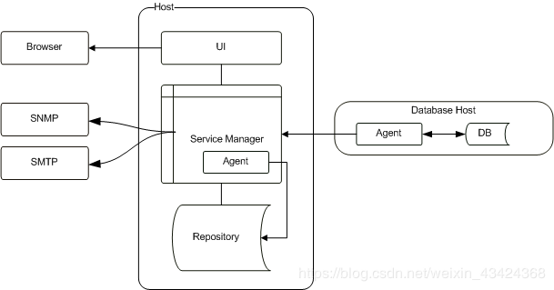											
第二种是不在被监控的机器上安装任何软件（Agentless Architecture），架构见下图：
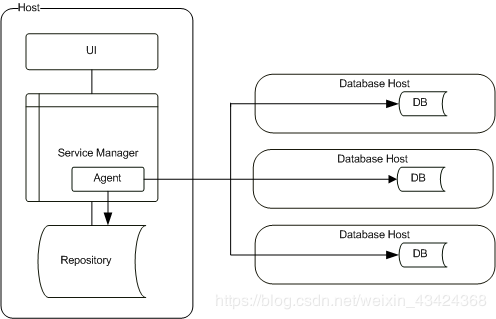											
**这两者的对比：**1. 架构上二者区别非常明显，一个有agent，另一个没有 agent；2. 无 agent 使用方便，配置 IP、用户名、密码等连接方式后即用；3. 无 agent 不能监控主机上非 MySQL 的信息，有 agent的可以；4. 从性能的角度考虑，推荐使用有 agent 的方式。
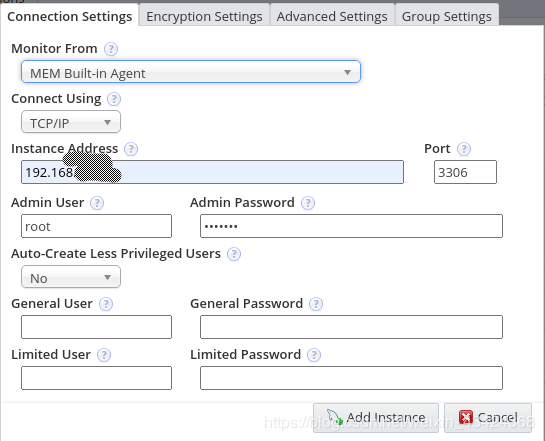											
**二、使用**
2.1 概览（Overview）
MEM 的概览（Overview）页面。
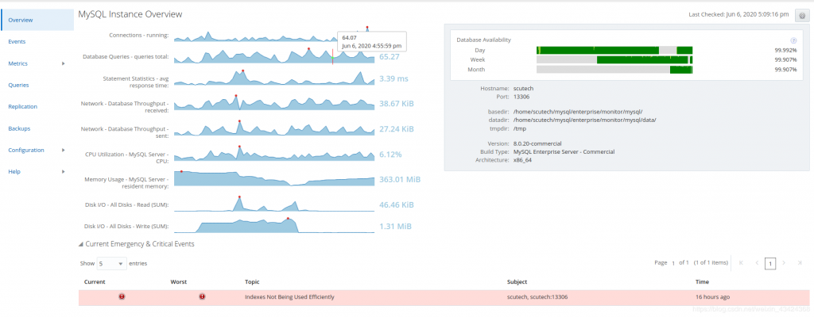											
从 overview 中可以看到被监控对象的大概情况，设置是点击右上角的齿轮。这是有 agent 的监控概览，包括了主机的信息，如：磁盘读写，内存使用等。没有 agent 的监控只有数据库的信息，如下图：
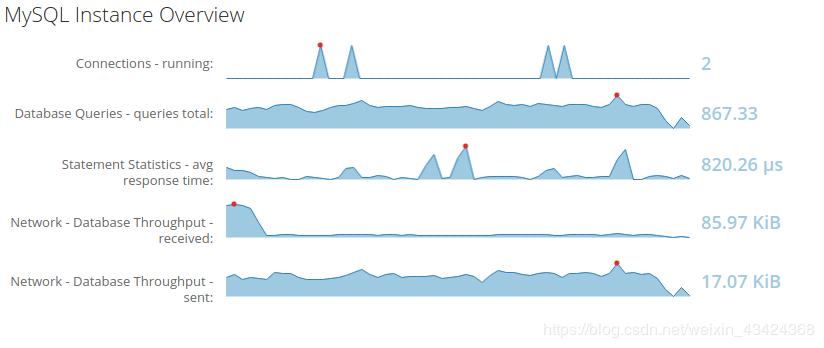											
2.2 事件（Event）
超过阀值的事件会在这里列出，阀值的配置在 configuration->advisor 里面，可以关闭的事件点击最右边 action 下面的叉叉符合即可关闭。
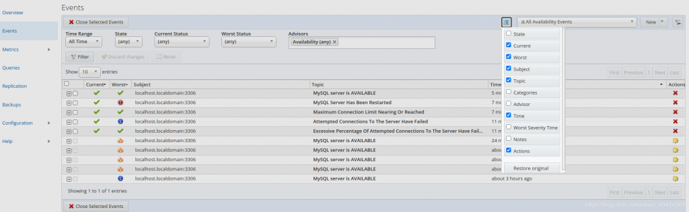											
2.3 指标（Metrics）
这里有很多衡量被监控对象的指标，这里列举比较常用的几例：
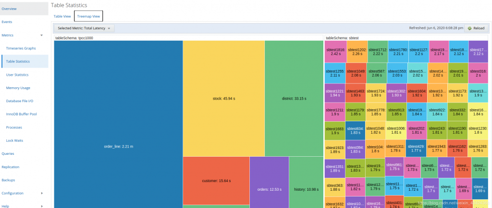											
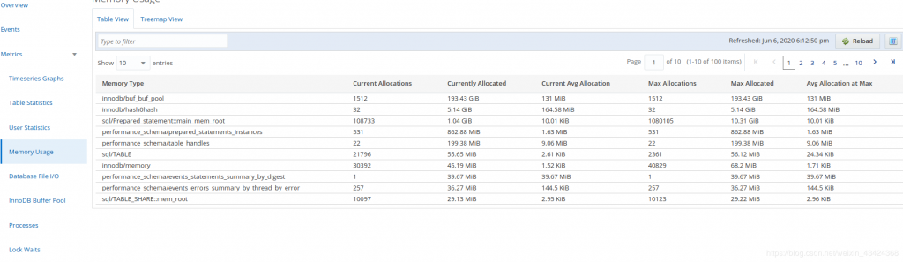											
查询分析（Query Analyzer）
查询分析的数据来自 Performance Schema Statement Digests 特性 **Performance Schema Statement Digests and Sampling**，早于 MySQL 5.6.14 的版本不支持这个特性。> Performance Schema Statement Digests and Sampling：
https://dev.mysql.com/doc/refman/8.0/en/performance-schema-statement-digests.html
被分析的语句的长度不能超过下面的参数，否则截断，- 
- 
- 
$ mysqladmin variables|grep max_digest_leng``|max_digest_length                                        | 1024 |``| performance_schema_max_digest_length                     | 1024 | `
注意：第一个参数 max_digest_length 是 session 级别的，而第二个 performance_schema_max_digest_length 是语句级别的，只对 performance_schema 起作用。
MySQL Enterprise Monitor Agent 每分钟收集一次表 performance_schema.events_statements_summary_by_digest，这个表由下面的参数 statements_digest 决定是否激活（默认激活）。
- 
- 
- 
- 
- 
- 
- 
`mysql> SELECT * FROM performance_schema.setup_consumers WHERE name = 'statements_digest';``+-------------------+---------+``| NAME              | ENABLED |``+-------------------+---------+``|``+-------------------+---------+``1 row in set (0.00 sec)`
监控的样图如下：
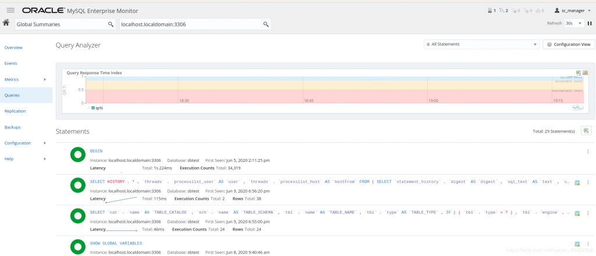											
在每个 SQL statement 后面有细节选项，点击进入可看这个 SQL statement 的细节：
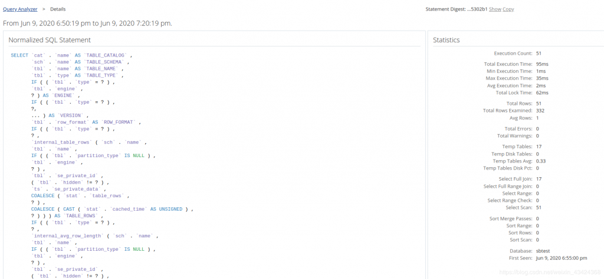											
当看这个 SQL statement 的例子的时候，可能因为配置的原因没有显示，这时会有下面的提示：
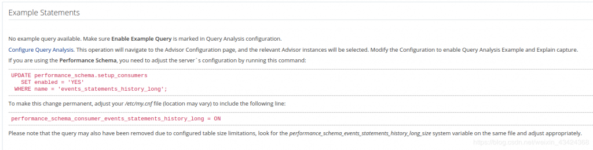											
设置正确后会出现下面的画面：
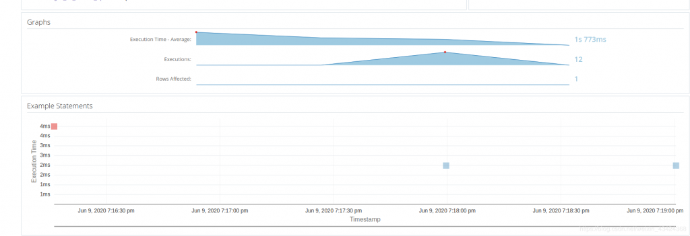											
参考：
Performance Schema Statement Digests and Sampling
https://dev.mysql.com/doc/refman/8.0/en/performance-schema-statement-digests.html