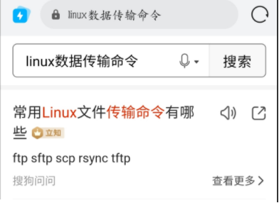

# 技术分享 | 你通常选用什么工具在 Linux 中进行数据传输？

**原文链接**: https://opensource.actionsky.com/20220414-linux/
**分类**: 技术干货
**发布时间**: 2022-04-14T01:27:29-08:00

---

作者：刘开洋
爱可生交付服务团队北京 DBA，对数据库及周边技术有浓厚的学习兴趣，喜欢看书，追求技术。
本文来源：原创投稿
*爱可生开源社区出品，原创内容未经授权不得随意使用，转载请联系小编并注明来源。
## 1、问题
前几天跟客户聊天，抱怨服务器之前的数据传输工具不好用，问我哪种传输工具效率高？还真被问住了，毕竟没经过实践嘛，今天就测试下。
有点草率得搜索了下，不过工具还不少。

数据传输工具: ftp sftp scp rsync tftp
## 2、准备工作
刨除网络带宽等其他因素，我们就 Linux 服务器之间传输文件做个对比，看看到底什么工具才是最快、最适合我的场景的。
我们就上面这些传输工具在文件实际大小和文件数量多少的层次上分别做个对比速度和简便性对比：
首先准备环境，配置两个机器ssh互信，创建两个文件夹，以不同的方式创建一个50G左右的大文件和51200个1M的小文件：
`# 制造50G大文件
[root@yang-01 big]# fallocate -l 50G 50g_file
[root@yang-01 big]# ll
total 52428856
-rw-r--r-- 1 root root 53687091200 Apr 10 17:55 50g_file
[root@yang-01 big]# du -sh *
51G 50g_file
# 制造51200个1M文件
[root@yang-01 many]# seq 51200 | xargs -i dd if=/dev/zero of=1m_file{} bs=1M count=1
1+0 records in
1+0 records out
1048576 bytes (1.0 MB) copied, 0.00468854 s, 224 MB/s
······
[root@yang-01 many]# ls | wc -l
51200
[root@yang-01 test]# du -sh many
51G many
`
小提示：这里采用了两种方式制造大文件，大家可以参考使用，生成文件确实是50G，字节数与之对应，至于为什么du工具计算出来是51G，这里并不是计算机1024与1000的数值换算的原因，而是因为du命令计算的是该文件累计使用到文件系统的总块数，可能出现使用的部分块空间占用并不完整的情况，导致数值偏大。
#### 2.1、测试 SCP
第一个测试的是scp，这是作者使用频率最多的一个远程传输工具，通常Linux系统会安装有该工具。
`####### 1 * 50G 文件测试
[root@yang-02 big]# scp /opt/test/big/50g_file root@yang-01:/opt/test/re/
50g_file                                                                                     100%   50GB 135.5MB/s   06:17
####### 51200 * 1M 文件测试
[root@yang-02 many]# time scp /opt/test/many/1m_file* root@yang-01:/opt/test/re/
1m_file1                                                       100% 1024KB  22.5MB/s   00:00
1m_file10                                                       100% 1024KB  35.8MB/s   00:00
1m_file100                                                     100% 1024KB  14.8MB/s   00:00
1m_file1000                                                     100% 1024KB  32.9MB/s   00:00
1m_file10000                                                   100% 1024KB  35.7MB/s   00:00
······
1m_file9998                                                     100% 1024KB 113.4MB/s   00:00
1m_file9999                                                     100% 1024KB  96.5MB/s   00:00
real    20m43.875s
user    4m2.448s
sys     2m52.604s
[root@yang-01 re]# ls | wc -l
51200
`
说明：
- 
类似于cp命令，由于跨机器文件加密传输导致其速度稍慢于copy操作；
- 
如果存在生产环境中无法使用ssh协议的情况，可以采用nc 文件传输；
- 
优点：该工具对于机器的系统资源占用少、影响较小，使用方便；
#### 2.2、测试 FTP
下面测一下 ftp，看看效果如何。
`####### 1 * 50G 文件测试
[root@yang-01 re]# ftp yang-02
Connected to yang-02 (192.168.88.72).
220 (vsFTPd 3.0.2)
Name (yang-02:root): root
331 Please specify the password.
Password:
230 Login successful.
Remote system type is UNIX.
Using binary mode to transfer files.
ftp> get /opt/test/big/50g_file /opt/test/re/50g_file
local: /opt/test/re/50g_file remote: /opt/test/big/50g_file
227 Entering Passive Mode (192,168,88,72,38,232).
150 Opening BINARY mode data connection for /opt/test/big/50g_file (53687091200 bytes).
226 Transfer complete.
53687091200 bytes received in 150 secs (359091.49 Kbytes/sec)
ftp> quit
221 Goodbye.
####### 51200 * 1M 文件测试
[root@yang-01 re]# time ftp yang-02
Connected to yang-02 (192.168.88.72).
220 (vsFTPd 3.0.2)
Name (yang-02:root):
331 Please specify the password.
Password:
230 Login successful.
Remote system type is UNIX.
Using binary mode to transfer files.
ftp> prompt off
Interactive mode off.
ftp> cd /opt/test/many
250 Directory successfully changed.
ftp> mget * .*
local: 1m_file1 remote: 1m_file1
227 Entering Passive Mode (192,168,88,72,156,228).
150 Opening BINARY mode data connection for 1m_file1 (1048576 bytes).
226 Transfer complete.
······
1048576 bytes received in 0.00337 secs (311057.86 Kbytes/sec)
local: . remote: .
227 Entering Passive Mode (192,168,88,72,213,4).
550 Failed to open file.
Warning: embedded .. in .. (changing to !!)
local: !! remote: !!
227 Entering Passive Mode (192,168,88,72,223,91).
550 Failed to open file.
ftp> quit
221 Goodbye.
real    14m32.032s
user    0m12.857s
sys     3m21.131s
[root@yang-01 re]# ls | wc -l
51200
`
说明：
- 
基于TCP 传输协议，ftp客户端发出命令到服务端进行文件下载、上传或者变更目录；
- 
适用于内网的文件归集以及公共文件的调阅。
- 
偶发性的文件传输，为了保障各主机之间的安全性，一般不会使用这种方式进行数据传输。
#### 2.3、测试 SFTP
sftp 就是在 ftp 的基础上补充了 加密/解密 的技术，我们也一起看下和 ftp 的传输速度差异：
`####### 1 * 50G 文件测试
[root@yang-01 re]# sftp root@yang-02
Connected to yang-02.
sftp> get ./big/50g_file /opt/test/re/50g_file
Fetching /./big/50g_file to /opt/test/re/50g_file
/./big/50g_file                                                      100%   50GB 128.7MB/s   06:37
sftp> quit
####### 51200 * 1M 文件测试
[root@yang-01 re]# time sftp root@yang-02
Connected to yang-02.
sftp> get ./many/1m_file* /opt/test/re/
Fetching /./many/1m_file1 to /opt/test/re/1m_file1
/./many/1m_file1                                                     100% 1024KB  77.3MB/s   00:00
······
Fetching /./many/1m_file9999 to /opt/test/re/1m_file9999
/./many/1m_file9999                                                   100% 1024KB 118.0MB/s   00:00
sftp>
sftp> quit
real    19m43.154s
user    4m52.309s
sys     4m47.476s
[root@yang-01 re]# ls | wc -l
51200
`
说明：
- 
相较于ftp工具，在提升安全等级的基础上对ssh传输进行加密，sftp 的传输速率降低了70%左右；
- 
使用 sftp 和 ftp 的使用需要搭建服务，使用麻烦，且 sftp 的传输速率类似于 scp。
#### 2.4、测试 RSYNC
再看看 rsync 工具的测试：
`####### 1 * 50G 文件测试
[root@yang-02 big]# time rsync -av ./50g_file root@yang-01:/opt/test/re/50g_file
sending incremental file list
50g_file
sent 53,700,198,488 bytes  received 35 bytes  107,940,097.53 bytes/sec
total size is 53,687,091,200  speedup is 1.00
real    8m17.039s
user    5m36.160s
sys     2m41.196s
####### 51200 * 1M 文件测试
[root@yang-02 many]# time rsync -av ./1m_file* root@yang-01:/opt/test/re/
sending incremental file list
1m_file1
1m_file10
1m_file100
······
1m_file9998
1m_file9999
sent 53,702,886,375 bytes  received 972,872 bytes  58,278,740.37 bytes/sec
total size is 53,687,091,200  speedup is 1.00
real    15m21.548s
user    5m46.497s
sys     2m38.581s
`
说明：
- 
rsync从比scp稍微快一点，Centos 中默认安装；
- 
占用带宽少，因为 rsync 在两端服务器之间传输数据块时会进行解压缩处理。
- 
优势： rsync 只会同步发生变化的文件，如果没有变更， rsync 不会进行覆盖处理，即 rsync 适合增量同步（由于场景原因，这里没有过多演示）；
- 
如果传输文件数量多的时候，rsync 工具可能会导致磁盘的 I/O 偏高，如果文件系统中存在数据库会产生一定影响。
#### 2.5、测试 TFTP
类似于 sftp，测一下tftp的速度怎么样：
`####### 1 * 50G 文件测试
[root@yang-01 re]# time tftp yang-02
tftp> get ./big/50g_file
real    10m30.114s
user    0m6.029s
sys 1m16.888s
[root@yang-01 re]# ll
total 1805832
-rw-r--r-- 1 root root 1849168384 Apr 11 17:54 50g_file
[root@yang-01 re]# du -sh *
1.8G    50g_file
####### 1 * 1G 文件测试
[root@yang-01 re]# time tftp yang-02
tftp> get ./many/1g_file1
tftp> quit
real    5m54.090s
user    0m29.190s
sys     2m58.866s
[root@yang-01 re]# ll
total 1048576
-rw-r--r-- 1 root root 1073741824 Apr 11 18:09 1g_file1
`
说明：
- 
tftp 工具是基于UDP协议进行数据传输，同样需要配置相关服务，使用过于麻烦；
- 
测试50G大文件传输仅仅1.8G，发生超时中断，fail，且时间较长；
- 
测试1个1G文件传输时间为354s，推测50倍时间较长，放弃该工具的测试。
#### 2.6、补充 NC
小编补充 nc 工具肯定是遇到了上述工具无法完成数据传输的场景，我们测下速度：
`####### 1 * 50G 文件测试
[root@yang-02 big]# nc 192.168.88.71 10086 < /opt/test/big/50g_file
[root@yang-01 re]# time nc -l 10086 > 50G_file
real    2m30.663s
user    0m9.232s
sys     2m16.370s
####### 51200 * 1M 文件测试
[root@yang-01 many]# tar cfz - *|nc 192.168.88.71 10086
[root@yang-01 re]# time nc -l 10086|tar xfvz -
1m_file1
1m_file10
1m_file100
···
1m_file9997
1m_file9998
1m_file9999
real    11m38.400s
user    3m47.051s
sys     2m33.923s
`
说明：
- 
这个工具的功能很是强大，可以实现任意TCP/UDP端口的监听与扫描；
- 
优势：速度相比于 scp 快很多，几乎没有网络协议的开销；
- 
跨机器传输文件只是它的功能之一，其他功能等待大家探索，据说可以网络测速哦。
#### 2.7、补充 python 工具
如果还有nc无法解决的场景，我们再试下使用 python 的 SimpleHTTPServer 模块吧：
`####### 1 * 50G 文件测试
[root@yang-02 big]# python -m SimpleHTTPServer 10086
Serving HTTP on 0.0.0.0 port 10086 ...
192.168.88.71 - - [13/Apr/2022 16:02:15] "GET /50g_file HTTP/1.1" 200 -
[root@yang-01 re]# wget http://192.168.88.72:10086/50g_file
--2022-04-13 16:02:15--  http://192.168.88.72:10086/50g_file
Connecting to 192.168.88.72:10086... connected.
HTTP request sent, awaiting response... 200 OK
Length: 53687091200 (50G) [application/octet-stream]
Saving to: ‘50g_file’
100%[==================================================================================>] 53,687,091,200  358MB/s   in 2m 35s
2022-04-13 16:04:50 (330 MB/s) - ‘50g_file’ saved [53687091200/53687091200]
####### 51200 * 1M 文件测试
[root@yang-02 many]# python -m SimpleHTTPServer 10086
Serving HTTP on 0.0.0.0 port 10086 ...
192.168.88.71 - - [13/Apr/2022 19:46:02] "GET /1m_file1 HTTP/1.1" 200 -
192.168.88.71 - - [13/Apr/2022 19:46:02] "GET /1m_file2 HTTP/1.1" 200 -
······
192.168.88.71 - - [13/Apr/2022 19:55:21] "GET /1m_file51200 HTTP/1.1" 200 -
[root@yang-01 re]# cat liu.sh
#!/bin/bash
for ((i=1;i<=51200;i++))
do
echo "http://192.168.88.72:10086/1m_file$i"
done
[root@yang-01 re]# bash liu.sh > liu.list
[root@yang-01 re]# cat liu.list | wc -l
51200
[root@yang-01 re]# wget -i liu.list
--2022-04-13 19:46:02--  http://192.168.88.72:10086/1m_file1
Connecting to 192.168.88.72:10086... connected.
HTTP request sent, awaiting response... 200 OK
Length: 1048576 (1.0M) [application/octet-stream]
Saving to: ‘1m_file1’
100%[=====================================================================================>] 1,048,576   --.-K/s   in 0.05s
2022-04-13 19:46:02 (19.9 MB/s) - ‘1m_file1’ saved [1048576/1048576]
·······
100%[=====================================================================================>] 1,048,576   --.-K/s   in 0.08s
2022-04-13 19:55:21 (11.9 MB/s) - ‘1m_file51200’ saved [1048576/1048576]
FINISHED --2022-04-13 19:55:21--
Total wall clock time: 9m 19s
Downloaded: 51200 files, 50G in 8m 11s (104 MB/s)
`
说明：
- 
使用python的 SimpleHTTPServer 模块或者 python3 的 http.server 模块实现了一个轻量级的HTTP协议的Web服务器；
- 
Linux发行版本几乎都内置有 python，所以该工具使用也较为方便。
- 
正常情况下，多文件传输有些麻烦，文件名可能无规律，需要单文件挨个处理。
## 3、总结
| 测试工具 | 1 * 50G测试时间 | 1M * 51200测试时间 | 压缩 | 加密 | 速度 |
| --- | --- | --- | --- | --- | --- |
| SCP | 06:17     = 377s | 20m43.875s = 1243.875s | -C 选项支持 | ssh 协议加密 | 较快 |
| FTP | 150s | 14m32.032s = 872.032s | 无 | 无 | 快 |
| SFTP | 06:37     = 397s | 19m43.154s = 1183.154s | 无 | ssh 协议加密 | 较快 |
| RSYNC | 8m17.039s = 657.039s | 15m21.548s = 921.548s | -z 选项支持 | ssh 协议加密 | 较快 |
| TFTP | 10m30.114s test fail |  | 无 | 无 | 慢 |
| NC | 2m30.663s = 150.663s | 11m38.400s = 698.400s | 无 | 无 | 快 |
| python工具 | 2m 35s    = 155 s | 9m 19s     = 559s | 无 | 无 | 快 |
- 
大文件传输速率：FTP > NC > python 工具 > SCP > SFTP > RSYNC 。
- 
小文件传输速率：python 工具 > NC > FTP > RSYNC > SFTP > SCP 。
- 
不同工具具有不同的应用场景，RSYNC在增量同步或定期归档的情况下速度很快；FTP工具搭建部署麻烦，适用于内网的文件归集以及公共文件的调阅，安全性低。
- 
如果由于生产安全限制，关闭了SSH连接或22端口的使用，可以使用基于其他协议的连接访问，推荐nc工具。
- 
对比每个工具对于同容量的文件数量测试，小文件会导致CPU多次读取匹配信息，增加CPU负担，IO的次数也会增多，存在一定的IO瓶颈，同容量的大文件和多个小文件传输对比会有一定的速度优势。
- 
如果是大量文件传输，可根据文件名特点分批次设置多个传输进程，从而达到源端服务器并发传输的效果，更好的利用网络带宽。
## 4、备注
- 
由于操作限制，以上测试工具均忽略交互式登录的时间。
- 
测试为虚拟机环境，无法保证变量绝对可控(网络带宽、吞吐、磁盘性能等影响因素)，因此文中给出的时间节点仅供参考。
- 
关于各个工具的使用说明及拓展，这里并没有给出，网上资料很多，各位老板随意爬取。

彩蛋：小编测试时发现各个工具 50 * 1G 的传输速度要快于 1 * 50G 文件，所以在同一环境下，会不会存在一种情况的50G容量（单文件容量和数量的交叉匹配）传输速度达到最快？有兴趣的小伙伴可以继续研究下。