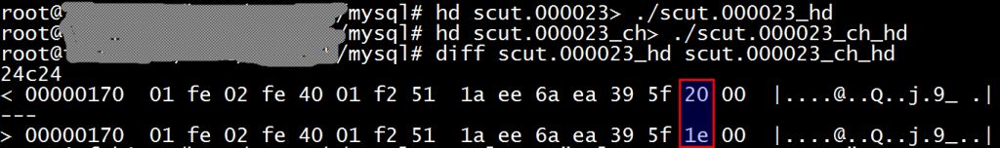

# 技术分享 | 使用 Python 解析并“篡改”MySQL 的 Binlog

**原文链接**: https://opensource.actionsky.com/20201027-mysql/
**分类**: MySQL 新特性
**发布时间**: 2020-10-27T01:21:39-08:00

---

作者：姚远
专注于 Oracle、MySQL 数据库多年，Oracle 10G 和 12C OCM，MySQL 5.6，5.7，8.0 OCP。现在鼎甲科技任技术顾问，为同事和客户提供数据库培训和技术支持服务。
本文来源：原创投稿
*爱可生开源社区出品，原创内容未经授权不得随意使用，转载请联系小编并注明来源。
**前言**
MySQL 的 Binlog 记录着 MySQL 数据库的所有变更信息，了解 Binlog 的结构可以帮助我们解析Binlog，甚至对 Binlog 进行一些修改，或者说是“篡改”，例如实现类似于 Oracle 的 flashback 的功能，恢复误删除的记录，把 update 的记录再还原回去等。本文将带您探讨一下这些神奇功能的实现，您会发现比您想象地要简单得多。本文指的 Binlog 是 ROW 模式的 Binlog，这也是 MySQL 8 里的默认模式，STATEMENT 模式因为使用中有很多限制，现在用得越来越少了。
**Binlog 的结构**
Binlog 由事件（event）组成，请注意是事件（event）不是事务（transaction），一个事务可以包含多个事件。事件描述对数据库的修改内容。
从  MySQL 5 版本开始，Binlog 采用的是 v4 版本。事件的类型根据 MySQL 的内部文档，有下面 36 类：
- 
- 
- 
- 
- 
- 
- 
- 
- 
- 
- 
- 
- 
- 
- 
- 
- 
- 
- 
- 
- 
- 
- 
- 
- 
- 
- 
- 
- 
- 
- 
- 
- 
- 
- 
- 
- 
- 
- 
- 
`enum Log_event_type { ``  UNKNOWN_EVENT= 0, ``  START_EVENT_V3= 1, ``  QUERY_EVENT= 2, ``  STOP_EVENT= 3, ``  ROTATE_EVENT= 4, ``  INTVAR_EVENT= 5, ``  LOAD_EVENT= 6, ``  SLAVE_EVENT= 7, ``  CREATE_FILE_EVENT= 8, ``  APPEND_BLOCK_EVENT= 9, ``  EXEC_LOAD_EVENT= 10, ``  DELETE_FILE_EVENT= 11, ``  NEW_LOAD_EVENT= 12, ``  RAND_EVENT= 13, ``  USER_VAR_EVENT= 14, ``  FORMAT_DESCRIPTION_EVENT= 15, ``  XID_EVENT= 16, ``  BEGIN_LOAD_QUERY_EVENT= 17, ``  EXECUTE_LOAD_QUERY_EVENT= 18, ``  TABLE_MAP_EVENT = 19, ``  PRE_GA_WRITE_ROWS_EVENT = 20, ``  PRE_GA_UPDATE_ROWS_EVENT = 21, ``  PRE_GA_DELETE_ROWS_EVENT = 22, ``  WRITE_ROWS_EVENT = 23, ``  UPDATE_ROWS_EVENT = 24, ``  DELETE_ROWS_EVENT = 25, ``  INCIDENT_EVENT= 26, ``  HEARTBEAT_LOG_EVENT= 27, ``  IGNORABLE_LOG_EVENT= 28,``  ROWS_QUERY_LOG_EVENT= 29,``  WRITE_ROWS_EVENT = 30,``  UPDATE_ROWS_EVENT = 31,``  DELETE_ROWS_EVENT = 32,``  GTID_LOG_EVENT= 33,``  ANONYMOUS_GTID_LOG_EVENT= 34,``  PREVIOUS_GTIDS_LOG_EVENT= 35, ``  ENUM_END_EVENT ``  /* end marker */ ``};`每个 Binlog 文件总是以 Format Description Event 作为开始，以 Rotate Event 结束作为结束，我们来看一个 Binlog 的例子：- 
- 
- 
- 
- 
- 
- 
- 
- 
- 
- 
- 
- 
- 
- 
```
mysql>  show binlog events in 'scut.000023';`+-------------+-----+----------------+-----------+-------------+--------------------------------------------------------+``| Log_name    | Pos | Event_type     | Server_id | End_log_pos | Info                                                   |``+-------------+-----+----------------+-----------+-------------+--------------------------------------------------------+``| scut.000023 |   4 | Format_desc    |      1024 |         123 | Server ver: 5.7.31-0ubuntu0.16.04.1-log, Binlog ver: 4 |``| scut.000023 | 123 | Previous_gtids |      1024 |         154 |                                                        |``| scut.000023 | 154 | Anonymous_Gtid |      1024 |         219 | SET @@SESSION.GTID_NEXT= 'ANONYMOUS'                   |``| scut.000023 | 219 | Query          |      1024 |         291 | BEGIN                                                  |``| scut.000023 | 291 | Rows_query     |      1024 |         330 | # delete from tt1                                      |``| scut.000023 | 330 | Table_map      |      1024 |         378 | table_id: 111 (test.tt1)                               |``| scut.000023 | 378 | Delete_rows    |      1024 |         434 | table_id: 111 flags: STMT_END_F                        |``| scut.000023 | 434 | Xid            |      1024 |         465 | COMMIT /* xid=216 */                                   |``| scut.000023 | 465 | Rotate         |      1024 |         507 | scut.000024;pos=4                                      |``+-------------+-----+----------------+-----------+-------------+--------------------------------------------------------+``9 rows in set (0.00 sec)
```
关于 “show binlog events” 语法显示的每一列的作用说明如下：
											
每个事件类型的说明可以参考**《MySQL 的内部文档》**> https://dev.mysql.com/doc/internals/en/binary-log.html
我们这里说明一下这里遇到的几个事件类型：
											
根据官方文档，事件（event）数据结构如下：
- 
- 
- 
- 
- 
- 
- 
- 
- 
- 
- 
- 
- 
- 
- 
- 
- 
- 
- 
```
+=====================================+``| event  | timestamp         0 : 4    |``| header +----------------------------+``|        | type_code         4 : 1    |``|        +----------------------------+``|        | server_id         5 : 4    |``|        +----------------------------+``|        | event_length      9 : 4    |``|        +----------------------------+``|        | next_position    13 : 4    |``|        +----------------------------+``|        | flags            17 : 2    |``|        +----------------------------+``|        | extra_headers    19 : x-19 |``+=====================================+``| event  | fixed part        x : y    |``| data   +----------------------------+``|        | variable part              |``+=====================================+
```
**恢复误删除的记录**
现在我们已经了解了 Binlog 的结构，我们可以试着修改 Binlog 里的数据。例如前面举例的 Binlog 删除了一条记录，我们可以试着把这条记录恢复，Binlog 里面有个删除行（DELETE_ROWS_EVENT）的事件，就是这个事件删除了记录，这个事件和写行（WRITE_ROWS_EVENT）的事件的数据结构是完全一样的，只是删除行事件的类型是 32，写行事件的类型是 30，我们把对应的 Binlog 位置的 32 改成 30 即可把已经删除的记录再插入回去。从前面的 “show binlog events” 里面可看到这个 DELETE_ROWS_EVENT 是从位置 378 开始的，这里的位置就是 Binlog 文件的实际位置（以字节为单位）。从事件（event）的结构里面可以看到 type_code 是在 event 的第 5 个字节，我们写个 Python 小程序把把第383（378+5=383）字节改成 30 即可。当然您也可以用二进制编辑工具来改。
下面是这个 Python 小程序的例子：
- 
- 
- 
- 
- 
- 
- 
- 
- 
- 
- 
- 
- 
- 
- 
- 
- 
- 
- 
- 
- 
#! /usr/bin/python3``import sys``
``if len(sys.argv) != 3:``        print ('Please run chtype.py inputType changedType.')``        sys.exit()``
``inputType=open(sys.argv[1],"rb")``changedType=open(sys.argv[2],"wb")``
``changedType.write(inputType.read(382))``changedType.write(chr(30).encode())``inputType.seek(1,1)``while True:``  line = inputType.readline()  ``  if not line:``        break``  changedType.write(line)``
``inputType.close()``changedType.close()`我们把原来的 Binlog 和修改后的 Binlog 进行一个对比：
											
发现这两个 Binlog 只有一个字节有区别，也就是 type_code 从 32 变成了 30，注意 Binlog 里面显示的是 16 进制的数字。我们分别应用一下原来的 Binlog 和修改后的 Binlog，看看效果如何？- 
- 
- 
- 
- 
- 
- 
- 
- 
- 
- 
- 
- 
- 
- 
- 
- 
```
$ mysql  -e "select * from test.tt1";`$ mysqlbinlog ./scut.000023_ch |mysql``$ mysql  -e "select * from test.tt1";``+---------------------+``| col1                |``+---------------------+``| aaaaaaaaaaaaaaaaaaa |``+---------------------+``$ mysqlbinlog ./scut.000023 |mysql``$ mysql  -e "select * from test.tt1";``$ mysqlbinlog ./scut.000023_ch |mysql``$ mysql  -e "select * from test.tt1";``+---------------------+``| col1                |``+---------------------+``| aaaaaaaaaaaaaaaaaaa |``+---------------------+
```
我们发现这两个 Binlog 可以分别把对应的记录删除和插入到 MySQL 数据库中，这样我们就成功地实现了类似于 Oracle 的 flashback 功能。
**找出 Binlog 中的大事务**
由于 ROW 模式的 Binlog 是每一个变更都记录一条日志，因此一个简单的 SQL，在 Binlog 里可能会产生一个巨无霸的事务，例如一个不带 where 的 update 或 delete 语句，修改了全表里面的所有记录，每条记录都在 Binlog 里面记录一次，结果是一个巨大的事务记录。这样的大事务经常是产生麻烦的根源。我的一个客户有一次向我抱怨，一个 Binlog 前滚，滚了两天也没有动静，我把那个 Binlog 解析了一下，发现里面有个事务产生了 1.4G 的记录，修改了 66 万条记录！下面是一个简单的找出 Binlog 中大事务的 Python 小程序，我们知道用 mysqlbinlog 解析的 Binlog，每个事务都是以 BEGIN 开头，以 COMMIT 结束。我们找出 BENGIN 前面的 “# at” 的位置，检查 COMMIT 后面的 “# at” 位置，这两个位置相减即可计算出这个事务的大小，下面是这个 Python 程序的例子。
- 
- 
- 
- 
- 
- 
- 
- 
- 
- 
- 
- 
- 
- 
- 
- 
- 
- 
- 
- 
- 
- 
- 
- 
- 
$ cat ./checkBigTran.py ``#! /usr/bin/python3``import sys``
``position=0``beginPosition=0``endPosition=0``maxSize=0``isEnd=0``for line in sys.stdin:``      if line[: 4]=='# at':``          position=int(line[5:])``          if isEnd:``             endPosition=position``             isEnd=0``      if line[: 5]=='BEGIN':``          beginPosition=position``      if line[: 6]=='COMMIT':``          isEnd=1``      if endPosition-beginPosition>maxSize:``          maxBeginPosition= beginPosition``          maxEndPosition=endPosition``          maxSize=endPosition-beginPosition``
``print("The largest transaction size is %d, the begion position is %d, the end position is %d." % (maxSize,maxBeginPosition,maxEndPosition))`用这个小程序检查一下可能包含大事务的 Binlog：- 
- 
```
$ mysqlbinlog binlog1|./checkBigTran.py `The largest transaction size is 1468183501, the begion position is 5737766, the end position is 1473921267.
```
发现里面果然包含了一个 1.4G 的大事务。
**切割 Binlog 中的大事务**
对于大的事务，MySQL 会把它分解成多个事件（注意一个是事务 TRANSACTION，另一个是事件 EVENT），事件的大小由参数 binlog-row-event-max-size 决定，这个参数默认是 8K。因此我们可以把若干个事件切割成一个单独的略小的事务，例如下面这个 Binlog：
- 
- 
- 
- 
- 
- 
- 
- 
- 
- 
- 
- 
- 
- 
- 
- 
- 
- 
mysql> show binlog events in 'scut.000025';``+-------------+-----+----------------+-----------+-------------+--------------------------------------------------------+``| Log_name    | Pos | Event_type     | Server_id | End_log_pos | Info                                                   |``+-------------+-----+----------------+-----------+-------------+--------------------------------------------------------+``| scut.000025 |   4 | Format_desc    |      1024 |         123 | Server ver: 5.7.31-0ubuntu0.16.04.1-log, Binlog ver: 4 |``| scut.000025 | 123 | Previous_gtids |      1024 |         154 |                                                        |``| scut.000025 | 154 | Anonymous_Gtid |      1024 |         219 | SET @@SESSION.GTID_NEXT= 'ANONYMOUS'                   |``| scut.000025 | 219 | Query          |      1024 |         291 | BEGIN                                                  |``| scut.000025 | 291 | Rows_query     |      1024 |         343 | # insert into tt1 values ('1')                         |``| scut.000025 | 343 | Table_map      |      1024 |         391 | table_id: 111 (test.tt1)                               |``| scut.000025 | 391 | Write_rows     |      1024 |         429 | table_id: 111 flags: STMT_END_F                        |``| scut.000025 | 429 | Rows_query     |      1024 |         481 | # insert into tt1 values ('2')                         |``| scut.000025 | 481 | Table_map      |      1024 |         529 | table_id: 111 (test.tt1)                               |``| scut.000025 | 529 | Write_rows     |      1024 |         567 | table_id: 111 flags: STMT_END_F                        |``| scut.000025 | 567 | Xid            |      1024 |         598 | COMMIT /* xid=397 */                                   |``| scut.000025 | 598 | Rotate         |      1024 |         640 | scut.000026;pos=4                                      |``+-------------+-----+----------------+-----------+-------------+--------------------------------------------------------+``12 rows in set (0.01 sec)`这个 Binlog 的两个 insert 是在一个事务里面完成的，我们可以两个事务之间插入 xid、Anonymous_Gtid、Query 等三个事件把一个事务切割成两个事务。Rows_query 这个事件不用插入，这个事件是注释掉了的，记录的是执行的 SQL，这个事件只有在参数 binlog_rows_query_log_events 为 on 时才会有，默认是 off 。相应的 Python 程序如下：- 
- 
- 
- 
- 
- 
- 
- 
- 
- 
- 
- 
- 
- 
- 
- 
- 
- 
- 
- 
- 
- 
- 
- 
- 
- 
```
# cat splitTran.py `#! /usr/bin/python3``import sys``
``if len(sys.argv) != 3:``    print ('Please run splitTrans.py inputBinlog changedBinlog.')``    sys.exit()``
``inputBinlog=open(sys.argv[1],"rb")``changedBinlog=open(sys.argv[2],"wb")``
``changedBinlog.write(inputBinlog.read(429))   # read from the head of  input binlog file to the first insert, then write into the changed binlog file.``firstInsert=inputBinlog.tell()``inputBinlog.seek(567,0)  # locate to the xid event``changedBinlog.write(inputBinlog.read(31))  # read from 567 to 598, write xid event, into the changed binlog file.``inputBinlog.seek(154,0)  # locate to the Anonymous_Gtid, Query events.``changedBinlog.write(inputBinlog.read(137))  # read from 154 to 291, write Anonymous_Gtid, Query events into changed binlog file.``inputBinlog.seek(firstInsert)``while True:``      line = inputBinlog.readline()  ``      if not line:``           break``      changedBinlog.write(line)``
``inputBinlog.close()``changedBinlog.close()
```
我们执行这个 Python 程序，生成一个新的 Binlog ，然后把新的 Binlog 应用到  MySQL。- 
- 
```
$  ./splitTran.py scut.000025 scut.000025_ch``$ mysqlbinlog scut.000025_ch |mysql
```
我们看看执行地效果：- 
- 
- 
- 
- 
- 
- 
- 
- 
- 
- 
- 
- 
- 
- 
- 
- 
- 
- 
- 
- 
- 
- 
- 
- 
- 
```
mysql> show binlog events in 'scut.000026';``+-------------+-----+----------------+-----------+-------------+------------------------------------------------------------------------------------------------------------------------------------+``| Log_name    | Pos | Event_type     | Server_id | End_log_pos | Info                                                                                                                               |``+-------------+-----+----------------+-----------+-------------+------------------------------------------------------------------------------------------------------------------------------------+``| scut.000026 |   4 | Format_desc    |      1024 |         123 | Server ver: 5.7.31-0ubuntu0.16.04.1-log, Binlog ver: 4                                                                             |``| scut.000026 | 123 | Previous_gtids |      1024 |         154 |                                                                                                                                    |``| scut.000026 | 154 | Anonymous_Gtid |      1024 |         219 | SET @@SESSION.GTID_NEXT= 'ANONYMOUS'                                                                                               |``| scut.000026 | 219 | Query          |      1024 |         287 | BEGIN                                                                                                                              |``| scut.000026 | 287 | Rows_query     |      1024 |         439 | # BINLOG '``EbA7XxMABAAAMAAAAIcBAAAAAG8AAAAAAAEABHRlc3QAA3R0MQAB/gL+QAEYYumN``EbA7Xx4ABAAAJgAAAK0BAAAAAG8AAAAAAAEAAgAB//4BMeeyFcw=``' |``| scut.000026 | 439 | Table_map      |      1024 |         487 | table_id: 111 (test.tt1)                                                                                                           |``| scut.000026 | 487 | Write_rows     |      1024 |         525 | table_id: 111 flags: STMT_END_F                                                                                                    |``| scut.000026 | 525 | Xid            |      1024 |         556 | COMMIT /* xid=425 */                                                                                                               |``| scut.000026 | 556 | Anonymous_Gtid |      1024 |         621 | SET @@SESSION.GTID_NEXT= 'ANONYMOUS'                                                                                               |``| scut.000026 | 621 | Query          |      1024 |         689 | BEGIN                                                                                                                              |``| scut.000026 | 689 | Rows_query     |      1024 |         841 | # BINLOG '``F7A7XxMABAAAMAAAABECAAAAAG8AAAAAAAEABHRlc3QAA3R0MQAB/gL+QAE+WKbj``F7A7Xx4ABAAAJgAAADcCAAAAAG8AAAAAAAEAAgAB//4BMmfP2Zk=``' |``| scut.000026 | 841 | Table_map      |      1024 |         889 | table_id: 111 (test.tt1)                                                                                                           |``| scut.000026 | 889 | Write_rows     |      1024 |         927 | table_id: 111 flags: STMT_END_F                                                                                                    |``| scut.000026 | 927 | Xid            |      1024 |         958 | COMMIT /* xid=432 */                                                                                                               |``+-------------+-----+----------------+-----------+-------------+------------------------------------------------------------------------------------------------------------------------------------+`14 rows in set (0.00 sec)
```
我们看到两个 insert 已经分开到两个事务里面了。
**后记**
ROW 模式下，即使我们只更新了一条记录的其中某个字段，也会记录每个字段变更前后的值，这个行为是 binlog_row_image 参数控制的，这个参数有 3 个值，默认为 FULL，也就是记录列的所有修改，即使字段没有发生变更也会记录。这样我们就可以实现类似 Oracle 的 flashback 的功能，我个人估计 MySQL 未来的版本从可能会基于 Binlog 推出这样的功能。
了解了 Binlog 的结构，再加上 Python 这把瑞士军刀，我们还可以实现很多功能，例如我们可以统计哪个表被修改地最多？我们还可以把 Binlog 切割成一段一段的，然后再重组，可以灵活地进行 MySQL 数据库的修改和迁移等工作。
相关推荐：
[技术分享 | MySQL 使用 MariaDB 审计插件](https://opensource.actionsky.com/20200908-mysql/)
[技术分享 | 只有.frm和.ibd文件时如何批量恢复InnoDB的表](https://opensource.actionsky.com/20200718-mysql/)
[技术分享 | 企业版监控工具 MEM 初探](https://opensource.actionsky.com/20200723-mem/)