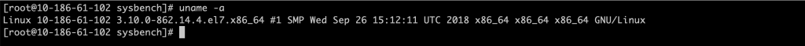
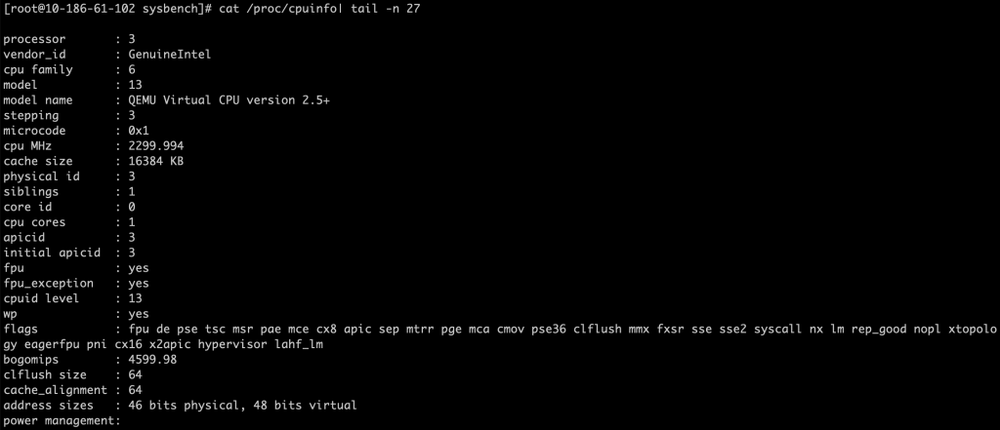
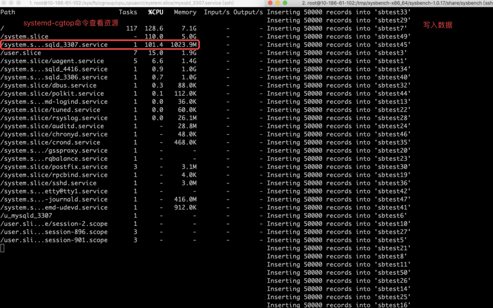
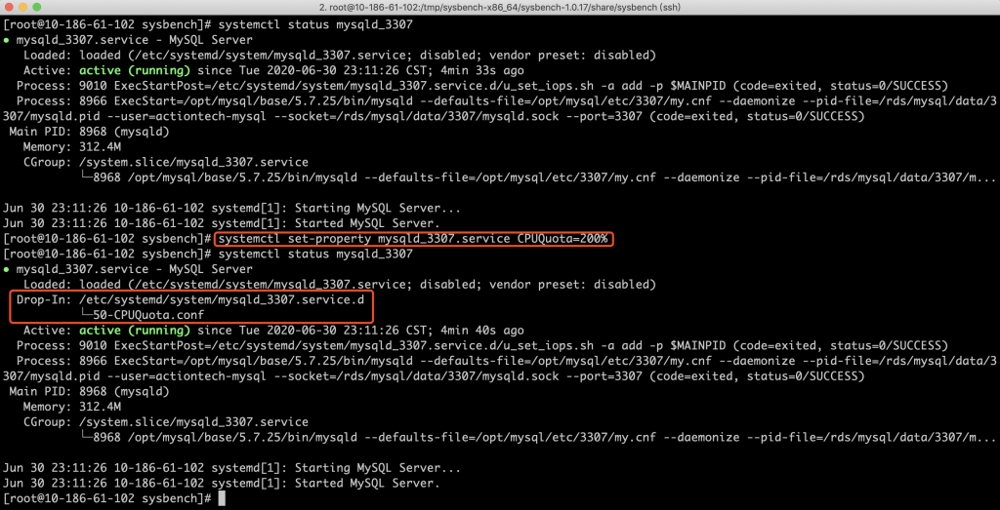
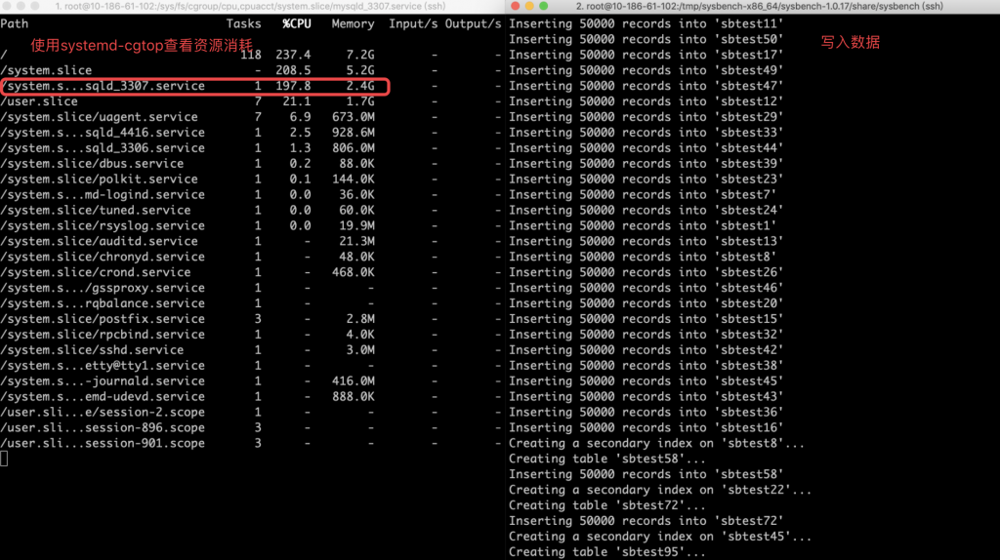
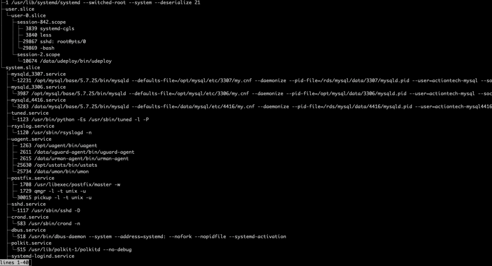

# 技术分享 | 使用 systemd 修改资源隔离配置

**原文链接**: https://opensource.actionsky.com/20200716-mysql/
**分类**: MySQL 新特性
**发布时间**: 2020-07-20T00:37:08-08:00

---

作者：晏泽
爱可生售后团队成员，主要负责公司数据库运维产品问题诊断；努力在数据库和 IT 领域里摸爬滚打中。
本文来源：原创投稿
*爱可生开源社区出品，原创内容未经授权不得随意使用，转载请联系小编并注明来源。 
本文关键字：Linux、systemd、资源隔离
相关文章推荐：
[线程简介和 MySQL 调试环境搭建](https://opensource.actionsky.com/20190919-mysql/)
[使用 TCP Wrappers 保护 MySQL 如何导致服务中断](https://opensource.actionsky.com/20200218-mysql/)
**⼀、修改 systemd unit file**
为了给程序配置资源隔离，通常我们会到 cgroup 层级树下的控制器⾥，创建或者修改控制组⽂件。 在 Linux7 中，如果为程序配置了 systemd 服务，除了直接修改控制组文件之外，还可以通过 systemd 相关命令对程序的资源隔离配置进行修改。 
1.1 修改方法
有两种方法可以对配置了 systemd 的程序进行资源隔离：1. 命令行修改：通过执行** systemctl set-property** 命令实现，形式为 **systemctl set-property**** name parameter=value**；修改默认即时生效。2. 手工修改文件：直接编辑程序的 systemd unit file 文件，完成之后需手工执行 **systemctl ****daemon-reload** 更新配置，并重启服务 **systemctl restart name.service**。
systemd unit file 里支持的资源隔离配置项，如常见的：
- CPUQuota=value 
该参数表示服务可以获取的最大 CPU 时间，value 为百分数形式，高于 100% 表示可使用 1 核以上的 CPU。与 cgroup cpu 控制器 **cpu.cfs_quota_us** 配置项对应。
- MemoryLimit=value 
该参数表示服务可以使用的最大内存量，value 可以使用 K, M, G, T 等后缀表示值的大小。与 cgroup memory 控制器 **memory.limit_in_bytes** 配置项对应。 
> **完整的配置项列表，请参考官方文档：2.3.2. Modifying Unit Files**
https://access.redhat.com/documentation/en-us/red_hat_enterprise_linux/7/html/resource_management_guide/sec-modifying_control_groups#sec-Modifying_Unit_Files
1.2 试验说明
以 MySQL CPU 资源管理为例。
环境信息：
系统版本：CentOS Linux release 7.5.1804 (Core)
											
CPU 配置：4 核 CPU
											
当资源限制为 1 核 CPU 时（CPUQuota=100%）：
											
修改 CPU 资源配置为：2核（CPUQuota=200%）
											
再次测试，可以看到数据库在写入数据的过程中，%CPU 的值固定在 200% 左右。
											
**二、简要原理说明**
系统资源在 cgroup 里体现为资源控制器（resource controller/cgroup subsystem）；每个controller 以层级目录结构的方式对系统资源进行管理。systemd 在系统开机时，默认自动将 cpu、blkio、memory 等控制器挂载到 /sys/fs/cgroup 路径下。
systemd 使⽤以下三种类型的 unit 来进⾏资源管理：
- service：A system service
- slice：A group of hierarchically organized units that manage system process
- scope：An externally created process
其中 scope 类型只能由程序自动创建；其他两种可程序⾃动创建，也可⼿动创建。系统在启动的时候将默认创建⼀系列运⾏时必要的 service，同时也会创建四种必要的 slice：
- -.slice — the root slice;
- system.slice — the default place for all system services;
- user.slice — the default place for all user sessions;
- machine.slice — the default place for all virtual machines and Linux containers.
基于此，在 Linux 7 中，系统通过绑定程序的 systemd 层级树路径和 cgroup 资源控制器路径实现资源隔离（可使用命令 **systemd-cgls** 直观查看，见下文图片），具体表现为：
- 将 service unit、scope unit 或者 slice unit 在 systemd 层级树里的路径，与对应的 cgroup 资源控制器路径进⾏匹配
- unit file 里有对应资源管理配置参数，直接作用于 cgroup 对应的资源控制器
因此，通过修改程序的 systemd unit file 里与资源管理相关的参数，即可达到资源隔离配置的目的。
