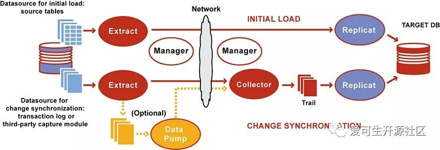
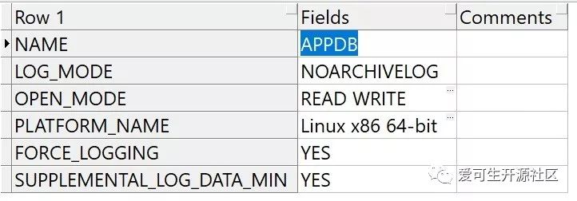

# 技术分享 | 使用OGG实现Oracle到MySQL数据平滑迁移

**原文链接**: https://opensource.actionsky.com/20190530-ogg-oracle-mysql/
**分类**: MySQL 新特性
**发布时间**: 2019-05-30T18:29:24-08:00

---

**本文目录：**
**一、OGG概述**
（一）OGG逻辑架构
**二、迁移方案**
（一）环境信息
（二）表结构迁移
（三）数据迁移
1.源端OGG配置
（1）Oracle数据库配置
（2）Oracle数据库OGG用户创建
（3）源端OGG 管理进程(MGR)配置
（4）源端OGG 表级补全日志(trandata)配置
（5）源端OGG 抽取进程(extract)配置
（6）源端OGG 传输进程(pump)配置
（7）源端OGG 异构mapping文件(defgen)生成
2.目标端OGG配置
（1）目标端MySQL数据库配置
（2）目标端OGG 管理进程(MGR)配置
（3）目标端OGG 检查点日志表(checkpoint)配置
（4）目标端OGG 回放线程(replicat)配置
3.全量同步配置
（1）源端OGG 全量抽取进程(extract)配置
（2）目标端OGG 全量回放进程(replicat)配置
**三、数据校验**
**四、迁移问题处理**
（一）MySQL限制
（二）全量与增量衔接
（三）OGG版本选择
（四）无主键表处理
（五）OGG安全规则
（六）数据抽取方式
**五、OGG参考资料**
**一、OGG概述**
> OGG全称为Oracle GoldenGate,是由Oracle官方提供的用于解决异构数据环境中数据复制的一个商业工具。相比于其它迁移工具OGG的优势在于可以直接解析源端Oracle的redo log，因此能够实现在不需要对原表结构做太多调整的前提下完成数据增量部分的迁移。本篇文章将重点介绍如何使用OGG实现Oracle到MySQL数据的平滑迁移，以及讲述个人在迁移过程中所碰到问题的解决方案。
**（一）OGG逻辑架构**

参照上图简单给大家介绍下OGG逻辑架构，让大家对OGG数据同步过程有个简单了解，后面章节会详细演示相关进程的配置方式，在OGG使用过程中主要涉及以下进程及文件：
- Manager进程：需要源端跟目标端同时运行，主要作用是监控管理其它进程，报告错误，分配及清理数据存储空间，发布阈值报告等
- Extract进程：运行在数据库源端，主要用于捕获数据的变化，负责全量、增量数据的抽取
- Trails文件：临时存放在磁盘上的数据文件
- Data Pump进程：运行在数据库源端，属于Extract进程的一个辅助进程，如果不配置Data Pump，Extract进程会将抽取的数据直接发送到目标端的Trail文件，如果配置了Data Pump，Extract进程会将数据抽取到本地Trail文件，然后通过Data Pump进程发送到目标端，配置Data Pump进程的主要好处是即使源端到目标端发生网络中断，Extract进程依然不会终止
- Collector进程：接收源端传输过来的数据变化，并写入本地Trail文件中
- Replicat进程：读取Trail文件中记录的数据变化，创建对应的DML语句并在目标端回放
**二、迁移方案**
**（一）环境信息**
| 软件名称 | 源端 | 目标端 |
| --- | --- | --- |
| OGG版本 | OGG 12.2.0.2.2 For Oracle | OGG 12.2.0.2.2 For MySQL |
| 数据库版本 | Oracle 11.2.0.4 | MySQL 5.7.21 |
| OGG_HOME | /home/oracle/ogg | /opt/ogg |
| IP地址 | XXX.XX.XX.124 | XXX.XX.XX.121 |
| 数据库 | cms | cms |
**（二）表结构迁移**
> 表结构迁移属于难度不高但内容比较繁琐的一步，我们在迁移表结构时使用了一个叫sqlines的开源工具，对于sqlines工具在MySQL端创建失败及不符合预期的表结构再进行特殊处理，以此来提高表结构转换的效率。
注意：OGG在Oracle迁移MySQL的场景下不支持DDL语句同步，因此表结构迁移完成后到数据库切换前尽量不要再修改表结构。
**（三）数据迁移**
> 数据同步的操作均采用OGG工具进行，考虑数据全量和增量的衔接，OGG需要先将增量同步的抽取进程启动，抓取数据库的redo log，待全量抽取结束后开启增量数据回放，应用全量和增量这段期间产生的日志数据，OGG可基于参数配置进行重复数据处理，所以使用OGG时优先将增量进行配置并启用。此外，为了避免本章节篇幅过长，OGG参数将不再解释，有需要的朋友可以查看官方提供的Reference文档查询任何你不理解的参数。
1.源端OGG配置
**（1）Oracle数据库配置**
> 针对Oracle数据库，OGG需要数据库开启归档模式及增加辅助补充日志、强制记录日志等来保障OGG可抓取到完整的日志信息
查看当前环境是否满足要求，输出结果如下图所示：
- `SQL> SELECT NAME,LOG_MODE,OPEN_MODE,PLATFORM_NAME,FORCE_LOGGING,SUPPLEMENTAL_LOG_DATA_MIN FROM V$DATABASE;`

如果条件不满足则实行该部分，
- `#### 开启归档(开启归档需要重启数据库)`
- `SQL> shutdown immediate;`
- `SQL> startup mount;`
- `SQL> alter database archivelog;`
- `SQL> alter database open;`
- `SQL> archive log list;`
- 
- `#### 开启附加日志和强制日志`
- `SQL> alter database add supplemental log data;`
- `SQL> alter database force logging;`
- `SQL> alter system switch logfile;`
- 
- `#### 启用OGG支持`
- `SQL> show parameter enable_goldengate_replication`
- `SQL> alter system set enable_goldengate_replication=true;`
- 
- `#### 再次查看当前环境是否满足要求`
- `SQL> SELECT NAME,LOG_MODE,OPEN_MODE,PLATFORM_NAME,FORCE_LOGGING,SUPPLEMENTAL_LOG_DATA_MIN FROM V$DATABASE;`
**（2）Oracle数据库OGG用户创建**
> OGG需要有一个用户有权限对数据库的相关对象做操作，以下为涉及的权限，该示例将创建一个用户名和密码均为ogg的Oracle数据库用户并授予以下权限
- `#### 查看当前数据库已存在的表空间，可使用已有表空间或新建单独的表空间`
- `SQL> SELECT TABLESPACE_NAME, CONTENTS FROM DBA_TABLESPACES;`
- 
- `#### 查看当前表空间文件数据目录`
- `SQL> SELECT NAME FROM V$DATAFILE;`
- 
- `#### 创建一个新的OGG用户的表空间`
- `SQL> CREATE TABLESPACE OGG_DATA DATAFILE '/u01/app/oracle/oradata/cms/ogg_data01.dbf' SIZE 2G;`
- 
- `#### 创建ogg用户且指定对应表空间并授权`
- `SQL> CREATE USER ogg IDENTIFIED BY ogg DEFAULT TABLESPACE OGG_DATA;`
- `SQL> grant connect,resource,unlimited tablespace to ogg;`
- `SQL> grant create session,alter session to ogg;`
- `SQL> grant execute on utl_file to ogg;`
- `SQL> grant select any dictionary, select any table to ogg;`
- `SQL> grant alter any table to ogg;`
- `SQL> grant flashback any table to ogg;`
- `SQL> grant select any transaction to ogg;`
- `SQL> grant sysdba to ogg;`
- `SQL> grant execute on dbms_streams_adm to ogg;`
- `SQL> grant execute on dbms_flashback to ogg;`
- `SQL> exec dbms_goldengate_auth.grant_admin_privilege('OGG');`
**（3）源端OGG 管理进程(MGR)配置**
- `#### 切换至ogg软件目录并执行ggsci进入命令行终端`
- `shell> cd $OGG_HOME`
- `shell> ggsci`
- 
- `#### 编辑/创建mgr配置文件`
- `ggsci> edit params mgr`
- 
- `PORT 7809`
- `DYNAMICPORTLIST 8000-8050`
- `-- AUTOSTART extract`
- `-- AUTORESTART extract,retries 4,waitminutes 4`
- `STARTUPVALIDATIONDELAY 5`
- `ACCESSRULE, PROG *, IPADDR XXX.XX.*, ALLOW`
- `ACCESSRULE, PROG SERVER, ALLOW`
- `PURGEOLDEXTRACTS /home/oracle/ogg/dirdat/*, USECHECKPOINTS,MINKEEPFILES 3`
- 
- `#### 启动并查看mgr状态`
- `ggsci> start mgr`
- `ggsci> info all`
- `ggsci> view report mgr`
**（4）源端OGG 表级补全日志(trandata)配置**
> 表级补全日志需要在最小补全日志打开的情况下才起作用,之前只在数据库级开启了最小补全日志(alter database add supplemental log data;)，redolog记录的信息还不够全面，必须再使用add trandata开启表级的补全日志以获得必要的信息。
- `#### 切换至ogg软件目录并执行ggsci进入命令行终端`
- `shell> cd $OGG_HOME`
- `shell> ggsci`
- 
- `#### 使用ogg用户登录appdb实例(TNS配置)对cms所有表增加表级补全日志`
- `ggsci> dblogin userid ogg@appdb,password ogg`
- `ggsci> add trandata cms.*`
**（5）源端OGG 抽取进程(extract)配置**
> Extract进程运行在数据库源端，负责从源端数据表或日志中捕获数据。Extract进程利用其内在的checkpoint机制，周期性地检查并记录其读写的位置，通常是写入到本地的trail文件。这种机制是为了保证如果Extract进程终止或者操作系统宕机，我们重启Extract进程后，GoldenGate能够恢复到以前的状态，从上一个断点处继续往下运行，而不会有任何数据损失。
- `#### 切换至ogg软件目录并执行ggsci进入命令行终端`
- `shell> cd $OGG_HOME`
- `shell> ggsci`
- 
- `#### 创建一个新的增量抽取进程，从redo日志中抽取数据`
- `ggsci> add extract e_cms,tranlog,begin now`
- 
- `#### 创建一个抽取进程抽取的数据保存路径并与新建的抽取进程进行关联`
- `ggsci> add exttrail /home/oracle/ogg/dirdat/ms,extract e_cms,megabytes 1024`
- 
- `#### 创建抽取进程配置文件`
- `ggsci> edit params e_cms`
- `extract e_cms`
- `setenv (NLS_LANG = "AMERICAN_AMERICA.AL32UTF8")`
- `setenv (ORACLE_HOME = "/data/oracle/11.2/db_1")`
- `setenv (ORCLE_SID = "cms")`
- `userid ogg@appdb,password ogg`
- `discardfile /home/oracle/ogg/dirrpt/e_cms.dsc,append,megabytes 1024`
- `exttrail /home/oracle/ogg/dirdat/ms`
- `statoptions reportfetch`
- `reportcount every 1 minutes,rate`
- `warnlongtrans 1H,checkinterval 5m`
- `table cms.*;`
- 
- `#### 启动源端抽取进程`
- `ggsci> start e_cms`
- `ggsci> info all`
- `ggsci> view report e_cms`
**（6）源端OGG 传输进程(pump)配置**
> pump进程运行在数据库源端，其作用非常简单。如果源端的Extract抽取进程使用了本地trail文件，那么pump进程就会把trail文件以数据块的形式通过TCP/IP协议发送到目标端，Pump进程本质上是Extract进程的一种特殊形式，如果不使用trail文件，那么Extract进程在抽取完数据后，直接投递到目标端。
补充：pump进程启动时需要与目标端的mgr进程进行连接，所以需要优先将目标端的mgr提前配置好，否则会报错连接被拒绝，无法传输抽取的日志文件到目标端对应目录下
- `#### 切换至ogg软件目录并执行ggsci进入命令行终端`
- `shell> cd $OGG_HOME`
- `shell> ggsci`
- 
- `#### 增加一个传输进程与抽取进程抽取的文件进行关联`
- `shell> add extract p_cms,exttrailsource /home/oracle/ogg/dirdat/ms`
- 
- `#### 增加配置将抽取进程抽取的文件数据传输到远程对应目录下`
- `#### 注意rmttrail参数指定的是目标端的存放目录，需要目标端存在该目录路径`
- `shell> add rmttrail /opt/ogg/dirdat/ms,extract p_cms `
- 
- 
- `#### 创建传输进程配置文件`
- `shell>edit params p_cms`
- `extract p_cms `
- `setenv (NLS_LANG = "AMERICAN_AMERICA.AL32UTF8")`
- `setenv (ORACLE_HOME = "/data/oracle/11.2/db_1")`
- `setenv (ORCLE_SID = "cms")`
- `userid ogg@appdb,password ogg`
- `RMTHOST XXX.XX.XX.121,MGRPORT 7809`
- `RMTTRAIL /opt/ogg/dirdat/ms`
- `discardfile /home/oracle/ogg/dirrpt/p_cms.dsc,append,megabytes 1024`
- `table cms.*;`
- 
- `#### 启动源端抽取进程`
- `#### 启动前确保目标端mgr进程已开启`
- `ggsci> start p_cms`
- `ggsci> info all`
- `ggsci> view report p_cms`
**（7）源端OGG 异构mapping文件(defgen)生成**
> 该文件记录了源库需要复制的表的表结构定义信息，在源库生成该文件后需要拷贝到目标库的dirdef目录，当目标库的replica进程将传输过来的数据apply到目标库时需要读写该文件，同构的数据库不需要进行该操作。
- `#### 创建mapping文件配置`
- `shell> cd $OGG_HOME`
- `shell> vim ./dirprm/mapping_cms.prm `
- `defsfile ./dirdef/cms.def,purge`
- `userid ogg@appdb,password ogg`
- `table cms.*;`
- 
- `#### 基于配置生成cms库的mapping文件`
- `#### 默认生成的文件保存在$OGG_HOME目录的dirdef目录下`
- `shell> ./defgen paramfile ./dirprm/mapping_cms.prm`
- 
- `#### 将该文件拷贝至目标端对应的目录`
- `shell> scp ./dirdef/cms.def root@XXX.XX.XX.121:/opt/ogg/dirdef`
**至此源端环境配置完成** 
2.目标端OGG配置
**（1）目标端MySQL数据库配置**
- 确认MySQL端表结构已经存在
- MySQL数据库OGG用户创建
- `mysql> create user 'ogg'@'%' identified by 'ogg';`
- `mysql> grant all on *.* to 'ogg'@'%';`
- 
- `#### 提前创建好ogg存放checkpoint表的数据库`
- `mysql> create database ogg;`
**（2）目标端OGG 管理进程(MGR)配置**
> 目标端的MGR进程和源端配置一样，可直接将源端配置方式在目标端重复执行一次即可，该部分不在赘述
**（3）目标端OGG 检查点日志表(checkpoint)配置**
> checkpoint表用来保障一个事务执行完成后，在MySQL数据库从有一张表记录当前的日志回放点，与MySQL复制记录binlog的GTID或position点类似。
- `#### 切换至ogg软件目录并执行ggsci进入命令行终端`
- `shell> cd $OGG_HOME`
- `shell> ggsci`
- 
- `ggsci> edit param ./GLOBALS`
- `checkpointtable ogg.ggs_checkpoint`
- 
- 
- `ggsci> dblogin sourcedb ogg@XXX.XX.XX.121:3306 userid ogg`
- `ggsci> add checkpointtable ogg.ggs_checkpoint`
**（4）目标端OGG 回放线程(replicat)配置**
> Replicat进程运行在目标端，是数据投递的最后一站，负责读取目标端Trail文件中的内容，并将解析其解析为DML语句，然后应用到目标数据库中。
- `#### 切换至ogg软件目录并执行ggsci进入命令行终端`
- `shell> cd $OGG_HOME`
- `shell> ggsci`
- 
- `#### 添加一个回放线程并与源端pump进程传输过来的trail文件关联，并使用checkpoint表确保数据不丢失`
- `ggsci> add replicat r_cms,exttrail /opt/ogg/dirdat/ms,checkpointtable ogg.ggs_checkpoint`
- 
- `#### 增加/编辑回放进程配置文件`
- `ggsci> edit params r_cms`
- `replicat r_cms`
- `targetdb cms@XXX.XX.XX.121:3306,userid ogg,password ogg`
- `sourcedefs /opt/ogg/dirdef/cms.def`
- `discardfile /opt/ogg/dirrpt/r_cms.dsc,append,megabytes 1024`
- `HANDLECOLLISIONS`
- `MAP cms.*,target cms.*;`
注意：replicat进程只需配置完成，无需启动，待全量抽取完成后再启动。
**至此源端环境配置完成** 
待全量数据抽取完毕后启动目标端回放进程即可完成数据准实时同步。
3.全量同步配置
> 全量数据同步为一次性操作，当OGG软件部署完成及增量抽取进程配置并启动后，可配置1个特殊的extract进程从表中抽取数据，将抽取的数据保存到目标端生成文件，目标端同时启动一个单次运行的replicat回放进程将数据解析并回放至目标数据库中。
**（1）源端OGG 全量抽取进程(extract)配置**
- `#### 切换至ogg软件目录并执行ggsci进入命令行终端`
- `shell> cd $OGG_HOME`
- `shell> ggsci`
- 
- `#### 增加/编辑全量抽取进程配置文件`
- `#### 其中RMTFILE指定抽取的数据直接传送到远端对应目录下`
- `#### 注意：RMTFILE参数指定的文件只支持2位字符，如果超过replicat则无法识别`
- `ggsci> edit params ei_cms`
- `SOURCEISTABLE`
- `SETENV (NLS_LANG = "AMERICAN_AMERICA.AL32UTF8")`
- `SETENV (ORACLE_SID=cms)`
- `SETENV (ORACLE_HOME=/data/oracle/11.2/db_1)`
- `USERID ogg@appdb,PASSWORD ogg`
- `RMTHOST XXX.XX.XX.121,MGRPORT 7809`
- `RMTFILE /opt/ogg/dirdat/ms,maxfiles 100,megabytes 1024,purge`
- `TABLE cms.*;`
- 
- `#### 启动并查看抽取进程正常`
- `shell> nohup ./extract paramfile ./dirprm/ei_cms.prm reportfile ./dirrpt/ei_cms.rpt &`
- 
- `## 查看日志是否正常进行全量抽取`
- `shell> tail -f ./dirrpt/ei_cms.rpt`
**（2）目标端OGG 全量回放进程(replicat)配置**
- `#### 切换至ogg软件目录并执行ggsci进入命令行终端`
- `shell> cd $OGG_HOME`
- `shell> ggsci`
- 
- `ggsci> edit params ri_cms`
- `SPECIALRUN`
- `END RUNTIME`
`TARGETDB cms@XXX.XX.XX.XXX:
3306,USERID ogg,PASSWORD ogg`
- `EXTFILE /opt/ogg/dirdat/ms`
- `DISCARDFILE ./dirrpt/ri_cms.dsc,purge`
- `MAP cms.*,TARGET cms.*;`
- 
- `#### 启动并查看回放进程正常`
- `shell> nohup ./replicat paramfile ./dirprm/ri_cms.prm reportfile ./dirrpt/ri_cms.rpt &`
- 
- `#### 查看日志是否正常进行全量回放`
- `shell> tail -f ./dirrpt/ri_cms.rpt`
**三、数据校验**
数据校验是数据迁移过程中必不可少的环节，本章节提供给几个数据校验的思路共大家参数，校验方式可以由以下几个角度去实现：
1.通过OGG日志查看全量、增量过程中discards记录是否为0来判断是否丢失数据；
2.通过对源端、目标端的表执行count判断数据量是否一致；
3.编写类似于pt-table-checksum校验原理的程序，实现行级别一致性校验，这种方式优缺点特别明显，优点是能够完全准确对数据内容进行校验，缺点是需要遍历每一行数据，校验成本较高；
4.相对折中的数据校验方式是通过业务角度，提前编写好数十个返回结果较快的SQL，从业务角度抽样校验。
**四、迁移问题处理**
> 本章节将讲述迁移过程中碰到的一些问题及相应的解决方式。
（一）MySQL限制
在Oracle到MySQL的表结构迁移过程中主要碰到以下两个限制：
1. Oracle端的表结构因为最初设计不严谨，存在大量的列使用varchar(4000)数据类型，导致迁移到MySQL后超出行限制，表结构无法创建。由于MySQL本身数据结构的限制，一个16K的数据页最少要存储两行数据，因此单行数据不能超过65,535 bytes，因此针对这种情况有两种解决方式：
- 根据实际存储数据的长度，对超长的varchar列进行收缩；
- 对于无法收缩的列转换数据类型为text，但这在使用过程中可能导致一些性能问题；
2. 与第一点类似，在Innodb存储引擎中，索引前缀长度限制是767 bytes，若使用DYNAMIC、COMPRESSED行格式且开启innodblargeprefix的场景下，这个限制是3072 bytes，即使用utf8mb4字符集时，最多只能对varchar(768)的列创建索引；
3. 使用ogg全量初始化同步时，若存在外键约束，批量导入时由于各表的插入顺序不唯一，可能子表先插入数据而主表还未插入，导致报错子表依赖的记录不存在，因此建议数据迁移阶段禁用主外键约束，待迁移结束后再打开。
- `mysql>set global foreign_key_checks=off;`
（二）全量与增量衔接
> HANDLECOLLISIONS参数是实现OGG全量数据与增量数据衔接的关键，其实现原理是在全量抽取前先开启增量抽取进程，抓去全量应用期间产生的redo log，当全量应用完成后，开启增量回放进程，应用全量期间的增量数据。使用该参数后增量回放DML语句时主要有以下场景及处理逻辑：
- 目标端不存在delete语句的记录，忽略该问题并不记录到discardfile
- 目标端丢失update记录
&#8211; 更新的是主键值，update转换成insert
&#8211; 更新的键值是非主键，忽略该问题并不记录到discardfile
- 目标端重复insert已存在的主键值，这将被replicat进程转换为UPDATE现有主键值的行
（三）OGG版本选择
> 在OGG版本选择上我们也根据用户的场景多次更换了OGG版本，最初因为客户的Oracle 数据库版本为11.2.0.4，因此我们在选择OGG版本时优先选择使用了11版本，但是使用过程中发现，每次数据抽取生成的trail文件达到2G左右时，OGG报错连接中断，查看RMTFILE参数详细说明了解到trail文件默认限制为2G，后来我们替换OGG版本为12.3，使用MAXFILES参数控制生成多个指定大小的trail文件，回放时Replicat进程也能自动轮转读取Trail文件，最终解决该问题。但是如果不幸Oracle环境使用了Linux 5版本的系统，那么你的OGG需要再降一个小版本，最高只能使用OGG 12.2。
（四）无主键表处理
> 在迁移过程中还碰到一个比较难搞的问题就是当前Oracle端存在大量表没有主键。在MySQL中的表没有主键这几乎是不被允许的，因为很容易导致性能问题和主从延迟。同时在OGG迁移过程中表没有主键也会产生一些隐患，比如对于没有主键的表，OGG默认是将这个一行数据中所有的列拼凑起来作为唯一键，但实际还是可能存在重复数据导致数据同步异常，Oracle官方对此也提供了一个解决方案，通过对无主键表添加GUID列来作为行唯一标示，具体操作方式可以搜索MOS文档ID 1271578.1进行查看。
（五）OGG安全规则
- 报错信息
- `2019-03-08 06:15:22  ERROR   OGG-01201  Error reported by MGR : Access denied.`
错误信息含义源端报错表示为该抽取进程需要和目标端的mgr进程通讯，但是被拒绝，具体操作为：源端的extract进程需要与目标端mgr进行沟通，远程将目标的replicat进行启动，由于安全性现在而被拒绝连接。
- 报错原因
在Oracle OGG 11版本后，增加了新特性安全性要求，如果需要远程启动目标端的replicat进程，需要在mgr节点增加访问控制参数允许远程调用
- 解决办法
在源端和目标端的mgr节点上分别增加访问控制规则并重启
- `## 表示该mgr节点允许(ALLOW)10.186网段(IPADDR)的所有类型程序(PROG *)进行连接访问`
- `ACCESSRULE, PROG *, IPADDR 10.186.*.*, ALLOW`
（六）数据抽取方式
- 报错信息
- `2019-03-15 14:49:04  ERROR   OGG-01192  Trying to use RMTTASK on data types which may be written as LOB chunks (Table: 'UNIONPAYCMS.CMS_OT_CONTENT_RTF').`
- 报错原因
根据官方文档说明，当前直接通过Oracle数据库抽取数据写到MySQL这种initial-load方式，不支持LOBs数据类型，而表 UNIONPAYCMS.CMSOTCONTENT_RTF 则包含了CLOB字段，无法进行传输,并且该方式不支持超过4k的字段数据类型
- 解决方法
将抽取进程中的RMTTASK改为RMTFILE参数
官方建议将数据先抽取成文件，再基于文件数据解析进行初始化导入
**五、OGG参考资料**
> 阅读OGG官方文档，查看support.oracle.com上Oracle官方给予的问题解决方案是学习OGG非常有效的方式，作者这里也打包了一些文档供大家下载查看，其中个人感觉比较重要并且查看比较多的文档包括：
How to Replicate Data Between Oracle and MySQL Database? (文档 ID 1605674.1).pdf
这个文档的作用相当于OGG快速开始，能够帮助用户快速的配置并跑通OGG全量、增量数据同步的流程，非常适合初学者上手
Administering Oracle GoldenGate for Windows and UNIX.pdf
Administering文档内容较多，其中详细介绍了各种OGG的使用配置场景，大家可以根据自己需要选择重点章节浏览
Reference for Oracle GoldenGate for Windows and UNIX.pdf
Reference文档算是我查看最多的一个文档，其中包含了OGG所有参数的描述、语法及使用示例，非常的详细，这也是前面未对参数进行展开讲解的原因。
**
**
**文档资料百度网盘下载链接：**
https://pan.baidu.com/s/13fwguorcVrboeBH8DYTpZA 密码:e8rh

**社区近期动态**
**[6月15日 上海站](https://event.31huiyi.com/1633790994)**
**[分布式中间件DBLE用户见面会](https://event.31huiyi.com/1633790994)**
本次举办的DBLE用户见面会，是自2017年10月24日数据库中间件DBLE发布以来，**首次线下互动式分享会议**。 
来爱可生总部研发中心，与研发、测试、产品、社区团队面对面，遇到志同道合的朋友，更有丰富精美的周边产品等着你！ 
**会议时间：2019年06月15日13:00—17:00 **
**会议地点：爱可生研发中心，上海市徐汇区虹梅路1905号远中科研楼甲幢7层**  
****