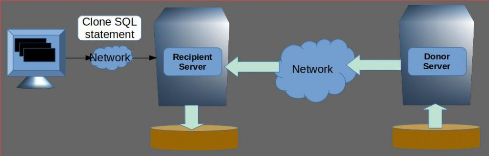

# 技术分享 | 克隆：更优雅的创建 MySQL 实例副本

**原文链接**: https://opensource.actionsky.com/20190730-mysql/
**分类**: MySQL 新特性
**发布时间**: 2019-07-30T00:54:31-08:00

---

> 原创作者：Debarun Banejee
发布时间：2019年7月23日
**背景******
大多情况下，需要可靠而有效地克隆 MySQL 实例数据。这包括 MySQL 高可用的解决方案，其中需要在将实例加入组复制集群之前配置实例，或者在经典复制模型中将其添加为 Slave。
											
为复制拓扑而创建 MySQL 副本一直很麻烦。涉及的步骤很多，首先要备份 MySQL 服务器，通过网络将备份传输到我们想要添加到复制集的新 MySQL 节点，然后在该节点上恢复备份并手动启动 MySQL 服务器。为了高可用，最好还要将其正确设置备份的 GTID，并启动并运行群集。涉及的手动步骤数量过多不利于高可用。**CLONE 插件**解决了这个问题并简化了副本配置。使您可以使用 MySQL 客户端（和 SQL 命令）来配置新节点并在发生时观察克隆进度。无需手动处理多个步骤并维护自己的基础架构来配置新的 MySQL 节点。
MySQL 8.0.17 引入了 CLONE SQL 语句，使当前的 MySQL 服务器成为另一个运行在不同节点的 MySQL 服务器的**“克隆”**。我们将执行 clone 语句的服务器实例称为**“受体”**。克隆的源服务器实例称为**“供体”**。供体克隆以一致的快照存储在 InnoDB 存储引擎中的所有数据和元数据，以替换受体中的数据。
成功执行 CLONE SQL 语句后，将自动重新启动受体服务器。重新启动涉及恢复克隆的快照数据，就像用老方法复制数据一样。恢复完成后，受体就是**供体**的克隆版，随时可以使用！
											
**这里有一些关于克隆过程的重要注意事项。**
- 不克隆 MySQL 配置参数，并且**受体**保留所有原始配置参数，如克隆之前。这样做是因为许多配置可能特定于节点（例如 PORT），因此保留它们似乎是一个不错的选择。另一方面，一些存储配置确实需要在**供体**和**受体**之间匹配（例如 innodbpagesize），如果这样的配置参数不匹配，CLONE 将报告错误。
- **CLONE **插件不会克隆二进制日志。
- **CLONE **插件目前仅支持 InnoDB 存储引擎。在其他存储引擎（如 MyISAM 和 CSV）中创建的表将被克隆为空表。克隆基础架构的设计允许克隆 MySQL 支持的任何存储引擎。但是，只有 InnoDB 序列化和反序列化方法已经实现并经过测试。
- 克隆会阻止**供体**中的所有并发 DDL。
- 需要注意的事实是受体放弃所有数据以及任何二进制日志，以便成为**供体**实例的克隆。在执行 CLONE 之前，如果认为有必要，需要备份当前受体数据。
**克隆实验******
现在让我们通过一个真实的例子和步骤来执行克隆。在下面的示例中，我们还将查看一些有趣的细节，例如，可观察性
- 如何监视长时间运行的克隆命令的进度以及克隆等所需的权限。在下面的示例中，我们将使用经典 shell。使用新 shell，您可以将克隆状态可视化为进度条。
步骤1：选择并设置供体
选择要从中克隆的 MySQL 服务器并以系统用户身份连接到该服务器。然后安装 clone 插件并为将从捐赠服务器传输数据的用户提供备份权限。
- `    mysql> INSTALL PLUGIN CLONE SONAME "mysql_clone.so";`
- `    mysql> CREATE USER clone_user IDENTIFIED BY "clone_password";`
- `    mysql> GRANT BACKUP_ADMIN ON *.* to clone_user;`
授予查看性能模式和执行函数的权限。这是为了观察克隆进度。
- `    mysql> GRANT SELECT ON performance_schema.* TO clone_user;`
- `    mysql> GRANT EXECUTE ON *.* to clone_user;`
步骤2：选择并设置收件人
选择将成为供体克隆的服务器。如果配置新节点，则首先初始化数据目录并启动服务器。
以系统用户身份连接到服务器。然后安装 clone 插件并向用户提供 CLONE_ADMIN 权限，该权限将用克隆数据替换当前实例数据。我们还维护一个配置，列出一组可以克隆的有效供体。
- `    mysql> INSTALL PLUGIN CLONE SONAME "mysql_clone.so";`
- `    mysql> SET GLOBAL clone_valid_donor_list = "donor.host.com:3306";`
- `    mysql> CREATE USER clone_user IDENTIFIED BY "clone_password";`
- `    mysql> GRANT CLONE_ADMIN ON *.* to clone_user;`
> donor 供体
授予查看性能模式和执行函数的权限。这是为了观察克隆进度。
- `    mysql> GRANT SELECT ON performance_schema.* TO clone_user;`
- `    mysql> GRANT EXECUTE ON *.* to clone_user;`
步骤3：连接到收件人并执行 CLONE SQL 语句
我们在这里提到运行的供体主机名和默认为 3306 的 MySQL 协议端口。供体必须可以访问受体服务器。受体将与提供的地址和凭证连接到供体并开始克隆。
- `    mysql> CLONE INSTANCE`
- `        -> FROM clone_user@donor.host.com:3306`
- `        -> IDENTIFIED BY "clone_password";`
克隆命令可能需要一些时间才能完成，具体取决于数据集的大小和供体上的负载。
步骤3A：等待克隆完成并检查进度
在克隆数据是否正在进行时，创建与**受体**的另一个连接，以使用 performance_schema 视图观察正在运行的克隆操作的进度。
此处显示的数据用于通过局域网克隆大约 100GB 的数据库，并在**供体**上使用适当的 sysbench 读写负载。数据可能因 CPU，磁盘，使用的网络和**供体**上的负载而异。
- `    mysql> select STATE, CAST(BEGIN_TIME AS DATETIME) as "START TIME",`
- `    CASE WHEN END_TIME IS NULL THEN`
- `    LPAD(sys.format_time(POWER(10,12) * (UNIX_TIMESTAMP(now()) - UNIX_TIMESTAMP(BEGIN_TIME))), 10, ' ')`
- `    ELSE`
- `    LPAD(sys.format_time(POWER(10,12) * (UNIX_TIMESTAMP(END_TIME) - UNIX_TIMESTAMP(BEGIN_TIME))), 10, ' ')`
- `    END as DURATION`
- `    from performance_schema.clone_status;`
- 
- `    +-------------+---------------------+------------+`
- `    | STATE       | START TIME          | DURATION   |`
- `    +-------------+---------------------+------------+`
- `    | In Progress | 2019-07-17 17:23:26 |     4.84 m |`
- `    +-------------+---------------------+------------+`
在启动命令约 5 分钟后克隆正在进行中。现在我们检查进度视图以获取更多详细信息。
我们使用 sys.format_time 中的格式在“DURATION”列中方便地显示时间。“m”意味着这里的分钟。有关详细信息，请参阅
- `    mysql> select STAGE, STATE, CAST(BEGIN_TIME AS TIME) as "START TIME",`
- `      CASE WHEN END_TIME IS NULL THEN`
- `      LPAD(sys.format_time(POWER(10,12) * (UNIX_TIMESTAMP(now()) - UNIX_TIMESTAMP(BEGIN_TIME))), 10, ' ')`
- `      ELSE`
- `      LPAD(sys.format_time(POWER(10,12) * (UNIX_TIMESTAMP(END_TIME) - UNIX_TIMESTAMP(BEGIN_TIME))), 10, ' ')`
- `      END as DURATION,`
- `      LPAD(CONCAT(FORMAT(ROUND(ESTIMATE/1024/1024,0), 0), " MB"), 16, ' ') as "Estimate",`
- `      CASE WHEN BEGIN_TIME IS NULL THEN LPAD('0%', 7, ' ')`
- `      WHEN ESTIMATE > 0 THEN`
- `      LPAD(CONCAT(CAST(ROUND(DATA*100/ESTIMATE, 0) AS BINARY), "%"), 7, ' ')`
- `      WHEN END_TIME IS NULL THEN LPAD('0%', 7, ' ')`
- `      ELSE LPAD('100%', 7, ' ') END as "Done(%)"`
- `      from performance_schema.clone_progress;`
- 
- `    +-----------+-------------+------------+------------+-----------+---------+`
- `    | STAGE     | STATE       | START TIME | DURATION   | Estimate  | Done(%) |`
- `    +-----------+-------------+------------+------------+-----------+---------+`
- `    | DROP DATA | Completed   |   17:23:26 |  790.86 ms |      0 MB |    100% |`
- `    | FILE COPY | In Progress |   17:23:27 |    4.85 m  | 94,729 MB |     47% |`
- `    | PAGE COPY | Not Started |       NULL |       NULL |      0 MB |      0% |`
- `    | REDO COPY | Not Started |       NULL |       NULL |      0 MB |      0% |`
- `    | FILE SYNC | Not Started |       NULL |       NULL |      0 MB |      0% |`
- `    | RESTART   | Not Started |       NULL |       NULL |      0 MB |      0% |`
- `    | RECOVERY  | Not Started |       NULL |       NULL |      0 MB |      0% |`
- `    +-----------+-------------+------------+------------+-----------+---------+`
克隆处于文件复制阶段（复制文件），约 94G 的总工作量的 47％ 现已完成。现在我们等待更多时间并重新检查进度。
- `    +-----------+-------------+------------+----------+------------+---------+`
- `    | STAGE     | STATE       | START TIME | DURATION | Estimate   | Done(%) |`
- `    +-----------+-------------+------------+----------+------------+---------+`
- `    | DROP DATA |   Completed |   17:23:26 | 790.86 ms |      0 MB |    100% |`
- `    | FILE COPY |   Completed |   17:23:27 |  10.33 m  | 94,729 MB |    100% |`
- `    | PAGE COPY |   Completed |   17:33:47 |  15.91 s  | 11,885 MB |    100% |`
- `    | REDO COPY |   Completed |   17:34:03 |   1.07 s  |    293 MB |    100% |`
- `    | FILE SYNC | In Progress |   17:34:04 |  51.68 s  |      0 MB |      0% |`
- `    | RESTART   | Not Started |       NULL |      NULL |      0 MB |      0% |`
- `    | RECOVERY  | Not Started |       NULL |      NULL |      0 MB |      0% |`
- `    +-----------+-------------+------------+-----------+-----------+---------+`
大多数克隆阶段都已完成，克隆现在处于 FILE SYNC 阶段（将数据同步到磁盘）。FILE SYNC 阶段完成后，将返回 clone 命令，服务器将自动重启。在最后两个阶段 RESTART 和 RECOVERY 期间，服务器将不可用。这是因为 MySQL 在此阶段从克隆数据中进行完全恢复。正在应用重做日志，并且必须在快照 GTID 上同步新克隆，以便它可以使用二进制日志赶上上游服务器。我们只有在这些阶段结束后才能检查状态。
步骤4：验证克隆是否成功完成
CLONE SQL 需要在完成后重新启动服务器。CLONE SQL 成功返回后，服务器将自动关闭。执行 CLONE SQL 的客户端可能会丢失连接。注意：如果启用了自动重新连接，则在服务器重新启动后将重新建立连接。否则，必须手动重新建立连接。
**受体**应该在具有监视进程的环境中运行，以检测服务器关闭和重新启动。请参阅通常首选的MySQL 服务器的运行环境。
在存在监视进程的情况下，客户端可以在 CLONE 之后自动重新启动后重新连接到**受体**。
如果没有监视进程，clone 将返回错误并关闭服务器。
- `    ERROR 3707 (HY000): Restart server failed (mysqld is not managed by supervisor process).`
此错误消息不表示克隆失败。这意味着需要手动重启服务器，然后客户端需要重新连接到服务器。
客户端重新连接到**受体**后，请检查 performance_schema 视图以验证克隆是否已成功完成。
- `    mysql> select STATE, ERROR_NO, BINLOG_FILE, BINLOG_POSITION, GTID_EXECUTED,`
- `    CAST(BEGIN_TIME AS DATETIME) as "START TIME",`
- `    CAST(END_TIME AS DATETIME) as "FINISH TIME",`
- `    sys.format_time(POWER(10,12) * (UNIX_TIMESTAMP(END_TIME) - UNIX_TIMESTAMP(BEGIN_TIME)))`
- `    as DURATION`
- `    from performance_schema.clone_status \G`
- 
- `    *************************** 1. row ***************************`
- `              STATE: Completed`
- `           ERROR_NO: 0`
- `        BINLOG_FILE: binlog.000005`
- `    BINLOG_POSITION: 101810585`
- `      GTID_EXECUTED: 229fc19e-a876-11e9-a441-0010e0b6728a:1-2008636`
- `         START TIME: 2019-07-17 17:23:26`
- `        FINISH TIME: 2019-07-17 17:40:27`
- `           DURATION: 17.01 m`
克隆已成功完成，大约需要 17 分钟才能完成。验证所有阶段是否成功完成以及在各个阶段中花费的时间。
- `    mysql> select STAGE, STATE, CAST(BEGIN_TIME AS DATETIME) as "START TIME",`
- `    CAST(END_TIME AS DATETIME) as "FINISH TIME",`
- `    LPAD(sys.format_time(POWER(10,12) * (UNIX_TIMESTAMP(END_TIME) - UNIX_TIMESTAMP(BEGIN_TIME))), 10, ' ')`
- `    as DURATION`
- `    from performance_schema.clone_progress;`
- `    select STAGE, STATE, CAST(BEGIN_TIME AS TIME) as "START TIME",`
- `      CAST(END_TIME AS TIME) as "FINISH TIME",`
- `      LPAD(sys.format_time(POWER(10,12) * (UNIX_TIMESTAMP(END_TIME) - UNIX_TIMESTAMP(BEGIN_TIME))), 10, ' ')`
- `      as DURATION`
- `      from performance_schema.clone_progress;`
- 
- `    +-----------+-----------+------------+-------------+------------+`
- `    | STAGE     | STATE     | START TIME | FINISH TIME | DURATION   |`
- `    +-----------+-----------+------------+-------------+------------+`
- `    | DROP DATA | Completed |   17:23:26 |    17:23:27 | 790.86 ms  |`
- `    | FILE COPY | Completed |   17:23:27 |    17:33:47 |  10.33 m   |`
- `    | PAGE COPY | Completed |   17:33:47 |    17:34:03 |  15.91 s   |`
- `    | REDO COPY | Completed |   17:34:03 |    17:34:04 |   1.07 s   |`
- `    | FILE SYNC | Completed |   17:34:04 |    17:35:32 |   1.46 m   |`
- `    | RESTART   | Completed |   17:35:32 |    17:35:40 |   7.77 s   |`
- `    | RECOVERY  | Completed |   17:35:40 |    17:40:27 |   4.79 m   |`
- `    +-----------+-----------+------------+-------------+------------+`
受体现在是供体的克隆，GTID 设置正确。现在可以基于 GTID 或二进制日志位置加入高可用集群。
> 阅读原文：
https://mysqlserverteam.com/clone-create-mysql-instance-replica/
**近期社区动态**
