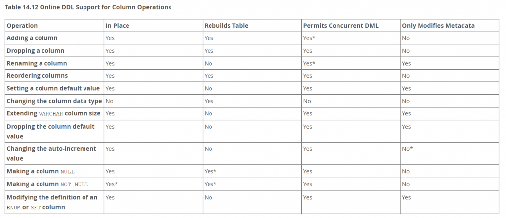
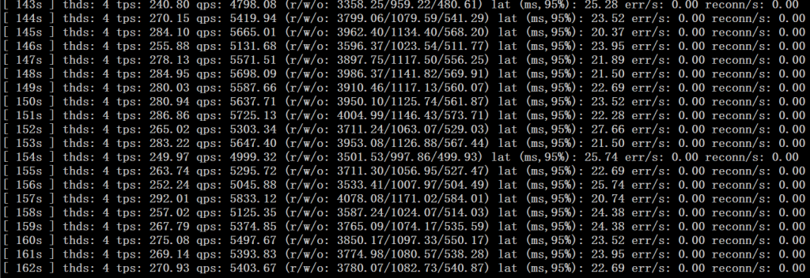
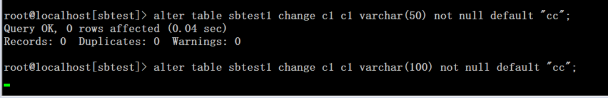
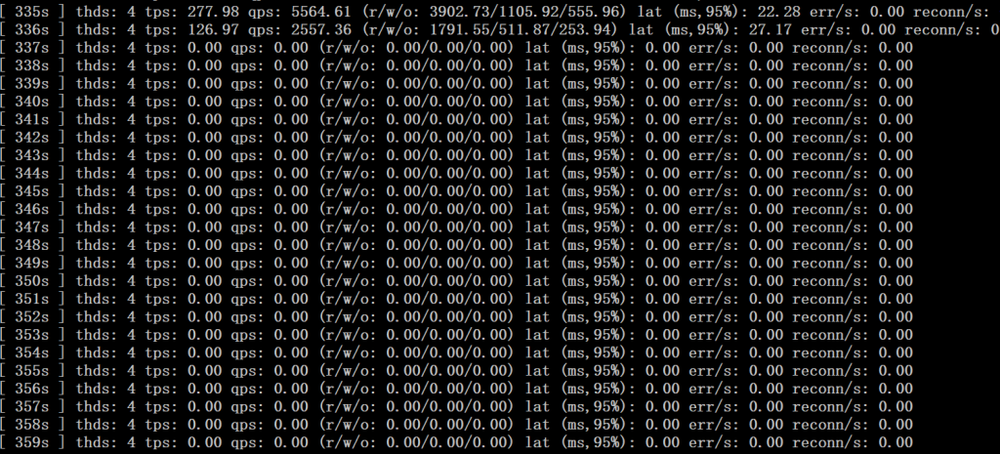
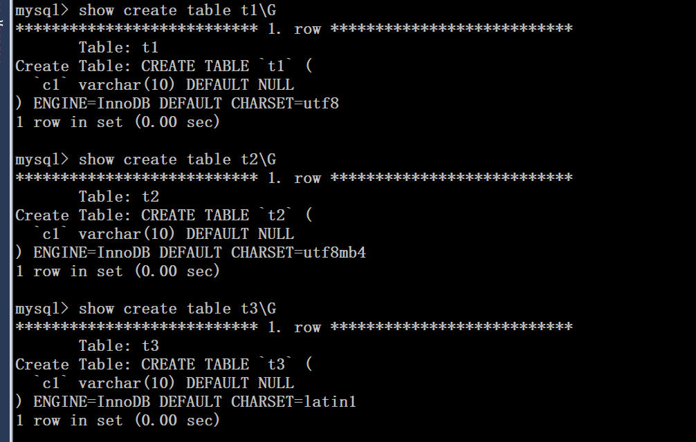
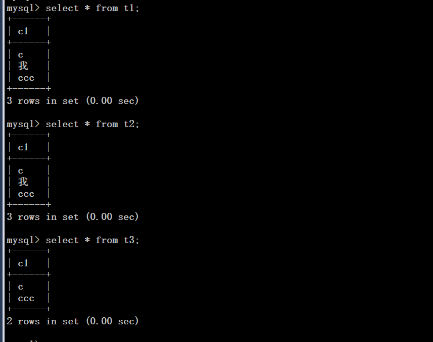
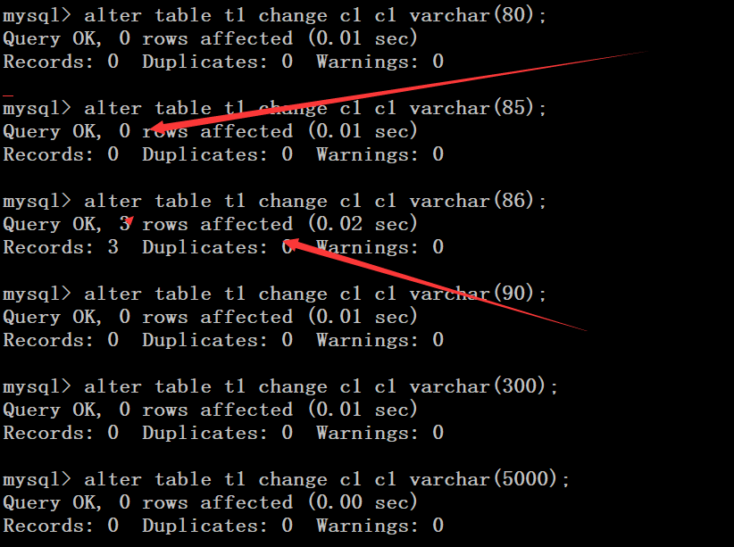
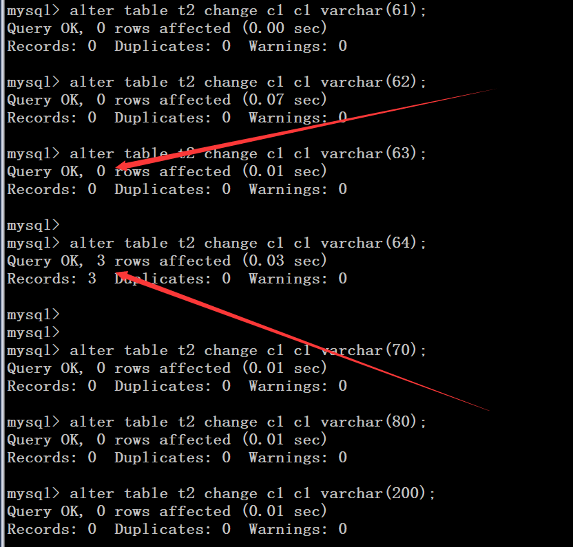
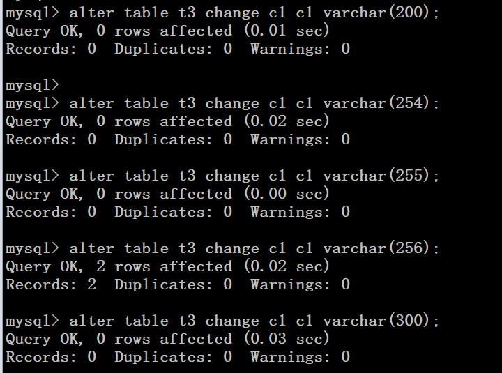

# 技术分享 | 关于 MySQL Online DDL 有趣的验证

**原文链接**: https://opensource.actionsky.com/20201208-mysql/
**分类**: MySQL 新特性
**发布时间**: 2020-12-08T00:33:46-08:00

---

作者：胡存存
爱可生 DBA 团队成员，主要负责 MySQL 故障处理和 SQL 审核优化。对技术执着，为客户负责。
本文来源：原创投稿
*爱可生开源社区出品，原创内容未经授权不得随意使用，转载请联系小编并注明来源。
MySQL 在 5.6 引入 Online DDL 之后，在 5.7 和 8.0 版本又对这一功能进行了大幅的优化。尤其是在 8.0 之后，已经实现了列的秒加。在 5.7 中有些 DDL 操作也实现了秒修改，比如修改字段的默认值，修改列名，但是这些在工作中不是很常见，今天我们讨论下能够实现秒修改的一种特殊情况，稍不注意可能就掉进坑中。
在日常工作中，我们用的最多的数据类型就是 int(bigint) 类型和 varchar 类型。在这两个数据类型中，其中 int 类型只要不超过数据类型允许的最大值，int(N) 类型的中的 N 不会影响输入的字节数，但是 varchar(N) 数据类型中的 N，当输入的字符数超过 N 时，就不允许输入，这时就需要扩容，这也是我们经常会遇到的一种数据变更。当出现这种需求，我们是采用 MySQL 的 Online DDL 直接修改还是用第三方的工具呢。我们先看下官网关于扩 varchar 类型的描述：
											
参考文章：https://dev.mysql.com/doc/refman/5.7/en/innodb-online-ddl-operations.html
通过上图可以发现，Extending VARCHAR column size 在 In Place 是 yes，Rebuilds Table 是 no，也就是在修改是在修改时不用 copy 表，那是不是这样，我们验证下。
我们用 sysbench 准备 4 张表，单表 500w，用 4 线程压数据库，模拟业务量（数据库版本：5.7.29）。
表结构为：- 
- 
- 
- 
- 
- 
- 
- 
- 
- 
- 
- 
- 
`root@localhost[sbtest]> show create table sbtest1\G``*************************** 1. row ***************************``       Table: sbtest1``Create Table: CREATE TABLE `sbtest1` (``  `id` int(11) NOT NULL AUTO_INCREMENT,``  `k` int(11) NOT NULL DEFAULT '0',``  `c` char(120) NOT NULL DEFAULT '',``  `pad` char(60) NOT NULL DEFAULT '',``  `c1` varchar(10) NOT NULL DEFAULT 'cc',``  PRIMARY KEY (`id`),``  KEY `k_1` (`k`)``) ENGINE=InnoDB AUTO_INCREMENT=5000001 DEFAULT CHARSET=utf8mb4``1 row in set (0.00 sec)`
此时启动 sysbench，看到此时的 qps 在 5000 左右，
											
此时将 c1 列从 varchar(10) 扩到 varchar(50)，我们发现秒修改，直接毫无感知，与官网上说的一样。
											
这时候字节长度又不够了，我们需要扩到 100，这时候，我们发现了异常，这次不再是秒修改，而是停在了那，现在是不是觉得有点不妙，这时候，再看我们的压测日志，
											
这时候业务完全被阻塞了，这时候，脑瓜子是不是嗡嗡的了。。。
											
到底怎么回事，我们看下官网怎么说：Extending VARCHAR column sizeALTER TABLE tbl_name CHANGE COLUMN c1 c1 VARCHAR(255), ALGORITHM=INPLACE, LOCK=NONE;The number of length bytes required by a VARCHAR column must remain the same. For VARCHAR columns of 0 to 255 bytes in size, one length byte is required to encode the value. For VARCHAR columns of 256 bytes in size or more, two length bytes are required. As a result, in-place ALTER TABLE only supports increasing VARCHAR column size from 0 to 255 bytes, or from 256 bytes to a greater size. In-place ALTER TABLE does not support increasing the size of a VARCHAR column from less than 256 bytes to a size equal to or greater than 256 bytes. In this case, the number of required length bytes changes from 1 to 2, which is only supported by a table copy (ALGORITHM=COPY). For example, attempting to change VARCHAR column size for a single byte character set from VARCHAR(255) to VARCHAR(256) using in-place ALTER TABLE returns this error:ALTER TABLE tbl_name ALGORITHM=INPLACE, CHANGE COLUMN c1 c1 VARCHAR(256);ERROR 0A000: ALGORITHM=INPLACE is not supported. Reason: Cannot change column type INPLACE. Try ALGORITHM=COPY.
由上文可知，在 varchar 类型中，当大小在 0 到 255 字节时，需要 1 个字节编码，当大于 255 时，需要 2 个字节编码。所以在相同字节编码的长度内变更，可以用 inplace 的方式，当字节编码长度变更时，只能用 copy 模式，这种情况下会完全阻塞表的读写。
这样我们大约明白怎么回事了，但细想，又在哪里有问题，刚才我们在变更时，从 varchar(50) 到 varchar(100)，还没到 255，为什么会出现 copy 表的现象？其实这里我们注意的是 varchar(N) 中，N 表示的是字符，而不是字节。所以，所以根据字符集不一样，每个字符需要的字节也不一样，所以在扩 varchar 长度时，N 的范围也不一样。
在 utf8 字符集中，一个字符需要三个字节，所以，当 N<=85 时，需要一个 1 个字节编码，当 N>85 时，需要两个。所以我们来验证下，这里我们建 3 张表：
											
我们在表中插入几条数据，如下：
											
我们先修改 t1（字符集为 utf8）表，如下：
											
如上图，我们看到，当字段扩到 85 时，影响的行数还为 0，当扩到 86 之后，影响行数变为 3，也就是说字符长度从 85 扩到 86，此时发生了全表的 copy。当大于 86 之后，我们怎么扩，也不会发生表的 copy 操作了。
我们再来验证 utf8mb4：
											
因为 utf8mb4 字符集一个字节需要 4 个字符，所以，当扩到 63 时，影响行数为 0，当扩到 64，影响行数为 3，发生了表的 copy。
我们进一步用 latin1 验证，因为拉丁 1 字符集，一个字符只需要一个字节，所以，当扩大到 255 时，仍为 0，当扩大到 256 时，影响行数变为 2。
											
综上，我们可以总结：
- 因为 varchar 字符集在存储时除了数据，还需要存 1~2 字节的前缀，长度前缀表示 varchar 中的字节数，当字段的字节数不大于 255 时，需要 1 个字节前缀，当大于 255 时，需要 2 个字节长度。
- innodb 存储引擎，在扩大 varchar 字符长度时，当字节长度在 0~255 之间，或者 256 开始扩大，能用到 inplace 特性，当从 255 扩大到 256 时，只能 copy 表。
- varchar(N) 字段类型中的 N 表示字符，根据不同字符集，单个字符需要的字节不一样，所以范围也不一样。
所以，我们在日常工作中，可以制定相应开发规范，尽量防止这类的事情发生。
另外，再提醒下，MySQL 5.7.20 之前的版本可能不支持（我测试的版本是 5.7.29），生产使用时需要再测试下。
此外，varchar 类型的缩小字符长度和字段数据类型更改都只能用 copy 的方式，有此需求要小心。
相关推荐：
[技术分享 | Online DDL 工具 pt-osc](https://opensource.actionsky.com/20200916-ddl/)
[技术分享 | Online DDL 工具 gh-ost](https://opensource.actionsky.com/20200730-mysql/)
[新特性解读 | MySQL 8.0 之原子 DDL](https://opensource.actionsky.com/20200709-mysql/)