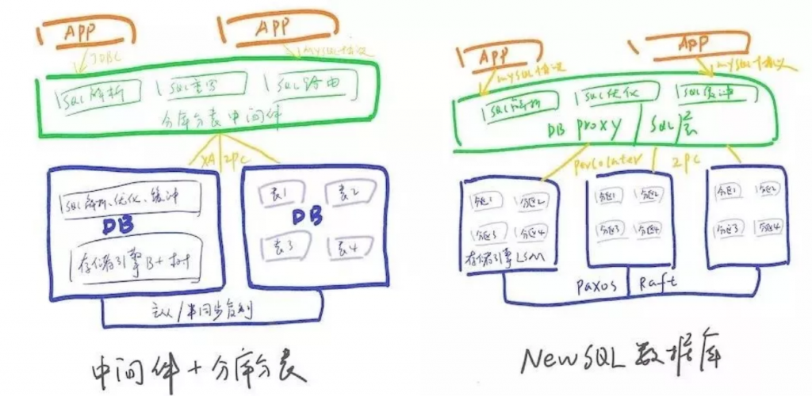
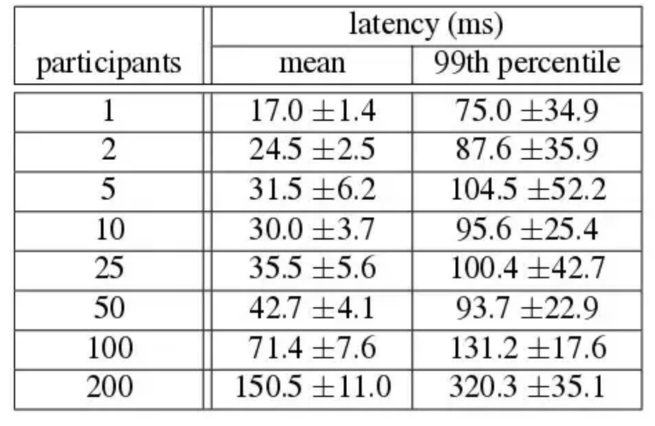

# 技术分享 | 分库分表 or NewSQL数据库？终于看懂应该怎么选！

**原文链接**: https://opensource.actionsky.com/20190812-mysql/
**分类**: MySQL 新特性
**发布时间**: 2019-08-12T00:41:00-08:00

---

作者介绍
**温卫斌，**就职于中国民生银行信息科技部，目前负责分布式技术平台设计与研发，主要关注分布式数据相关领域。
最近与同行科技交流，经常被问到分库分表与分布式数据库如何选择，网上也有很多关于中间件+传统关系数据库（分库分表）与NewSQL分布式数据库的文章，但有些观点与判断是我觉得是偏激的，脱离环境去评价方案好坏其实有失公允。本文通过对两种模式关键特性实现原理对比，希望可以尽可能客观、中立的阐明各自真实的优缺点以及适用场景。
**一、NewSQL数据库先进在哪儿？**
首先关于“中间件+关系数据库分库分表”算不算NewSQL分布式数据库问题，国外有篇论文pavlo-newsql-sigmodrec，如果根据该文中的分类，Spanner、TiDB、OB算是第一种新架构型，Sharding-Sphere、Mycat、DRDS等中间件方案算是第二种（文中还有第三种云数据库，本文暂不详细介绍）。
「pavlo-newsql-sigmodrec」 参考链接：https://db.cs.cmu.edu/papers/2016/pavlo-newsql-sigmodrec2016.pdf基于中间件（包括SDK和Proxy两种形式）+传统关系数据库（分库分表）模式是不是分布式架构？我觉得是的，因为存储确实也分布式了，也能实现横向扩展。但是不是“伪”分布式数据库？从架构先进性来看，这么说也有一定道理。
“伪”主要体现在中间件层与底层DB重复的SQL解析与执行计划生成、存储引擎基于B+Tree等，这在分布式数据库架构中实际上冗余低效的。为了避免引起真伪分布式数据库的口水战，本文中NewSQL数据库特指这种新架构NewSQL数据库。
NewSQL数据库相比中间件+分库分表的先进在哪儿？画一个简单的架构对比图：
											
- 传统数据库面向磁盘设计，基于内存的存储管理及并发控制，不如NewSQL数据库那般高效利用；
- 中间件模式SQL解析、执行计划优化等在中间件与数据库中重复工作，效率相比较低；
- NewSQL数据库的分布式事务相比于XA进行了优化，性能更高；
- 新架构NewSQL数据库存储设计即为基于paxos（或Raft）协议的多副本，相比于传统数据库主从模式（半同步转异步后也存在丢数问题），在实现了真正的高可用、高可靠（RTO<30s，RPO=0）；
- NewSQL数据库天生支持数据分片，数据的迁移、扩容都是自动化的，大大减轻了DBA的工作，同时对应用透明，无需在SQL指定分库分表键。
这些大多也是NewSQL数据库产品主要宣传的点，不过这些看起来很美好的功能是否真的如此？接下来针对以上几点分别阐述下的我的理解。
**二、分布式事务**
这是把双刃剑。
1、CAP限制想想更早些出现的NoSQL数据库为何不支持分布式事务（最新版的MongoDB等也开始支持了），是缺乏理论与实践支撑吗？并不是，原因是CAP定理依然是分布式数据库头上的紧箍咒，在保证强一致的同时必然会牺牲可用性A或分区容忍性P。为什么大部分NoSQL不提供分布式事务？《为什么大部分NoSQL不提供分布式事务？》
参考链接：https://www.jdon.com/47671
那么NewSQL数据库突破CAP定理限制了吗？并没有。NewSQL数据库的鼻祖Google Spanner（目前绝大部分分布式数据库都是按照Spanner架构设计的）提供了一致性和大于5个9的可用性，宣称是一个“实际上是CA”的，其真正的含义是**系统处于CA状态的概率非常高，由于网络分区导致的服务停用的概率非常小**，究其真正原因是其打造私有全球网保证了不会出现网络中断引发的网络分区，另外就是其高效的运维队伍，这也是cloud spanner的卖点。详细可见CAP提出者Eric Brewer写的《Spanner, TrueTime和CAP理论》。《Spanner, TrueTime和CAP理论》参考链接：http://dockone.io/article/2129
推荐一篇关于分布式系统有趣的文章《站在巨人的分布式肩膀上》，其中提到：**分布式系统中，您可以知道工作在哪里，或者您可以知道工作何时完成，但您无法同时了解两者；****两阶段协议本质上是反可用性协议。**《站在巨人的分布式肩膀上》
参考链接：https://queue.acm.org/detail.cfm?id=2953944
2、完备性两阶段提交协议是否严格支持ACID，各种异常场景是不是都可以覆盖？
2PC在commit阶段发送异常，其实跟最大努力一阶段提交类似也会有部分可见问题，严格讲一段时间内并不能保证A原子性和C一致性（待故障恢复后recovery机制可以保证最终的A和C）。完备的分布式事务支持并不是一件简单的事情，需要可以应对网络以及各种硬件包括网卡、磁盘、CPU、内存、电源等各类异常，通过严格的测试。
之前跟某友商交流，他们甚至说目前已知的NewSQL在分布式事务支持上都是不完整的，他们都有案例跑不过，圈内人士这么笃定，也说明了**分布式事务的支持完整程度其实是层次不齐的。**
但分布式事务又是这些NewSQL数据库的一个非常重要的底层机制，跨资源的DML、DDL等都依赖其实现，如果这块的性能、完备性打折扣，上层跨分片SQL执行的正确性会受到很大影响。
3、性能传统关系数据库也支持分布式事务XA，但为何很少有高并发场景下用呢？因为XA的基础两阶段提交协议存在网络开销大，阻塞时间长、死锁等问题，这也导致了其实际上很少大规模用在基于传统关系数据库的OLTP系统中。NewSQL数据库的分布式事务实现也仍然多基于两阶段提交协议，例如google percolator分布式事务模型，采用原子钟+MVCC+ Snapshot Isolation（SI），这种方式通过TSO(Timestamp Oracle)保证了全局一致性，通过MVCC避免了锁，另外通过primary lock和secondary lock将提交的一部分转为异步，相比XA确实提高了分布式事务的性能。SI是乐观锁，在热点数据场景，可能会大量的提交失败。另外SI的隔离级别与RR并非完全相同，它不会有幻想读，但会有写倾斜。但不管如何优化，相比于1PC，2PC多出来的GID获取、网络开销、prepare日志持久化还是会带来很大的性能损失，尤其是跨节点的数量比较多时会更加显著，例如在银行场景做个批量扣款，一个文件可能上W个账户，这样的场景无论怎么做还是吞吐都不会很高。
											
▲ Spanner给出的分布式事务测试数据
**虽然NewSQL分布式数据库产品都宣传完备支持分布式事务，但这并不是说应用可以完全不用关心数据拆分，这些数据库的最佳实践中仍然会写到，应用的大部分场景尽可能避免分布式事务。**既然强一致事务付出的性能代价太大，我们可以反思下是否真的需要这种强一致的分布式事务？尤其是在做微服务拆分后，很多系统也不太可能放在一个统一的数据库中。尝试将一致性要求弱化，便是柔性事务，放弃ACID(Atomicity, Consistency, Isolation,  Durability)，转投BASE(Basically Available, Soft state, Eventually consistent)，例如Saga、TCC、可靠消息保证最终一致等模型，对于大规模高并发OLTP场景，我个人更建议使用柔性事务而非强一致的分布式事务。关于柔性事务，笔者之前也写过一个技术组件，最近几年也涌现出了一些新的模型与框架（例如阿里刚开源的Fescar），限于篇幅不再赘述，详细可阅读[《分布式事务选型的取舍》](http://mp.weixin.qq.com/s?__biz=MzI4NTA1MDEwNg==&mid=2650779737&idx=1&sn=79eaeed2c65c180347ce97a7ebb29868&chksm=f3f905ccc48e8cdab837d6baa00eb08042d4d8737af26b4423b97c8d3f6d8a197135e74a9e32&scene=21#wechat_redirect)。**解决分布式事务是否只能用两阶段提交协议？**OceanBase 1.0中通过updateserver避免分布式事务的思路很有启发性 ，不过2.0版后也变成了2PC。业界分布式事务也并非只有两阶段提交这一解。其它方案参考链接：its-time-to-move-on-from-two-phase翻译版参考链接：https://www.jdon.com/51588)
**三、HA与异地多活**
主从模式并不是最优的方式，就算是半同步复制，在极端情况下（半同步转异步）也存在丢数据问题，目前业界公认更好的方案是基于paxos分布式一致性协议或者其它类paxos如raft方式，Google Spanner、TiDB、CockcoachDB、OB都采用了这种方式，基于Paxos协议的多副本存储，遵循过半写原则，支持自动选主，解决了数据的高可靠，缩短了failover时间，提高了可用性，特别是减少了运维的工作量，这种方案技术上已经很成熟，也是NewSQL数据库底层的标配。当然这种方式其实也可以用在传统关系数据库，阿里、微信团队等也有将MySQL存储改造支持paxos多副本的，MySQL也推出了官方版MySQL Group Cluster，预计不远的未来主从模式可能就成为历史了。分布式一致性算法本身并不难，但具体在工程实践时，需要考虑很多异常并做很多优化，实现一个生产级可靠成熟的一致性协议并不容易。例如实际使用时必须转化实现为multi-paxos或multi-raft，需要通过batch、异步等方式减少网络、磁盘IO等开销。**需要注意的是很多NewSQL数据库厂商宣传基于paxos或raft协议可以实现【异地多活】，这个实际上是有前提的，那就是异地之间网络延迟不能太高。**以银行“两地三中心”为例，异地之间多相隔数千里，延时达到数十毫秒，如果要多活，那便需异地副本也参与数据库日志过半确认，这样高的延时几乎没有OLTP系统可以接受的。**数据库层面做异地多活是个美好的愿景，但距离导致的延时目前并没有好的方案。**之前跟蚂蚁团队交流，蚂蚁异地多活的方案是在应用层通过MQ同步双写交易信息，异地DC将交易信息保存在分布式缓存中，一旦发生异地切换，数据库同步中间件会告之数据延迟时间，应用从缓存中读取交易信息，将这段时间内涉及到的业务对象例如用户、账户进行黑名单管理，等数据同步追上之后再将这些业务对象从黑名单中剔除。由于双写的不是所有数据库操作日志而只是交易信息，数据延迟只影响一段时间内数据，这是目前我觉得比较靠谱的异地度多活方案。另外有些系统进行了单元化改造，这在paxos选主时也要结合考虑进去，这也是目前很多NewSQL数据库欠缺的功能。
**四、Scale横向扩展与分片机制**
paxos算法解决了高可用、高可靠问题，并没有解决Scale横向扩展的问题，所以分片是必须支持的。NewSQL数据库都是天生内置分片机制的，而且会根据每个分片的数据负载(磁盘使用率、写入速度等)自动识别热点，然后进行分片的分裂、数据迁移、合并，这些过程应用是无感知的，这省去了DBA的很多运维工作量。以TiDB为例，它将数据切成region，如果region到64M时，数据自动进行迁移。分库分表模式下需要应用设计之初就要明确各表的拆分键、拆分方式（range、取模、一致性哈希或者自定义路由表）、路由规则、拆分库表数量、扩容方式等。相比NewSQL数据库，这种模式给应用带来了很大侵入和复杂度，这对大多数系统来说也是一大挑战。分库分表模式也能做到在线扩容，基本思路是通过异步复制先追加数据，然后设置只读完成路由切换，最后放开写操作，当然这些需要中间件与数据库端配合一起才能完成。**这里有个问题是NewSQL数据库统一的内置分片策略（例如TiDB基于range）可能并不是最高效的，因为与领域模型中的划分要素并不一致，这导致的后果是很多交易会产生分布式事务。**举个例子，银行核心业务系统是以客户为维度，也就是说客户表、该客户的账户表、流水表在绝大部分场景下是一起写的，但如果按照各表主键range进行分片，这个交易并不能在一个分片上完成，这在高频OLTP系统中会带来性能问题。
**五、分布式SQL支持**
常见的单分片SQL，这两者都能很好支持。NewSQL数据库由于定位与目标是一个通用的数据库，所以支持的SQL会更完整，包括跨分片的join、聚合等复杂SQL。中间件模式多面向应用需求设计，不过大部分也支持带拆分键SQL、库表遍历、单库join、聚合、排序、分页等。但对跨库的join以及聚合支持就不够了。NewSQL数据库一般并不支持存储过程、视图、外键等功能，而中间件模式底层就是传统关系数据库，这些功能如果只是涉及单库是比较容易支持的。NewSQL数据库往往选择兼容MySQL或者PostgreSQL协议，所以SQL支持仅局限于这两种，中间件例如驱动模式往往只需做简单的SQL解析、计算路由、SQL重写，所以可以支持更多种类的数据库SQL。SQL支持的差异主要在于分布式SQL执行计划生成器，由于NewSQL数据库具有底层数据的分布、统计信息，因此可以做CBO，生成的执行计划效率更高，而中间件模式下没有这些信息，往往只能基于规则RBO（Rule-Based-Opimization），这也是为什么中间件模式一般并不支持跨库join，因为实现了效率也往往并不高，还不如交给应用去做。这里也可以看出中间件+分库分表模式的架构风格体现出的是一种妥协、平衡，它是一个面向应用型的设计；而NewSQL数据库则要求更高、“大包大揽”，它是一个通用底层技术软件，因此后者的复杂度、技术门槛也高很多。
**六、存储引擎**
传统关系数据库的存储引擎设计都是面向磁盘的，大多都基于B+树。B+树通过降低树的高度减少随机读、进而减少磁盘寻道次数，提高读的性能，但大量的随机写会导致树的分裂，从而带来随机写，导致写性能下降。NewSQL的底层存储引擎则多采用LSM，相比B+树LSM将对磁盘的随机写变成顺序写，大大提高了写的性能。不过LSM的的读由于需要合并数据性能比B+树差，一般来说LSM更适合应在写大于读的场景。当然这只是单纯数据结构角度的对比，在数据库实际实现时还会通过SSD、缓冲、bloom filter等方式优化读写性能，所以读性能基本不会下降太多。NewSQL数据由于多副本、分布式事务等开销，相比单机关系数据库SQL的响应时间并不占优，但由于集群的弹性扩展，整体QPS提升还是很明显的，这也是NewSQL数据库厂商说分布式数据库更看重的是吞吐，而不是单笔SQL响应时间的原因。
**七、成熟度与生态**
分布式数据库是个新型通用底层软件，准确的衡量与评价需要一个多维度的测试模型，需包括发展现状、使用情况、社区生态、监控运维、周边配套工具、功能满足度、DBA人才、SQL兼容性、性能测试、高可用测试、在线扩容、分布式事务、隔离级别、在线DDL等等，虽然NewSQL数据库发展经过了一定时间检验，但多集中在互联网以及传统企业非核心交易系统中，目前还处于快速迭代、规模使用不断优化完善的阶段。相比而言，传统关系数据库则经过了多年的发展，通过完整的评测，在成熟度、功能、性能、周边生态、风险把控、相关人才积累等多方面都具有明显优势，同时对已建系统的兼容性也更好。**对于互联网公司，数据量的增长压力以及追求新技术的基因会更倾向于尝试NewSQL数据库，不用再考虑库表拆分、应用改造、扩容、事务一致性等问题怎么看都是非常吸引人的方案。****对于传统企业例如银行这种风险意识较高的行业来说，NewSQL数据库则可能在未来一段时间内仍处于探索、审慎试点的阶段。**基于中间件+分库分表模式架构简单，技术门槛更低，虽然没有NewSQL数据库功能全面，但大部分场景最核心的诉求也就是拆分后SQL的正确路由，而此功能中间件模式应对还是绰绰有余的，可以说在大多数OLTP场景是够用的。限于篇幅，其它特性例如在线DDL、数据迁移、运维工具等特性就不在本文展开对比。
**八、总结**
如果看完以上内容，您还不知道选哪种模式，那么结合以下几个问题，先思考下NewSQL数据库解决的点对于自身是不是真正的痛点：- 强一致事务是否必须在数据库层解决？
- 数据的增长速度是否不可预估的？
- 扩容的频率是否已超出了自身运维能力？
- 相比响应时间更看重吞吐？
- 是否必须做到对应用完全透明？
- 是否有熟悉NewSQL数据库的DBA团队？
如果以上有两到三个是肯定的，那么你可以考虑用NewSQL数据库了，虽然前期可能需要一定的学习成本，但它是数据库的发展方向，未来收益也会更高，尤其是互联网行业，随着数据量的突飞猛进，分库分表带来的痛苦会与日俱增。当然选择NewSQL数据库你也要做好承担一定风险的准备。如果你还未做出抉择，不妨再想想下面几个问题：- 最终一致性是否可以满足实际场景？
- 数据未来几年的总量是否可以预估？
- 扩容、DDL等操作是否有系统维护窗口？
- 对响应时间是否比吞吐更敏感？
- 是否需要兼容已有的关系数据库系统？
- 是否已有传统数据库DBA人才的积累？
- 是否可容忍分库分表对应用的侵入？
如果这些问题有多数是肯定的，那还是分库分表吧。在软件领域很少有完美的解决方案，NewSQL数据库也不是数据分布式架构的银弹。相比而言分库分表是一个代价更低、风险更小的方案，它最大程度复用传统关系数据库生态，通过中间件也可以满足分库分表后的绝大多数功能，定制化能力更强。**在当前NewSQL数据库还未完全成熟的阶段，分库分表可以说是一个上限低但下限高的方案，尤其传统行业的核心系统，如果你仍然打算把数据库当做一个黑盒产品来用，踏踏实实用好分库分表会被认为是个稳妥的选择。**很多时候软件选型取决于领域特征以及架构师风格，限于笔者知识与所属行业特点所限，以上仅为个人粗浅的一些观点，欢迎讨论。
**近期社区动态**
