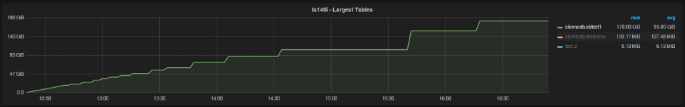

# 技术分享 | 在磁盘上查找 MySQL 表的大小

**原文链接**: https://opensource.actionsky.com/20190830-mysql/
**分类**: MySQL 新特性
**发布时间**: 2019-08-30T00:55:16-08:00

---

> 作者：Peter Zaitsev
翻译：管长龙
我想知道 MySQL 表在磁盘上占用多少空间，但看起来很琐碎。不应该在 `INFORMATION_SCHEMA.TABLES` 中提供这些信息吗？没那么简单！
这个看似简单的问题实际上在 MySQL 中非常复杂。MySQL 支持许多存储引擎（其中一些根本不在磁盘上存储数据）， 不同的存储数据格式。例如，InnoDB 存储引擎为 MySQL 5.7 提供了三种“基本”格式，其中包含 `row_formats` 和两种可压缩的种类。
简化一下：我们如何在磁盘上查找存储在其自己的表空间中的 InnoDB 表的表大小（前提是 `innodb_file_per_table=1` ）。
在我们得到答案之前，先展示通过 `sysbench` 运行预先获得的图表（批量数据插入表）：
											
此图显示了从 `INFORMATION_SCHEMA.TABLES` 获取的 `data_length` 和 `index_length` 所定义的表大小。可以预期，随着数据的增多，表格会跳跃增长（有时会增加 10GB 或更多）。
该图表与磁盘上数据的变化方式不匹配，它逐渐增长（如预期）：- `-rw-r----- 1 mysql mysql 220293234688 Jan 25 17:03 sbtest1.ibd`
- `-rw-r----- 1 mysql mysql 220310011904 Jan 25 17:03 sbtest1.ibd`
- `-rw-r----- 1 mysql mysql 222499438592 Jan 25 17:07 sbtest1.ibd`
正如我们从这个实验中看到的那样，MySQL 并没有真正的实时维护 `data_length` 和 `index_length` 的值，而是定期刷新它们 &#8211; 而且不规则地刷新它们。图表的后半部分一些数据刷新变得更加规律。这与图表的第一部分不同，后者似乎每次有 10％ 的行更改时，就更新一次统计信息。`table_rows`， `data_free` 或 `update_time` ，它们也是实时更新的。
要在 MySQL 5.7获取 `information_schema` 获取到更准确的实时信息，需要做两件事：
- 禁用 `innodb_stats_persistent`
- 启用 `innodb_stats_on_metadata```
这两者都会带来严重的代价。
禁用持久性统计信息意味着每次服务器启动时 InnoDB 都必须刷新统计信息，这代价很大，并且可能会在重新启动之间产生不稳定的查询计划。那有没有更好的办法呢？事实证明有。
可以通过 `INNODB_SYS_TABLESPACES` 查看表空间信息表以查看实际文件大小。与 `index_length` 和 `data_length` 不同， `INNODB_SYS_TABLESPACES` 实时更新，无需特殊配置：- `mysql> select * from INFORMATION_SCHEMA.INNODB_SYS_TABLESPACES where name='sbinnodb/sbtest1' \G`
- `*************************** 1. row ***************************`
- `        SPACE: 42`
- `         NAME: sbinnodb/sbtest1`
- `         FLAG: 33`
- `  FILE_FORMAT: Barracuda`
- `   ROW_FORMAT: Dynamic`
- `    PAGE_SIZE: 16384`
- `ZIP_PAGE_SIZE: 0`
- `   SPACE_TYPE: Single`
- `FS_BLOCK_SIZE: 4096`
- `    FILE_SIZE: 245937209344`
- `ALLOCATED_SIZE: 245937266688`
- `1 row in set (0.00 sec)`
使用这个表的好处是，它还处理新功能 “InnoDB 页压缩”，正确显示了 `file_size` （磁盘上的逻辑文件大小）和 `allocated_size`（为此文件分配的空间，并且可以显着缩小）之间的区别。
最后，让我们看一下不同的 InnoDB 压缩方式如何影响 `information_schema` 中提供的信息。- `mysql> select * from INFORMATION_SCHEMA.INNODB_SYS_TABLESPACES where name='sbinnodb/testcomp' G`
- `*************************** 1. row ***************************`
- `        SPACE: 48`
- `         NAME: sbinnodb/testcomp`
- `         FLAG: 33`
- `  FILE_FORMAT: Barracuda`
- `   ROW_FORMAT: Dynamic`
- `    PAGE_SIZE: 16384`
- `ZIP_PAGE_SIZE: 0`
- `   SPACE_TYPE: Single`
- `FS_BLOCK_SIZE: 4096`
- `    FILE_SIZE: 285212672`
- `ALLOCATED_SIZE: 113004544`
- `1 row in set (0.00 sec)`
如果您使用旧的 InnoDB 压缩（InnoDB 表压缩），您将看到 `data_length` 和 `index_length` 中显示的压缩数据大小作为结果。例如， `avg_row_length` 将远低于您的预期。
如果在 MySQL 5.7 中使用新的 InnoDB 压缩（InnoDB 页压缩），您将看到与文件大小相对应的值，而不是如 `information_schema` 中所示的分配大小。
**结论**
回答一个微不足道的问题“这个表在磁盘上占用了多少空间？” 在 MySQL 中真的不是一个简单的问题 &#8211; 显而易见的数据，可能会得到错误的答案。
查看 `INFORMATION_SCHEMA.INNODB_SYS_TABLESPACES` 以获取 InnoDB 表的实际文件大小值。
**原文链接：**https://www.percona.com/blog/2016/01/26/finding_mysql_table_size_on_disk/
**社区近期动态**
**No.1**
**Mycat 问题免费诊断**
诊断范围支持：
Mycat 的故障诊断、源码分析、性能优化
服务支持渠道：
- 技术交流群，进群后可提问
QQ群（669663113）
- 社区通道，邮件&电话
osc@actionsky.com
- 现场拜访，线下实地，1天免费拜访
关注“爱可生开源社区”公众号，回复关键字“Mycat”，获取活动详情。
**No.2**
**社区技术内容征稿**
征稿内容：
- 格式：.md/.doc/.txt
- 主题：MySQL、分布式中间件DBLE、数据传输组件DTLE相关技术内容
- 要求：原创且未发布过
- 奖励：作者署名；200元京东E卡+社区周边
投稿方式：
- 邮箱：osc@actionsky.com
- 格式：[投稿]姓名+文章标题
- 以附件形式发送，正文需注明姓名、手机号、微信号，以便小编及时联系