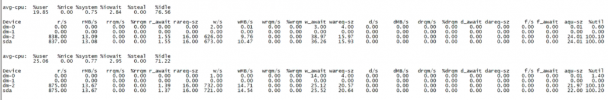
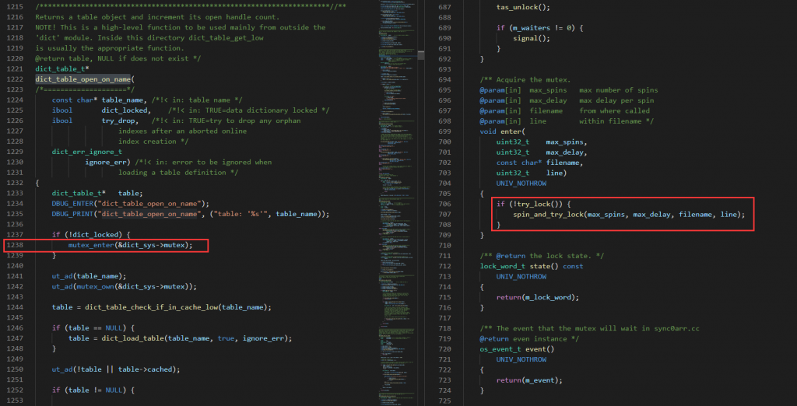
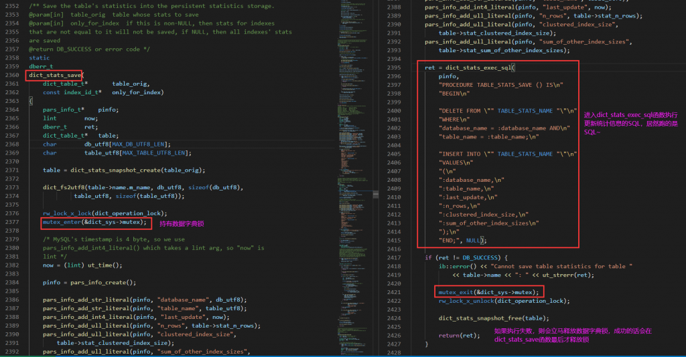
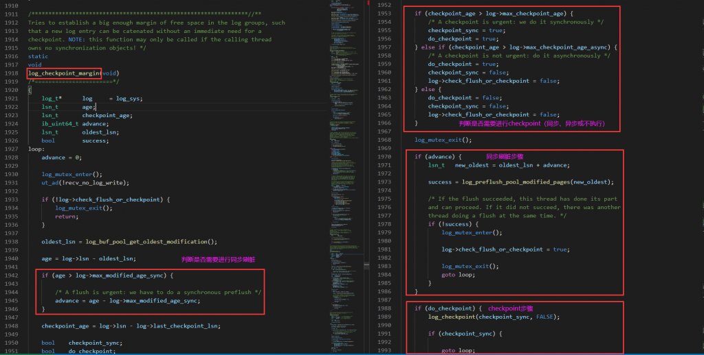

# 技术分享 | 大量 Opening tables 案例分析

**原文链接**: https://opensource.actionsky.com/20201217-mysql/
**分类**: MySQL 新特性
**发布时间**: 2020-12-17T00:46:19-08:00

---

作者：xuty
本文来源：原创投稿
*爱可生开源社区出品，原创内容未经授权不得随意使用，转载请联系小编并注明来源。
**一、现象**
某项目反馈系统非常卡，登陆 MySQL 后发现大量 SQL 处于 **Opening tables** 状态，断断续续，一会好一会又出现，比较离奇。
											
之前遇到过类似的问题现象，是由于 MySQL 开启了 **AHI（自适应哈希索引）**后如果 **DROP** 或 **TRUNCATE **一张大表，MySQL 会同时删除 buffer pool 中对应表上的 AHI，这个过程需会持有一把**数据字典锁（非常重的锁）**，导致其他用户线程因为无法获数据字典锁而处于 Opening tables 状态。
但是这里检查过所有的会话 SQL，并没有发现有 DROP 或者 TRUNCATE 语句，所以应该不是上述的这种问题，而是其他的原因导致了类似的现象。
值得怀疑的是，这台 MySQL 服务器的**磁盘写入性能很差**，会不会是因为磁盘写入太差导致这个现象？
											
因为一时间没法排查出具体原因，所以针对 MySQL 进程打了个快照，方便事后详细排查。
**二、分析栈帧**
用 pt-pmp 工具处理下快照后，内容比较多，这里只显示一些比较重要的堆栈：- 
- 
- 
- 
- 
- 
- 
- 
- 
- 
- 
- 
- 
- 
`1402 ``pthread_cond_wait,wait(os0event.cc:165),os_event::wait_low(os0event.cc:165),sync_array_wait_event(sync0arr.cc:475),TTASEventMutex::wait(ut0mutex.ic:89),spin_and_try_lock(ib0mutex.h:850),enter(ib0mutex.h:850),PolicyMutex<TTASEventMutex<GenericPolicy>(ib0mutex.h:850),dict_table_open_on_name(dict0dict.cc:1238),ha_innobase::open_dict_table(ha_innodb.cc:6250),ha_innobase::open(ha_innodb.cc:5888),handler::ha_open(handler.cc:2759),open_table_from_share(table.cc:3353),open_table(sql_base.cc:3559),open_and_process_table(sql_base.cc:5145),open_tables(sql_base.cc:5145),open_tables_for_query(sql_base.cc:6531),execute_sqlcom_select(sql_parse.cc:5127),mysql_execute_command(sql_parse.cc:2792),mysql_parse(sql_parse.cc:5582),dispatch_command(sql_parse.cc:1458),do_command(sql_parse.cc:999),handle_connection(connection_handler_per_thread.cc:300),pfs_spawn_thread(pfs.cc:2190),start_thread(libpthread.so.0),clone(libc.so.6)``
``36 ``nanosleep(libpthread.so.0),os_thread_sleep(os0thread.cc:279),buf_flush_wait_flushed(buf0flu.cc:2074),log_preflush_pool_modified_pages(log0log.cc:1531),log_checkpoint_margin(log0log.cc:1973),log_check_margins(log0log.cc:1973),log_free_check(log0log.ic:491),row_ins_sec_index_entry(log0log.ic:491),row_ins_index_entry(row0ins.cc:3460),row_ins_index_entry_step(row0ins.cc:3460),row_ins(row0ins.cc:3460),row_ins_step(row0ins.cc:3460),row_insert_for_mysql_using_ins_graph(row0mysql.cc:1738),ha_innobase::write_row(ha_innodb.cc:7566),handler::ha_write_row(handler.cc:7991),write_record(sql_insert.cc:1873),Sql_cmd_insert::mysql_insert(sql_insert.cc:769),Sql_cmd_insert::execute(sql_insert.cc:3105),mysql_execute_command(sql_parse.cc:3566),mysql_parse(sql_parse.cc:5582),dispatch_command(sql_parse.cc:1458),do_command(sql_parse.cc:999),handle_connection(connection_handler_per_thread.cc:300),pfs_spawn_thread(pfs.cc:2190),start_thread(libpthread.so.0),clone(libc.so.6)``
``1 ``pthread_cond_wait,wait(os0event.cc:165),os_event::wait_low(os0event.cc:165),buf_dblwr_flush_buffered_writes(buf0dblwr.cc:979),buf_dblwr_add_to_batch(buf0dblwr.cc:1154),buf_flush_write_block_low(buf0flu.cc:1099),buf_flush_page(buf0flu.cc:1099),buf_flush_try_neighbors(buf0flu.cc:1453),buf_flush_page_and_try_neighbors(buf0flu.cc:1453),buf_do_flush_list_batch(buf0flu.cc:1780),buf_flush_batch(buf0flu.cc:1780),buf_flush_do_batch(buf0flu.cc:1780),pc_flush_slot(buf0flu.cc:2874),buf_flush_page_cleaner_worker(buf0flu.cc:3504),start_thread(libpthread.so.0),clone(libc.so.6)``
``1``nanosleep(libpthread.so.0),os_thread_sleep(os0thread.cc:279),buf_flush_wait_flushed(buf0flu.cc:2074),log_preflush_pool_modified_pages(log0log.cc:1531),log_checkpoint_margin(log0log.cc:1973),log_check_margins(log0log.cc:1973),log_free_check(log0log.ic:491),que_run_threads_low(log0log.ic:491),que_run_threads(log0log.ic:491),trx_purge(trx0purge.cc:1883),srv_do_purge(srv0srv.cc:2631),srv_purge_coordinator_thread(srv0srv.cc:2631),start_thread(libpthread.so.0),clone(libc.so.6)``
``1``nanosleep(libpthread.so.0),os_thread_sleep(os0thread.cc:279),buf_flush_wait_flushed(buf0flu.cc:2074),log_preflush_pool_modified_pages(log0log.cc:1531),log_checkpoint_margin(log0log.cc:1973),log_check_margins(log0log.cc:1973),log_free_check(log0log.ic:491),que_run_threads_low(log0log.ic:491),que_run_threads(log0log.ic:491),que_eval_sql(que0que.cc:1232),dict_stats_exec_sql(dict0stats.cc:311),dict_stats_save(dict0stats.cc:2415),dict_stats_update(dict0stats.cc:3112),dict_stats_process_entry_from_recalc_pool(dict0stats_bg.cc:356),dict_stats_thread(dict0stats_bg.cc:356),start_thread(libpthread.so.0),clone(libc.so.6)`
其中 **1402 个线程**是处于自旋状态，因为无法拿到对应的 **Mutex 锁**而进行忙等，应该就是对应我们看到的**大量 Opening tables 的线程**，但是具体什么锁需要跟踪下 MySQL 源码才能知道。
**36 个线程**都是 insert 操作，最后都再等待 **buf_flush_wait_flushed**，貌似是等待刷盘操作。
最后三个线程分别是：1. page_cleaner：后台刷脏线程，最后处于 **buf_dblwr_flush_buffered_writes**。2. purge_thread：purge 线程（清理 undo），最后处于 **buf_flush_wait_flushed**。3. dict_stats_thread：统计信息更新线程，最后处于 **buf_flush_wait_flushed**。
简单分析下这些线程，发现 insert、pugre_thread、dict_stats_thread 的最后一部分堆栈调用都是如下：- 
- 
- 
- 
- 
- 
`log_free_check`` -> log_check_margins``  -> log_checkpoint_margin``   -> log_preflush_pool_modified_pages``    -> buf_flush_wait_flushed``     -> os_thread_sleep`
**三、源码跟踪**
> Server version: 5.7.22-log MySQL Community Server (GPL)
这里我把源码分析主要拆成 2 块，第一块是分析 **1402 个线程**的堆栈，看下是在等待什么锁资源，第二块是分析这个锁资源被哪个线程占用了，为啥不释放？
先来看第一部分，过程就是从 MySQL 快照中找到一个如下类似的线程（这里去掉了一些参数显示），然后从 MySQL 源码中一步一步分析函数调用。- 
- 
- 
- 
- 
- 
- 
- 
- 
- 
- 
- 
- 
- 
- 
- 
- 
- 
- 
- 
- 
- 
- 
- 
- 
- 
`#0  0x00007efc61303965 in pthread_cond_wait@@GLIBC_2.3.2 () from /lib64/libpthread.so.0``#1  0x0000000000ffb03b in wait at /export/home/pb2/build/sb_0-27500212-1520171728.22/mysql-5.7.22/storage/innobase/os/os0event.cc:165``#2  os_event::wait_low at /export/home/pb2/build/sb_0-27500212-1520171728.22/mysql-5.7.22/storage/innobase/os/os0event.cc:335``#3  0x00000000010a0ce9 in sync_array_wait_event at /export/home/pb2/build/sb_0-27500212-1520171728.22/mysql-5.7.22/storage/innobase/sync/sync0arr.cc:475``#4  0x0000000000f8c1c4 in TTASEventMutex<GenericPolicy>::wait at /export/home/pb2/build/sb_0-27500212-1520171728.22/mysql-5.7.22/storage/innobase/include/ut0mutex.ic:89``#5  0x0000000000f8c33b in spin_and_try_lock at /export/home/pb2/build/sb_0-27500212-1520171728.22/mysql-5.7.22/storage/innobase/include/ib0mutex.h:850``#6  enter at /export/home/pb2/build/sb_0-27500212-1520171728.22/mysql-5.7.22/storage/innobase/include/ib0mutex.h:707``#7  PolicyMutex<TTASEventMutex<GenericPolicy> >::enter at /export/home/pb2/build/sb_0-27500212-1520171728.22/mysql-5.7.22/storage/innobase/include/ib0mutex.h:987``#8  0x0000000001152f41 in dict_table_open_on_name at /export/home/pb2/build/sb_0-27500212-1520171728.22/mysql-5.7.22/storage/innobase/dict/dict0dict.cc:1238``#9  0x0000000000f72a73 in ha_innobase::open_dict_table at /export/home/pb2/build/sb_0-27500212-1520171728.22/mysql-5.7.22/storage/innobase/handler/ha_innodb.cc:6250``#10 0x0000000000f8273b in ha_innobase::open at /export/home/pb2/build/sb_0-27500212-1520171728.22/mysql-5.7.22/storage/innobase/handler/ha_innodb.cc:5888``#11 0x000000000081b33e in handler::ha_open at /export/home/pb2/build/sb_0-27500212-1520171728.22/mysql-5.7.22/sql/handler.cc:2759``#12 0x0000000000dc239a in open_table_from_share at /export/home/pb2/build/sb_0-27500212-1520171728.22/mysql-5.7.22/sql/table.cc:3353``#13 0x0000000000cc18b9 in open_table at /export/home/pb2/build/sb_0-27500212-1520171728.22/mysql-5.7.22/sql/sql_base.cc:3559``#14 0x0000000000cc52b6 in open_and_process_table at /export/home/pb2/build/sb_0-27500212-1520171728.22/mysql-5.7.22/sql/sql_base.cc:5145``#15 open_tables at /export/home/pb2/build/sb_0-27500212-1520171728.22/mysql-5.7.22/sql/sql_base.cc:5756``#16 0x0000000000cc5e62 in open_tables_for_query at /export/home/pb2/build/sb_0-27500212-1520171728.22/mysql-5.7.22/sql/sql_base.cc:6531``#17 0x0000000000d14ff6 in execute_sqlcom_select at /export/home/pb2/build/sb_0-27500212-1520171728.22/mysql-5.7.22/sql/sql_parse.cc:5127``#18 0x0000000000d18bce in mysql_execute_command at /export/home/pb2/build/sb_0-27500212-1520171728.22/mysql-5.7.22/sql/sql_parse.cc:2792``#19 0x0000000000d1aaad in mysql_parse at /export/home/pb2/build/sb_0-27500212-1520171728.22/mysql-5.7.22/sql/sql_parse.cc:5582``#20 0x0000000000d1bcca in dispatch_command at /export/home/pb2/build/sb_0-27500212-1520171728.22/mysql-5.7.22/sql/sql_parse.cc:1458``#21 0x0000000000d1cb74 in do_command at /export/home/pb2/build/sb_0-27500212-1520171728.22/mysql-5.7.22/sql/sql_parse.cc:999``#22 0x0000000000dedaec in handle_connection at /export/home/pb2/build/sb_0-27500212-1520171728.22/mysql-5.7.22/sql/conn_handler/connection_handler_per_thread.cc:300``#23 0x0000000001256a94 in pfs_spawn_thread at /export/home/pb2/build/sb_0-27500212-1520171728.22/mysql-5.7.22/storage/perfschema/pfs.cc:2190``#24 0x00007efc612ffdd5 in start_thread () from /lib64/libpthread.so.0``#25 0x00007efc5fdb8ead in clone () from /lib64/libc.so.6`
分析过后，发现这种线程，最终是在 **dict_table_open_on_name** 函数中（注意函数行数为 **1238**，与堆栈一致），因为无法获取 **dict_sys->mutex**，这把**数据字典锁**而产生自旋等待。
											
再来看第二部分，**dict_sys->mutex **被哪个线程占了，为啥不释放？这里有个小技巧，就是只需要分析**总数为 1 的函数调用**，因为这把数据字典锁同一时间只能被一个线程占用，那这里主要是就是最后 3 个线程。先从最可疑的线程开始，即 **dict_stats_thread**，因为它也有一个 dict~- 
- 
- 
- 
- 
- 
- 
- 
- 
- 
- 
- 
- 
- 
- 
- 
- 
`#0  0x00007efc61306e3d in nanosleep () from /lib64/libpthread.so.0``#1  0x0000000000ffb7a0 in os_thread_sleep at /export/home/pb2/build/sb_0-27500212-1520171728.22/mysql-5.7.22/storage/innobase/os/os0thread.cc:279``#2  0x0000000001135779 in buf_flush_wait_flushed at /export/home/pb2/build/sb_0-27500212-1520171728.22/mysql-5.7.22/storage/innobase/buf/buf0flu.cc:2074``#3  0x0000000000fd4589 in log_preflush_pool_modified_pages at /export/home/pb2/build/sb_0-27500212-1520171728.22/mysql-5.7.22/storage/innobase/log/log0log.cc:1531``#4  0x0000000000fd7a69 in log_checkpoint_margin at /export/home/pb2/build/sb_0-27500212-1520171728.22/mysql-5.7.22/storage/innobase/log/log0log.cc:1973``#5  log_check_margins at /export/home/pb2/build/sb_0-27500212-1520171728.22/mysql-5.7.22/storage/innobase/log/log0log.cc:2065``#6  0x000000000101af4d in log_free_check at /export/home/pb2/build/sb_0-27500212-1520171728.22/mysql-5.7.22/storage/innobase/include/log0log.ic:491``#7  que_run_threads_low at /export/home/pb2/build/sb_0-27500212-1520171728.22/mysql-5.7.22/storage/innobase/que/que0que.cc:1109``#8  que_run_threads at /export/home/pb2/build/sb_0-27500212-1520171728.22/mysql-5.7.22/storage/innobase/que/que0que.cc:1155``#9  0x000000000101b86e in que_eval_sql at /export/home/pb2/build/sb_0-27500212-1520171728.22/mysql-5.7.22/storage/innobase/que/que0que.cc:1232``#10 0x0000000001176b9c in dict_stats_exec_sql at /export/home/pb2/build/sb_0-27500212-1520171728.22/mysql-5.7.22/storage/innobase/dict/dict0stats.cc:311``#11 0x0000000001179346 in dict_stats_save at /export/home/pb2/build/sb_0-27500212-1520171728.22/mysql-5.7.22/storage/innobase/dict/dict0stats.cc:2415``#12 0x000000000117a9ca in dict_stats_update at /export/home/pb2/build/sb_0-27500212-1520171728.22/mysql-5.7.22/storage/innobase/dict/dict0stats.cc:3112``#13 0x000000000117cc3a in dict_stats_process_entry_from_recalc_pool at /export/home/pb2/build/sb_0-27500212-1520171728.22/mysql-5.7.22/storage/innobase/dict/dict0stats_bg.cc:356``#14 dict_stats_thread at /export/home/pb2/build/sb_0-27500212-1520171728.22/mysql-5.7.22/storage/innobase/dict/dict0stats_bg.cc:445``#15 0x00007efc612ffdd5 in start_thread () from /lib64/libpthread.so.0``#16 0x00007efc5fdb8ead in clone () from /lib64/libc.so.6`
同样根据该线程的函数调用，去 MySQL 源码里一步一步跟踪，看下是否占用了**数据字典锁**，比较幸运，在 **dict_stats_save** 函数中发现其拿走了 **数据字典锁**，然后进入 **dict_stats_exec_sql **函数执行更新统计信息的 SQL，而且期间并未释放数据字典锁（这块需要去函数分支中检查，因为函数较多，这里省略说明），如下：
											
找到数据字典锁被 **dict_stats_thread **占用后就得分析为啥它不释放呢，我们继续往下看堆栈，这块就得去着重分析下 **log_free_check 开始往下的函数**，之前也提到过 insert、pugre_thread、dict_stats_thread 等线程最后都是跑得这段逻辑。- 
- 
- 
- 
- 
- 
- 
- 
- 
- 
- 
`dict_stats_save`` -> dict_stats_exec_sql``  -> que_eval_sql``   -> que_run_threads``    -> que_run_threads_low``     -> log_free_check /* Check that there is enough space in the log to accommodate possible log entries by this query step. */``      -> log_check_margins /* Checks that there is enough free space in the log to start a new query step.Flushes the log buffer or makes a new checkpoint if necessary. */``       -> log_checkpoint_margin /* Tries to establish a big enough margin of free space in the log groups, such that a new log entry can be catenated without an immediate need for a checkpoint. */``        -> log_preflush_pool_modified_pages /* Advances the smallest lsn for which there are unflushed dirty blocks in the buffer pool. */``         -> buf_flush_wait_flushed /* Waits until a flush batch of the given lsn ends */``          -> os_thread_sleep`
这段逻辑主要是先判断 log buffer 可用空间是否达到临界值（**log->buf_free > log->max_buf_free**），达到的话需要将 log buffer 中的日志先刷到 redo log 中。
然后判断 innodb buffer pool 中脏页占比是否达到临界值（**(log->lsn &#8211; oldest_lsn) > log->max_modified_age_sync**），达到的话需要进行**同步刷脏页**，这个过程可能会比较久，且阻塞当前其他写入进程。
最后判断 checkpoint 是否达到临界值（对比 **log->lsn &#8211; log->last_checkpoint_lsn**、**max_checkpoint_age**、**max_checkpoint_age_async **3 个值的大小），分别选择进行同步 checkpoint、异步 checkpoint、或是不做 checkpoint。
这里最后进入的是 **log_preflush_pool_modified_pages**，就是`同步刷脏页`的过程，刷脏页的过程就是唤醒 **page clean thread** 进行写入，而自身则处于** buf_flush_wait_flushed **函数中，一直等待刷脏页完成，就如我们之前堆栈中看到的一样，insert、pugre_thread、dict_stats_thread 等线程均在等待 page clean thread 刷新脏页。
											
这块可能我理解的不是很透彻~，大家有兴趣可以去看下 MySQL · 引擎特性 · InnoDB redo log漫游，里面介绍的非常详细**。**
> 
MySQL · 引擎特性 · InnoDB redo log漫游
http://mysql.taobao.org/monthly/2015/05/01/
**四、总结**
根据上述堆栈分析，总结下来，还是由于**磁盘写入性能太差**，导致了 innodb buffer pool 中**脏页LSN** 落后**当前 LSN** 太多，达到临界值后，触发了 MySQL 的同步刷脏机制，期间会卡住所有正在进行写入的线程，即诸多 insert 语句、purge 线程、还有 **dict_stats_thread(统计信息更新线程)**均被阻塞。
我们一开始看到的许多会话处于 Opening tables 的现象，可以说是一个比较巧合的事。当某张表的数据量变化达到一定量级（默认 10%），就触发了后台的 dict_stats_thread，它会拿着 **dict_sys->mutex(数据字典锁)**去更新对应表上面的统计信息，但是更新过程中卡在**同步刷脏页**步骤，无法及时释放 dict_sys->mutex，因此很多 SQL 会因为无法拿到 dict_sys->mutex 而处于 Opening tables 状态。
**附录：**> http://mysql.taobao.org/monthly/2015/05/01/http://blog.itpub.net/7728585/viewspace-2149106/https://my.oschina.net/yejr/blog/4594471https://developer.aliyun.com/article/41043http://mysql.taobao.org/monthly/2020/03/08/
相关推荐：
[故障分析 | MySQL 优化案例 &#8211; select count(*)](https://opensource.actionsky.com/20200707-mysql/)
[故障分析 | MySQL 优化案例 &#8211; 字符集转换](https://opensource.actionsky.com/20200630-mysql/)
[故障分析 | 崩溃恢复巨慢原因分析](https://opensource.actionsky.com/20201113-mysql/)