# 技术分享 | 如何优雅地在 Windows 上从 MySQL 5.6 升级到 5.7

**原文链接**: https://opensource.actionsky.com/20200715-mysql/
**分类**: MySQL 新特性
**发布时间**: 2020-07-15T00:36:56-08:00

---

作者：赵黎明
爱可生 MySQL DBA 团队成员，Oracle 10g OCM，MySQL 5.7 OCP，擅长数据库性能问题诊断、事务与锁问题的分析等，负责处理客户 MySQL 及我司自研 DMP 平台日常运维中的问题，对开源数据库相关技术非常感兴趣。
本文来源：原创投稿
*爱可生开源社区出品，原创内容未经授权不得随意使用，转载请联系小编并注明来源。
本文关键字：升级、Windows、账号管理
相关文章推荐：
[Bad handshake，升级 5.7.28 引起的“血案”](https://opensource.actionsky.com/20200514-mysql/)
**背景**
最近有去某客户那里支持 MySQL 实例升级，他们的实例版本比较多，有 5.5、5.6、5.7，外加各种小版本，平台也很多，有 Linux、Windows。对于 Unix/Linux 平台的 MySQL 版本升级，大家可能再熟悉不过了，但对于 windows 平台的，可能接触地较少。由于项目上有需求，自己也在 Windows 环境上测试了一把，有了些心得，想跟大家分享一些经验，于是有了本文。这里主要是针对比较常见的 5.6 到 5.7 的升级。
**限制**
- MySQL 官方提供了 2 种介质的升级方式：一种是 MySQL Installer 的方式（需要下载 MSI 可执行程序，进行图形化安装），另一种则是 noinstall zip 包的方式（就是我们熟悉的绿色软件，解压即用的那种，当然 MySQL 作为数据库软件，也没傻瓜到那种程度，还是需要一些额外操作的），推荐使用第 2 种方式，系统侵入性小，方便快捷。
- 连续大版本的升级（5.6 to 5.7）不能用 MySQL Installer，这种场景只支持 zip 方式。
- 社区版和企业版之间，也不能用 MySQL Installer 升级，需要用 zip 方式。
- 除了介质，升级的方法也有 2 种：一种是 IN-PLACE 方式（适用于数据量较大、小版本或连续版本的升级），另一种是逻辑方式（适用于数据量小、跨越大版本的升级）。
- 对于大数据库，即便是采用 IN-PLACE 方式升级，也可能会花费较长时间，因为执行 mysql_upgrade 时，默认也会对业务表进行数据转换和修复（这个问题在客户那儿也遇到了，300G 左右的库，有大量 MyISAM 表，最大的单表有 40G。修复过程其实是通过创建临时表进行重建，而他们的磁盘性能又不好，跑了很久都没有结束，后来通过 -s 参数跳过对业务表的修复）。
- 如果是 Milestone 版和 GA 版之间的升级，也只能通过逻辑方式进行。
**环境准备**
虽然是在讲升级，这里也稍微提一下 Windows 上安装实例的方法。首先，准备一台 Windows 主机（我这里用的是 Windows 10），去官网下载好 5.6.x，5.7.x for Windows 的 zip 包，我选择了社区版的 5.6.30 和 5.7.30（最新 GA）的包。 
解压完的 zip包 是这样的，有点像 Linux 上的二进制包：
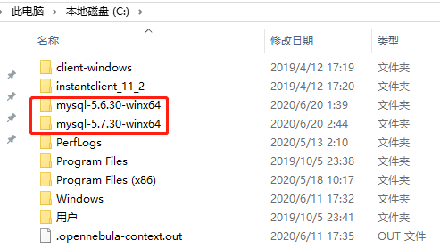											
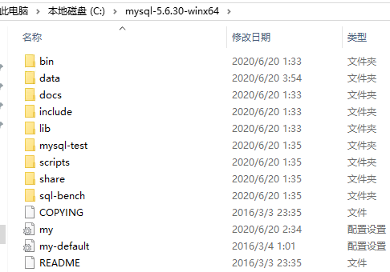											
**安装 5.6 环境**
安装很简单，最小化配置只需要把 my-default 参数中示例的几个参数前的注释符号去掉，并配置上相应的值，就可以启动了，当然，如果是生产环境，肯定会自定义一堆参数，此处略过。
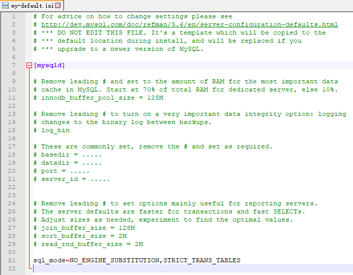											
改完后如下，然后就可以用这个参数文件去初始化实例了： 
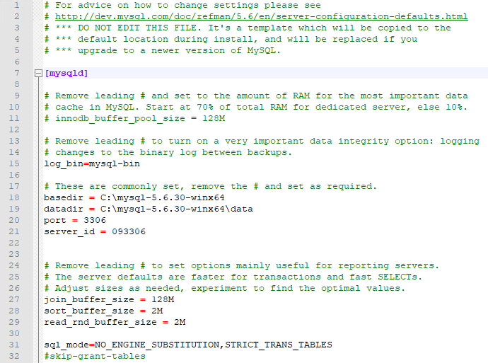											
初始化实例后，再启动实例，接着创建并配置 Windows 服务，以后就可以通过启停服务对 MySQL 实例进行管理。
**升级 5.6 至 5.7**
这里不讨论详细的升级步骤，与安装实例其实差不多，主要说一下升级时要注意的点（本次测试采用 IN-PLACE 方式）。- 首次安装完 5.7（zip 方式）后，出于安全性考虑，需要设置 skip-grant-tables 进入实例，修改 root 密码，删除空账号（先执行 flush privileges;）。
- 服务的创建、删除都要用管理员身份运行 cmd 后再执行执行，示例：mysqld install mysql5630 / mysqld remove mysql5630。
- 如果启动实例是用 mysqld &#8211;console 执行的，会在屏幕输出实例启动的一些 error 日志，一旦退出这个窗口，实例就会终止（因此，建议仅在首次测试实例能否正常启动时使用）。
- 5.7 的 zip 包解压后没有 data 目录和 my.ini 配置文件，可以将 5.6 中的 data 目录和 my.ini 拷贝过来（拷 data 前要停实例），如果本来就已经指定在 basedir 之外的地方，也可以直接用，然后修改 5.7 配置文件的 datadir 与原来 5.6 的位置一致。
- 如果 5.6 是 zip 安装，5.7 也是 zip 安装，并且 5.7 解压到 5.6 的目录之外，建议修改环境变量后先执行 mysql -V，检查其是否被正确地配置了（官方推荐解压到同一个目录中，这样可以不用修改环境变量）。
- 尽量不要使用旧版的 my.cnf，并且用 mysqld &#8211;print-defaults 检查默认参数。
- 升级到 5.7 后，当执行 mysqld install mysql5730 时（添加 5.7 实例的服务），如果报找不到 dll 动态库链接文件 MSVCR120.dll、MSVCP120.dll，则需要下载并安装相应版本的的 Visual C++ 程序）。 
> **参考链接：**
https://www.groovypost.com/howto/fix-visual-c-plus-plus-redistributable-windows-10/
https://answers.microsoft.com/en-us/windows/forum/windows_7-performance/missing-msvcp120dll-file/f0a14d55-73f0-4a21-879e-1cbacf05e906
各个 dll 文件对应的 Visual C++ 版本：
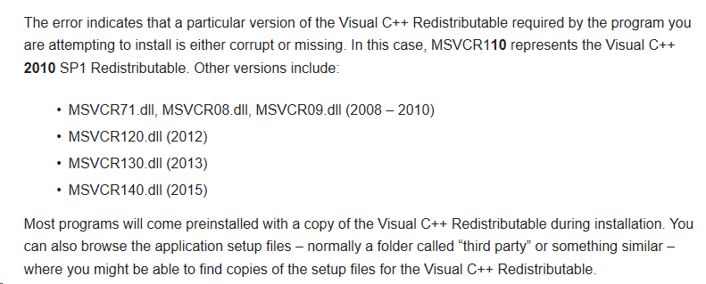											
安装完以后，可以查看 dll 动态库链接文件与对应 Visual C++ 版本之间的关系： 
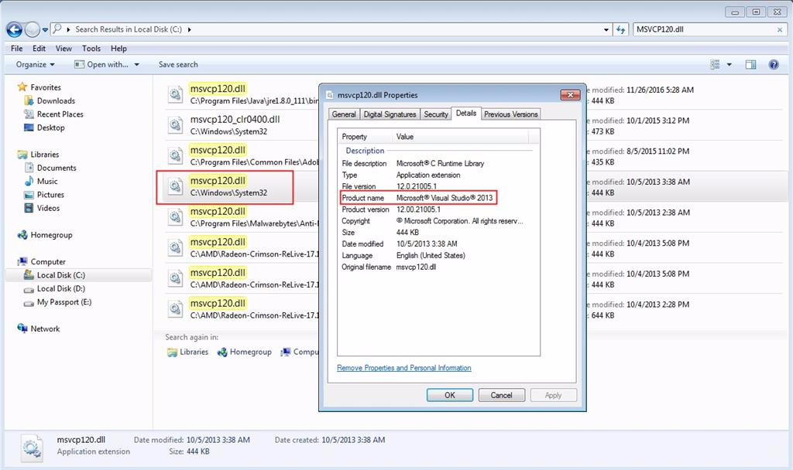											
我的环境中要正常运行 5.7.30 实例，需要安装 Visual C++ 2012、Visual C++ 2013，之后就可以正常创建服务。
**升级排错案例**
安装完 5.7.30 实例后，创建并启动 windows 服务： 
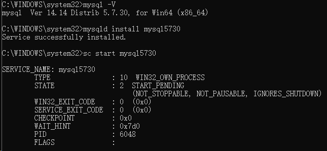											
通过 SC 启动服务后却立即停止了：
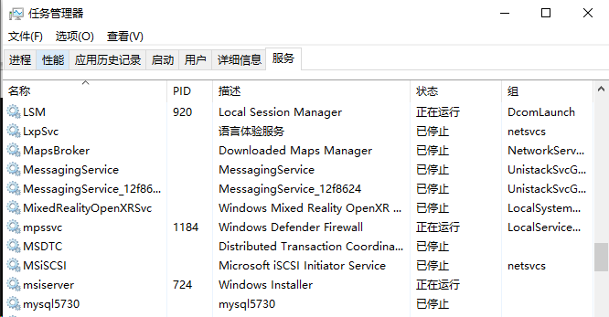											
用 NET 命令也无法启动，error 日志也没有输出：
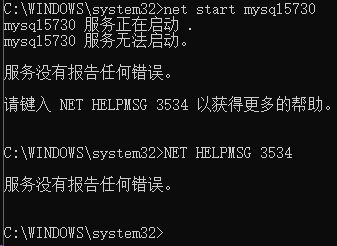											
尝试删除服务再重新添加：
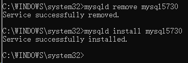											
此时服务还没有被创建：
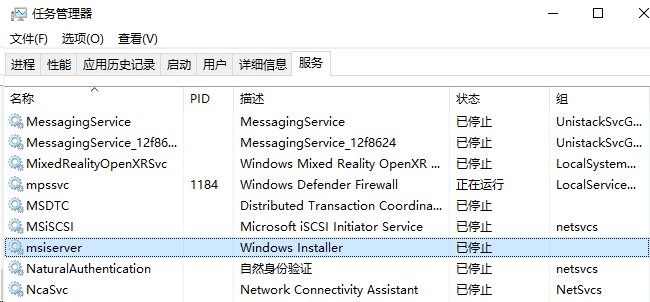											
通过 SC 再次启动后，服务有了，但仍然是已停止状态：
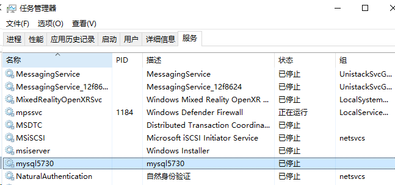											
再次删除服务后直接启动 mysqld，在登录客户端后发现了端倪，原来是用 5.6.30 的 mysqld 命令启动了：
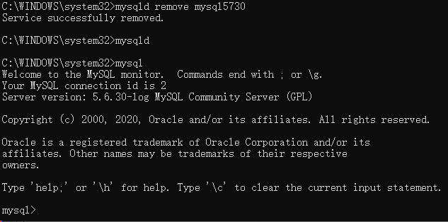											
立即检查 my.ini 参数，发现参数中果然是用了 5.6.30 的路径：
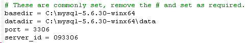											
停止进程，修改参数并重新启动 5.7.30 进程和服务：
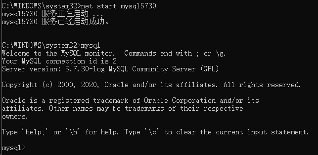											
msyql5730 服务恢复正常，不会再自动停止了：
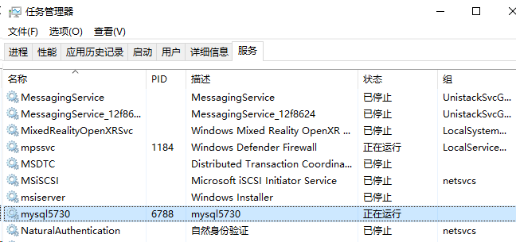											
服务端（mysqld）和客户端（mysql）进程也运行正常：
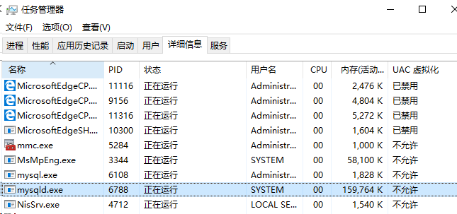											
检查数据库（注意，此时仍然是没有 sys 库的，因为是把 5.6 的 data 目录直接拿来启动实例的）：
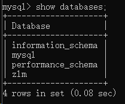											
执行 mysql_upgrade，重建系统库：
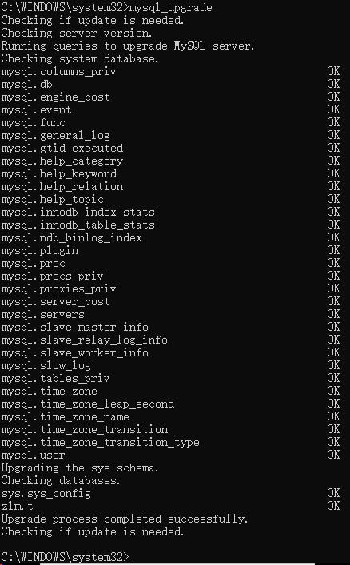											
至此，完成 5.6.30 to 5.7.30 的升级（是不是 so easy？）。
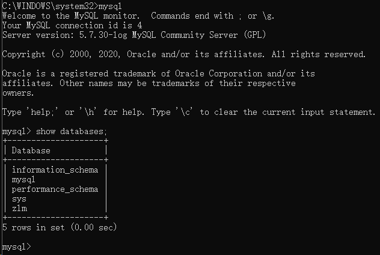											
要注意，执行完 mysql_upgrade 后需要重启实例，否则会报以下错误：
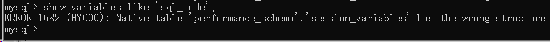											
重启实例后，可以正常使用了：
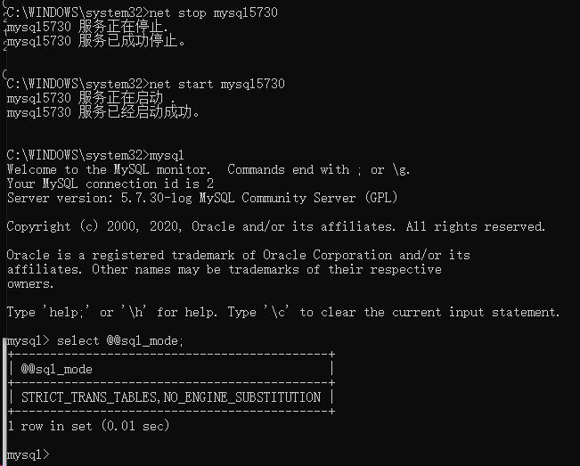											
**一个有趣的登陆测试**
- 配置了 3 个 root 账号，来源分别为 ::1，127.0.0.1&#8217;，localhost。
- 在账号密码都不输入的情况下，Windows 默认会用 ODBC@localhost 这个用户连接。
- 在加上 -uroot 后，会优先使用 root@&#8217;::1&#8242; 这个账号来连接，用户仍然使用的是 root@localhost。
- 把 root@&#8217;::1&#8242; 账号删除后，会使用 root@localhost 的账号连接。
- 把 root@localhost 账号也删除后，默认不会使用 root@127.0.0.1 的账号连接，除非指定了 -h127.0.0.1。
- 在 Windows 中，无论是 ::1、localhost 还是 127.0.0.1，哪怕是使用 -S 进行连接，也都是 TCP/IP 连接。
- 
- 
- 
- 
- 
- 
- 
- 
- 
- 
- 
- 
- 
- 
- 
`mysql> select user,host from mysql.user;``+---------------+-------------+``| user | host |``+---------------+-------------+``| root | 10.186.64.% |``| root | 127.0.0.1 |``| root | ::1 |``| mysql.session | localhost |``| mysql.sys | localhost |``| root | localhost |``+---------------+-------------+``6 rows in set (0.00 sec)``
``mysql> exit``Bye`- 
- 
- 
- 
- 
- 
- 
- 
- 
- 
- 
- 
- 
- 
- 
- 
- 
- 
- 
- 
- 
- 
- 
- 
- 
- 
- 
- 
- 
- 
- 
- 
- 
```
C:\Users\Administrator>mysql`ERROR 1045 (28000): Access denied for user 'ODBC'@'localhost' (using password: NO)``
``C:\Users\Administrator>mysql -uroot``ERROR 1045 (28000): Access denied for user 'root'@'localhost' (using password: NO)``
``C:\Users\Administrator>mysql -uroot -p``Enter password: ********``Welcome to the MySQL monitor. Commands end with ; or \g.``Your MySQL connection id is 7``Server version: 5.7.30-log MySQL Community Server (GPL)``
``Copyright (c) 2000, 2020, Oracle and/or its affiliates. All rights reserved.``
``Oracle is a registered trademark of Oracle Corporation and/or its``affiliates. Other names may be trademarks of their respective``owners.``
``Type 'help;' or '\h' for help. Type '\c' to clear the current input statement.``
``mysql> select current_user(),user();``+----------------+----------------+``| current_user() | user() |``+----------------+----------------+``| root@::1 | root@localhost |``+----------------+----------------+``1 row in set (0.00 sec)``
``mysql> drop user root@'::1';``Query OK, 0 rows affected (0.06 sec)``
``mysql> exit``Bye
```
- 
- 
- 
- 
- 
- 
- 
- 
- 
- 
- 
- 
- 
- 
- 
- 
- 
- 
- 
- 
- 
- 
- 
- 
- 
- 
- 
```
C:\Users\Administrator>mysql -uroot -p``Enter password: ********``Welcome to the MySQL monitor. Commands end with ; or \g.``Your MySQL connection id is 8``Server version: 5.7.30-log MySQL Community Server (GPL)``
``Copyright (c) 2000, 2020, Oracle and/or its affiliates. All rights reserved.``
``Oracle is a registered trademark of Oracle Corporation and/or its``affiliates. Other names may be trademarks of their respective``owners.``
``Type 'help;' or '\h' for help. Type '\c' to clear the current input statement.``
``mysql> select current_user(),user();``+----------------+----------------+``| current_user() | user() |``+----------------+----------------+``| root@localhost | root@localhost |``+----------------+----------------+``1 row in set (0.02 sec)``
``mysql> drop user root@localhost;``Query OK, 0 rows affected (0.03 sec)``
``mysql> exit``Bye
```
- 
- 
- 
- 
- 
- 
- 
- 
- 
- 
- 
- 
- 
- 
- 
- 
- 
- 
- 
- 
- 
- 
- 
- 
- 
- 
- 
- 
- 
- 
- 
- 
- 
- 
- 
- 
- 
- 
- 
- 
- 
- 
- 
- 
- 
- 
- 
- 
- 
- 
- 
- 
- 
- 
- 
- 
- 
- 
```
C:\Users\Administrator>mysql -uroot -p``Enter password: ********``ERROR 1045 (28000): Access denied for user 'root'@'localhost' (using password: YES)``
``C:\Users\Administrator>mysql -uroot -p -h127.0.0.1``Enter password: ********``Welcome to the MySQL monitor. Commands end with ; or \g.``Your MySQL connection id is 10``Server version: 5.7.30-log MySQL Community Server (GPL)``
``Copyright (c) 2000, 2020, Oracle and/or its affiliates. All rights reserved.``
``Oracle is a registered trademark of Oracle Corporation and/or its``affiliates. Other names may be trademarks of their respective``owners.``
``Type 'help;' or '\h' for help. Type '\c' to clear the current input statement.``
``mysql> select current_user(),user();``+----------------+----------------+``| current_user() | user() |``+----------------+----------------+``| root@127.0.0.1 | root@localhost |``+----------------+----------------+``1 row in set (0.00 sec)``
``mysql> \s``--------------``mysql Ver 14.14 Distrib 5.7.30, for Win64 (x86_64)``
``Connection id: 10``Current database:``Current user: root@localhost``SSL: Cipher in use is ECDHE-RSA-AES128-GCM-SHA256``Using delimiter: ;``Server version: 5.7.30-log MySQL Community Server (GPL)``Protocol version: 10``Connection: 127.0.0.1 via TCP/IP``Server characterset: latin1``Db characterset: latin1``Client characterset: gbk``Conn. characterset: gbk``TCP port: 3306``Uptime: 6 hours 41 min 40 sec``
``Threads: 1 Questions: 26 Slow queries: 0 Opens: 123 Flush tables: 1 Open tables: 116 Queries per second avg: 0.001``--------------``
``mysql> show variables like 'socket';``+-----------------------------------------+-------+``| Variable_name | Value |``+-----------------------------------------+-------+``| socket | MySQL |``+-----------------------------------------+-------+``3 rows in set, 1 warning (0.01 sec)``
``mysql> exit``Bye
```
- 
- 
- 
- 
- 
- 
- 
- 
- 
- 
- 
- 
- 
- 
- 
- 
- 
- 
- 
- 
- 
- 
- 
- 
- 
- 
- 
- 
- 
- 
- 
- 
- 
- 
- 
- 
```
C:\Users\Administrator>mysql -uroot -p -S MySQL``
``Enter password: ********``Welcome to the MySQL monitor. Commands end with ; or \g.``Your MySQL connection id is 16``Server version: 5.7.30-log MySQL Community Server (GPL)``
``Copyright (c) 2000, 2020, Oracle and/or its affiliates. All rights reserved.``
``Oracle is a registered trademark of Oracle Corporation and/or its``affiliates. Other names may be trademarks of their respective``owners.``
``Type 'help;' or '\h' for help. Type '\c' to clear the current input statement.``
``mysql> \s``--------------``mysql Ver 14.14 Distrib 5.7.30, for Win64 (x86_64)``
``Connection id: 16``Current database:``Current user: root@localhost``SSL: Cipher in use is ECDHE-RSA-AES128-GCM-SHA256``Using delimiter: ;``Server version: 5.7.30-log MySQL Community Server (GPL)``Protocol version: 10``Connection: localhost via TCP/IP``Server characterset: latin1``Db characterset: latin1``Client characterset: gbk``Conn. characterset: gbk``TCP port: 3306``Uptime: 7 hours 6 min 23 sec``
``Threads: 1 Questions: 63 Slow queries: 0 Opens: 137 Flush tables: 1 Open tables: 130 Queries per second avg: 0.002`--------------
```
**升级步骤汇总**
最后，再把升级的各个步骤罗列一遍：1. 下载 5.7.30 的 zip 包并解压到新的目录。 2. 安装 Visual C++ 2012/2013（或更多版本）。 3. 停应用，停止 5.6 实例（可以通过停服务来操作，停止服务前建议记录一下 GTID 或 binlog file 和 position 位置），删除服务。 4. 备份一份 5.6 实例的 datadir，包括 binlog（整个目录 copy 到别的目录存放）。 5. 拷贝 5.6 实例的 datadir 和 my.ini 到 5.7 实例 basedir 目录，调整并优化参数值（注意要确保路径一致，确认已开启 5.7 新特性相关参数，如增强半同步、MTS 等）。 6. 修改系统环境变量，把可执行路径指向 5.7 实例的 basedir/bin。 7. 启动 5.7 实例，创建服务并启动。 8. 验证服务端、客户端版本是否正确。 9. 确认无误后，执行 mysql_upgrade 升级数据字典（会升级系统库：mysql，ps，sys，没有会重建）。 10. 重启实例。 11. 再次校验 5.7 的参数，尽量保持与 5.6 的兼容，尤其要注意 sql_mode 的默认值对业务的影响。 12. 清理 5.6 实例的 basedir 和 datadir 目录（可选）。 13. 如果是主从环境，还要考虑 slave_net_timeout 参数默认值改变带来的影响（主库 error 日志中出现 “ER_RPL_ZOMBIE_ENCOUNTERED” 的报错）。在 5.7.7 以前，该参数默认是 3600s，之后改为了 60s，需要重新执行 change master to 语句，并且显式指定 master_heartbeat_period=xx，因为从 5.7.4 开始，只有执行 reset slave 才能将其重置为默认值（slave_net_timeout 值的一半）。另外提一句，也是从 5.7.4 开始，执行 change master to 语句时，可以不用先停止复制线程了。 > **参考链接：**
https://dev.mysql.com/doc/refman/5.7/en/change-master-to.html
https://dev.mysql.com/doc/refman/5.7/en/upgrading-from-previous-series.html
https://dev.mysql.com/doc/refman/5.7/en/replication-options-slave.html#sysvar_slave_net_timeout
**总结**
本文主要阐述了如何优雅地通过 ZIP&IN-PLACE 方式在 Windows 服务器上将 MySQL 5.6 实例升级到 5.7。对 MySQL 官方提供的一些升级方式和相关限制做了说明。通过一个实际的升级案例来展示如何在升级过程中排查错误。演示了一个关于账号登陆的小测试，要注意区分账号的来源部分、current_user()，user() 之间的差别，前者是 mysql.user 表中创建的账号，后者是当前操作系统的登录用户。最后对整个升级步骤做了总结，罗列了一些升级时的注意点。> **参考链接：** 
https://dev.mysql.com/doc/refman/5.7/en/windows-installation.html
https://dev.mysql.com/doc/refman/5.7/en/windows-upgrading.html