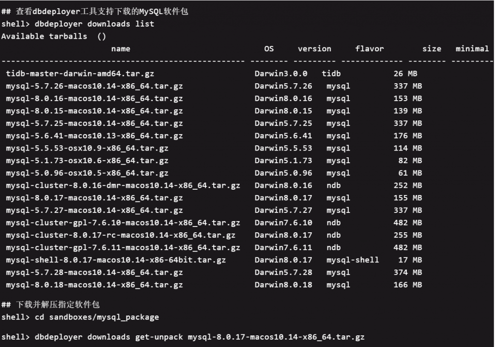

# 技术分享 | 如何使用 dbdeployer 快速搭建 MySQL 测试环境

**原文链接**: https://opensource.actionsky.com/20191127-mysql/
**分类**: MySQL 新特性
**发布时间**: 2019-11-27T02:12:25-08:00

---

#### 一、工具介绍
> dbdeployer 是一款十分强大的数据库测试环境部署工具，可实现一键部署不同架构、不同版本的数据库环境。
如：MySQL 主从复制、GTID 模式复制、MySQL 组复制（单主模式、多主模式等）完整的数据库类型支持及版本，可在安装完 dbdeployer 后使用 dbdeployer admin capabilities 命令进行查看，以下是当前已支持数据库及组件类型
- Oracle MySQL
- Percona MySQL
- MariaDB
- TiDB
- MySQL NDB Cluster
- Percona XtraDB Cluster
- mysql-shell
本文主要介绍基于 dbdeployer 工具快速搭建 MySQL 测试环境以及 dbdeployer 的基础使用。完整的功能特性以及使用方式可查看 dbdeployer 文档手册，dbdeployer 的文档手册十分详细的介绍了该工具特性及各类使用方式，可查看文末的相关链接。
#### 二、工具安装
本文以 MacOS 下部署为例，Linux 平台安装部署方式基本类似（该工具不提供 Windows 版本），可访问
https://github.com/datacharmer/dbdeploer/releases
获取最新版 dbdeployer 下载链接，以下内容中 shell> 表示命令行提示符
## 下载当前最新版软件包
shell> wget https://github.com/datacharmer/dbdeployer/releases/download/v1.42.0/dbdeployer-1.42.0.osx.tar.gz
## 软件解压后实际只有一个单独的编译好的可执行文件
shell> tar xzvf dbdeployer-1.42.0.osx.tar.gz
## 将解压的软件拷贝至系统可执行目录下方便使用
shell> chmod +x dbdeployer-1.42.0.osx
shell> mv dbdeployer-1.42.0.osx /usr/local/bin/dbdeployer
## 验证是否安装成功
shell> dbdeployer --version
shell> dbdeployer --help
#### 三、工具配置
该软件默认使用当前用户的 作为配置文件。该文件默认未生成，可使用命令导出一份并进行修改。以下我只修改配置文件中的参数，将该目录指定为自定义的HOME/sandboxes/mysql_base
## 创建 MySQL 软件包及解压后的软件目录
shell> mkdir -p ~/sandboxes/{mysql_package,mysql_base}
## 将默认配置中 sandbox-binary 参数修改为已创建的目录路径
## 该部分也可使用 dbdeployer defaults export /Users/yuzhenxing/.dbdeployer/config.json 先将配置文件导出，再 vim 手工编辑修改
shell> dbdeployer defaults update sandbox-binary $HOME/sandboxes/mysql_base
## 查看已修改的配置信息
## 配置中包含各类 MySQL 的初始化信息，可根据实际情况灵活调整
shell> dbdeployer defaults show
# Configuration file: /Users/yuzhenxing/.dbdeployer/config.json
{
"version": "1.39.0",
"sandbox-home": "$HOME/sandboxes",
"sandbox-binary": "$HOME/sandboxes/mysql_base",
"use-sandbox-catalog": true,
"log-sb-operations": false,
"log-directory": "/Users/yuzhenxing/sandboxes/logs",
"cookbook-directory": "recipes",
"shell-path": "/bin/bash",
"master-slave-base-port": 11000,
"group-replication-base-port": 12000,
"group-replication-sp-base-port": 13000,
"fan-in-replication-base-port": 14000,
"all-masters-replication-base-port": 15000,
"multiple-base-port": 16000,
"pxc-base-port": 18000,
"ndb-base-port": 19000,
"ndb-cluster-port": 20000,
"group-port-delta": 125,
"mysqlx-port-delta": 10000,
"admin-port-delta": 11000,
"master-name": "master",
"master-abbr": "m",
"node-prefix": "node",
"slave-prefix": "slave",
"slave-abbr": "s",
"sandbox-prefix": "msb_",
"imported-sandbox-prefix": "imp_msb_",
"master-slave-prefix": "rsandbox_",
"group-prefix": "group_msb_",
"group-sp-prefix": "group_sp_msb_",
"multiple-prefix": "multi_msb_",
"fan-in-prefix": "fan_in_msb_",
"all-masters-prefix": "all_masters_msb_",
"reserved-ports": [
1186,
3306,
33060,
33062
],
"remote-repository": "https://raw.githubusercontent.com/datacharmer/mysql-docker-minimal/master/dbdata",
"remote-index-file": "available.json",
"remote-completion-url": "https://raw.githubusercontent.com/datacharmer/dbdeployer/master/docs/dbdeployer_completion.sh",
"remote-tarball-url": "https://raw.githubusercontent.com/datacharmer/dbdeployer/master/downloads/tarball_list.json",
"pxc-prefix": "pxc_msb_",
"ndb-prefix": "ndb_msb_",
"timestamp": "Thu Nov 21 15:58:56 CST 2019"
}
#### 四、基本使用
在使用之前我们需要先下载好对应操作系统的 MySQL 软件包，dbdeployer 软件提供了下载 MySQL 软件的管理命令，我们可通过 dbdeployer 工具下载，也可自行下载 MySQL 软件包，我们将下载的软件放置在之前已创建好的 ~/sandboxes/mysql_package 目录下。以下以 MacOS 系统为例，Linux 类似。
##### 1. 使用 dbdeployer 下载 MySQL

##### 2.自行下载 MySQL
访问 https://downloads.mysql.com/archives/community/ 可下载各不同版本的 MySQL
## 下载并解压MySQL软件包
shell> cd sandboxes/mysql_package
shell> wget https://downloads.mysql.com/archives/get/file/mysql-8.0.17-macos10.14-x86_64.tar.gz
shell> dbdeployer unpack mysql-8.0.17-macos10.14-x86_64.tar.gz
##### 3.快速部署实例
以下示例简单使用几条命令实现各种不同架构的 MySQL 部署，详细使用方式可查看文末 dbdeployer 文档链接。
## 部署一个单节点的MySQL，开启GTID并指定字符集
## GTID和字符等参数也可在部署完成后在MySQL配置文件中指定
## 注意：部署的数据库默认自动运行，可以指定 --skip-start参数只初始化但不启动
shell> dbdeployer deploy single 8.0.17 --gtid --my-cnf-options="character_set_server=utf8mb4"
## 部署一个主从复制MySQL(默认初始化3个节点，一主两从)
shell> dbdeployer deploy replication 8.0.17 --repl-crash-safe --gtid --my-cnf-options="character_set_server=utf8mb4"
## 部署一个单主模式的MGR(默认初始化3个节点)
shell> dbdeployer deploy --topology=group replication 8.0.17 --single-primary
## 部署一个多主模式的MGR(默认初始化3个节点)
shell> dbdeployer deploy --topology=all-masters replication 8.0.17
##### 4.实例组操作
一键部署完成后会在 $HOME/sandboxes 目录下生成各实例组对应的数据目录，该目录包含以下信息(部分信息)
- 一键启停该组所有实例的脚本
- 一键登录数据库脚本
- 一键重置该组所有实例的脚本（清除所有测试数据并重新初始化成全新的主从）
- 主从实例的数据目录（主库为 master，从库分别为 node1、node2 依次递增）
各实例的配置文件
默认用户授权命令
单独启停实例命令
binlog、relaylog 解析命令
##### 使用示例
## 查看该组所有实例状态
shell> cd ~/sandboxes/rsandbox_8_0_17
shell> ./status_all
REPLICATION  /Users/yuzhenxing/sandboxes/rsandbox_8_0_17
master : master on  -  port    20718(20718)
node1 : node1 on  -  port    20719(20719)
node2 : node2 on  -  port    20720(20720)
## 一键重启该组所有实例
shell> ./restart_all
stop /Users/yuzhenxing/sandboxes/rsandbox_8_0_17/master
stop /Users/yuzhenxing/sandboxes/rsandbox_8_0_17/node1
stop /Users/yuzhenxing/sandboxes/rsandbox_8_0_17/node2
executing 'start' on master
. sandbox server started
executing 'start' on slave 1
. sandbox server started
executing 'start' on slave 2
. sandbox server started
## 单独重启该组某一实例
shell> cd ~/sandboxes/rsandbox_8_0_17/master
shell> ./restart
## 登录指定实例
shell> ./use
#### 五、dbdeployer 常用管理命令
以下是使用 dbdeployer 过程中总结的常用命令，详细使用方式可查看文末 dbdeployer 文档链接。
## 查看 dbdeployer 支持的各类数据库版本及版本特性（输出信息过长或过多，已省略输出结果）
shell> dbdeployer admin capabilities
shell> dbdeployer admin capabilities percona
shell> dbdeployer admin capabilities mysql
## 使用 dbdeployer 查看指定版本 MySQL 的基本信息
shell> dbdeployer downloads get-by-version 5.7 --newest --dry-run
Name:          mysql-5.7.28-macos10.14-x86_64.tar.gz
Short version: 5.7
Version:       5.7.28
Flavor:        mysql
OS:            Darwin
URL:           https://dev.mysql.com/get/Downloads/MySQL-5.7/mysql-5.7.28-macos10.14-x86_64.tar.gz
Checksum:      MD5: 00c2cabb06d8573b5b52d3dd1576731e
Size:          374 MB
## 查看当前已安装的所有 MySQL 基本信息
## 包括架构类型、版本、端口等等（输出信息过长或过多，已省略输出结果）
shell> dbdeployer sandboxes --full-info
## 查看各组 MySQL 的运行情况
shell> dbdeployer global status
MULTIPLE  /Users/yuzhenxing/sandboxes/all_masters_msb_8_0_17
node1 : node1 on  -  port    23818(23818)
node2 : node2 on  -  port    23819(23819)
node3 : node3 on  -  port    23820(23820)
MULTIPLE  /Users/yuzhenxing/sandboxes/group_sp_msb_8_0_17
node1 : node1 off  -   (22718)
node2 : node2 off  -   (22719)
node3 : node3 off  -   (22720)
## 批量停止所有运行的 MySQL （输出信息过长或过多，已省略输出结果）
shell> dbdeployer global stop
## 删除已部署的 MySQL 实例
## 如正在运行则会先停止，后清除实例相关目录
shell> dbdeployer delete msb_8_0_17
## 可对实例加锁，防止误删除
## dbdeployer sandboxes --full-info 命令可查的到哪组实例已加锁
shell> dbdeployer admin lock group_sp_msb_8_0_17
shell> dbdeployer delete group_sp_msb_8_0_17
shell> dbdeployer admin unlock group_sp_msb_8_0_17
shell> dbdeployer sandboxes --full-info
其他更多的 dbdeployer 使用和管理命令，可执行 dbdeployer 或dbdeployer &#8211;help 进行查看，更详尽的使用方式和使用示例可查看文末的 dbdeployer 官方手册链接。
#### 六、相关链接
- dbdeployer 官方手册https://github.com/datacharmer/dbdeployer
- MySQL 各历史版本下载链接https://downloads.mysql.com/archives/community/
- dbdeployer 的功能特性https://github.com/datacharmer/dbdeployer/blob/master/docs/features.md