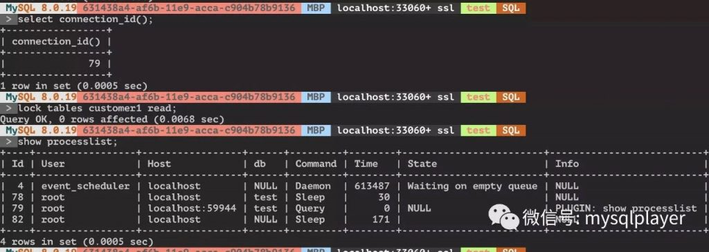
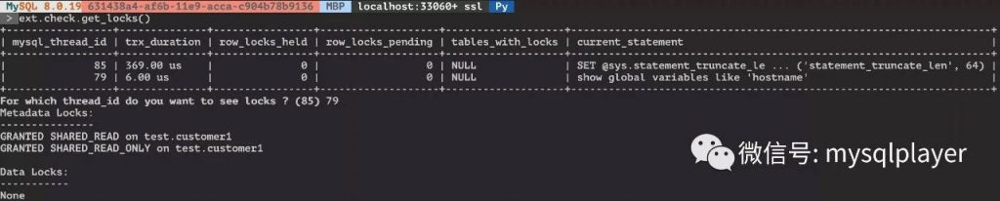
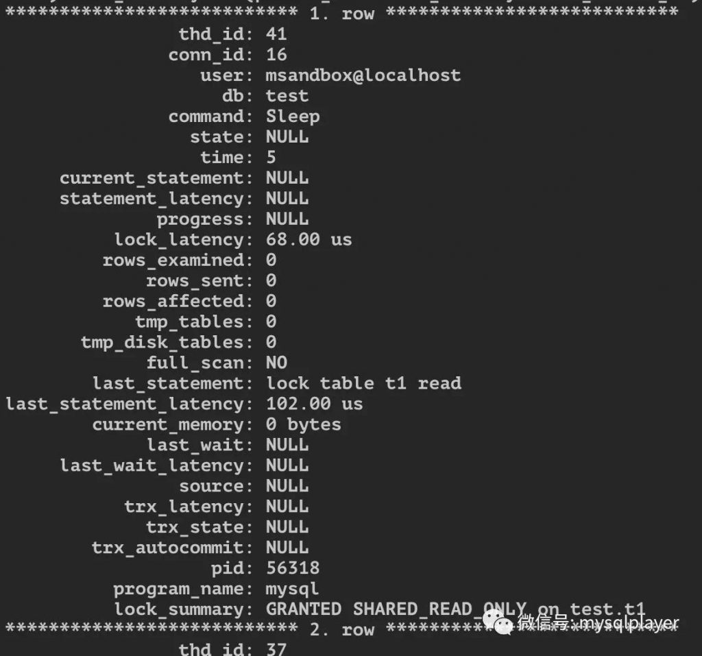

# 技术分享 | 如何方便的查看 Metadata Lock

**原文链接**: https://opensource.actionsky.com/20200618-mysql/
**分类**: MySQL 新特性
**发布时间**: 2020-06-18T00:44:23-08:00

---

作者：洪斌
爱可生南区负责人兼技术服务总监，MySQL  ACE，擅长数据库架构规划、故障诊断、性能优化分析，实践经验丰富，帮助各行业客户解决 MySQL 技术问题，为金融、运营商、互联网等行业客户提供 MySQL 整体解决方案。
本文来源：转载自公众号-玩转MySQL
*爱可生开源社区出品，原创内容未经授权不得随意使用，转载请联系小编并注明来源。
MySQL 的 Metadata Lock 机制是为了保护并发访问数据对象的一致性。DDL、表级锁、全局锁都会产生 metadata lock，写操作在锁释放前会被阻塞，而任何会话持有了 metadata lock 在 processlist 中是看不到的。
											
当发现其他会话被阻塞，就很难快速找到“罪魁祸首”。之前也曾介绍过[《快速定位令人头疼的全局锁》](https://opensource.actionsky.com/20190909-mysql/) 。
最近折腾 MySQL shell 插件时发现了一个方法，也能很方便的查询元数据锁。
在社区 MySQL shell 插件库 https://github.com/lefred/mysqlshell-plugins 的 ext.check.get_locks() 函数查看实例上锁情况。要在 MySQL 8.0 以上版本，它用到了 CTE 查询。
											
如果是 MySQL 5.7，需先开启 metadata 的 instrument。- 
```
call sys.ps_setup_enable_instrument('wait/lock/metadata/sql/mdl%')
```
执行此 SQL 查看元数据锁情况，上锁会话、SQL、锁类型能关联显示。- 
- 
- 
- 
- 
- 
- 
- 
- 
- 
- 
- 
- 
- 
- 
- 
- 
- 
- 
- 
- 
- 
- 
- 
- 
- 
- 
- 
- 
- 
```
SELECT`    ps.*,``    lock_summary.lock_summary``FROM``    sys.processlist ps``    INNER JOIN (``        SELECT``            owner_thread_id,``            GROUP_CONCAT(``                DISTINCT CONCAT(``                    mdl.LOCK_STATUS,``                    ' ',``                    mdl.lock_type,``                    ' on ',``                    IF(``                        mdl.object_type = 'USER LEVEL LOCK',``                        CONCAT(mdl.object_name, ' (user lock)'),``                        CONCAT(mdl.OBJECT_SCHEMA, '.', mdl.OBJECT_NAME)``                    )``                )``                ORDER BY``                    mdl.object_type ASC,``                    mdl.LOCK_STATUS ASC,``                    mdl.lock_type ASC SEPARATOR '\n'``            ) as lock_summary``        FROM``            performance_schema.metadata_locks mdl``        GROUP BY``            owner_thread_id`    ) lock_summary ON (ps.thd_id = lock_summary.owner_thread_id) \ G
```
