# 技术分享 | 如何根据 MySQL 崩溃日志找到已修复的 BUG 内容

**原文链接**: https://opensource.actionsky.com/20210909-mysql/
**分类**: MySQL 新特性
**发布时间**: 2021-09-09T22:05:10-08:00

---

作者：岳明强
爱可生北京分公司 DBA 团队成员，负责数据库管理平台的运维和 MySQL 问题处理。擅长对 MySQL 的故障定位。
本文来源：原创投稿
*爱可生开源社区出品，原创内容未经授权不得随意使用，转载请联系小编并注明来源。
在生产中一般发生运行问题，可以翻翻 error 日志，大部分都能解决。有的时候数据库突然宕机重启，此时我们在 error 日志中会发现&#8221;This could be because you hit a bug&#8221;，然后打了一堆看不懂的堆栈。这时候如果拿着碰到BUG的结论交差，多半会被应用一顿暴击输出：有证据没，这个 bug 怎么出现的，官方怎么修的，在什么版本修的。那么接下来，我将根据现有 error 日志报错中的堆栈信息，找到详细的 BUG 修复记录
## 一、查看当前错误日志
MySQL 异常崩溃，查看 error 日志，红框处为位置信息
注：如出现这种类似 BUG 信息，不应只看这部分信息，应先查看 MySQL 异常退出前是否存在报错信息。此处不进行演示
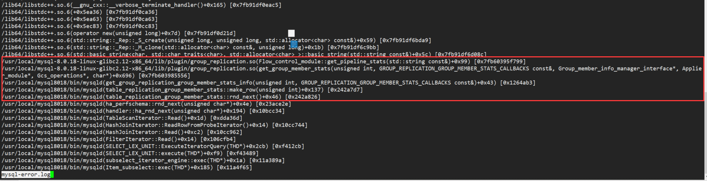
## 二、gdb 查看报错文件位置
使用 gdb 追踪报错文件位置，前面报错文件为 mysqld ,就 gdb mysqld 文件，如果是其他的文件，例如组复制插件，那么就 gdb 该文件
首先先 b 一下函数名称，如下所示：
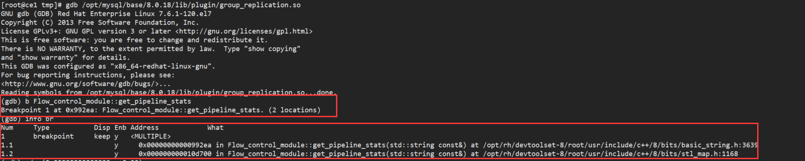
可以看出后面找到两个位置，然后我们再加上偏移量，再 b 一下：
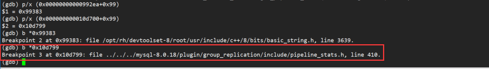
很明显，第二个找到的是 mysql 里文件，从官方上下载相同版本源码包进行解压，找过 pipeline_stats.h 这一文件中的410行，确定函数名为 Pipeline_member_stats()
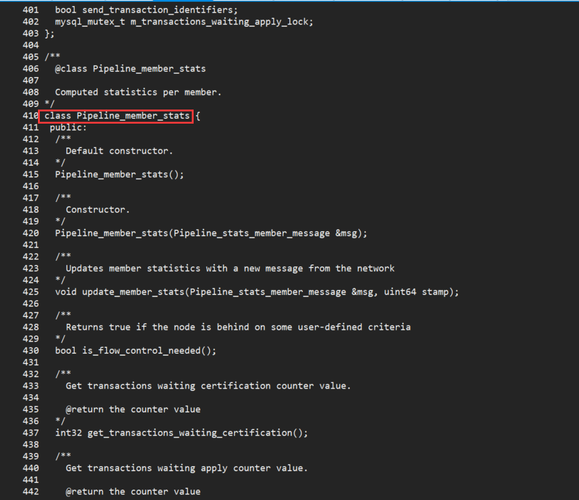
## 三、查看该函数变更内容
在 github上mysql 官方地址中找到这一文件
https://github.com/mysql/mysql-server
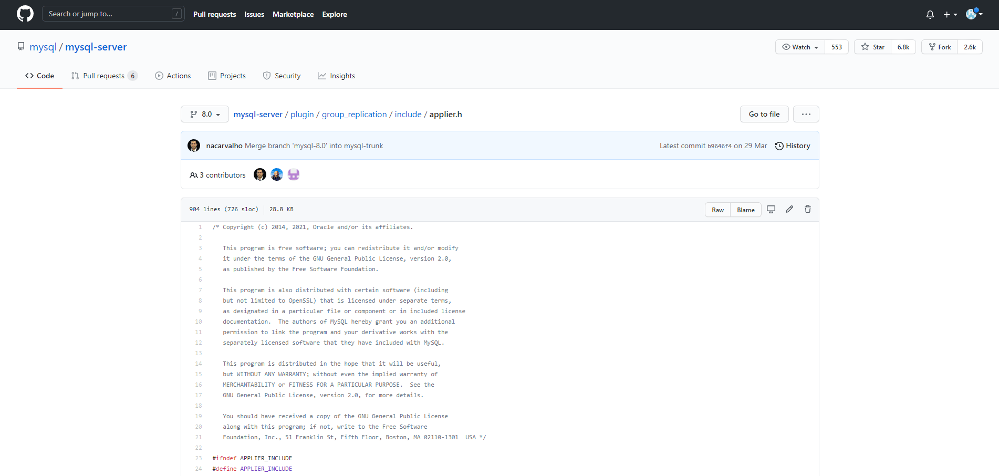
搜索相应的关键字到该位置
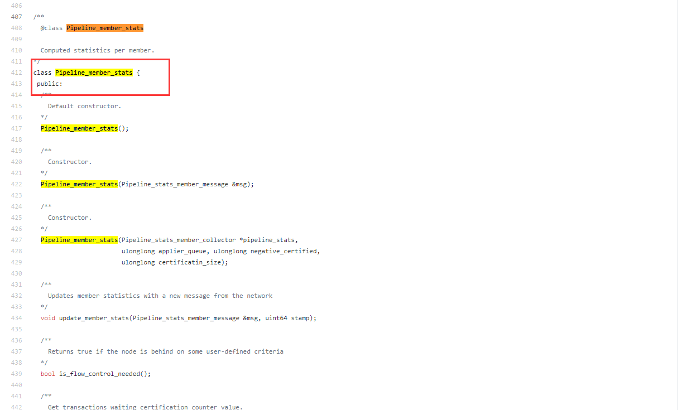
网址上默认为8.0最新版本的代码，取下来和8.0.18版本的代码进行对比
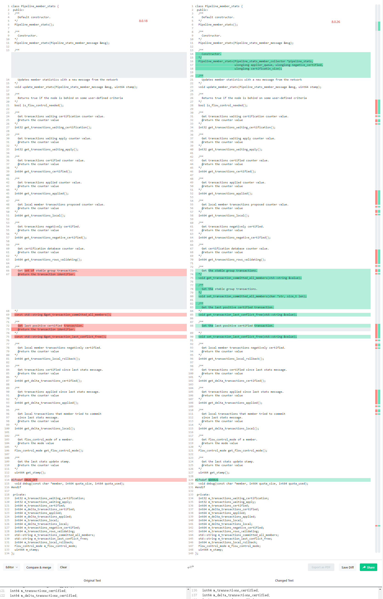
## 四、查看变更内容历史
通过对比工具，可以看出该段函数代码，存在部分的更改，接下来，再看看变更这部分代码的原因，打开左侧的 Blame ，可以看出历史的变更记录
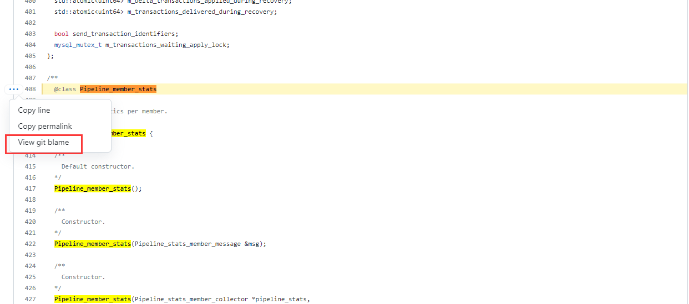
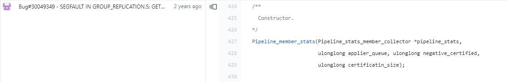
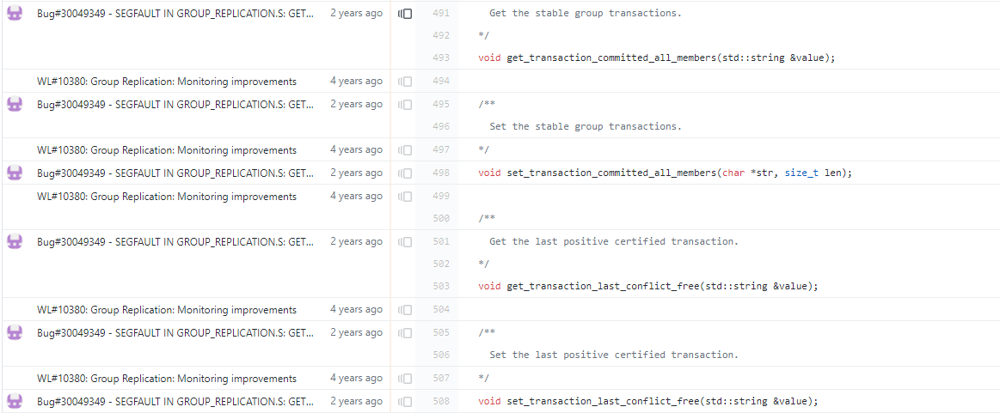
该函数内大部分的变更都是由于 Bug#30049349 引起，可以进去看看 bug 详细的内容，文章中指出 stop group_replication 时，进行P_S查看有几率造成数据库 crash，修复的方式是在 stop group_replication 的时候，给P_S中的相关表加一个读写锁，禁止查询
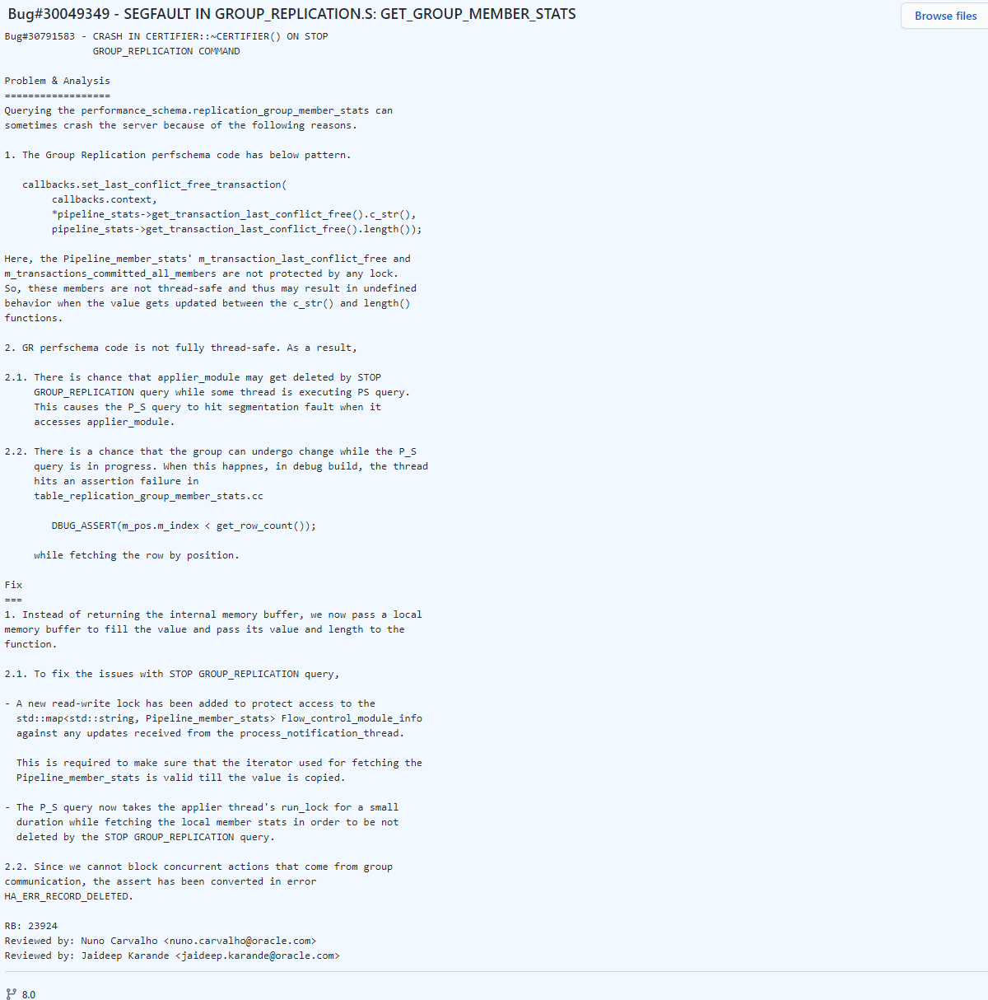
在 MySQL 官网的 Release Notes 里也能找到是在8.0.20版本修复该bug
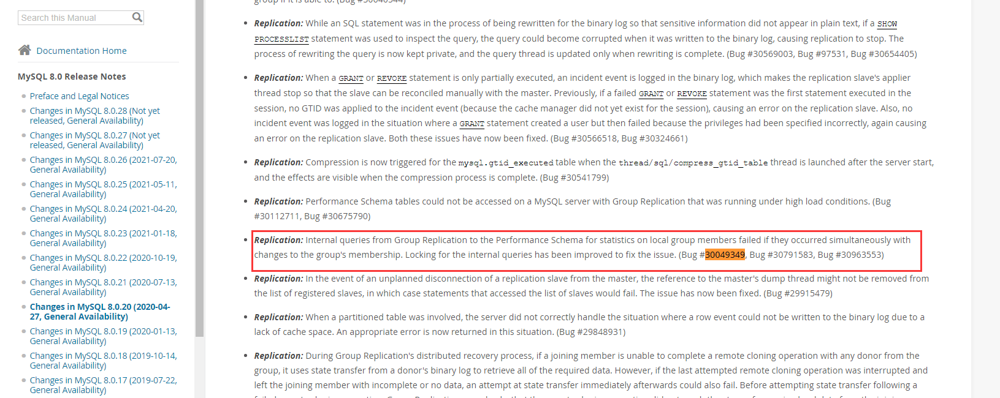
还可以从整个文件的 History 中查看历史更改
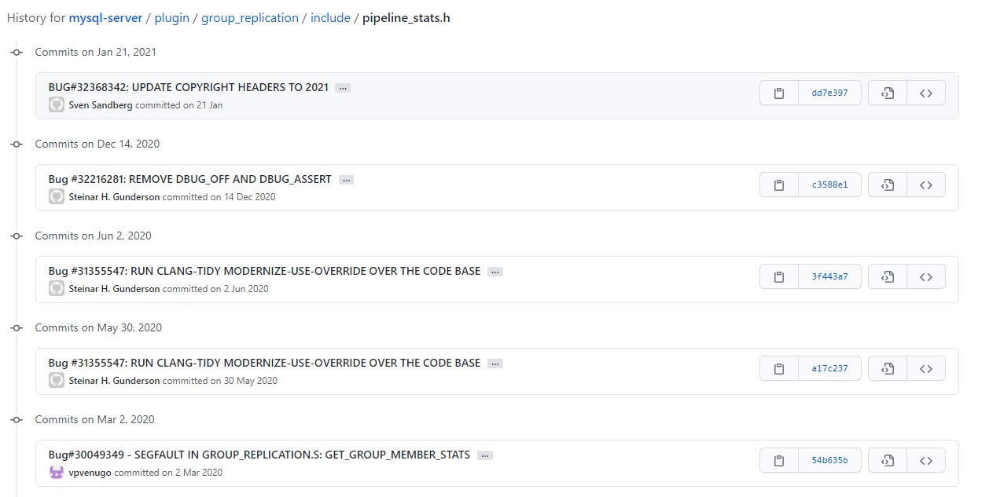
## 五、结语
文章内主要提到通过 error 日志找到当前已经修复的 bug 。碰到 error 日志中有上述报错，应该先对崩溃前的报错进行分析，部分的崩溃报错不用通过堆栈的方式定位就能找到问题。如碰到目前还未修复或者修复 bug 时并没有对该段代码进行直接修改时，可能会失效，这时候需要对堆栈指向的代码进行梳理，搞清楚这部分逻辑，再分析。