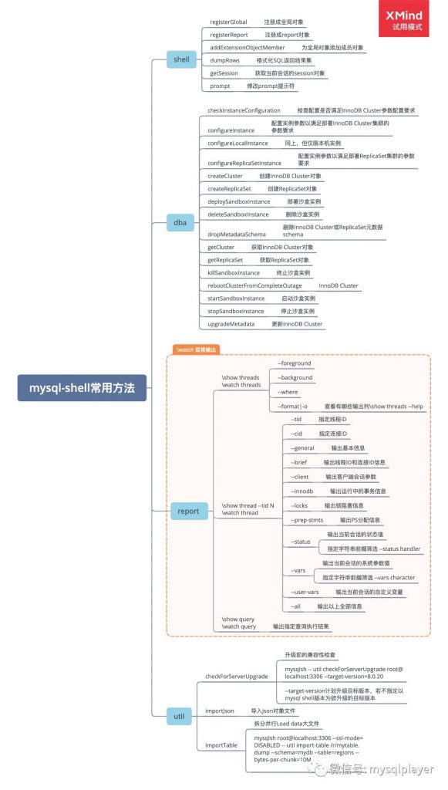
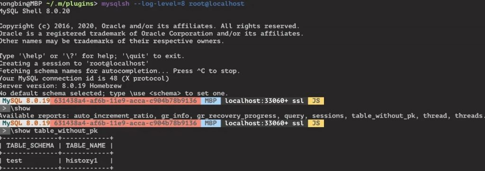
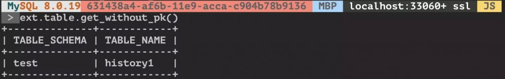
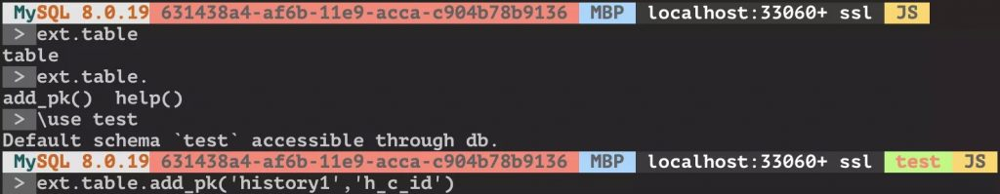

# 技术分享 | 如何编写 MySQL Shell 插件

**原文链接**: https://opensource.actionsky.com/20200528-mysql/
**分类**: MySQL 新特性
**发布时间**: 2020-05-28T00:32:46-08:00

---

作者：洪斌
爱可生南区负责人兼技术服务总监，MySQL  ACE，擅长数据库架构规划、故障诊断、性能优化分析，实践经验丰富，帮助各行业客户解决 MySQL 技术问题，为金融、运营商、互联网等行业客户提供 MySQL 整体解决方案。
本文来源：转载自公众号-玩转MySQL
*爱可生开源社区出品，原创内容未经授权不得随意使用，转载请联系小编并注明来源。
MySQL Shell 现在不只是用来部署 InnoDB cluster 和 Replica set 了，在 8.0.17 之后有了自定义扩展能力，DBA 可以用 javascript 和 python 编写扩展了，把一些常用的 SQL 脚本封装成自己的工具箱，甚至可以围绕它构建 DBA 的 DevOps 作业平台。
											
为 MySQL Shell 添加扩展并不复杂，现有两种扩展方式，一种是 report，这种主要用来做各种查询，可以使用内建的两个命令调用自定义的 report，另一种是 plugin，可以定义任意功能函数。- \show 就是普通一次性输出，已经内建了好多常用指标，参见脑图。
- \watch 类似 top 方式，持续输出信息，写些简单的监控脚本方便多了。
**自定义扩展**
将自定义的 js 或 py 脚本放在 ~/.mysqlsh/plugin 和~/.mysqlsh/init.d 目录下，建议是放在 plugin 目录下，目录可按功能类别命名，目录中必须有 init.py 或 init.js 文件用来初始化扩展，代码中可约定顶级目录名作为全局对象，二级目录作为成员对象。- `hongbin@MBP ~/.m/plugins> tree`
- `.`
- `└── ext`
- `    └── table`
- `        └── init.py`
- 
- `2 directories, 1 file`
下面是一段示例代码
- `# init.py`
- `# -------`
- `# 演示注册report和plugin两种方式`
- `# 定义一个查询函数，获取没有主键或唯一索引表`
- `def report_table_without_pk(session):`
- `    query = '''SELECT tables.table_schema , tables.table_name`
- `                FROM information_schema.tables`
- `                LEFT JOIN (`
- `                SELECT table_schema , table_name`
- `                FROM information_schema.statistics`
- `                GROUP BY table_schema, table_name, index_name HAVING`
- `                    SUM( case when non_unique = 0 and nullable != 'YES' then 1 else 0 end ) = count(*) ) puks`
- `                ON tables.table_schema = puks.table_schema and tables.table_name = puks.table_name`
- `                WHERE puks.table_name is null`
- `                AND tables.table_type = 'BASE TABLE' AND Engine="InnoDB";'''`
- `    result = session.run_sql(query)`
- `    report = []`
- `    if (result.has_data()):`
- `        report = [result.get_column_names()]`
- `        for row in result.fetch_all():`
- `            report.append(list(row))`
- `  # 注册为report，需要返回字典类型`
- `    return {"report": report}`
- 
- `# 功能同上，这里为演示以Pluginf方式重新定义函数，两者report和plugin差异主要在于输出方式`
- `def plugin_table_without_pk(session):`
- `    query = '''SELECT tables.table_schema , tables.table_name`
- `                FROM information_schema.tables`
- `                LEFT JOIN (`
- `                SELECT table_schema , table_name`
- `                FROM information_schema.statistics`
- `                GROUP BY table_schema, table_name, index_name HAVING`
- `                SUM( case when non_unique = 0 and nullable != 'YES' then 1 else 0 end ) = count(*) ) puks`
- `                ON tables.table_schema = puks.table_schema and tables.table_name = puks.table_name`
- `                WHERE puks.table_name is null`
- `                AND tables.table_type = 'BASE TABLE' AND Engine="InnoDB";'''`
- `    result = session.run_sql(query)`
- `    shell.dump_rows(result)`
- `    return`
- 
- `# 注册一个function，用来给表添加主键字段，变更类操作通常以function`
- `def _add_pk(table, columns, session=None):`
- `    query = 'ALTER TABLE %s ADD PRIMARY KEY (%s)' % (table, columns)`
- `    if session is None:`
- `        session = shell.get_session()`
- `        if session is None:`
- `            print("No session specified. Either pass a session object to this "`
- `                  "function or connect the shell to a database")`
- `            return`
- `    # session = shell.get_session()`
- `    result = session.run_sql(query)`
- 
- `# 这里注册上面定义的report函数，report名称，返回格式类型，函数名，描述`
- `shell.register_report("table_without_pk", "list", report_table_without_pk, {`
- `                      "brief": "Lists the table without primary key."})`
- 
- `# 这里定义全局对象，可以看做一个命名空间，ext是默认社区扩展插件的对象名，或者其他自定义对象名称`
- `if 'ext' in globals():`
- `    global_obj = ext`
- `else:`
- `    # Otherwise register new global object named 'ext'`
- `    global_obj = shell.create_extension_object()`
- `    shell.register_global("ext", global_obj,`
- `                          {"brief": "MySQL Shell extension plugins."})`
- 
- `# 可以按类别在全局对象下添加子对象`
- `try:`
- `    plugin_obj = global_obj.table`
- `except IndexError:`
- 
- `    plugin_obj = shell.create_extension_object()`
- `    shell.add_extension_object_member(global_obj,`
- `                                      "table",`
- `                                      plugin_obj,`
- `                                      {"brief": "Utility object for table operations."})`
- 
- `# 添加功能函数到自定义插件对象中，父级对象名，调用函数名，定义的函数，描述，函数接受的参数名/类型/是否必选/描述`
- `try:`
- `    shell.add_extension_object_member(plugin_obj,`
- `    "add_pk",`
- `    _add_pk,`
- `    {"brief":`
- `    "Add a primary key to the table",`
- `    "parameters": [`
- `        {`
- `            "name": "table",`
- `            "type": "string",`
- `            "required": True,`
- `            "brief": "table name."`
- `        },`
- `        {`
- `            "name": "columns",`
- `            "type": "string",`
- `            "required": True,`
- `            "brief": "column name."`
- `        },`
- `        {`
- `            "name": "session",`
- `            "type": "object",`
- `            "class": "Session",`
- `            "required": False,# 若不想单独传session参数，可以在函数中获取当前会话对象`
- `            "brief": "The session to be used on the operation."`
- `        }`
- `    ]`
- `    })`
- 
- `except Exception as e:`
- `    shell.log("ERROR", "Failed to register ext.table.add_pk ({0}).".format(`
- `        str(e).rstrip()))`
- 
- `# 添加plugin_table_without_pk`
- `try:`
- `    shell.add_extension_object_member(plugin_obj,`
- `    "get_without_pk",`
- `    plugin_table_without_pk,`
- `    {"brief":`
- `    "Lists the table without primary key.",`
- `    })`
- `except Exception as e:`
- `    shell.log("ERROR", "Failed to register ext.table.get_without_pk ({0}).".format(`
- `        str(e).rstrip()))`
- ``
**使用方法**
登录 mysqlsh 后自动搜索并初始化插件，指定 &#8211;log-level 参数时可记录详细调试信息到 ~/.mysqlsh/mysqlsh.log ，如果加载失败，可以查看日志分析原因。
对于 report，使用 \show 或 \watch 命令指定 report 名称输出结果。
											
对于 plugin，直接调用函数。
											
											
这里抛砖引玉简单介绍了一下 MySQL Shell 插件扩展功能，更多有趣的用法等你来发现。> **参考：**
https://dev.mysql.com/doc/mysql-shell/8.0/en/mysql-shell-plugins-examples.html
https://github.com/lefred/mysqlshell-plugins