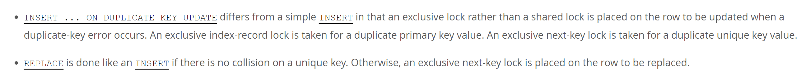
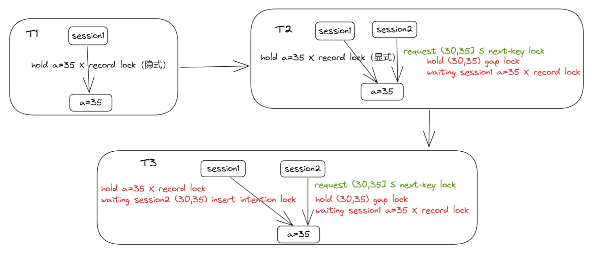
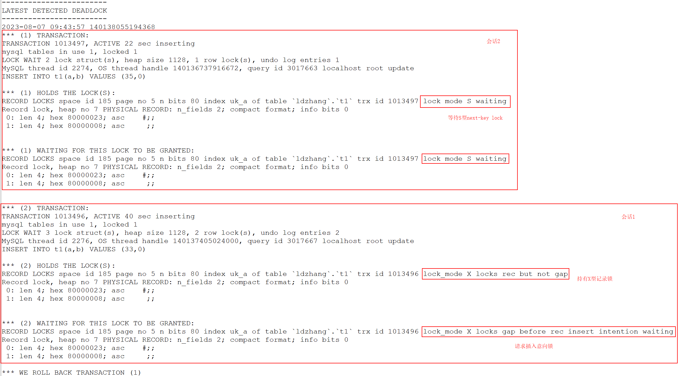
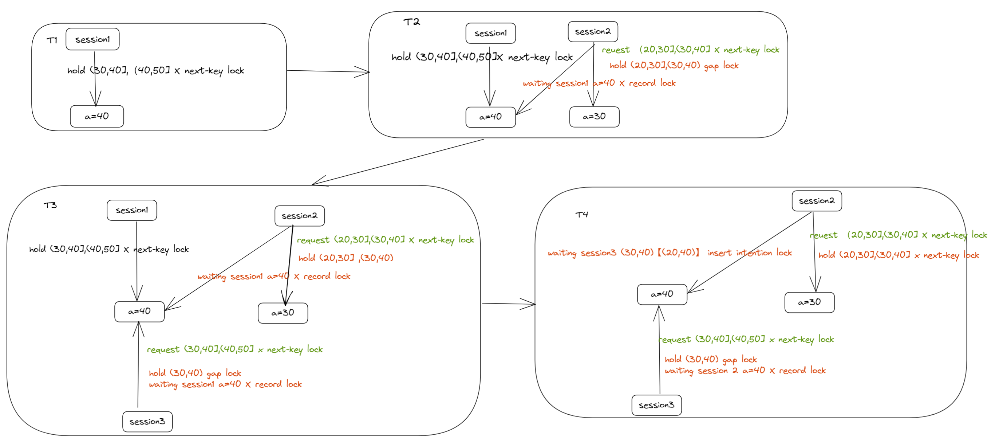
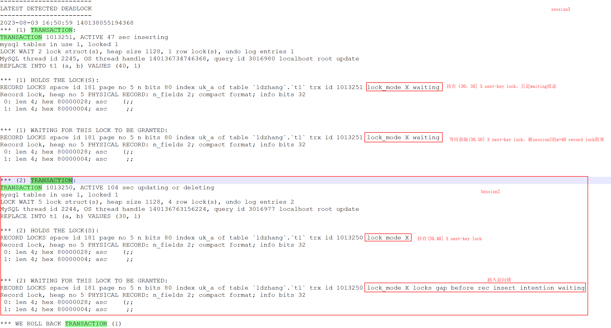
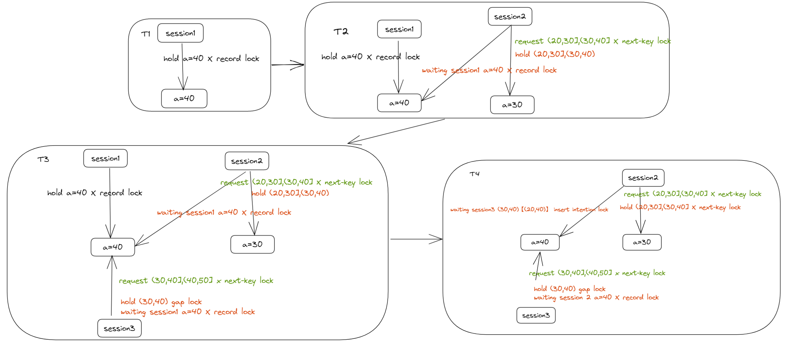
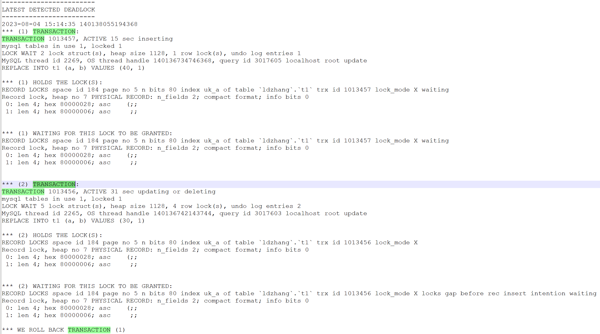
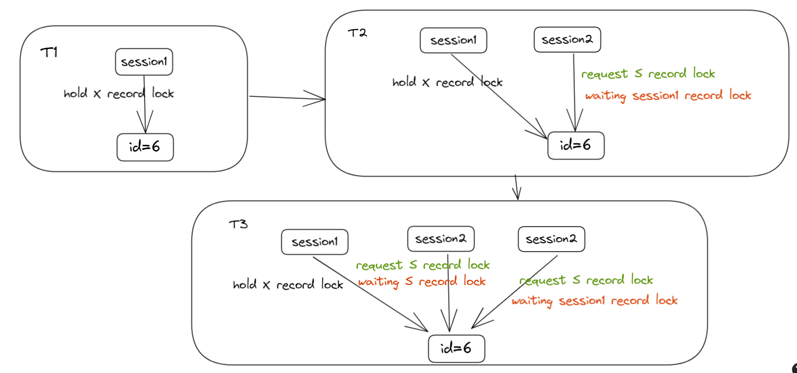
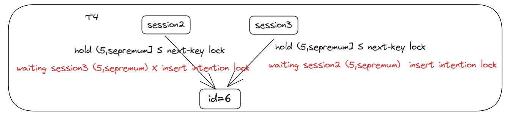
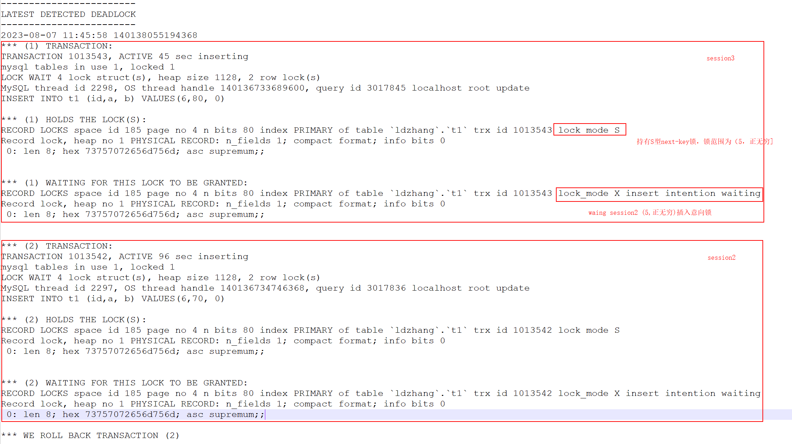

# 技术分享 | 如何避免 RC 隔离级别下的 INSERT 死锁

**原文链接**: https://opensource.actionsky.com/%e6%8a%80%e6%9c%af%e5%88%86%e4%ba%ab-%e5%a6%82%e4%bd%95%e9%81%bf%e5%85%8d-rc-%e9%9a%94%e7%a6%bb%e7%ba%a7%e5%88%ab%e4%b8%8b%e7%9a%84-insert-%e6%ad%bb%e9%94%81/
**分类**: 技术干货
**发布时间**: 2023-09-04T17:31:11-08:00

---

本文分析了 INSERT 及其变种（REPLACE/INSERT ON DUPLICATE KEY UPDATE）的几个场景的死锁及如何避免。
> 
作者：张洛丹，DBA 数据库技术爱好者~
爱可生开源社区出品，原创内容未经授权不得随意使用，转载请联系小编并注明来源。
本文共 3200 字，预计阅读需要 10 分钟。
# 说在前面
本文分析了 `INSERT` 及其变种（`REPLACE/INSERT ON DUPLICATE KEY UPDATE`）的几个场景的死锁及如何避免：
- 场景一：[INSERT 唯一键冲突](https://juejin.cn/post/7052880067298328589)
- 场景二/三：`REPLACE INTO` 唯一键冲突（来自线上业务）
- 场景四：`INSERT` 主键冲突（来自官方案例）
其实 Google 一番，也会有大量这样的文章。本文只是就几个场景进行了分析，不过一遍走下来，对 `INSERT` 加锁情况、如何导致的死锁也就掌握了，个人能力有限，如文中内容有错误和纰漏，也欢迎大佬指出。
有兴趣的就继续往下看吧~
# 回顾行锁
在此之前，先浅浅回顾一下 InnoDB 中的行锁类型。
### 记录锁（RECORD LOCK）
对索引记录加锁。
### 间隙锁（GAP LOCK，也叫范围锁）
对索引记录的所在间隙加锁，在 RR 隔离级别下，用于解决幻读的问题（实际上在 RC 隔离级别下，也会产生间隙锁）。
S 间隙锁和 X 间隙锁是兼容的，不同的事务可以在同一个间隙加锁。
### NEXT-KEY 锁
相当于 RECORD LOCK + GAP LOCK。
### 插入意向锁（INSERT INTENTION LOCK）
GAP 锁的一种，在执行 `INSERT` 前，如果待插入记录的下一条记录上被加了 GAP 锁，则 `INSERT` 语句被阻塞，且生成一个插入意向锁。
仅会被 GAP 锁阻塞。
### 隐式锁
新插入的记录，不生成锁结构，但由于事务 ID 的存在，相当于加了隐式锁；别的事务要对这条记录加锁前，先帮助其生成一个锁结构，然后再进入等待状态。
这里产生死锁的关键就是 GAP 锁。GAP 锁是在 RR 隔离级别下用于解决幻读问题，但是 RC 隔离级别下，在重复键检查和外键检查时也会用到。
再浅浅回顾一下 `INSERT` 语句加锁类型：
- 被 GAP 锁阻塞时，生成一个插入意向锁。
- 遇到重复键冲突时
主键冲突，产生 S 型记录锁（RR 和 RR 隔离级别，**实际上在 INSERT 阶段时还是会请求 GAP 锁**）。
- 唯一键冲突，产生 S 型 NEXT-KEY 锁（RR 和 RR 隔离级别）。
> 
注意：`INSERT` 语句正常执行时，不会生成锁结构。
另外，对于 `INSERT ... ON DUPLICATE KEY UPDATE` 和 `REPLACE` 稍有一些不同：
### 锁类型的不同
`INSERT ... ON DUPLICATE KEY UPDATE` 和 `REPLACE` 如果遇到重复键冲突。
- 如果是主键冲突，加 X 型记录锁（RR 和 RR 隔离级别，**实际上在 `INSERT` 阶段时还是会请求 GAP 锁**）。
- 如果是唯一键冲突，加 X 型 NEXT-KEY 锁（RR 和 RR 隔离级别）。
### 锁范围不同
- `INSERT` 和 `INSERT ... ON DUPLICATE KEY UPDATE` 在插入或 `UPDATE` 的行上加 NEXT-KEY 锁时。
- `REPLACE` 在加 NEXT-KEY 锁时，会在 `REPLACE` 的记录及其下一条记录上加 NEXT-KEY 锁。
> 
这里和官方文档描述有些不同。如下，官方仅说了会在被 `REPLACE` 的行上加 NEXT-KEY 锁，但是测试下来其下一行也会加 NEXT-KEY 锁，具体见后文的场景。

最后浅浅回顾一下死锁的产生条件以及观测手段：
### 死锁的产生条件
两个或两个以上事务，互相等待对方持有的锁，且持有对方需要的锁，从而造成循环等待。
### 死锁观测手段
`performance_schema.data_locks` 查看会话产生的锁结构信息。
> 
SELECT ENGINE_TRANSACTION_ID, OBJECT_NAME, INDEX_NAME, LOCK_TYPE, LOCK_MODE, LOCK_STATUS, LOCK_DATA FROM performance_schema.data_locks;
`show engine innodb status` 查看死锁信息。
# 正式开始
正式开始前还是要说一下基本的环境信息：
- MySQL 8.0.32
- transaction_isolation：READ-COMMITTED
### 准备数据
每个案例初始数据都是这些。
`DROP TABLE IF EXISTS t1;
CREATE TABLE t1 (
id INT NOT NULL AUTO_INCREMENT,
a INT NULL,
b INT NULL,
PRIMARY KEY (id),
UNIQUE INDEX uk_a (a ASC)
);
INSERT INTO t1 (id, a, b) VALUES (1, 10, 0);
INSERT INTO t1 (id, a, b) VALUES (2, 20, 0);
INSERT INTO t1 (id, a, b) VALUES (3, 30, 0);
INSERT INTO t1 (id, a, b) VALUES (4, 40, 0);
INSERT INTO t1 (id, a, b) VALUES (5, 50, 0);
`
## 场景一
| 时刻 | session1 | session2 |
| --- | --- | --- |
| T1 | BEGIN;INSERT INTO t1(a,b) VALUES (35,0); |  |
| T2 |  | BEGIN;INSERT INTO t1(a,b) VALUES (35,0); &#8211;被阻塞 |
| T3 | INSERT INTO t1(a,b) VALUES (33,0) |  |
| T4 |  | DEADLOCK |
不同时刻持有锁状态如下：
> 
说明：示意图中仅画出我们分析的唯一索引上的锁，实际上在对唯一索引加上锁后，还会对对应的聚簇索引加记录锁，对主键索引但这里不去体现了，下文同。

### 过程解说
##### T1 时刻
session1 插入记录成功，此时对应的索引记录被隐式锁保护，未生成锁结构。
##### T2 时刻
session2 插入记录检测到插入值和 session1 唯一键冲突。
- session2 帮助 session1 对 a=35 的记录产生了一个显式的锁结构。
- session2 自身产生 S 型的 NEXT-KEY LOCK，请求范围为 (30,35]，但是其只能获取到 (30,35) 的 GAP LOCK，而被 session1 的 a=35 的记录锁阻塞。
`mysql> SELECT ENGINE_TRANSACTION_ID, OBJECT_NAME, INDEX_NAME, LOCK_TYPE, LOCK_MODE, LOCK_STATUS, LOCK_DATA FROM performance_schema.data_locks;
+-----------------------+-------------+------------+-----------+---------------+-------------+-----------+
| ENGINE_TRANSACTION_ID | OBJECT_NAME | INDEX_NAME | LOCK_TYPE | LOCK_MODE     | LOCK_STATUS | LOCK_DATA |
+-----------------------+-------------+------------+-----------+---------------+-------------+-----------+
|               xxxxxx2 | t1          | NULL       | TABLE     | IX            | GRANTED     | NULL      |
|               xxxxxx2 | t1          | uk_a       | RECORD    | S             | WAITING     | 35, 7     |
|               xxxxxx1 | t1          | NULL       | TABLE     | IX            | GRANTED     | NULL      |
|               xxxxxx1 | t1          | uk_a       | RECORD    | X,REC_NOT_GAP | GRANTED     | 35, 7     |
+-----------------------+-------------+------------+-----------+---------------+-------------+-----------+
4 rows in set (0.01 sec)
`
##### T3 时刻
- session1 插入 a=33，被 session2 (30,35)间隙锁阻塞。
**至此，形成闭环锁等待，死锁条件达成：**
- session1 持有 session2 需要的 a=35 记录锁，且请求 session2 持有的 (30,35)  GAP 锁。
- session2 持有 session1 需要的 (30,35) GAP 锁，且请求 session1 持有的记录锁。
下面是打印的死锁日志。

针对该场景的死锁该如何避免：
- 在一个事务中的 `INSERT` 按照主键或唯一键的顺序增序插入，即 session1 可以先插入 a=33 的记录，再插入 a=35 的记录，可一定程度避免受到 GAP 锁的影响。
- 一个事务中只插入一行记录，且尽快提交。
## 场景二
| 时刻 | session1 | session2 | session3 |
| --- | --- | --- | --- |
| T1 | BEGIN; REPLACE INTO t1 (a, b) VALUES (40, 1); |  |
| T2 |  | BEGIN; REPLACE INTO t1 (a, b) VALUES (30, 1); &#8212; 被阻塞 |
| T3 |  |  | BEGIN; REPLACE INTO t1 (a, b) VALUES (40, 1);  &#8212; 被阻塞 |
| T4 | COMMIT; |  |  |
| T5 |  | 2 rows affected; | DEADLOCK,ROLLBACK; |
不同时刻持有锁状态如下：

### 过程解说
##### T1 时刻
session1 检测到唯一键冲突，对 `REPLACE` 的记录和其下一条记录加 X 型 NEXT-KEY 锁，即锁范围为 (30,40],(40,50]。
> 
注意：这里和 `INSERT` 区分，`INSERT` 遇到唯一键冲突被阻塞时，在插入的记录上加的 NEXT-KEY 锁，这里 `REPLACE` 是在插入记录的下一条记录上加的 NEXT-KEY 锁（官方文档描述似乎有欠妥当）。
### 锁情况
`mysql> SELECT ENGINE_TRANSACTION_ID, OBJECT_NAME, INDEX_NAME, LOCK_TYPE, LOCK_MODE, LOCK_STATUS, LOCK_DATA FROM performance_schema.data_locks;
+-----------------------+-------------+------------+-----------+---------------+-------------+-----------+
| ENGINE_TRANSACTION_ID | OBJECT_NAME | INDEX_NAME | LOCK_TYPE | LOCK_MODE     | LOCK_STATUS | LOCK_DATA |
+-----------------------+-------------+------------+-----------+---------------+-------------+-----------+
|               xxxxxx1| t1          | NULL       | TABLE     | IX            | GRANTED     | NULL      |
|               xxxxxx1| t1          | uk_a       | RECORD    | X             | GRANTED     | 40, 4     |
|               xxxxxx1| t1          | uk_a       | RECORD    | X             | GRANTED     | 50, 5     |
|               xxxxxx1| t1          | PRIMARY    | RECORD    | X,REC_NOT_GAP | GRANTED     | 4         |
|               xxxxxx1| t1          | uk_a       | RECORD    | X,GAP         | GRANTED     | 40, 10    |
+-----------------------+-------------+------------+-----------+---------------+-------------+-----------+
5 rows in set (0.00 sec)
`
##### T2 时刻
session2 遇到唯一键冲突，对 `REPLACE` 的记录和其下一条记录加 X 型 NEXT-KEY 锁，即锁范围是 (20,30],(30,40]，对 (20,30],(30,40) 加锁成功，但是等待 session1 a=40 的记录锁。
`mysql> SELECT ENGINE_TRANSACTION_ID, OBJECT_NAME, INDEX_NAME, LOCK_TYPE, LOCK_MODE, LOCK_STATUS, LOCK_DATA FROM performance_schema.data_locks;
+-----------------------+-------------+------------+-----------+---------------+-------------+-----------+
| ENGINE_TRANSACTION_ID | OBJECT_NAME | INDEX_NAME | LOCK_TYPE | LOCK_MODE     | LOCK_STATUS | LOCK_DATA |
+-----------------------+-------------+------------+-----------+---------------+-------------+-----------+
|               xxxxxx2 | t1          | NULL       | TABLE     | IX            | GRANTED     | NULL      |
|               xxxxxx2 | t1          | uk_a       | RECORD    | X             | GRANTED     | 30, 3     |
|               xxxxxx2 | t1          | PRIMARY    | RECORD    | X,REC_NOT_GAP | GRANTED     | 3         |
|               xxxxxx2 | t1          | uk_a       | RECORD    | X             | WAITING     | 40, 4     |
|               xxxxxx1 | t1          | NULL       | TABLE     | IX            | GRANTED     | NULL      |
|               xxxxxx1 | t1          | uk_a       | RECORD    | X             | GRANTED     | 40, 4     |
|               xxxxxx1 | t1          | uk_a       | RECORD    | X             | GRANTED     | 50, 5     |
|               xxxxxx1 | t1          | PRIMARY    | RECORD    | X,REC_NOT_GAP | GRANTED     | 4         |
|               xxxxxx1 | t1          | uk_a       | RECORD    | X,GAP         | GRANTED     | 40, 10    |
+-----------------------+-------------+------------+-----------+---------------+-------------+-----------+
9 rows in set (0.00 sec)
`
##### T3 时刻
session3 请求的锁类型和 session1 相同，锁范围为（30,40],(40,50]，在获取(30,40] NEXT-KEY 锁时，只获取到了(30,40) GAP 锁，等待 session1 a=40 的记录锁。
> 
注意：这里还未对（40，50] 加上锁，InnoDB 行锁是逐行获取的，无法获取到则被阻塞。
### 锁情况
`mysql> SELECT ENGINE_TRANSACTION_ID, OBJECT_NAME, INDEX_NAME, LOCK_TYPE, LOCK_MODE, LOCK_STATUS, LOCK_DATA FROM performance_schema.data_locks;
+-----------------------+-------------+------------+-----------+---------------+-------------+-----------+
| ENGINE_TRANSACTION_ID | OBJECT_NAME | INDEX_NAME | LOCK_TYPE | LOCK_MODE     | LOCK_STATUS | LOCK_DATA |
+-----------------------+-------------+------------+-----------+---------------+-------------+-----------+
|               xxxxxx3 | t1          | NULL       | TABLE     | IX            | GRANTED     | NULL      |
|               xxxxxx3 | t1          | uk_a       | RECORD    | X             | WAITING     | 40, 4     |
|               xxxxxx2 | t1          | NULL       | TABLE     | IX            | GRANTED     | NULL      |
|               xxxxxx2 | t1          | uk_a       | RECORD    | X             | GRANTED     | 30, 3     |
|               xxxxxx2 | t1          | PRIMARY    | RECORD    | X,REC_NOT_GAP | GRANTED     | 3         |
|               xxxxxx2 | t1          | uk_a       | RECORD    | X             | WAITING     | 40, 4     |
|               xxxxxx1 | t1          | NULL       | TABLE     | IX            | GRANTED     | NULL      |
|               xxxxxx1 | t1          | uk_a       | RECORD    | X             | GRANTED     | 40, 4     |
|               xxxxxx1 | t1          | uk_a       | RECORD    | X             | GRANTED     | 50, 5     |
|               xxxxxx1 | t1          | PRIMARY    | RECORD    | X,REC_NOT_GAP | GRANTED     | 4         |
|               xxxxxx1 | t1          | uk_a       | RECORD    | X,GAP         | GRANTED     | 40, 10    |
+-----------------------+-------------+------------+-----------+---------------+-------------+-----------+
11 rows in set (0.01 sec)
`
##### T4 时刻
- session1 提交后，持有的锁释放。
- session2 获取到 a=40 的记录锁，至此，session2 持有的锁为 (20,30],(30,40]   NEXT-KEY 锁 ；session2获取到锁后，执行插入操作，由于插入的间隙是 (20,40)，被 session3 的 (30,40)  GAP 锁阻塞，产生插入意向锁，并进入等待状态。
**至此，形成闭环锁等待，死锁条件达成：**
- session2 持有 (20,30],(30,40] NEXT-KEY 锁，请求插入意向锁，被 session3 的 (30,40) GAP 锁阻塞。
- session3 持有阻塞 session2 的 (30,40) GAP 锁，请求 sesion2 持有的 a=40 记录锁。
下面是打印的死锁日志。

## 场景三
| 时刻 | session1 | session2 | session3 |
| --- | --- | --- | --- |
| T1 | BEGIN; SELECT * FROM t1 WHERE a=40 for UPDATE; |  |
| T2 |  | BEGIN; REPLACE INTO t1 (a, b) VALUES (30, 1);&#8211; 被阻塞 |
| T3 |  |  | BEGIN; REPLACE INTO t1 (a, b) VALUES (40, 1); &#8212; 被阻塞 |
| T4 | COMMIT; |  |  |
| T5 |  | 2 rows affected; | DEADLOCK,ROLLBACK; |
不同时刻持有锁状态如下：

该场景和场景二死锁情况基本相同，只是 session1 持有锁类型不同，就不一一解说了。
下面是打印的死锁日志。

### 针对场景二和场景三的死锁该如何避免？
从前面的分析中，可以看到看到在唯一键冲突时，`INSERT`、`INSERT ... ON DUPLICATE KEY UPDATE` 的加锁范围要比 `REPLACE` 加锁范围小，在该场景下，可使用 `INSERT ... ON DUPLICATE KEY UPDATE` 代替 `REPLACE` 来避免死锁，有兴趣的可以自己测试下。
## 场景四
### 说明
- 本案例测试主键冲突的情况，先删除了表上的唯一键，避免干扰。
- 对于唯一键冲突的该种场景下同样会产生死锁，死锁情况相同，有兴趣可自行验证。
| 时刻 | session1 | session2 | session3 |
| --- | --- | --- | --- |
| T1 | BEGIN;INSERT INTO t1 (id,a, b) VALUES (6,60, 0); |  |
| T2 |  | BEGIN;INSERT INTO t1 (id,a, b) VALUES(6,70, 0); &#8211;被阻塞 |  |
| T3 |  |  | BEGIN;INSERT INTO t1 (id,a, b) VALUES(6,80, 0);&#8211; 被阻塞 |
| T4 | ROLLBACK; |  |  |
| T5 |  | 1 rows affected; | DEADLOCK,ROLLBACK; |
### 锁情况
在 T1、T2、T3 阶段锁情况如下，此时并没有 GAP 锁，是记录锁，相应的锁状态如下：

`mysql>  SELECT ENGINE_TRANSACTION_ID, OBJECT_NAME, INDEX_NAME, LOCK_TYPE, LOCK_MODE, LOCK_STATUS, LOCK_DATA FROM performance_schema.data_locks;
+-----------------------+-------------+------------+-----------+---------------+-------------+-----------+
| ENGINE_TRANSACTION_ID | OBJECT_NAME | INDEX_NAME | LOCK_TYPE | LOCK_MODE     | LOCK_STATUS | LOCK_DATA |
+-----------------------+-------------+------------+-----------+---------------+-------------+-----------+
|               xxxxxx3 | t1          | NULL       | TABLE     | IX            | GRANTED     | NULL      |
|               xxxxxx3 | t1          | PRIMARY    | RECORD    | S,REC_NOT_GAP | WAITING     | 6         |
|               xxxxxx2 | t1          | NULL       | TABLE     | IX            | GRANTED     | NULL      |
|               xxxxxx2 | t1          | PRIMARY    | RECORD    | S,REC_NOT_GAP | WAITING     | 6         |
|               xxxxxx1 | t1          | NULL       | TABLE     | IX            | GRANTED     | NULL      |
|               xxxxxx1 | t1          | PRIMARY    | RECORD    | X,REC_NOT_GAP | GRANTED     | 6         |
+-----------------------+-------------+------------+-----------+---------------+-------------+-----------+
6 rows in set (0.00 sec)
`
##### T4 时刻
session1 ROLLBACK，session2 和 session3 都获取到了 S 锁，在 `INSERT` 阶段，却产生了 NEXT-KEY 锁，锁范围为 (5,supremum]。

**至此，形成闭环锁等待，死锁条件达成：**
session2 和 session3 分别想要在插入的间隙 (5,supremum) 获得插入意向锁，但分别被对方持有的 GAP 锁阻塞。
下面是打印的死锁日志。

触发死锁后，我们再看锁持有情况。
此时 session2 持有 (5,sepremum)，再插入该范围内的记录都会被阻塞了。
`mysql>  SELECT ENGINE_TRANSACTION_ID, OBJECT_NAME, INDEX_NAME, LOCK_TYPE, LOCK_MODE, LOCK_STATUS, LOCK_DATA FROM performance_schema.data_locks;
+-----------------------+-------------+------------+-----------+--------------------+-------------+------------------------+
| ENGINE_TRANSACTION_ID | OBJECT_NAME | INDEX_NAME | LOCK_TYPE | LOCK_MODE          | LOCK_STATUS | LOCK_DATA              |
+-----------------------+-------------+------------+-----------+--------------------+-------------+------------------------+
|               xxxxxx2 | t1          | NULL       | TABLE     | IX                 | GRANTED     | NULL                   |
|               xxxxxx2 | t1          | PRIMARY    | RECORD    | S                  | GRANTED     | supremum pseudo-record |
|               xxxxxx2 | t1          | PRIMARY    | RECORD    | X,INSERT_INTENTION | GRANTED     | supremum pseudo-record |
|               xxxxxx2 | t1          | PRIMARY    | RECORD    | S,GAP              | GRANTED     | 6                      |
+-----------------------+-------------+------------+-----------+--------------------+-------------+------------------------+
4 rows in set (0.00 sec)
`
# 小结
从前面的实验中可以看到无论是 `INSERT` 还是 `REPLACE`，在高并发的情况下由于唯一键的存在，即使在 RC 隔离级别下，仍然有较大概率会触发到死锁。当前只能在业务端做好容错处理，以下是一些小建议来减少或避免 `INSERT` 死锁：
- RC 隔离级别相较 RR 隔离级别产生死锁的概率小，但仍不可避免。
- `INSERT ... ON DUPLICATE KEY UPDATE` 比 `REPLACE` 产生死锁的几率小且更安全高效。
- 并发事务按照相同的顺序处理数据。
- 事务尽快提交，避免大事务、长事务。
另外，通过前面的实验，大家可能会有以下疑问：
- 为什么 RC 隔离级别要使用 GAP 锁？
- 为什么主键和唯一键的处理方式不同？
- &#8230;？？？
有兴趣的可以到下面文章寻找答案：
[http://mysql.taobao.org/monthly/2022/05/02/](http://mysql.taobao.org/monthly/2022/05/02/)