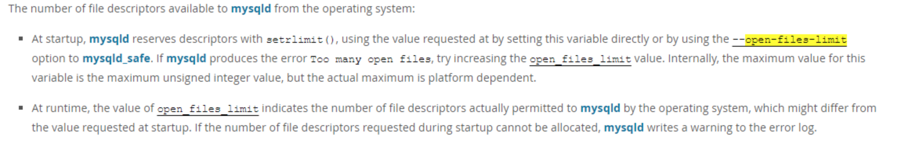
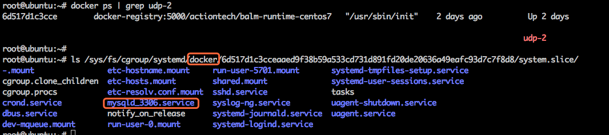

# 技术分享 | 探索测试：MySQL 遇到 Too many open files 时，哪项配置在生效？

**原文链接**: https://opensource.actionsky.com/20210914-mysql/
**分类**: MySQL 新特性
**发布时间**: 2021-09-15T00:04:31-08:00

---

作者：红红
DBLE 项目测试负责人，主导分布式中间件的测试，在测试中不断发现产品和自身的 bug。迭代验证，乐在其中。
本文来源：原创投稿
*爱可生开源社区出品，原创内容未经授权不得随意使用，转载请联系小编并注明来源。
本文将就下面三个场景做正向测试
- 
case1. MySQL 配置文件和 mysqld.service 中都声明了可打开的最大文件数时，哪个在生效？
- 
case2. MySQL 配置文件中对可打开的最大文件数配置，怎么才能生效？
- 
case3. 如果把 mysqld 的 service 中对最大文件数做的限制删除，那谁在控制？
测试环境信息：
- 
docker容器, 宿主机内核：4.15.0-36-generic, systemd版本：systemd-219-42.el7_4.4.x86_64
- 
mysql-5.7.25
测试准备：
通过 DMP 运维平台安装好 MySQL 实例，
MySQL 配置文件的配置中文件描述符的限制为：
`[root@udp2 3306]# grep -i open_files_limit /opt/mysql/etc/3306/my.cnf
open_files_limit = 65535
`
注册的 mysqld service 中配置的文件描述符的限制为：
`[root@udp2 3306]# grep -i limitnofile /etc/systemd/system/mysqld_3306.service
LimitNOFILE = 65535
`
通过/proc/{replace-with-pid-of-mysql}/limits 查看 mysqld 的资源限制：
当前 mysqld 程的资源限制值为65535，但不知是哪个限制在起作用。
#### case1. MySQL 配置文件和 mysqld.service 中都声明了可打开的最大文件数时，哪个在生效？
step1. 修改限制的配置并重启 mysqld
| 修改配置 |
| --- |
| mysql 配置：在 my.cnf 的[mysqld]下配置：open_files_limit = 65536 
在 mysqld 的 service 文件中[Service]下配置：LimitNOFILE = 65534 |
step2. 重启 mysqld 服务：
| 重启服务 |
| --- |
| systemctl daemon-reload  systemctl restart mysqld_3306.service |
step3. 通过/proc/{replace-with-pid-of-mysql}/limits 再次查看资源限制的值：
`[root@udp2 system]# pgrep mysql
16054
[root@udp2 system]# cat /proc/16054/limits | grep -i "max open files"
Max open files            65534                65534                files
`
##### 测试结论：mysqld my.cnf 和 mysqld service 都配置了最大可打开文件数时，是 mysqld.service 的配置在生效。
#### case2. MySQL 配置文件中对可打开的最大文件数配置，怎么才能生效？
> 
概要
有同学对case1的结论有疑惑，因为 MySQL 官网查到：

MySQL 配置文件中的 open_files_limit 不起作用，case1 的结论跟官网的描述似乎不太能对上。下面我们来确认一下
step1. 首先我们再仔细读一下这个描述：
`using the value requested at by setting this variable directly or by using the --open-files-limit option to mysqld_safe，
这个参数是要传给谁的？mysqld_safe。
`
step2. 我们看一看通过 DMP 平台启动的 mysqld 服务的 mysqld_safe :
`[root@udp2 system]# ps -ef | grep mysql
root       922 14557  0 16:01 pts/1    00:00:00 grep --color=auto mysql
actiont+ 12178     1  4 15:59 ?        00:00:05 /opt/mysql/base/5.7.25/bin/mysqld --defaults-file=/opt/mysql/etc/3306/my.cnf --daemonize --pid-file=/opt/mysql/data/3306/mysqld.pid --user=actiontech-mysql --socket=/opt/mysql/data/3306/mysqld.sock --port=3306
`
可以看到没有 mysqld_safe进 程。mysqld_safe 主要是对 mysqld 进程做了一些守护性的工作，DMP 平台提供了更强大的高可用能力，就没有使用 mysqld_safe 来启动 mysqld 。
step3. 我们再测试一下用 mysqld_safe 来启动 mysqld :
`启动命令：nohup /opt/mysql/base/5.7.25/bin/mysqld_safe --defaults-file=/opt/mysql/etc/3306/my.cnf --user=actiontech-mysql &
`
step4. 启动完成后，再来看看资源限制情况：
`[root@udp2 system]# ps -ef | grep mysql
root      9267 14557  2 16:01 pts/1    00:00:00 /bin/sh /opt/mysql/base/5.7.25/bin/mysqld_safe --defaults-file=/opt/mysql/etc/3306/my.cnf --user=actiontech-mysql
actiont+ 11437  9267 17 16:01 pts/1    00:00:01 /opt/mysql/base/5.7.25/bin/mysqld --defaults-file=/opt/mysql/etc/3306/my.cnf --basedir=/opt/mysql/base/5.7.25 --datadir=/opt/mysql/data/3306 --plugin-dir=/opt/mysql/base/5.7.25/lib/plugin --user=actiontech-mysql --log-error=/opt/mysql/data/3306/mysql-error.log --open-files-limit=65536 --pid-file=/opt/mysql/data/3306/mysqld.pid --socket=/opt/mysql/data/3306/mysqld.sock --port=3306
root     13082 14557  0 16:02 pts/1    00:00:00 grep --color=auto mysql
[root@udp2 system]#
[root@udp2 system]# cat /proc/11437/limits | grep -i "max open files"
Max open files            65536                65536                files
[root@udp2 system]# cat /proc/9267/limits | grep -i "max open files"
Max open files            65536                65536                files
`
可以看到在使用 mysqld_safe 启动 mysqld 时，my.cnf 中的配置起了作用，跟官档描述是相吻合的。
**测试结论：不是使用 mysqld_safe 启动的 mysql 实例的资源限制如果不手工介入，配置中的限制值是未生效的。**
**测试建议：通过该测试有2个点值得注意：**
1.systemd 的 service 是针对一个服务级别的资源限制，一个服务可有一个进程，也可有多个进程，mysqld 的服务只有 mysqld 进程，所以这里在设计上可改进的点是：在 mysqld 的 service 中，将 my.cnf 中设置的值配置给 LimitNOFILE 。这个时候能体现运维平台的优势，通过运维平台改MySQL 配置，平台可以将配置改动联动的带入到 mysqld 的 service 。如果是自己手动改的话就得牢记两者之间的关联，一个不小心可能就漏改了。
2.在生产上，经常有服务需要重启的场景，通过启动命令重启和通过注册到 systemd的服务重启，是有一些差异的。比如这里对 mysqld 的资源限制生效的配置，不同的启动方式直接影响了实际生效的资源限制。
#### case3. 如果把 mysqld 的 service 中对最大文件数做的限制删除，那谁在控制？
> 
概要
> 
现在我们知道了如果是 mysqld_safe 启动的 mysqld，open_files_limit 受 mysql 配置的限制，如果是注册到 systemd 的 mysqld service 启动 mysqld,  service 中的配置起作用。
将服务注册到systemd是现在服务管理的主流方式。那如果mysqld的service中没有设置LimitNOFILE，哪个配置会控制资源限制呢？
step1. 把 mysqld 的 service 中 LimitNOFILE = 65534 通过行首加#注释掉，然后重启 mysqld 服务：
`systemctl daemon-reload
systemctl restart mysqld_3306.service
`
step2. 等启动完成，再来看打开文件数的限制：
`[root@udp2 system]# pgrep mysql
6700
[root@udp2 system]# cat /proc/6700/limits  | grep -i "max open files"
Max open files            1048576              1048576              files
`
现在 mysqld 的 open-files-limit 生效的值: 1048576，这个值是哪里来的呢？
**step3. systemd 对资源限制是通过 cgroup 实现的。资源限制的等级结构可以通过命令systemd-cgls来查看，我们来看看现在的资源限制结构（仅显示 mysqld 相关的等级结构，其它手工删除了）：**
`[root@udp2 system]# systemd-cgls
├─    1 /usr/sbin/init
├─ 7000 systemd-cgls
├─ 7002 less
├─14557 bash
└─system.slice
├─mysqld_3306.service
│ └─6700 /opt/mysql/base/5.7.25/bin/mysqld --defaults-file=/opt/mysql/etc/3306/my.cnf --daemonize --pid-file=/opt/mysql/data/3306/mysqld.pid --user=actiontech-mysql --socket=/opt/mysql/data/3306/mysqld.sock --port=3306
`
可以看到 mysqld 直接受 system.slice 限制
step4. 刚开始我们已经介绍了，我们是在 docker 环境下测试的。退出容器，在宿主机查看测试用的 docker 容器资源限制的等级结构：
其中，udp-2是测试用容器名

mysqld_3306.service 父一级是 system.slice ，再上一级是容器 id ，这2个都是 docker 生成的，不受我们控制，应该不会无缘无故改写资源限制，所以我们再往上级看：再上级是 docker ,这个是有注册服务的，是用户可参与设置的，我们来看看这个配置里对 open-flies-limit 的限制值：
root@ubuntu:~# grep -i &#8220;limitnofile&#8221; /lib/systemd/system/docker.service
LimitNOFILE=1048576
到此，可以初步猜测是 docker 服务的资源限制在起作用
step5.上一步的结论是我们推断出来的，现在来验证一下：
`step5.1 修改 docker service 中的最大打开文件数的限制：
设置 LimitNOFILE=1048577，
step5.2 重新加载配置及重启服务：
systemctl daemon-reload
systemctl restart docker.service
step5.3 然后重启mysqld所在的容器和mysqld服务后，查看资源限制：
[root@udp2 opt]# pgrep mysql
22339
[root@udp2 opt]# cat /proc/22339/limits | grep -i "max open files"
Max open files 1048577 1048577 files
`
到此我们找到并确认了 mysqld 服务中未配置最大打开文件数时，查看到的这个 magic 1048576 的来源正是上一步猜测的 docker.service 。
**测试结论：如果 service 中不设置的话，要看资源限制的等级结构的父级或更上层的父级的设置来确定是谁在控制最大可打开文件数。**
说明：cgroup 是红帽6开始提供的功能，本文这些测试结论可能跟特定系统有关
**reference:**
https://dev.mysql.com/doc/refman/5.7/en/server-system-variables.html#sysvar_open_files_limit
https://access.redhat.com/documentation/en-us/red_hat_enterprise_linux/7/html-single/resource_management_guide/index