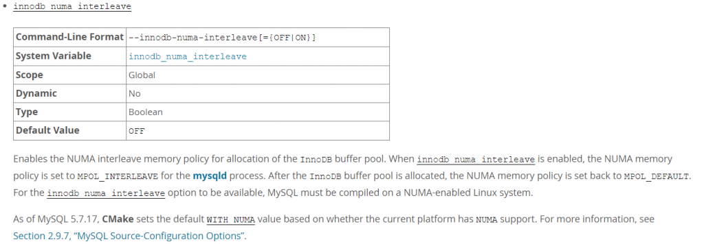

# 技术分享 | 浅谈 NUMA 与 MySQL

**原文链接**: https://opensource.actionsky.com/20210422-mysql/
**分类**: MySQL 新特性
**发布时间**: 2021-04-22T01:34:41-08:00

---

作者：孙祚龙爱可生南区交付服务部团队 DBA，负责客户 MySQL 的故障处理以及公司数据库集群管理平台 DMP 的日常运维。本文来源：原创投稿*爱可生开源社区出品，原创内容未经授权不得随意使用，转载请联系小编并注明来源。
## 背景
v该问题来自于在给客户部署 MySQL 前进行服务器环境配置时，涉及到服务器配置项关闭 numa，客户对此配置项的必要性产生了疑虑。针对这一疑虑，进行了以下关于 numa 的研究。
## 一、NUMA 简介
NUMA（Non-Uniform Memory Access，非一致性内存访问） NUMA 服务器的基本特征是 Linux 将系统的硬件资源划分为多个节点（Node），每个节点上有单独的 CPU、内存和 I/O 槽口等。CPU 访问自身 Node 内存的速度将远远高于访问远地内存（系统内其它节点的内存）的速度，这也是非一致内存访问 NUMA 的由来。
## 二、NUMA 与 MySQL 分析
NUMA 的 4 种内存分配策略：
- 缺省（default）：总是在本地节点分配（当前进程运行的节点上）
- 绑定（bind）：强制分配到指定节点上
- 交叉（interleavel）：在所有节点或者指定节点上交叉分配内存
- 优先（preferred）：在指定节点上分配，失败则在其他节点上分配
NUMA 的内存分配策略对于进程来说，并不是乐观的。因为 NUMA 默认是使用 CPU 亲和的内存分配策略，即请求进程会从当前所处的 CPU 的 Node 请求分配内存。当某个需要消耗大量内存的进程耗尽了所处的 Node 的内存时，就会导致产生 swap，不会从远程 Node 分配内存，这就是 swap insanity 现象。
MySQL 数据库是单进程多线程的架构，在开启的 NUMA 服务器中，内存被分配到各 NUMA Node 上，而 MySQL 进程只能消耗所在节点的内存。所以在开启 NUMA 的服务器上，某些特殊场景中容易出现系统拥有空闲内存但发生 SWAP 导致性能问题的情况。
比如专用的 MySQL 单实例服务器，物理内存为 40GB，MySQL 进程所在节点的本地内存为 20G，而 MySQL 配置 30GB 内存，超出节点本地内存部分会被 SWAP 到磁盘上，而不是使用其他节点的物理内存，引发性能问题。
## 三、如何关闭 NUMA
**1. 硬件层，在 BIOS 中设置关闭；**
**2. OS 内核层，在 Linux Kernel 启动参数中加上 numa=off 后重启服务器；**
For RHEL 6：
编辑 /boot/grub/grub.conf 文件的 kernel 行（添加 numa=off）：
`# vi /boot/grub/grub.conf
kernel /vmlinuz-2.6.39-400.215.10.EL ro root=/dev/VolGroup00/LogVol00 numa=off
`For RHEL 7：
编辑 /etc/default/grub 文件的 kernel 行
`# vi /etc/default/grub
GRUB_CMDLINE_LINUX="rd.lvm.lv=rhel_vm-210/root rd.lvm.lv=rhel_vm-210/swap vconsole.font=latarcyrheb-sun16 crashkernel=auto  vconsole.keymap=us rhgb quiet numa=off
`RHEL7/CentOS7 必须要重建 GRUB 配置文件才能生效：
`# grub2-mkconfig -o /etc/grub2.cfg
`**3. 数据库层，在 mysqld_safe 脚本中加上 “numactl &#8211;interleave=all” 来启动 mysqld。**
`# numactl --interleave=all ./bin/mysqld_safe --defaults-file=/etc/my.cnf &`
## 四、innodb_numa_interleave 参数
MySQL 在 5.6.27、 5.7.9 引入了 innodb_numa_interleave 参数，MySQL 自身解决了内存分类策略的问题，需要服务器支持 numa。
											
根据官方文档的描述：
当启用 innodb_numa_interleave 时，mysqld 进程的 NUMA 内存策略被设置为 MPOL_INTERLEAVE；InnoDB 缓冲池分配完毕后，NUMA 内存策略又被设置为 MPOL_DEFAULT。当然 innodb_numa_interleave 参数生效，MySQL 必须是在启用 NUMA 的 Linux 系统上编译安装。从 MySQL 5.7.17 开始，CMake 编译软件新增了 WITH_NUMA 参数，可以在支持 NUMA 的 Linux 系统上编译 MySQL。
需要注意 innodb_numa_interleave 参数在 MySQL5.7.17 的二进制包中是不支持的。
经过测试：
    1. 系统若不支持 numa，-DWITH_NUMA=ON 会导致 CMake 编译失败；
    2. MySQL5.7.19+ 的免编译的二进制包开始支持 innodb_numa_interleave 参数。
## 关于 NUMA 的建议
若是专用的 MySQL 服务器，可以直接在 BIOS 层或者 OS 内核层关闭 NUMA；
若希望其他进程使用 NUMA 特性，可以选择合适的 MySQL 版本开启 innodb_numa_interleave 参数。
> **关于 NUMA 的误区：**
numactl 命令未找到，numa 就是未开启吗？
不是，numactl 是 Linux 提供的一个对 NUMA 进行手工调优的命令（默认不安装），可以用 numactl 命令查看系统的 NUMA 状态和对 NUMA 进行控制。
**参考资料：**
> &#8220;The MySQL “swap insanity” problem and the effects of the NUMA architecture&#8221;：https://blog.jcole.us/2010/09/28/mysql-swap-insanity-and-the-numa-architect
> &#8220;A brief update on NUMA and MySQL&#8221;：https://blog.jcole.us/2012/04/16/a-brief-update-on-numa-and-mysql/https://www.kernel.org/doc/html/v4.18/vm/numa.htmlhttp://mysql.taobao.org/monthly/2015/07/06/https://www.thegeekdiary.com/how-to-disable-numa-in-centos-rhel-67/
**文章推荐：**
[故障分析 | MySQL OOM 故障应如何下手](https://opensource.actionsky.com/20200426-mysql/)