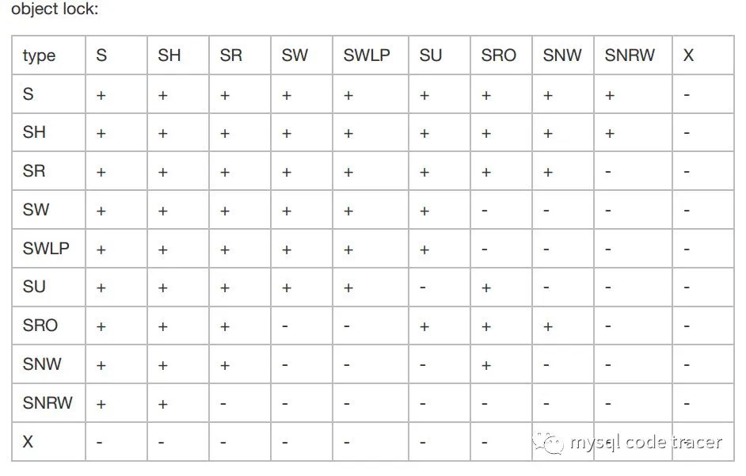
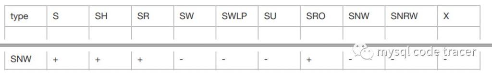
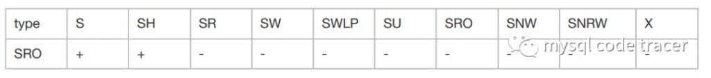

# 技术分享 | 深入理解 MySQL MDL Lock

**原文链接**: https://opensource.actionsky.com/20200414-mysql/
**分类**: MySQL 新特性
**发布时间**: 2020-04-14T00:34:54-08:00

---

作者：高鹏（网名八怪）
文章末尾有他著作的《深入理解 MySQL 主从原理 32 讲》，深入透彻理解 MySQL 主从，GTID 相关技术知识。
本文来源：转载自公众号-mysql code tracer
*爱可生开源社区出品，原创内容未经授权不得随意使用，转载请联系小编并注明来源。
本文基于源码版本 5.7.14
水平有限，有误请谅解。笔者已经将加好 MDL 获取过程和释放过程的版本放到了github 如下：> https://github.com/gaopengcarl/percona-server-locks-detail-5.7.22
### 一、MDL Lock 综述
### MySQL 中 MDL 锁一直是一个比较让人比较头疼的问题，我们谈起堵塞一般更加倾向于 InnoDB 层的 row lock(gap lock/next key lock/key lock)，因为它很好理解也很好观察。
### 而对于 MDL Lock 考虑就少一些，因为它实在不好观察，只有出现问题查看 show processlist 的时候，可以看到简单的所谓的‘Waiting for table metadata lock’之类的状态，其实 MDL Lock 是 MySQL 上层一个非常复杂的子系统，有自己的死锁检测机制。
### 大家一般说是不是锁表了很大一部分就和 MDL Lock 有关，可见的它的关键性和严重性，笔者也是根据自己的需求学习了一些，且没有能力阅读全部的代码，但是笔者通过增加一个 TICKET 的打印函数让语句的 MDL Lock 加锁流程全部打印出来方便学习，下面从一些基础概念说起然后告诉大家笔者是如何做的打印功能，最后对每种 MDL TYPE 可能出现的语句进行测试和分析。
### 如果大家对基本概念和增加打印函数不感兴趣可直接参考第五部分语句加 MDL Lock 测试和分析，希望这些测试能够帮助到大家诊断问题。
刚好最近笔者遇到一次 MDL Lock 出现死锁的情况会在下篇文章中给出案例，本文只看理论。
- 处于层次：MySQL 层，实际上早在 open_table 函数中 MDL LOCK 就开始获取了。
- 最早获取阶段：THD::enter_stage: &#8216;Opening tables&#8217;
- 调用栈帧
- `#0 open_table_get_mdl_lock(thd=0x7fffd0000df0,ot_ctx=0x7fffec06fb00,`
- `table_list=0x7fffd00067d8,flags=0,mdl_ticket=0x7fffec06f950)`
- `at/root/MySQL5.7.14/percona-server-5.7.14-7/sql/sql_base.cc:2789`
- `#1 0x0000000001516e17inopen_table(thd=0x7fffd0000df0,`
- `table_list=0x7fffd00067d8,ot_ctx=0x7fffec06fb00)`
- `at/root/MySQL5.7.14/percona-server-5.7.14-7/sql/sql_base.cc:3237`
- 死锁检测出错码
- `{ "ER_LOCK_DEADLOCK", 1213, "Deadlock found when trying to get lock; try restarting transaction"},`
- `ERROR 1213(40001): Deadlock found when trying to getlock; try restarting transaction`
可以发现 MDL Lock 的死锁抛错和 Innodb 死锁一模一样，不同的只是‘show engine innodb status’没有死锁信息。
### 二、重要数据结构和概念
### 1、MDL Lock类型
我们主要研究的类型如下：
MDL_INTENTION_EXCLUSIVE(IX)
MDL_SHARED(S)
MDL_SHARED_HIGH_PRIO(SH)
MDL_SHARED_READ(SR)
MDL_SHARED_WRITE(SW)
MDL_SHARED_WRITE_LOW_PRIO(SWL)
MDL_SHARED_UPGRADABLE(SU)
MDL_SHARED_READ_ONLY(SRO)
MDL_SHARED_NO_WRITE(SNW)
MDL_SHARED_NO_READ_WRITE(SNRW)
MDL_EXCLUSIVE(X)
第五部分会对每种类型进行详细的测试和解释。
##### 2、MDL Lock namespace
在 MDL 中 MDL_KEY 按照 namespace+DB+OBJECT_NAME 的方式进行表示，所谓的 namespace 也比较重要下面是 namespace 的分类：
- 
GLOBAL is used for the global read lock.
- 
TABLESPACE is for tablespaces.
- 
SCHEMA is for schemas (aka databases).
- 
TABLE is for tables and views.
- 
FUNCTION is for stored functions.
- 
PROCEDURE is for stored procedures.
- 
TRIGGER is for triggers.
- 
EVENT is for event scheduler events.
- 
COMMIT is for enabling the global read lock to block commits.
- 
USER_LEVEL_LOCK is for user-level locks.
- 
LOCKING_SERVICE is for the name plugin RW-lock service
本文我们主要对 GLOBAL/SCHEMA/TABLE namespace 进行描述，而对于 COMMIT namespace 是提交的时候会用到的如果遇到等待，状态为‘Waiting for commit lock’，一般为 FTWRL 堵塞 COMMIT。可参考我的[《深入理解 MySQL 主从原理》15节](https://opensource.actionsky.com/20190827-mysql/)。其他 namespace 不做描述。
##### 3、MDL Lock实现分类
- scope lock：一般对应全局 MDL Lock，如 flush table with read lock 会获取namespace space：GLOBAL type：S和namespace space：COMMIT type：S的MDL Lock。它包含 GLOBAL, COMMIT, TABLESPACE 和 SCHEMA
- object lock：如其名字所示，对象级别的 MDL Lock，比如 TABLE 级别的 MDL Lock，这也是本文的讨论核心。它包含其他的 namespace。
下面是源码注释：
- `/**`
- `Helper struct which defines how different types of locks are handled`
- `for a specific MDL_lock. In practice we use only two strategies: "scoped"`
- `lock strategy for locks in GLOBAL, COMMIT, TABLESPACE and SCHEMA namespaces`
- `and "object" lock strategy for all other namespaces.`
- `*/`
4、MDL Lock 兼容矩阵
											
											
这里兼容矩阵是学习锁堵塞的重点，类型很多比 Innodb row lock 类型要多很多，不用记住，只需要遇到能知道。
##### 5、MDL Lock duration(MDL Lock 持续周期)
这个对应源码的 enum_mdl_duration，通常我们需要关注 MDL Lock 是事务提交后释放还是语句结束后释放，实际上就是这个，这对 MDL lock 堵塞的范围很重要。我直接复制源码的解释。- MDL_STATEMENT：Locks with statement duration are automatically released at the end of statement or transaction.
- MDL_TRANSACTION：Locks with transaction duration are automatically released at the end of transaction.
- MDL_EXPLICIT:Locks with explicit duration survive the end of statement and transaction.They have to be released explicitly by calling MDL_context::release_lock().
##### 6、MDL Lock 的 FAST PATH(unobtrusive) 和 SLOW PATH(obtrusive)
使用两种不同的方式目的在于优化 MDL Lock 的实现，下面是源码的注释，可做适当了解：- A) &#8220;unobtrusive&#8221; lock types
- 1) Each type from this set should be compatible with all other types from the set (including itself).
- 2) These types should be common for DML operations Our goal is to optimize acquisition and release of locks of this type by avoiding complex checks and manipulations on mwaiting/mgranted bitmaps/lists. We replace them with a check of and increment/decrement of integer counters.We call the latter type of acquisition/release &#8220;fast path&#8221;.Use of &#8220;fast path&#8221; reduces the size of critical section associated with MDL_lock::m_rwlock lock in the common case and thus increases scalability.The amount by which acquisition/release of specific type &#8220;unobtrusive&#8221; lock increases/decreases packed counter in MDL_lock::m_fast_path_state is returned by this function.
- B) &#8220;obtrusive&#8221; lock types
- 1) Granted or pending lock of those type is incompatible withsome other types of locks or with itself.
- 2) Not common for DML operations These locks have to be always acquired involving manipulations on m_waiting/m_granted bitmaps/lists, i.e. we have to use &#8220;slow path&#8221; for them. Moreover in the presence of active/pending locks from &#8220;obtrusive&#8221; set we have to acquire using &#8220;slow path&#8221; even locks of&#8221;unobtrusive&#8221; type.
##### 7、MDL_request 结构部分属性
也就是通过语句解析后需要获得的 MDL Lock 的需求，然后通过这个类对象在 MDL 子系统中进行 MDL Lock 申请，大概包含如下一些属性：- `/** Type of metadata lock. */`
- `enum enum_mdl_type type; //需求的类型`
- `/** Duration for requested lock. */`
- `enum enum_mdl_duration duration; //持续周期`
- `/**`
- `Pointers for participating in the list of lock requests for this context.`
- `*/`
- `MDL_request *next_in_list; //双向链表实现`
- `MDL_request **prev_in_list;`
- `/**`
- `Pointer to the lock ticket object for this lock request.`
- `Valid only if this lock request is satisfied.`
- `*/`
- `MDL_ticket *ticket; //注意这里如果申请成功(没有等待)，会指向一个实际的TICKET，否则为NULL`
- `/** A lock is requested based on a fully qualified name and type. */`
8、MDL_key 结构部分属性
就是实际的 namespace+DB+OBJECT_NAME，整个放到一个 char 数组里面，他会在 MDL_LOCK 和 MDL_REQUEST 中出现。- `private:`
- `uint16m_length;`
- `uint16m_db_name_length;`
- `charm_ptr[MAX_MDLKEY_LENGTH];//放到了这里`
9、MDL_ticket 结构部分属性
如同门票一样，如果获取了 MDL Lock 必然给 MDL_request 返回一张门票，如果等待则不会分配。源码 MDL_context::acquire_lock 可以观察到。部分属性如下：- `/**`
- `Pointers for participating in the list of lock requests for this context.`
- `Context private.正如解释这里是context中链表链表的形成，是线程私有的`
- `*/`
- `MDL_ticket *next_in_context;`
- `MDL_ticket **prev_in_context;`
- `/**`
- `Pointers for participating in the list of satisfied/pending requests`
- `for the lock. Externally accessible.正如解释这里是MDL_LOCK中链表链表的形成，是全局的`
- `*/`
- `MDL_ticket *next_in_lock;`
- `MDL_ticket **prev_in_lock;`
- `/**`
- `Context of the owner of the metadata lock ticket. Externally accessible.`
- `很明显这里指向了这个ticket的拥有者也就是MDL_context，它是线程的属性`
- `*/`
- `MDL_context *m_ctx;`
- `/**`
- `Pointer to the lock object for this lock ticket. Externally accessible.`
- `很明显这里是一个指向MDL_LOCK的一个指针`
- `*/`
- `MDL_lock *m_lock;`
- `/**`
- `Indicates that ticket corresponds to lock acquired using "fast path"`
- `algorithm. Particularly this means that it was not included into`
- `MDL_lock::m_granted bitmap/list and instead is accounted for by`
- `MDL_lock::m_fast_path_locks_granted_counter`
- `这里就代表了是否是FAST PATH从注释来看fast path方式不会在MDL LOCK中`
- `占用granted位图和链表取而代之代之的是一个统计器m_fast_path_locks_granted_counter`
- `这样一来开销肯定更小`
- `*/`
- `bool m_is_fast_path;`
- `/**`
- `Indicates that ticket corresponds to lock request which required`
- `storage engine notification during its acquisition and requires`
- `storage engine notification after its release.`
- `*/`
10、MDL_lock 结构部分属性
每一个 MDL_key 都会对应一个 MDL_lock，其中包含了所谓的 GRANTED 链表和 WAIT 链表，考虑它的复杂性，可以直接参考源码注释也非常详细，这里给出我所描述的几个属性如下：- `/** The key of the object (data) being protected. */`
- `MDL_key key;`
- `/** List of granted tickets for this lock. */`
- `Ticket_list m_granted;`
- `/** Tickets for contexts waiting to acquire a lock. */`
- `Ticket_list m_waiting;`
11、MDL_context 结构部分属性
这是整个 MySQL 线程和 MDL Lock 子系统进行交互的一个所谓的上下文结构，其中包含了很多方法和属性，我比较关注的属性如下：- `/**`
- `If our request for a lock is scheduled, or aborted by the deadlock`
- `detector, the result is recorded in this class.`
- `*/`
- `MDL_wait m_wait;`
- `/**`
- `Lists of all MDL tickets acquired by this connection.`
- `这是一个不同MDL lock持续时间的一个链表数组。实际就是`
- `MDL_STATEMENT一个链表`
- `MDL_TRANSACTION一个链表`
- `MDL_EXPLICIT一个链表`
- `*/`
- `Ticket_list m_tickets[MDL_DURATION_END];`
- `//这是一个父类指针指向子类对象，虚函数重写的典型,实际他就指向了一个线程`
- `/*`
- `class THD :public MDL_context_owner,`
- `public Query_arena,`
- `public Open_tables_state`
- `*/`
- `MDL_context_owner *m_owner;`
12、所有等待状态
源码给出了所有的等待标记如下：- `PSI_stage_info MDL_key::m_namespace_to_wait_state_name[NAMESPACE_END]=`
- `{`
- `{0, "Waiting for global read lock", 0},`
- `{0, "Waiting for tablespace metadata lock", 0},`
- `{0, "Waiting for schema metadata lock", 0},`
- `{0, "Waiting for table metadata lock", 0},`
- `{0, "Waiting for stored function metadata lock", 0},`
- `{0, "Waiting for stored procedure metadata lock", 0},`
- `{0, "Waiting for trigger metadata lock", 0},`
- `{0, "Waiting for event metadata lock", 0},`
- `{0, "Waiting for commit lock", 0},`
- `{0, "User lock", 0}, /* Be compatible with old status. */`
- `{0, "Waiting for locking service lock", 0},`
- `{0, "Waiting for backup lock", 0},`
- `{0, "Waiting for binlog lock", 0}`
- `};`
我们常见的是：- &#8220;Waiting for table metadata lock&#8221;：通常就是 namespace TABLE 级别的 MDL Lock，具体根据兼容矩阵判断参考第五部分。
- &#8220;Waiting for global read lock&#8221;：通常就是 namespace GLOBAL 级别的 MDL Lock，通常和 flush table with read lock 有关，参考第五部分。
- &#8220;Waiting for commit lock&#8221;：通常就是 namespace COMMIT 级别的 MDL Lock，通常和 flush table with read lock 有关，参考第五部分。
##### 三、增加打印函数 my_print_ticket
学习 MDL Lock 最好的方式当然是获取一条语句锁加的所有 MDL Lock，包含加锁、升级、降级和释放的流程。虽然 5.7 加入诊断 MDL Lock 的方法：
- `UPDATE performance_schema.setup_consumers SET ENABLED = 'YES' WHERE NAME ='global_instrumentation';`
- `UPDATE performance_schema.setup_instruments SET ENABLED = 'YES' WHERE NAME ='wait/lock/metadata/sql/mdl';`
- `select* from performance_schema.metadata_locks`
但是对于每个语句获取的所有 MDL Lock 的流程仍然不好观察，因此我加入了打印函数：- `/*p_ticket in parameter*/`
- `int my_print_ticket(const MDL_ticket* p_ticket)`
并且在 mdl_ticket 类中增加了这个函数原型为友元函数：- `friendint my_print_ticket(const MDL_ticket* p_ticket);`
主要捕获 MDL Lock 的加锁信息打印到 err 日志中，包含的信息如下：- 线程 id：通过 p_ticket->mctx->get_thd(); 获取
- mdl lock database name：通过 p_ticket->m_lock->key.db_name() 获取
- mdl lock object name：通过 p_ticket->m_lock->key.name() 获取
- mdl lock namespace：通过 p_ticket->m_lock->key.mdl_namespace() 获取
- mdl lock fast path：通过 p_ticket->m_is_fast_path 获取判断是则输出否则不输出
- mdl lock type：通过 p_ticket->m_type 获取
- mdl lock duration：通过 p_ticket->m_duration 获取
上面这些信息都在前面进行过描述了。具体的输出信息如下：- `2017-08-03T07:34:21.720583Z3[Note] (>MDL PRINT) Thread id is3:`
- `2017-08-03T07:34:21.720601Z3[Note] (->MDL PRINT) DB_name is:test`
- `2017-08-03T07:34:21.720619Z3[Note] (-->MDL PRINT) OBJ_name is:test`
- `2017-08-03T07:34:21.720637Z3[Note] (--->MDL PRINT) Namespaceis:TABLE`
- `2017-08-03T07:34:21.720655Z3[Note] (---->MDL PRINT) Fast path is:(Y)`
- `2017-08-03T07:34:21.720673Z3[Note] (----->MDL PRINT) Mdl type is:MDL_SHARED_WRITE(SW)`
- `2017-08-03T07:34:21.720692Z3[Note] (------>MDL PRINT) Mdl duration is:MDL_TRANSACTION`
这实际上和 metadata_locks 中的信息差不多，如下：
- `MySQL> select* from performance_schema.metadata_locks\G`
- `*************************** 1. row ***************************`
- `OBJECT_TYPE: TABLE`
- `OBJECT_SCHEMA: test`
- `OBJECT_NAME: test`
- `OBJECT_INSTANCE_BEGIN: 140734412907760`
- `LOCK_TYPE: SHARED_WRITE`
- `LOCK_DURATION: TRANSACTION`
- `LOCK_STATUS: GRANTED`
- `SOURCE: sql_parse.cc:6314`
- `OWNER_THREAD_ID: 39`
- `OWNER_EVENT_ID: 241`
一旦有了这个函数我们只需要在加锁、升级、降级和释放的位置进行适当添加就可以了。
##### 四、在合适的位置增加 my_print_ticket 打印函数
既然我们要研究 MDL Lock 的加锁？升级？降级，那么我们就必要找到他们的函数入口，然后在合适的位置增加打印函数 my_print_ticket 进行观察，下面标示出打印位置。
##### 1、加锁：MDL_context::acquire_lock
- `bool`
- `MDL_context::acquire_lock(MDL_request *mdl_request, ulong lock_wait_timeout)`
- `{`
- `if(mdl_request->ticket) //获取成功获得ticket`
- `{`
- `/*`
- `We have managed to acquire lock without waiting.`
- `MDL_lock, MDL_context and MDL_request were updated`
- `accordingly, so we can simply return success.`
- `*/`
- `//REQUESET获取TICKET成功 此处打印`
- `return FALSE;`
- `}`
- `/*`
- `Our attempt to acquire lock without waiting has failed.`
- `As a result of this attempt we got MDL_ticket with m_lock`
- `member pointing to the corresponding MDL_lock object which`
- `has MDL_lock::m_rwlock write-locked.`
- `*/`
- `//获取不成功加入MDL_lock 等待队列`
- `lock= ticket->m_lock;`
- 
- `lock->m_waiting.add_ticket(ticket);`
- 
- `will_wait_for(ticket); //死锁检测`
- 
- `/* There is a shared or exclusive lock on the object. */`
- `DEBUG_SYNC(get_thd(), "mdl_acquire_lock_wait");`
- 
- `find_deadlock();`
- 
- `//此处打印TICKET进入了等待流程`
- 
- `if(lock->needs_notification(ticket) || lock->needs_connection_check())`
- `{`
- `}`
- `done_waiting_for();//等待完成对死锁检测等待图进行调整去掉本等待边edge(无向图)`
- 
- `//当然到这里也是通过等待后获得成功了状态为GRANTED`
- `DBUG_ASSERT(wait_status == MDL_wait::GRANTED);`
- 
- `m_tickets[mdl_request->duration].push_front(ticket);`
- 
- `mdl_request->ticket= ticket;`
- 
- `MySQL_mdl_set_status(ticket->m_psi, MDL_ticket::GRANTED);`
- `//此处打印通过等待REQUEST获得了TICKET`
- `return FALSE;`
- `}`
2、降级：void MDL_ticket::downgrade_lock(enum_mdl_type new_type)
- `void MDL_ticket::downgrade_lock(enum_mdl_type new_type)`
- `{`
- 
- `/* Only allow downgrade from EXCLUSIVE and SHARED_NO_WRITE. */`
- `DBUG_ASSERT(m_type == MDL_EXCLUSIVE ||`
- `m_type == MDL_SHARED_NO_WRITE);`
- 
- `//此处打印出降级前的TICKET`
- 
- `if(m_hton_notified)`
- `{`
- `MySQL_mdl_set_status(m_psi, MDL_ticket::POST_RELEASE_NOTIFY);`
- `m_ctx->get_owner()->notify_hton_post_release_exclusive(&m_lock->key);`
- `m_hton_notified= false;`
- `MySQL_mdl_set_status(m_psi, MDL_ticket::GRANTED);`
- `}`
- `//函数结尾答应出降级后的TICKET`
- `}`
3、升级：MDL_context::upgrade_shared_lock(MDL_ticket *mdl_ticket,enum_mdl_type new_type, ulong lock_wait_timeout)
- `bool`
- `MDL_context::upgrade_shared_lock(MDL_ticket *mdl_ticket,`
- `enum_mdl_type new_type,`
- `ulong lock_wait_timeout)`
- `{`
- `MDL_REQUEST_INIT_BY_KEY(&mdl_new_lock_request,`
- `&mdl_ticket->m_lock->key, new_type,`
- `MDL_TRANSACTION);//构造一个request`
- 
- `//此处打印出来的TICKET类型`
- 
- `if(acquire_lock(&mdl_new_lock_request, lock_wait_timeout)) //尝试使用新的LOCK_TYPE进行加锁`
- `DBUG_RETURN(TRUE);`
- 
- `is_new_ticket= ! has_lock(mdl_svp, mdl_new_lock_request.ticket);`
- 
- `lock= mdl_ticket->m_lock;`
- 
- `//下面进行一系列对MDL_LOCK的维护并且对所谓的合并操作`
- `/* Code below assumes that we were upgrading to "obtrusive" type of lock. */`
- `DBUG_ASSERT(lock->is_obtrusive_lock(new_type));`
- 
- `/* Merge the acquired and the original lock. @todo: move to a method. */`
- `MySQL_prlock_wrlock(&lock->m_rwlock);`
- 
- `if(is_new_ticket)`
- `{`
- `m_tickets[MDL_TRANSACTION].remove(mdl_new_lock_request.ticket);`
- `MDL_ticket::destroy(mdl_new_lock_request.ticket);`
- `}`
- `//此处打印出来的升级后TICKET类型`
- `DBUG_RETURN(FALSE);`
- `}`
4、释放：略
### 五、常见 MDL Lock 类型加锁测试
##### 1、MDL_INTENTION_EXCLUSIVE(IX)
这个锁会在很多操作的时候都会出现，比如做任何一个 DML/DDL 操作都会触发，实际上 DELTE/UPDATE/INSERT/FOR UPDATE 等 DML 操作会在 GLOBAL 上加IX锁，然后才会在本对象上加锁。而 DDL 语句至少会在 GLOBAL 上加IX锁，对象所属 SCHEMA 上加IX锁，本对象加锁。下面是 DELETE 触发的 GLOABL IX MDL LOCK：- `2017-08-03T18:22:38.092205Z3[Note] (acquire_lock)THIS MDL LOCK acquire ok!`
- `2017-08-03T18:22:38.092242Z3[Note] (>MDL PRINT) Thread id is3:`
- `2017-08-03T18:22:38.092276Z3[Note] (--->MDL PRINT) Namespaceis:GLOBAL`
- `2017-08-03T18:22:38.092310Z3[Note] (---->MDL PRINT) Fast path is:(Y)`
- `2017-08-03T18:22:38.092344Z3[Note] (----->MDL PRINT) Mdl type is:MDL_INTENTION_EXCLUSIVE(IX)`
- `2017-08-03T18:22:38.092380Z3[Note] (------>MDL PRINT) Mdl duration is:MDL_STATEMENT`
- `2017-08-03T18:22:38.092551Z3[Note] (------->MDL PRINT) Mdl status is:EMPTY`
我们注意一样它的持续周期为语句级别。下面是 ALETER 语句触发的 GLOABL IX MDL Lock：- `2017-08-03T18:46:05.894871Z3[Note] (acquire_lock)THIS MDL LOCK acquire ok!`
- `2017-08-03T18:46:05.894915Z3[Note] (>MDL PRINT) Thread id is3:`
- `2017-08-03T18:46:05.894948Z3[Note] (--->MDL PRINT) Namespaceis:GLOBAL`
- `2017-08-03T18:46:05.894980Z3[Note] (---->MDL PRINT) Fast path is:(Y)`
- `2017-08-03T18:46:05.895012Z3[Note] (----->MDL PRINT) Mdl type is:MDL_INTENTION_EXCLUSIVE(IX)`
- `2017-08-03T18:46:05.895044Z3[Note] (------>MDL PRINT) Mdl duration is:MDL_STATEMENT`
- `2017-08-03T18:46:05.895076Z3[Note] (------->MDL PRINT) Mdl status is:EMPTY`
所以这个 MDL Lock 无所不在，而只有是否兼容问题，如果不兼容则堵塞。scope lock 的 IX 类型一般都是兼容的除非遇到 S 类型，下面讨论。
###### 2、MDL_SHARED(S)
这把锁一般用在 flush tables with read lock 中，如下：- `MySQL> flush tables with read lock;`
- `Query OK, 0 rows affected (0.01 sec)`
- 
- `2017-08-03T18:19:11.603911Z3[Note] (acquire_lock)THIS MDL LOCK acquire ok!`
- `2017-08-03T18:19:11.603947Z3[Note] (>MDL PRINT) Thread id is3:`
- `2017-08-03T18:19:11.603971Z3[Note] (--->MDL PRINT) Namespaceis:GLOBAL`
- `2017-08-03T18:19:11.603994Z3[Note] (----->MDL PRINT) Mdl type is:MDL_SHARED(S)`
- `2017-08-03T18:19:11.604045Z3[Note] (------>MDL PRINT) Mdl duration is:MDL_EXPLICIT`
- `2017-08-03T18:19:11.604073Z3[Note] (------->MDL PRINT) Mdl status is:EMPTY`
- `2017-08-03T18:19:11.604133Z3[Note] (acquire_lock)THIS MDL LOCK acquire ok!`
- `2017-08-03T18:19:11.604156Z3[Note] (>MDL PRINT) Thread id is3:`
- `2017-08-03T18:19:11.604194Z3[Note] (--->MDL PRINT) Namespaceis:COMMIT`
- `2017-08-03T18:19:11.604217Z3[Note] (----->MDL PRINT) Mdl type is:MDL_SHARED(S)`
- `2017-08-03T18:19:11.604240Z3[Note] (------>MDL PRINT) Mdl duration is:MDL_EXPLICIT`
- `2017-08-03T18:19:11.604310Z3[Note] (------->MDL PRINT) Mdl status is:EMPTY`
我们注意到其 namspace 为 GLOBAL 和 COMMIT 显然他们是 scope lock，他们的 TYPE 为 S，那么很显然根据兼容性原则 scope lock 的 MDL IX 和 MDL S 不兼容，flush tables with read lock 就会堵塞所有 DELTE/UPDATE/INSERT/FOR UPDATE 等 DML 和 DDL 操作，并且也会堵塞 commit 操作。
##### 3、MDL_SHARED_HIGH_PRIO(SH)
这个锁基本上大家也是经常用到只是没感觉到而已，比如我们一般 desc 操作。兼容矩阵如下：
											
操作记录如下：- `MySQL> desc test.testsort10;`
- 
- `2017-08-03T19:06:05.843277Z4[Note] (acquire_lock)THIS MDL LOCK acquire ok!`
- `2017-08-03T19:06:05.843324Z4[Note] (>MDL PRINT) Thread id is4:`
- `2017-08-03T19:06:05.843359Z4[Note] (->MDL PRINT) DB_name is:test`
- `2017-08-03T19:06:05.843392Z4[Note] (-->MDL PRINT) OBJ_name is:testsort10`
- `2017-08-03T19:06:05.843425Z4[Note] (--->MDL PRINT) Namespaceis:TABLE`
- `2017-08-03T19:06:05.843456Z4[Note] (---->MDL PRINT) Fast path is:(Y)`
- `2017-08-03T19:06:05.843506Z4[Note] (----->MDL PRINT) Mdl type is:MDL_SHARED_HIGH_PRIO(SH)`
- `2017-08-03T19:06:05.843538Z4[Note] (------>MDL PRINT) Mdl duration is:MDL_TRANSACTION`
- `2017-08-03T19:06:05.843570Z4[Note] (------->MDL PRINT) Mdl status is:EMPTY`
这中类型的优先级比较高，但是其和 X 不兼容。注意持续时间为 MDL_TRANSACTION。
##### 4、MDL_SHARED_READ(SR)
这把锁一般用在非当前读取的 select 中。兼容性如下：
											
操作记录如下：- `MySQL> select* from test.testsort10 limit 1;`
- 
- `2017-08-03T19:13:52.338764Z4[Note] (acquire_lock)THIS MDL LOCK acquire ok!`
- `2017-08-03T19:13:52.338813Z4[Note] (>MDL PRINT) Thread id is4:`
- `2017-08-03T19:13:52.338847Z4[Note] (->MDL PRINT) DB_name is:test`
- `2017-08-03T19:13:52.338883Z4[Note] (-->MDL PRINT) OBJ_name is:testsort10`
- `2017-08-03T19:13:52.338917Z4[Note] (--->MDL PRINT) Namespaceis:TABLE`
- `2017-08-03T19:13:52.338950Z4[Note] (---->MDL PRINT) Fast path is:(Y)`
- `2017-08-03T19:13:52.339025Z4[Note] (----->MDL PRINT) Mdl type is:MDL_SHARED_READ(SR)`
- `2017-08-03T19:13:52.339062Z4[Note] (------>MDL PRINT) Mdl duration is:MDL_TRANSACTION`
- `2017-08-03T19:13:52.339097Z4[Note] (------->MDL PRINT) Mdl status is:EMPTY`
这里还是要提及一下平时我们偶尔会出现 select 也堵住的情况（比如 DDL 的某个阶段需要对象 MDL X 锁）。我们不得不抱怨 MySQL 居然会堵塞 select 其实这里也就是 object mdl lock X 和 SR 不兼容的问题（参考前面的兼容矩阵）。注意持续时间为 MDL_TRANSACTION。
##### 5、MDL_SHARED_WRITE(SW)
这把锁一般用于 DELTE/UPDATE/INSERT/FOR UPDATE 等操作对 table 的加锁（当前读），不包含 DDL 操作，但是要注意 DML 操作实际上还会有一个 GLOBAL 的 IX 的锁，前面已经提及过了，这把锁只是对象上的。
兼容性如下：
											
操作记录如下：
- `MySQL> select* from test.testsort10 limit 1for update;`
- 
- `2017-08-03T19:25:41.218428Z4[Note] (acquire_lock)THIS MDL LOCK acquire ok!`
- `2017-08-03T19:25:41.218461Z4[Note] (>MDL PRINT) Thread id is4:`
- `2017-08-03T19:25:41.218493Z4[Note] (->MDL PRINT) DB_name is:test`
- `2017-08-03T19:25:41.218525Z4[Note] (-->MDL PRINT) OBJ_name is:testsort10`
- `2017-08-03T19:25:41.218557Z4[Note] (--->MDL PRINT) Namespaceis:TABLE`
- `2017-08-03T19:25:41.218588Z4[Note] (---->MDL PRINT) Fast path is:(Y)`
- `2017-08-03T19:25:41.218620Z4[Note] (----->MDL PRINT) Mdl type is:MDL_SHARED_WRITE(SW)`
- `2017-08-03T19:25:41.218677Z4[Note] (------>MDL PRINT) Mdl duration is:MDL_TRANSACTION`
- `2017-08-03T19:25:41.218874Z4[Note] (------->MDL PRINT) Mdl status is:EMPTY`
注意持续时间为 MDL_TRANSACTION 。
##### 6、MDL_SHARED_WRITE_LOW_PRIO(SWL)
这把锁很少用到源码注释只有如下：
- `Usedby DML statements modifying tables andusing the LOW_PRIORITY clause`
不做解释了。
##### 7、MDL_SHARED_UPGRADABLE(SU)
这把锁一般在 ALTER TABLE 语句中会用到，他可以升级为 SNW、SNRW、X，同时至少 X 锁也可以降级为 SU，实际上在 Innodb ONLINE DDL 中非常依赖它，由于它的存在那么 DML(SW) 和 SELECT(SR) 都不会堵塞。
兼容性如下：
											
我们有必要研究一下他的兼容性，可以看到 OBJECT LOCK 中 (SELECT)SR 和 (DML)SW 都是允许的，而在 SCOPED LOCK 中虽然 DML DDL 都会在 GLOBAL 上锁，但是其类型都是 IX。所以这个 SU 锁不堵塞 DML/SELECT 读写操作进入 Innodb 引擎层，它是 ONLINE DDL 的基础。如果不兼容你都进入不了 Innodb 引擎层，更谈不上什么 ONLINE DDL，注意我这里说的 ALGORITHM=INPLACE的ONLINE DDL。
操作日志记录：
- `MySQL> alter table testsort12 add column it intnotnull;`
- `Query OK, 0 rows affected (6.27 sec)`
- `Records: 0Duplicates: 0Warnings: 0`
- `2017-08-03T19:46:54.781453Z3[Note] (acquire_lock)THIS MDL LOCK acquire ok!`
- `2017-08-03T19:46:54.781487Z3[Note] (>MDL PRINT) Thread id is3:`
- `2017-08-03T19:46:54.781948Z3[Note] (->MDL PRINT) DB_name is:test`
- `2017-08-03T19:46:54.781990Z3[Note] (-->MDL PRINT) OBJ_name is:testsort12`
- `2017-08-03T19:46:54.782026Z3[Note] (--->MDL PRINT) Namespaceis:TABLE`
- `2017-08-03T19:46:54.782060Z3[Note] (----->MDL PRINT) Mdl type is:MDL_SHARED_UPGRADABLE(SU)`
- `2017-08-03T19:46:54.782096Z3[Note] (------>MDL PRINT) Mdl duration is:MDL_TRANSACTION`
- `2017-08-03T19:46:54.782175Z3[Note] (------->MDL PRINT) Mdl status is:EMPTY`
- `2017-08-03T19:46:54.803898Z3[Note] (upgrade_shared_lock)THIS MDL LOCK will upgrade`
- `2017-08-03T19:46:54.804201Z3[Note] (upgrade_shared_lock)THIS MDL LOCK upgrade TO`
- `2017-08-03T19:46:54.804240Z3[Note] (>MDL PRINT) Thread id is3:`
- `2017-08-03T19:46:54.804254Z3[Note] (->MDL PRINT) DB_name is:test`
- `2017-08-03T19:46:54.804267Z3[Note] (-->MDL PRINT) OBJ_name is:testsort12`
- `2017-08-03T19:46:54.804280Z3[Note] (--->MDL PRINT) Namespaceis:TABLE`
- `2017-08-03T19:46:54.804293Z3[Note] (----->MDL PRINT) Mdl type :MDL_EXCLUSIVE(X)`
- `2017-08-03T19:46:54.804306Z3[Note] (------>MDL PRINT) Mdl duration is:MDL_TRANSACTION`
- `2017-08-03T19:46:54.804319Z3[Note] (------->MDL PRINT) Mdl status is:EMPTY`
- `2017-08-03T19:46:54.855563Z3[Note] (downgrade_lock)THIS MDL LOCK will downgrade`
- `2017-08-03T19:46:54.855693Z3[Note] (downgrade_lock) to this MDL lock`
- `2017-08-03T19:46:54.855706Z3[Note] (>MDL PRINT) Thread id is3:`
- `2017-08-03T19:46:54.855717Z3[Note] (->MDL PRINT) DB_name is:test`
- `2017-08-03T19:46:54.856053Z3[Note] (-->MDL PRINT) OBJ_name is:testsort12`
- `2017-08-03T19:46:54.856069Z3[Note] (--->MDL PRINT) Namespaceis:TABLE`
- `2017-08-03T19:46:54.856082Z3[Note] (----->MDL PRINT) Mdl type is:MDL_SHARED_UPGRADABLE(SU)`
- `2017-08-03T19:46:54.856094Z3[Note] (------>MDL PRINT) Mdl duration is:MDL_TRANSACTION`
- `2017-08-03T19:46:54.856214Z3[Note] (------->MDL PRIN`
我们需要简单分析一下，获得 testsort12 表上的 MDL Lock 大概流程如下：- `2017-08-03T19:46:54.781487获得 MDL_SHARED_UPGRADABLE(SU)`
- `2017-08-03T19:46:54.804293升级 MDL_EXCLUSIVE(X) 准备阶段`
- `2017-08-03T19:46:54.855563降级 MDL_SHARED_UPGRADABLE(SU) 执行阶段`
- `2017-08-03T19:47:00.304057升级 MDL_EXCLUSIVE(X) 提交阶段`
不管如何这个 ALTER 操作还是比较费时的，从时间我们看到 2017-08-03T19:46:54 降级完成 (SU) 到 2017-08-03T19:47:00 这段时间，实际上是最耗时的实际上这里就是实际的 Inplace 重建，但是这个过程实际在 MDL SU 模式下所以不会堵塞 DML/SELECT 操作。这里再给大家提个醒，所谓的 ONLINE DDL 只是在 Inplace 重建阶段不堵塞 DML/SELECT 操作，还是尽量在数据库压力小的时候操作，如果有 DML 没有提交或者 SELECT 没有做完这个时候 SW 或者 SR 必然堵塞 X，而 X 为高优先级能够堵塞所有操作。这样导致的现象就是由于 DML 未提交会堵塞 DDL 操作，而 DDL 操作会堵塞所有操作，基本对于这个 TABLE 的表全部操作堵塞（SW 堵塞 X，X 堵塞所有操作）。而对于 ALGORITHM=COPY 在COPY 阶段用的是 SNW 锁，接下来我就先来看看 SNW 锁。
##### 8、MDL_SHARED_NO_WRITE(SNW)
SU 可以升级为 SNW，而 SNW 可以升级为 X，如前面所提及的用于 ALGORITHM=COPY 中，保护数据的一致性。先看看它的兼容性如下：
											
从兼容矩阵可以看到，本锁不会堵塞 SR，但是堵塞 SW，当然也就堵塞了 DML(SW) 而 SELECT(SR) 不会堵塞。下面是部分操作记录日志：- `MySQL> alter table testsort12 add column ik intnotnull, ALGORITHM=COPY ;`
- 
- `2017-08-03T20:07:58.413215Z3[Note] (upgrade_shared_lock)THIS MDL LOCK upgrade TO`
- `2017-08-03T20:07:58.413241Z3[Note] (>MDL PRINT) Thread id is3:`
- `2017-08-03T20:07:58.413257Z3[Note] (->MDL PRINT) DB_name is:test`
- `2017-08-03T20:07:58.413273Z3[Note] (-->MDL PRINT) OBJ_name is:testsort12`
- `2017-08-03T20:07:58.413292Z3[Note] (--->MDL PRINT) Namespaceis:TABLE`
- `2017-08-03T20:07:58.413308Z3[Note] (----->MDL PRINT) Mdl type is:MDL_SHARED_NO_WRITE(SNW)`
- `2017-08-03T20:07:58.413325Z3[Note] (------>MDL PRINT) Mdl duration is:MDL_TRANSACTION`
- `2017-08-03T20:07:58.413341Z3[Note] (------->MDL PRINT) Mdl status is:EMPTY`
- `2017-08-03T20:08:25.392006Z3[Note] (upgrade_shared_lock)THIS MDL LOCK upgrade TO`
- `2017-08-03T20:08:25.392024Z3[Note] (>MDL PRINT) Thread id is3:`
- `2017-08-03T20:08:25.392086Z3[Note] (->MDL PRINT) DB_name is:test`
- `2017-08-03T20:08:25.392159Z3[Note] (-->MDL PRINT) OBJ_name is:testsort12`
- `2017-08-03T20:08:25.392199Z3[Note] (--->MDL PRINT) Namespaceis:TABLE`
- `2017-08-03T20:08:25.392214Z3[Note] (----->MDL PRINT) Mdl type is:MDL_EXCLUSIVE(X)`
- `2017-08-03T20:08:25.392228Z3[Note] (------>MDL PRINT) Mdl duration is:MDL_TRANSACTION`
- `2017-08-03T20:08:25.392242Z3[Note] (------->MDL PRINT) Mdl status is:EMPTY`
我们可以发现如下：- `2017-08-03T20:07:58.413308获得了MDL_SHARED_NO_WRITE(SNW)`
- `2017-08-03T20:08:25.392006升级为MDL_EXCLUSIVE(X)`
2017-08-03T20:07:58.413308 到 2017-08-03T20:08:25.392006 就是实际 COPY 的时间，可见整个 COPY 期间只能 SELECT，而不能 DML。也是 ALGORITHM=COPY 和 ALGORITHM=INPLACE 的一个关键区别。
##### 9、MDL_SHARED_READ_ONLY(SRO)
用于 LOCK TABLES READ  语句，兼容性如下：
											
根据兼容性可以发现，堵塞 DML(SW) 但是 SELECT(SR) 还是可以的。下面是操作日志：- `MySQL> lock table testsort12 read;`
- `Query OK, 0 rows affected (0.01 sec)`
- `2017-08-03T21:08:27.267947Z3[Note] (acquire_lock)THIS MDL LOCK acquire ok!`
- `2017-08-03T21:08:27.267979Z3[Note] (>MDL PRINT) Thread id is3:`
- `2017-08-03T21:08:27.268009Z3[Note] (->MDL PRINT) DB_name is:test`
- `2017-08-03T21:08:27.268040Z3[Note] (-->MDL PRINT) OBJ_name is:testsort12`
- `2017-08-03T21:08:27.268070Z3[Note] (--->MDL PRINT) Namespaceis:TABLE`
- `2017-08-03T21:08:27.268113Z3[Note] (----->MDL PRINT) Mdl type is:MDL_SHARED_READ_ONLY(SRO)`
- `2017-08-03T21:08:27.268145Z3[Note] (------>MDL PRINT) Mdl duration is:MDL_TRANSACTION`
- `2017-08-03T21:08:27.268175Z3[Note] (------->MDL PRINT) Mdl status is:EMPTY`
10、MDL_SHARED_NO_READ_WRITE(SNRW)
用于 LOCK TABLES WRITE 语句，兼容性如下：
											
可以看到 DML(SW) 和 SELECT(SR) 都被它堵塞，但是还可以 DESC(SH)。
操作日志记录如下：
- `MySQL> lock table testsort12 write;`
- `Query OK, 0 rows affected (0.00 sec)`
- `2017-08-03T21:13:07.113347Z3[Note] (acquire_lock)THIS MDL LOCK acquire ok!`
- `2017-08-03T21:13:07.113407Z3[Note] (>MDL PRINT) Thread id is3:`
- `2017-08-03T21:13:07.113435Z3[Note] (--->MDL PRINT) Namespaceis:GLOBAL`
- `2017-08-03T21:13:07.113458Z3[Note] (---->MDL PRINT) Fast path is:(Y)`
- `2017-08-03T21:13:07.113482Z3[Note] (----->MDL PRINT) Mdl type is:MDL_INTENTION_EXCLUSIVE(IX)`
- `2017-08-03T21:13:07.113505Z3[Note] (------>MDL PRINT) Mdl duration is:MDL_STATEMENT`
- `2017-08-03T21:13:07.113604Z3[Note] (------->MDL PRINT) Mdl status is:EMPTY`
- `2017-08-03T21:13:07.113637Z3[Note] (acquire_lock)THIS MDL LOCK acquire ok!`
- `2017-08-03T21:13:07.113660Z3[Note] (>MDL PRINT) Thread id is3:`
- `2017-08-03T21:13:07.113681Z3[Note] (->MDL PRINT) DB_name is:test`
- `2017-08-03T21:13:07.113703Z3[Note] (-->MDL PRINT) OBJ_name is:`
- `2017-08-03T21:13:07.113725Z3[Note] (--->MDL PRINT) Namespaceis:SCHEMA`
- `2017-08-03T21:13:07.113746Z3[Note] (---->MDL PRINT) Fast path is:(Y)`
- `2017-08-03T21:13:07.113768Z3[Note] (----->MDL PRINT) Mdl type is:MDL_INTENTION_EXCLUSIVE(IX)`
- `2017-08-03T21:13:07.113791Z3[Note] (------>MDL PRINT) Mdl duration is:MDL_TRANSACTION`
- `2017-08-03T21:13:07.113813Z3[Note] (------->MDL PRINT) Mdl status is:EMPTY`
- `2017-08-03T21:13:07.113842Z3[Note] (acquire_lock)THIS MDL LOCK acquire ok!`
- `2017-08-03T21:13:07.113865Z3[Note] (>MDL PRINT) Thread id is3:`
- `2017-08-03T21:13:07.113887Z3[Note] (->MDL PRINT) DB_name is:test`
- `2017-08-03T21:13:07.113922Z3[Note] (-->MDL PRINT) OBJ_name is:testsort12`
- `2017-08-03T21:13:07.113945Z3[Note] (--->MDL PRINT) Namespaceis:TABLE`
- `2017-08-03T21:13:07.113975Z3[Note] (----->MDL PRINT) Mdl type is:MDL_SHARED_NO_READ_WRITE(SNRW)`
- `2017-08-03T21:13:07.113998Z3[Note] (------>MDL PRINT) Mdl duration is:MDL_TRANSACTION`
- `2017-08-03T21:13:07.114021Z3[Note] (------->MDL PRINT) Mdl status is:EMPTY`
除此之外可以发现语句还需要 GLOBAL 和 SCHEMA 上的 IX 锁，换句话说 flush tables with read lock; 会堵塞‘lock table testsort12 write’，但是‘lock table testsort12 read’却不会堵塞。
##### 11、MDL_EXCLUSIVE(X)
用于各种 DDL 操作，实际上基本全部的 DDL 都会涉及到这个锁，即便是 ONLINE DDL 也会在准备和提交阶段获取本锁，因此 ONLINE DDL 不是完全不堵塞的，只是堵塞时间很短很短，兼容性如下：
											
我们在验证 SU 和 SNW MDL Lock 类型的时候已经看到了操作记录，不做补充了。
最后推荐高鹏的专栏《深入理解 MySQL 主从原理 32 讲》，想要透彻了解学习 MySQL 主从原理的朋友不容错过。
作者微信：gp_22389860
