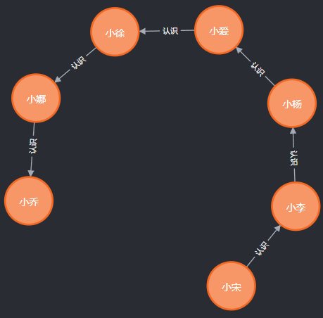

# 技术分享 | 用图数据库来降低 MySQL 处理多层关系的延迟（一）

**原文链接**: https://opensource.actionsky.com/20220119-mysql/
**分类**: MySQL 新特性
**发布时间**: 2022-01-18T23:12:14-08:00

---

作者：杨涛涛
资深数据库专家，专研 MySQL 十余年。擅长 MySQL、PostgreSQL、MongoDB 等开源数据库相关的备份恢复、SQL 调优、监控运维、高可用架构设计等。目前任职于爱可生，为各大运营商及银行金融企业提供 MySQL 相关技术支持、MySQL 相关课程培训等工作。
本文来源：原创投稿
*爱可生开源社区出品，原创内容未经授权不得随意使用，转载请联系小编并注明来源。
MySQL 数据库可以用来处理绝大多数在线业务场景，而且能处理得很好，无论从单节点性能，或者说从多机扩展后的总体吞吐量来讲，都很占优势。不过，万事无绝对，MySQL 在某些场景下性能并不能达到预期。例如在各种繁杂的关系处理方面，MySQL处理起来就有些吃力。此类场景下，NoSQL 就比关系型数据库要更加合适。本篇我们用图数据库Neo4J（NoSQL的一种）来举例说明在这种场景下如何弥补 MySQL 的不足。
**这里先用简单的人物关系来举例说明。**
对于简单的人物关系，比如说小宋、小李、小杨、小爱、小徐、小娜、小乔几个人之间的关系链条可能如下：
- 
小宋 “认识” 小李。
- 
小李 ”认识“ 小杨。
- 
小杨 “认识“ 小爱。
- 
小爱 ”认识” 小徐。
- 
小徐 “认识“ 小娜。
- 
小娜 ”认识” 小乔。
其中 “认识” 即为几个人之间的关系。 这样的关系有很多种，比如 “认识”、“见过”、”好友“、”同事“，”暗恋“、”恋人“ 等等。本篇我们先来看基本的关系：”认识“。也就是说关系仅仅“认识”而已，别无其他。
##### 假设有如下三个需求：
- 
###### 找出用户总数目。
- 
###### 找出“认识” 小杨 并且 小杨 又 “认识” 的人。
- 
###### 找出小杨 “认识” 的 “认识” 的 “认识” 的 “认识” 的人。
##### 对于这样几个需求，我们先基于 MySQL 来设计两张表：（如果仅仅实现最后两个需求，只需要表 2 即可。）
表1：用户表，存储用户记录；表2：用户关系表，存储用户之间的关系。 为了简化起见，两张表无主键，由MySQL 内部分配。
`mysql:ytt>create table user1 (name varchar(64));
Query OK, 0 rows affected (0.09 sec)
mysql:ytt>insert user1 values ("小宋"),("小李"),("小杨"),("小爱"),("小徐"),("小娜"),("小乔");
Query OK, 7 rows affected (0.01 sec)
Records: 7  Duplicates: 0  Warnings: 0
mysql:ytt>create table relation1 (user_name varchar(64),friend_name varchar(64));
Query OK, 0 rows affected (0.07 sec)
mysql:ytt>insert relation1 values ("小宋","小李"),("小李","小杨"),("小杨","小爱"),("小爱","小徐"),("小徐","小娜"),("小娜","小乔");
Query OK, 6 rows affected (0.01 sec)
Records: 6  Duplicates: 0  Warnings: 0
`
**那我们来实现以上三个需求：**
- 
找出用户总数目： 非常简单，直接求 count(*) 即可。
`   mysql:ytt>select count(*) as total_number from user1;
+--------------+
| total_number |
+--------------+
|            7 |
+--------------+
1 row in set (0.00 sec)
`
- 
找出“认识” 小杨 并且 小杨 又 “认识” 的人： 由于记录条数少，直接全表过滤。
`   mysql:ytt>select * from (select (case when friend_name = "小杨" then user_name when user_name = "小杨" then friend_name end) as user_name from relation1) as sub_table where user_name is not null;
+-----------+
| user_name |
+-----------+
| 小李      |
| 小爱      |
+-----------+
2 rows in set (0.00 sec)
`
- 
找出小杨 “认识” 的 “认识” 的 “认识” 的 “认识” 的人： 也就是找到以小杨为起点的四层关系网的最终用户名。
`   mysql:ytt>select d.friend_name from relation1 b 
-> inner join relation1 a on  b.user_name = "小杨" and b.friend_name = a.user_name
-> inner join relation1 c on a.friend_name = c.user_name
-> inner join relation1 d on c.friend_name = d.user_name;
+-------------+
| friend_name |
+-------------+
| 小乔        |
+-------------+
1 row in set (0.00 sec)
`
以上三个需求，特别是第三个。 找出以小杨为起点的关系网，层数越多，需要 join 的表个数越多。在 MySQL 里，表关联数量越多，性能也就越差，后期我将会在“SQL 优化” 主题里继续延伸探讨这个问题。
##### 我们用图数据库 Neo4J 来解决同样的需求。
创建用户节点以及用户之间的关系，
`neo4j@ytt> create (x1:user {name:"小宋"}),
(x2:user {name:"小李"}),
(x3:user {name:"小杨"}),
(x4:user {name:"小爱"}),
(x5:user {name:"小徐"}),
(x6:user {name:"小娜"}),
(x7:user {name:"小乔"})
with x1,x2,x3,x4,x5,x6,x7
create (x1)-[:认识]->(x2),
(x2)-[:认识]->(x3),
(x3)-[:认识]->(x4),
(x4)-[:认识]->(x5),
(x5)-[:认识]->(x6),
(x6)-[:认识]->(x7);
0 rows
ready to start consuming query after 269 ms, results consumed after another 0 ms
Added 7 nodes, Created 6 relationships, Set 7 properties, Added 7 labels
`
对应的关系图展示如下：

**以上需求在 Neo4J 里的实现如下：**
- 
需求一：
`   neo4j@ytt> match(x:user) return count(*) as total_number;
+--------------+
| total_number |
+--------------+
| 7            |
+--------------+
1 row
ready to start consuming query after 21 ms, results consumed after another 1 ms
`
- 
需求二：
`   neo4j@ytt> match (y1:user)-[:认识]->(x:user {name:"小杨"})-[:认识]->(y2:user) return y1.name,y2.name;
+-------------------+
| y1.name | y2.name |
+-------------------+
| "小李"    | "小爱"    |
+-------------------+
1 row
ready to start consuming query after 95 ms, results consumed after another 2 ms
`
- 
需求三：
`   neo4j@ytt> match(x:user {name:"小杨"})-[:认识*4]->(y) return y.name;
+--------+
| y.name |
+--------+
| "小乔"   |
+--------+
1 row
ready to start consuming query after 398 ms, results consumed after another 174 ms
`
单从三个需求的查询结果上看，MySQL 和 Neo4J 性能差不多，区别只是写法上有些差异。但是如果把数据量放大，特别是对需求三的处理，MySQL 就有点吃力了。
我们来把数据放大数倍，用户表记录数增加到千条，关系表记录数增加到十万条。
分别给用户表和关系表造点数据：(user1.csv 里包含 1100个 用户，relation1.csv 里包含 1W 条记录，每个用户大概“认识” 100 个人，并且给关系表加上索引。)
`mysql:ytt>truncate table user1;
Query OK, 0 rows affected (0.19 sec)
mysql:ytt>load data infile '/var/lib/mysql-files/user1.csv' into table user1 fields terminated by ',' enclosed by '"';
Query OK, 1100 rows affected (0.10 sec)
Records: 1100  Deleted: 0  Skipped: 0  Warnings: 0
mysql:ytt>truncate table relation1;
Query OK, 0 rows affected (0.11 sec)
mysql:ytt>load data infile '/var/lib/mysql-files/relation1.csv' into table relation1 fields terminated by ',' enclosed by '"';
Query OK, 100000 rows affected (1.60 sec)
Records: 100000  Deleted: 0  Skipped: 0  Warnings: 0
mysql:ytt>alter table relation1 add key idx_user_name (user_name), add key idx_friend_name(friend_name);
Query OK, 0 rows affected (4.09 sec)
Records: 0  Duplicates: 0  Warnings: 0
`
表部分数据如下：
`mysql:ytt>table user1 limit 2;
+-------+
| name  |
+-------+
| user1 |
| user2 |
+-------+
2 rows in set (0.00 sec)
mysql:ytt>table relation1 limit 2;
+-----------+-------------+
| user_name | friend_name |
+-----------+-------------+
| user1     | user101     |
| user2     | user101     |
+-----------+-------------+
2 rows in set (0.00 sec)
`
接下来实现第三个需求：
这里把用户“小杨” 替换为“user1”， 由于结果很多，所以只求个总数即可，花费时间4分多钟，对于用户端来讲，已经无法接受。
`mysql:ytt>select count(distinct d.friend_name) as cnt from relation1 b 
-> inner join relation1 a on  b.user_name = "user1" and b.friend_name = a.user_name
-> inner join relation1 c on a.friend_name = c.user_name
-> inner join relation1 d on c.friend_name = d.user_name;
+-----+
| cnt |
+-----+
| 100 |
+-----+
1 row in set (4 min 15.47 sec)
`
接下来把 MySQL 数据导入到 Neo4J ，来继续实现同样的需求：
导入节点：
`neo4j@ytt> load csv from  "file:///user1.csv" as x create (a:user {name:x[0]});
0 rows
ready to start consuming query after 523 ms, results consumed after another 0 ms
Added 1100 nodes, Set 1100 properties, Added 1100 labels
`
导入关系：
`neo4j@ytt> load csv from "file:///relation1.csv" as x with x match (a:user {name:x[0]}), (b:user {name:x[1]}) merge (a)-[:认识]-(b);
Created 100000 relationships, completed after 94636 ms.
`
给节点加上索引：
`neo4j@ytt> create index on :user(name);
0 rows
ready to start consuming query after 31 ms, results consumed after another 0 ms
Added 1 indexes
`
Neo4J 实现第三个需求：执行时间小于1秒，已经比 MySQL 快了很多倍。
`neo4j@ytt> match(x:user {name:"user1"})-[*4]->(y) 
return count(distinct y.name) as total_friend;
+--------------+
| total_friend |
+--------------+
| 100          |
+--------------+
1 row
ready to start consuming query after 44 ms,
results consumed after another 692 ms
`
**总结：**
本篇基于图数据库在处理人物关系上优于关系型数据库的基础上做了简单介绍，更多关系处理，请继续阅读后续篇章。