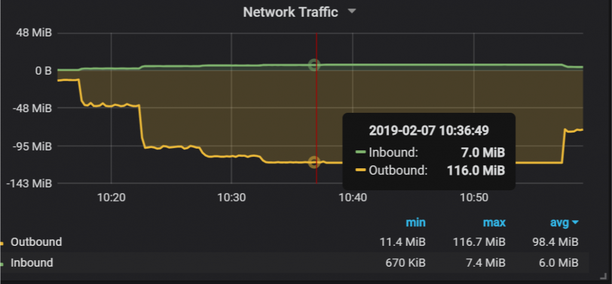
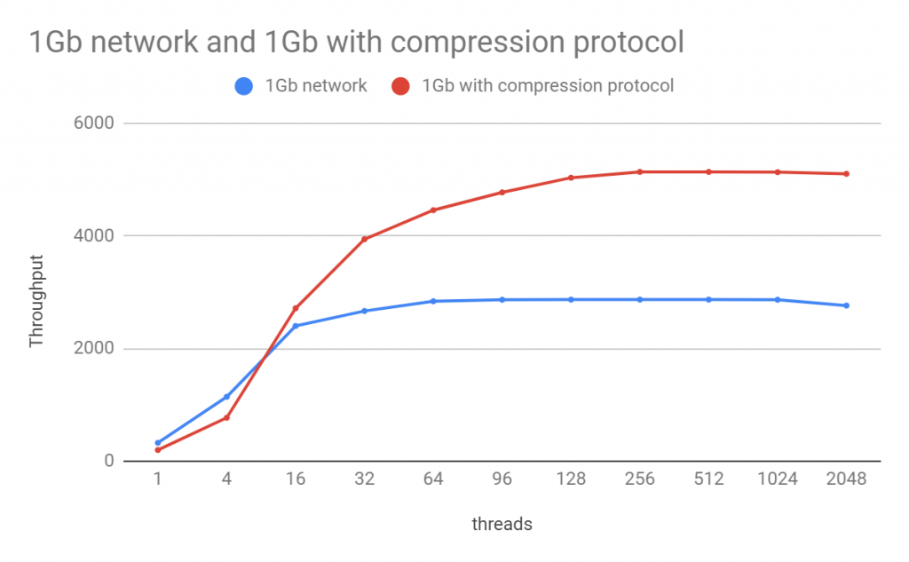
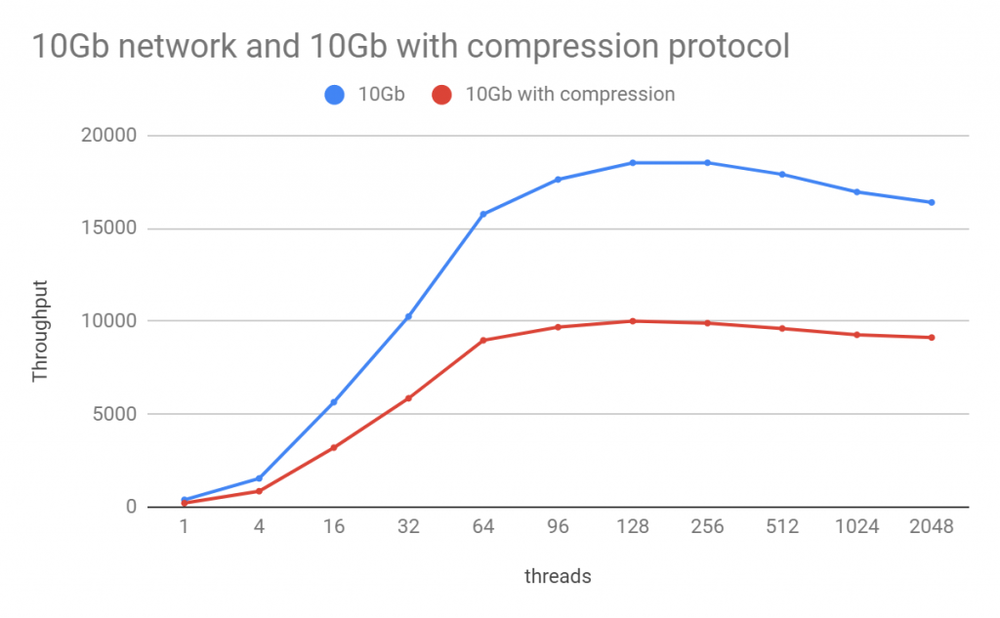
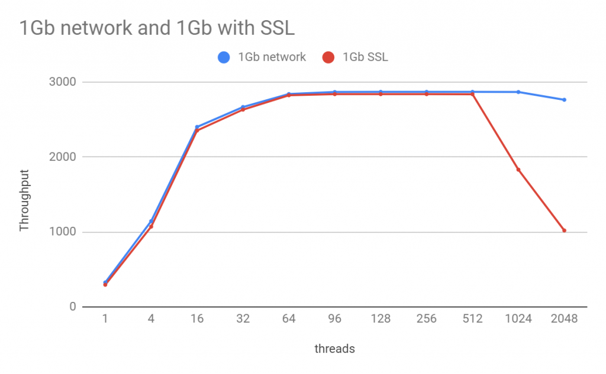
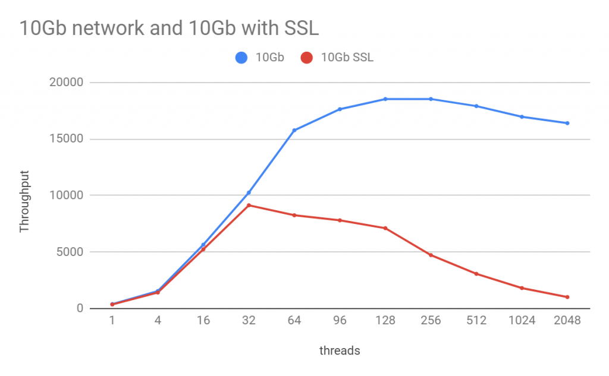

# 技术分享 | 网络带宽如何影响 MySQL 性能

**原文链接**: https://opensource.actionsky.com/20190819-mysql/
**分类**: MySQL 新特性
**发布时间**: 2019-08-19T17:26:34-08:00

---

作者：Vadim Tkachenko
网络是数据库基础架构的主要部分。但是，通常性能基准测试是在本地计算机上完成的，客户端和服务器并置在一起。这样做是为了简化结构并排除一个以上的变量（网络部分），但是我们也忽略了网络对性能的影响。
对于像 MySQL Group Replication 这样的产品集群来说，网络更为重要。
在这篇文章中，我将介绍网络设置。这些都是简单而微不足道的，但却是让我们更了解复杂网络设置效果的基石。
## 安装
我将使用两台裸机服务器，通过专用的 10Gb 网络连接。我将通过使用 `ethtool-s eth1 speed1000duplex full autoneg off` 命令更改网络接口速度来模拟 1Gb 网络。
											
我将运行一个简单的基准：
sysbench oltp_read_only --mysql-ssl=on --mysql-host=172.16.0.1 --tables=20 --table-size=10000000 --mysql-user=sbtest --mysql-password=sbtest --threads=$i --time=300 --report-interval=1 --rand-type=pareto
运行时线程数从 1 到 2048 不等。所有数据都适合内存 `-innodb_buffer_pool_size` 足够大。因此工作负载在内存中占用大量 CPU：没有 IO 开销。操作系统：Ubuntu 16.04
## N1 基准-网络带宽
在第一个实验中，我将比较 1Gb 网络和 10Gb 网络。
											
											
显然，1Gb 网络性能是这里的瓶颈，如果我们迁移到 10Gb 网络，我们可以显着改善我们的结果。要查看 1Gb 网络是瓶颈，我们可以检查 PMM（percona 的数据库监控管理开源工具） 中的网络流量图表：
											
我们可以看到我们的吞吐量达到了 116 MiB/s（或 928 Mb/s)，这非常接近网络带宽。但是，如果我们的网络基础设施仅限于 1Gb，我们可以做些什么？
## N2 基准-协议压缩
MySQL 协议中有一个功能，您可以看到客户端和服务器之间的网络交换压缩：`--mysql-compression=on`。让我们看看它将如何影响我们的结果。
											
											
这是一个有趣的结果。当我们使用所有可用的网络带宽时，协议压缩实际上有助于改善结果。
											
											
但是 10Gb 网络不是这种情况。压缩/解压缩所需的 CPU 资源是一个限制因素，通过压缩，吞吐量实际上只达到我们没有压缩的一半。现在让我们谈谈协议加密，以及如何使用 SSL 影响我们的结果。
## N3基准-网络加密
											
											
											
											
对于 1Gb 网络，SSL 加密显示了一些损失 &#8211; 单线程约为 10％ &#8211; 但是否则我们再次达到带宽限制。我们还看到了大量线程的可扩展性，这在 10Gb 网络案例中更为明显。使用 10Gb 时，SSL 协议在 32 个线程后不会扩展。实际上，它似乎是 MySQL 目前使用的 OpenSSL 1.0 中的可伸缩性问题。在我们的实验中，我们看到 OpenSSL 1.1.1 提供了更好的可伸缩性，但是您需要从链接到 OpenSSL 1.1.1 的源代码中获得特殊的 MySQL 构建才能实现这一点。我没有在这里展示它们，因为我们没有生产二进制文件。
## 结论
1. 网络性能和利用率将影响一般应用程序吞吐量。
2. 检查您是否达到了网络带宽限制。
3. 如果受到网络带宽的限制，协议压缩可以改善结果，但如果不是，则可能会使事情变得更糟。
4. SSL 加密在线程数量较少的情况下会有一些损失（约10％），但对于高并发工作负载，它不会扩展。
阅读原文：
https://www.percona.com/blog/2019/02/19/how-network-bandwidth-affects-mysql-performance/
**近期社区动态**
