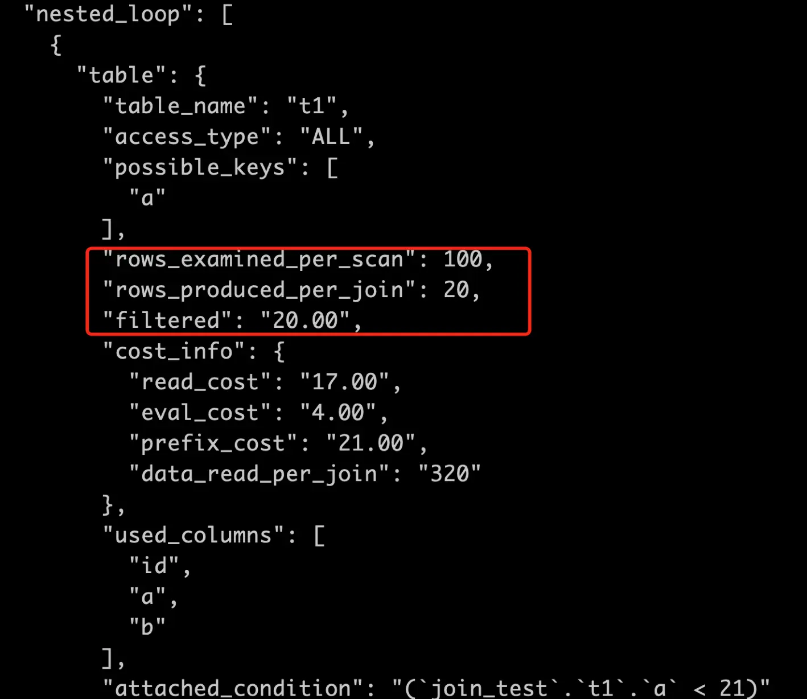
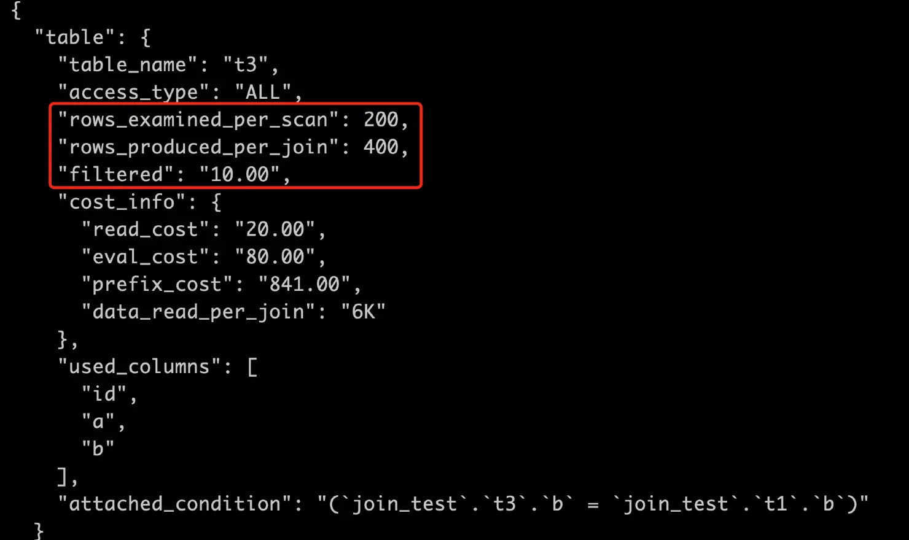
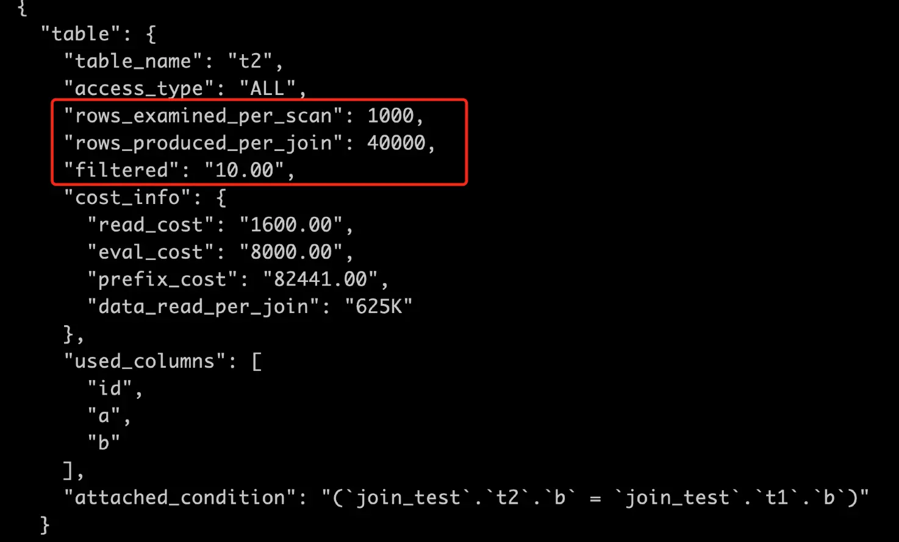
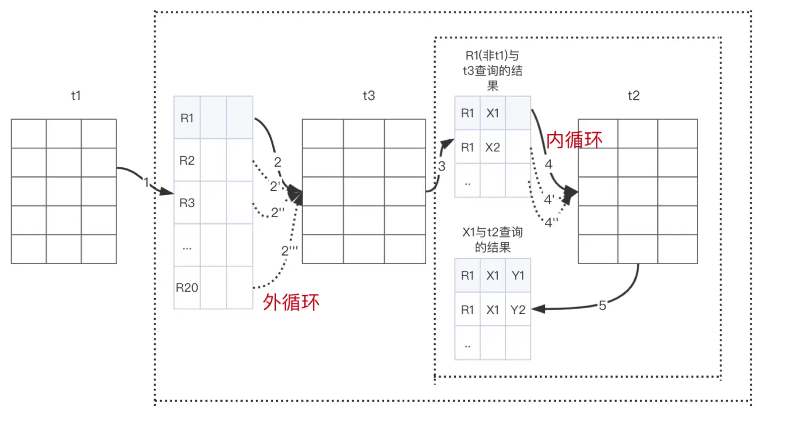

# 技术分享 | 详解 MySQL 三表 JOIN

**原文链接**: https://opensource.actionsky.com/%e6%8a%80%e6%9c%af%e5%88%86%e4%ba%ab-%e8%af%a6%e8%a7%a3-mysql-%e4%b8%89%e8%a1%a8-join/
**分类**: MySQL 新特性
**发布时间**: 2023-12-27T17:54:07-08:00

---

常听说 MySQL 中三表 JOIN 的执行流程并不是前两张表 JOIN 得出结果，再与第三张表进行 JOIN；而是三表嵌套的循环连接。
> 
作者：胡呈清，爱可生 DBA 团队成员，擅长故障分析、性能优化，个人博客：[简书 | 轻松的鱼]，欢迎讨论。
爱可生开源社区出品，原创内容未经授权不得随意使用，转载请联系小编并注明来源。
本文共 2000 字，预计阅读需要 8 分钟。
那这个三表嵌套的循环连接具体又是个什么流程呢？与前两张表 JOIN 得出结果再与第三张表进行 JOIN 的执行效率相比如何呢？下面通过一个例子来分析分析。
# 前提
关联字段无索引的情况下强制使用索引嵌套循环连接算法，目的是更好的观察扫描行数。
`set optimizer_switch='block_nested_loop=off';`
表结构和数据如下：
`CREATE TABLE `t2` (
`id` int(11) NOT NULL,
`a` int(11) DEFAULT NULL,
`b` int(11) DEFAULT NULL,
PRIMARY KEY (`id`),
KEY `a` (`a`)
) ENGINE=InnoDB;
drop procedure idata;
delimiter ;;
create procedure idata()
begin
declare i int;
set i=1;
while(i<=1000)do
insert into t2 values(i, i, i);
set i=i+1;
end while;
end;;
delimiter ;
call idata();
create table t1 like t2;
create table t3 like t2;
insert into t1 (select * from t2 where id<=100);
insert into t3 (select * from t2 where id<=200);
`
示例 SQL：
`select * from t1 join t2 on t1.b=t2.b  join t3 on t1.b=t3.b where t1.a<21;
`
# 通过扫描行数分析 JOIN 过程
通过 slow log 得知一共扫描 24100 行：
`# Query_time: 0.016162  Lock_time: 0.000249 Rows_sent: 20  Rows_examined: 24100
SET timestamp=1617348099;
select * from t1 join t2 on t1.b=t2.b  join t3 on t1.b=t3.b where t1.a<21;
`
执行计划显示用的索引嵌套循环连接算法：
`mysql> explain select * from t1 join t2 on t1.b=t2.b  join t3 on t1.b=t3.b where t1.a<21;
+----+-------------+-------+------------+------+---------------+------+---------+------+------+----------+-------------+
| id | select_type | table | partitions | type | possible_keys | key  | key_len | ref  | rows | filtered | Extra       |
+----+-------------+-------+------------+------+---------------+------+---------+------+------+----------+-------------+
|  1 | SIMPLE      | t1    | NULL       | ALL  | a             | NULL | NULL    | NULL |  100 |    20.00 | Using where |
|  1 | SIMPLE      | t3    | NULL       | ALL  | NULL          | NULL | NULL    | NULL |  200 |    10.00 | Using where |
|  1 | SIMPLE      | t2    | NULL       | ALL  | NULL          | NULL | NULL    | NULL | 1000 |    10.00 | Using where |
+----+-------------+-------+------------+------+---------------+------+---------+------+------+----------+-------------+
`
扫描行数构成：
- t1 扫描 100行；
- t3 扫描 20*200=4000 行；
- t2 扫描 20*1000=20000 行。
总行数=100+4000+20000=24100。
从这个结果来看，JOIN 过程像是先 `t1` 和 `t3` 表 JOIN 得出 20 行中间结果，再与 `t2` 进行 JOIN 得出结果。这结论与我们通常认为的三表 JOIN 实际上是三表嵌套的循环连接不一样，接着往下看。
# 通过执行成本分析 JOIN 过程
查看执行计划成本：
`mysql> explain format=json select * from t1 join t2 on t1.b=t2.b join t3 on t1.b=t3.b where t1.a<21\G`
其他信息：
- `t1` 表 100 行，只有 1 个数据页（可通过 `mysql.innodb_table_stats`）；
- `t2` 表 1000 行，有 4 个数据页；
- `t3` 表 200 行，只有 1 个数据页；
- `io_block_read_cost=1.0`，成本常数（MySQL 5.7）：读取一个页面花费的成本默认是 1.0；
- `row_evaluate_cost=0.2`，成本常数（MySQL 5.7）：读取以及检测一条记录是否符合搜索条件的成本默认是 0.2。
### t1 是驱动表，全表扫描。
- 扫描 100 行；
- 预估满足条件的只有 20%，即 100 * 20%=20，即 `t1` 的扇出。
*IO 成本=1 * 1.0=1*
*CPU 成本=100 * 0.2=20*
*扫描 `t1` 总成本=21*

### t3 是被驱动表，全表扫描
- 每次扫描 200 行；
- 因为驱动表扇出为 20，所以要查找 20 次 `t3`，总共会扫描 20 * 200=4000 行；
- 预估满足条件的行只有扫描行数的 10%，即 4000 * 10%=400，即为 `t1 join t3` 后的扇出，即 rows_produced_per_json。
*IO 成本=1 * 1.0=1*
*CPU 成本=200 * 0.2=40*
*扫描 `t3` 表总成本=驱动表扇出 * (IO 成本+CPU 成本)=20 * (1+40)=820*
*阶段性总成本=21+820=841*
*此处 `eval_cost=80`，实则为驱动表扇出 `被驱动每次扫描行数*filtered*成本常数`，即 20 * 200 * 10% * 0.2*
*简化公式为：`eval_cost=rows_produced_per_json * 成本常数`*

### t2 也是被驱动表，全表扫描
- 每次查找扫描1000行；
- 要查找 400 次，总共会扫描 400 * 1000=400000 行；
- 预估满足条件的只有 10%，即 400000 * 10%=40000，即为 t2 的扇出，即 `rows_produced_per_json`。
*IO 成本=4 * 1.0=4*
*CPU 成本=1000 * 0.2=200*
*扫描 `t2` 表总成本=前 2 表 JOIN 的扇出 * (IO 成本+CPU 成本)=400 * (4+200)=81600*
*阶段性总成本=841+81600=82441*
*此处 `eval_cost=8000`，即 `rows_produced_per_json*成本常数`，即`40000*0.2`*

根据执行计划成本分析：
- `t1` 表查找 1 次，每次扫描 100行；
- `t3` 表查找 20 次，每次扫描 200 行；
- `t2` 表查找 400 次，每次扫描 1000 行。
这样看，三表 JOIN 流程是：
- 全表扫描 `t1`，满足条件的有 20 行，先取第 1 行数据记为 R1；
- 从 R1 中取出 b 字段去 `t3` 表中查找；
- 
取出 `t3` 中满足条件的行，跟 R1 组成一行，作为结果集的一部分，从结果集中取第 1 行数据记为  X1；
a. 从 X1 中取出 b 字段去 `t2` 表中查找；
b. 取出 `t2` 中满足条件的行，跟 X1 组成一行，作为结果集的一部分；
c. 重复 a、b 步骤，直到结束。
- 重复 2、3 步骤，直到结束。
图示（这里展示的是索引嵌套循环算法时三表 JOIN 的流程，块循环嵌套算法不一样）：

> 
注意：由于造的数据比较特殊，所以第 3 步得出的中间结果集实际上只有 1 行，所以最终 `t2` 表的查找次数是 20 * 1=20，所以扫描总行数是 20 * 1000。所以单看 slow log 中显示的 24100 行，会误认为是先得出 `t1` 和 `t3` JOIN 的结果，再去和 `t2` 进行 JOIN。
当我调整 `t3` 的数据，删除 20 行，再插入 20 行，使满足 b<21 的数据翻倍，这样“第 3 步得出的中间结果集”变成 2 行：
`mysql> delete from t3 where id>180;
Query OK, 20 rows affected (0.00 sec)
mysql> insert into t3 select * from t3 where b<21;
Query OK, 20 rows affected (0.00 sec)
`
再来看 slow log 中扫描的总行数为 44100，`t1`、`t3` 的扫描行数不变，`t2` 的扫描行数变为 `20 * 2* 1000=40000`：
`# Query_time: 0.013848  Lock_time: 0.000100 Rows_sent: 40  Rows_examined: 44100
SET timestamp=1617354884;
select * from t1 join t2 on t1.b=t2.b  join t3 on t1.b=t3.b where t1.a<21;
`
**为什么执行计划中分析得到的是 t2 表查找 400 次呢？**
因为执行计划对 `t1` JOIN `t3` 的扇出是个估算值，不准确。而 slow log 是真实执行后统计的，是个准确值。
**为什么执行计划中，t2 表的执行次数是用“t1 join t3 的扇出”表示的？这不是说明 t1 先和 t3 JOIN，结果再和 t2 JOIN？**
其实拆解来看，“三表嵌套循环” 和 “前两表 JOIN 的结果和第三张表 JOIN” 两种算法，成本是一样的，而且如果要按三表嵌套循环的方式展示每张表的成本将非常复杂，可读性不强。所以执行计划中这么表示没有问题。
# 总结
总的来说，对于三表 JOIN 或者多表 JOIN 来说，“三表嵌套循环” 和 “先两表 JOIN，结果和第三张表 JOIN” 两种算法，成本是一样的。
当被驱动表的关联字段不是唯一索引，或者没有索引，每次扫描行数会大于 1 时，其扇出误差会非常大。比如在上面的示例中：
`t3` 表实际的扇出只有 20，但优化器估算值是总扫描行数的 10%，由于 `t3` 表的关联字段没有索引，所以每次都要全表扫描 200 行，总的扫描行数=20 * 200=4000，扇出=4000 * 10%=400，比实际的 20 大了 20 倍。尤其对于后续表的 JOIN 来说，成本估算会产生更严重的偏差。
如果是 LEFT JOIN，每个被驱动表的 filtered 都会被优化器认定为 100%，误差更大！
通常建议 JOIN 不超过两张表，就是因为优化器估算成本误差大导致选择不好的执行计划，如果要用，一定要记住：**关联字段必须要有索引，最好是唯一性或者基数大的索引。** 
*补充：MySQL 8.0 有 HASH JOIN 后这种情况会好很多。*