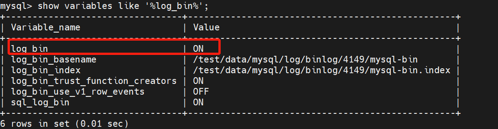
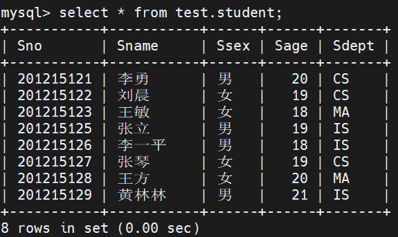

# 技术分享 | 误删表以及表中数据，该如何恢复？

**原文链接**: https://opensource.actionsky.com/20220726-binlong/
**分类**: 技术干货
**发布时间**: 2022-07-26T00:22:34-08:00

---

作者：杨小云
爱可生数据库工程师，负责 MySQL 日常维护及 DMP 产品支持。擅长mysql故障处理。
本文来源：原创投稿
*爱可生开源社区出品，原创内容未经授权不得随意使用，转载请联系小编并注明来源。
#### 场景：
客户误删了一张表，所以 想恢复某张表的数据，期望恢复到删除之前的数据。
#### 前提：
数据库误删某表恢复方法，下面介绍的的方法是针对每天有备份的数据库和开启 binlog 日志的。
说明：本文中的测试库为 test 数据库，测试表是 test 中 student 表。
#### 一、开启 binlog 日志，并备份数据
##### 1.查看数据库是否开启binlog日志

如果没有开启，需要下面的方法进行开启
（1）在linux系统下，修改/etc/my.cnf文件
#编辑模式进入/etc/my.cnf
vi /etc/my.cnf
# i开始进行编辑
# 在#log bin 后面添加内容
server_id=2
log_bin = mysqlbin
binlog_format = ROW
expire_logs_days = 30
log_bin_basename= /数据库实例安装目录/log/binlog/端口号/mysql-bin       
log_bin_index=/数据库实例安装目录/log/binlog/端口号/mysql-bin.index
# esc 退出编辑，shift+:保存
（2）重启 mysql 服务
systemctl restart mysqld
到这里已经开启 binlog 了，可以用查看命令看一下是否开启
##### 2. 查看一下数据表中的数据

##### 3. 备份数据
备份命令格式：
mysqldump [选项] 数据库名 [表名] > 脚本名
mysqldump [选项] --数据库名 [选项 表名] > 脚本名
mysqldump [选项] --all-databases [选项] > 脚本名
（1）备份所有数据库
mysqldump -h10.186.63.4 -P4149 -uu1 -p1234567890q@ -all-databases > /test1.sql
（2）备份单库（多个库之间以空格间隔）
mysqldump -h10.186.63.4 -P4149 -uu1 -p1234567890q@ database > test2.sql
（3）备份单表(多个表以空格间隔)
mysqldump -h10.186.63.4 -P4149 -uu1 -p1234567890q@ database table  > test3.sql
（4）备份指定数据库排除某些表
mysqldump -h10.186.63.4 -P4149 -uu1 -p1234567890q@ database --ignore-table=db.tb --ignore-table=db.tb2 > /test4.sql
#### 4. 插入数据后删除数据库
插入数据，生成 binlog 日志
mysql> insert into student values('201215130','张三','男',21,'IS');
Query OK, 1 row affected (0.03 sec)
mysql>  insert into student values('201215131','李四','女',20,'MA');
Query OK, 1 row affected (0.02 sec)
删除数据库
mysql> drop database test;
Query OK, 1 row affected (0.10 sec)
**切记这个时候不要有任何的操作！！！**
#### 二、恢复数据
##### 1. 查看当前的 binlog
mysql>  show master status\G;
************************ 1. row ***************************
File: mysql-bin.000021
Position: 68403303
Binlog_Do_DB:
Binlog_Ignore_DB:
Executed_Gtid_Set: 130df5fa-01c1-11ed-916a-02000aba3f04:1-446151
1 row in set (0.00 sec)
ERROR:
No query specified
注：mysql-bin.000021文件将作为恢复删除数据的来源之一
##### 2. 拷贝 binlog 日志
将当前的binlog日志拷贝到其他目录，以免后续操作对 binlog日志产生影响
cp  /test/data/mysql/log/binlog/4149/mysql-bin.000021  /root
##### 3. 将转换 binlog 日志为 sql
命令格式为：mysqlbinlog -d database mysql-bin文件 > xx.sql
如：
/data/mysql/base/5.7.25/bin/mysqlbinlog -d test mysql-bin.000021 > 0021bin.sql
[root@test2 4149]# /data/mysql/base/5.7.25/bin/mysqlbinlog -d test mysql-bin.000022 > 0022.sql
WARNING: The option --database has been used. It may filter parts of transactions, but will include the GTIDs in any case. If you want to exclude or include transactions, you should use the options --exclude-gtids or --include-gtids, respectively, instead.
编辑转化后的sql文件
vi 0021bin.sql
将里面的**误操作命令(DROP命令)全部删除**
保存后开始进行恢复数据
##### 4. 恢复备份文件
/data/mysql/base/5.7.25/bin/mysql -h10.186.63.4 -P4149 -uu1 -p1234567890q@  < test.sql 
查看数据库备份文件是否恢复
mysql> show databases;
mysql> use test;
mysql> show tables;
mysql>select * from table;
##### 5. 恢复备份之后被删除的数据
注释掉 binlog 转化后的 sql 文件中的这一行
SET @@GLOBAL.GTID_PURGED=
/*SET @@GLOBAL.GTID_PURGED=XXXX*/;
指定被删除表所在的数据库，导入数据
/data/mysql/base/5.7.25/bin/mysql -h10.186.63.4 -P4149 -uu1 -p1234567890q@  test  < 0021bin.sql
查看恢复后的数据
mysql> select * from test.student;
+-----------+-----------+------+------+-------+
| Sno       | Sname     | Ssex | Sage | Sdept |
+-----------+-----------+------+------+-------+
| 201215121 | 李勇      | 男   |   20 | CS    |
| 201215122 | 刘晨      | 女   |   19 | CS    |
| 201215123 | 王敏      | 女   |   18 | MA    |
| 201215125 | 张立      | 男   |   19 | IS    |
| 201215126 | 李一平    | 男   |   18 | IS    |
| 201215127 | 张琴      | 女   |   19 | CS    |
| 201215128 | 王方      | 女   |   20 | MA    |
| 201215129 | 黄林林    | 男   |   21 | IS    |
| 201215130 | 李四      | 女   |   20 | MA    |
| 201215131 | 张三      | 男   |   21 | IS    |
+-----------+-----------+------+------+-------+
10 rows in set (0.00 sec)