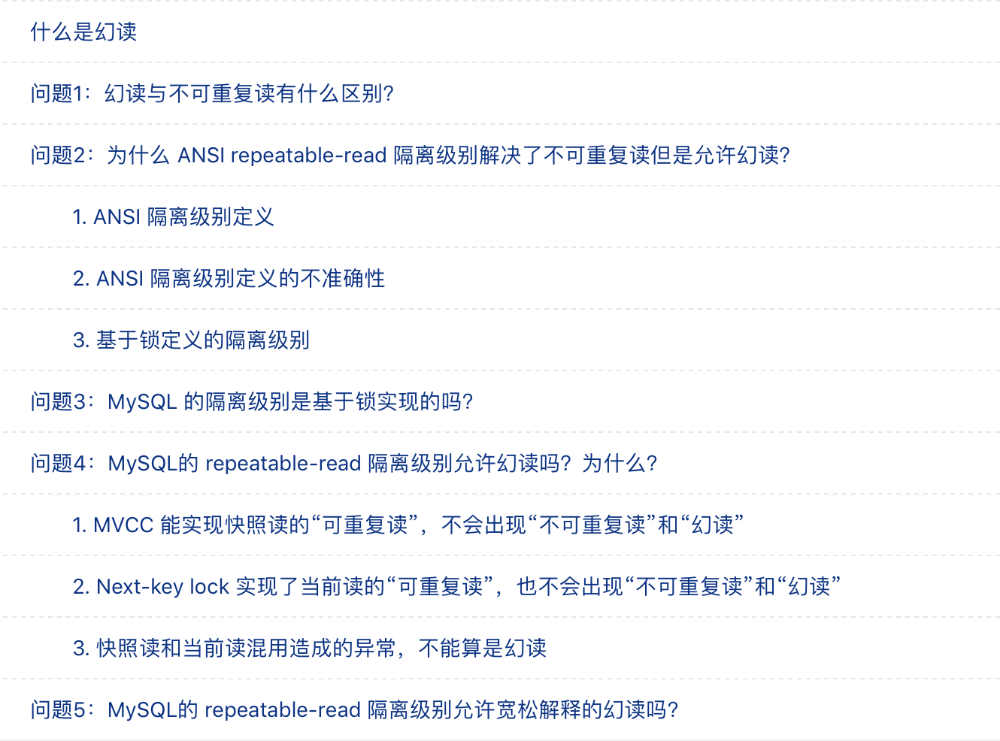
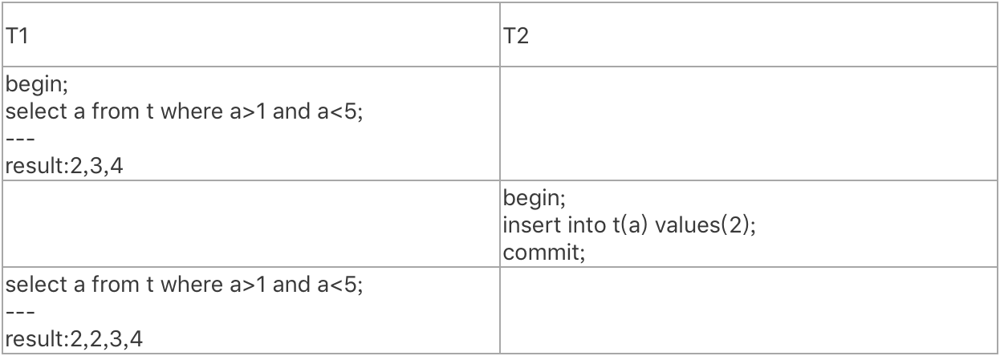
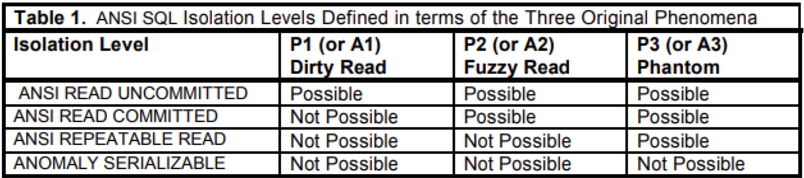
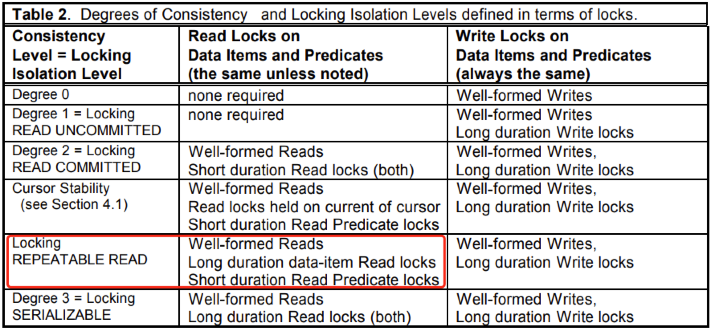
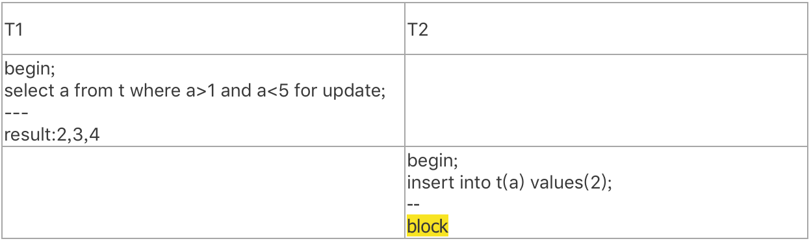
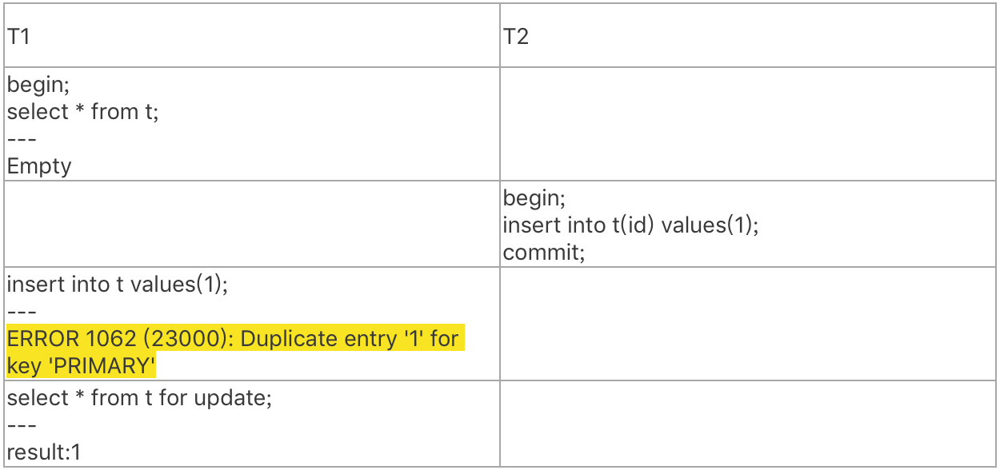
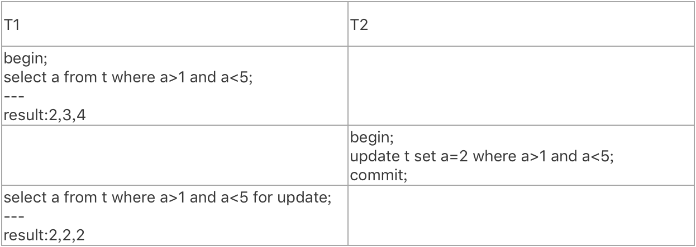
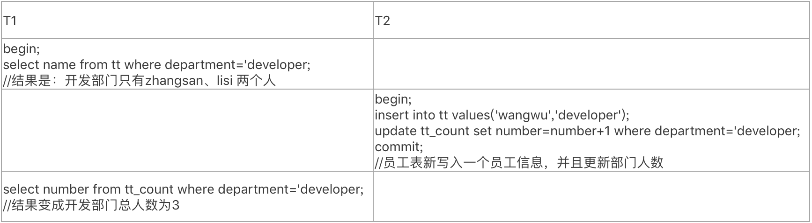

# 技术分享 | 隔离级别：正确理解幻读

**原文链接**: https://opensource.actionsky.com/20210818-mysql/
**分类**: MySQL 新特性
**发布时间**: 2021-08-22T23:41:43-08:00

---

作者：胡呈清
爱可生 DBA 团队成员，擅长故障分析、性能优化，个人博客：https://www.jianshu.com/u/a95ec11f67a8，欢迎讨论。
本文来源：原创投稿
*爱可生开源社区出品，原创内容未经授权不得随意使用，转载请联系小编并注明来源。
在网络上看了几篇关于幻读的文章，总有些不对劲的地方，要么是解释过于官方看不懂，要么压根儿就是错的，于是我找到了著名论文 A Critique of ANSI SQL Isolation Levels ，对幻读问题做了归纳和总结，希望能帮助大家真正理解幻读，大纲如下：

## 什么是幻读
幻读最早由 ANSI SQL-92 的隔离级别定义中提出：
> 
P3 (Phantom): Transaction T1 reads a set of data items satisfying some . Transaction T2 then creates data items that satisfy T1’s  and commits. If T1 then repeats its read with the same , it gets a set of data items different from the first read.
翻译一下：
事务 T1 读取一组满足某些  的数据。事务 T2 创建了满足 T1 的  的数据项并提交。如果 T1 用相同的再次读取，得到一组不同于第一次读取的数据。这就叫幻读。
举个例子：

如果把 T2 执行的 SQL 换成 `update t set a=2 where a>1 and a 
P2 (Non-repeatable or Fuzzy Read): Transaction T1 reads a data item. Another transaction T2 then modifies or deletes that data item and commits. If T1 then attempts to reread the data item, it receives a modified value or discovers that the data item has been deleted.
注意和幻读定义的两个不同：
- 
幻读定义中有 
- 
幻读定义中 T2 是“创建数据”，不可重复读的定义中 T2 是修改或者删除数据
啥意思呢？
在满足  的范围内，修改和删除数据必定是对已经存在的数据行操作，而创建数据则意味着创建之前这个数据项是不存在的。“创建数据”不仅是 insert，还包括 update。update 把本来不满足谓词范围的数据项更新成满足谓词范围的数据项，比如：谓词范围是 a>1 and a
再直观点讲（个人解读），不可重复读是说读的结果的行数不变或者减少，结果的内容发生变化；而幻读呢，就是读的结果的行数变多了。
举例：
已知T1 执行两个SQL：
`//T1
begin;
Q1:select a from t where a>1 and a1 and a
T2在T1的Q1和Q2之间执行并提交以下任意SQL，并造成T1的Q2读到不一样的结果：
` //T2
Q1：insert into t(a) values(2);           //这个符合幻读定义
Q2: update t set a=3 where a=6;          //这个符合幻读定义
Q3: update t set a=2 where a>1 and a1 and a
## 问题2：为什么 ANSI repeatable-read 隔离级别解决了不可重复读但是允许幻读？
### 1. ANSI 隔离级别定义
首先，我们必须厘清一个概念：就是在 ANSI 中，每个隔离级别被一个禁止出现的现象异常现象所定义：

意思就是：
- 
read-uncommitted 对应 P1 脏读；
- 
read-committed 对应 P2 不可重复读；
- 
repeatable-read 对应 P3 幻读；
- 
serializable 没有与之对应的异常现象。
### 2. ANSI 隔离级别定义的不准确性
A Critique of ANSI SQL Isolation Levels 论文（下面简称论文），指出了这个定义的不正确性：
首先 ANSI repeatable-read 级别不符合语义，它并不能做到可重复读，应该改名叫 phantom 之类的。论文中有简单交代其背景：
> 
Date and IBM originally used the name “Repeatable Reads” [DAT, DB2] to mean serializable or Locking SERIALIZABLE. This seemed like a more comprehensible name than the [GLPT] term “Degree 3 isolation."
The ANSI SQL meaning of REPEATABLE READ is different from Date’s original definition, and we feel the terminology is unfortunate. Since anomaly P3 is specifically not ruled out by the ANSI SQL REPEATABLE READ isolation level, it is clear from the definition of P3 that reads are NOT repeatable! We repeat this misuse of the term with Locking REPEATABLE READ in Table 2, in order to parallel the ANSI definition.
翻译：
> 
Date和IBM最初使用名称“Repeatable Reads”[DAT，DB2]表示可串行化或锁可串行化。这似乎是一个比[GLPT]术语“隔离度3”更易理解的名称，尽管它们是相同的。可重复读的ANSI SQL含义与Date的原始定义不同，我们认为这是不幸的。Phenomena P3是ANSI SQL 可重复读隔离级别不考虑的，但从P3的定义可以看出，读取是不可重复的！（译者注：P3 违反了“可重复读”中文词义）我们在表2中仍然误用“锁可重复读”术语，来对应ANSI定义。
其次这个定义导致了一个常见的误解：即不允许 P1、P2、P3 这3种异常现象就意味着可串行化，实际上这是错误的，因为 ANSI 对这3种异常现象的定义不清晰（论文进行了宽松解释，认为宽松解释才是正确的，后面会有解释什么是宽松解释），并且还有其他异常现象比如脏写、丢失更新、写偏移等现象 ANSI 根本没提。所以在上图中（出自论文），对4 种隔离级别添加了 ANSI 前缀，并且 serializable 加了 ANOMALY，表示这不是真正的可串行化。
所以对于问题“为什么 ANSI repeatable-read 隔离级别解决了不可重复读但是允许幻读？”来说，第一层回答是：因为 ANSI 定义就是如此。
但我们还是可以尝试继续研究下背后的原因。
### 3. 基于锁定义的隔离级别
论文中有一张表表示基于锁定义的隔离级别（注意：这个定义其实指明了用锁来实现隔离级别，ANSI 的定义是不考虑具体实现的，并且基于锁的隔离级别满足 ANSI 隔离级别的要求，但又不相同，所以对4种隔离级别加了 locking 前缀）：

locking repeatable-read 隔离级别中，对于读取操作的加锁范围：仅对数据项进行长时间加锁（Long duration data-item Read locks），对于谓词范围仅短时间加锁（Short duration Read Predicate locks）。
谓词锁(Predicate locks)的解释：读取（或写入）的谓词锁（给定的确定的一组数据项下）实际上是对满足的所有数据项的锁。这可能是一个无限集，因为它包括数据库中存在的数据以及当前不在数据库中的所有幻影（phantom）数据项（如果它们被插入，或者当前数据项被更新以满足 ）。
举个简单例子：对于 select a from t where a>1 and a
读取数据前，对数据项(2,3,4)或谓词范围(1,5)请求读锁，这叫“Well-formed Reads”；
- 
读取到数据后，直到事务终止后（提交或回滚），才对数据项(2,3,4)的读锁释放，这叫“Long duration data-item Read locks”；
- 
读取到数据后，立马就把谓词范围(1,5)的读锁释放了，这叫“Short duration Read Predicate locks”。如果直到事务终止后，才对谓词范围(1,5)的锁释放，就叫"Long duration Read Predicate locks"。
用我们马上要讲到的 MySQL 里的概念，对数据项加锁就是记录锁，对谓词范围加锁就是 Next-key 锁（记录锁加间隙锁）。这样我们就知道了，原来在 ANSI 定义中，RR 隔离级别中的读只是对数据记录加了读锁，间隙锁只存在 SQL 执行期间，这样事务T2对T1读取的数据做修改、删除操作时会被阻塞，但是在间隙中插入数据却可以执行。所以根据“不可重复读”和“幻读的定义”， repeatable-read 不允许不可重复读，允许幻读。
## 问题3：MySQL 的隔离级别是基于锁实现的吗？
是由锁和MVCC共同实现的：
- 
SERIALIZABLE 隔离级别，是通过锁来实现的，参考上面基于锁定义的隔离级别：所有读都会对谓词范围加长锁，直到事务终止；
- 
其他隔离级别，是用 MVCC 实现的。普通的 select 称为快照读，是不会加读锁的，目的是为了提升读写并发性能。
## 问题4：MySQL的 repeatable-read 隔离级别允许幻读吗？为什么？
先说答案：不允许。但实际上这个问题略显复杂，我们分几点来阐述。
#### 1. MVCC 能实现快照读的“可重复读”，不会出现“不可重复读”和“幻读”
这是显而易见的，因为 MVCC 实际上就是数据存在多个版本，只需要在实现上保证同一事务的两次快照读读相同的数据版本即可，还不需要用锁来实现（回顾问题2）。
#### 2. 间隙锁（或者说 next-key lock）实现了当前读的“可重复读”，也不会出现“不可重复读”和“幻读”
这里先解释下当前读：读取数据的最新版本（意味着即使是 repeatable-read，当前读也能读到其他事物提交的数据），并且会加对应的锁。在MySQL中下面的操作都是当前读：
`select * from t where a>1 and a1 and a
问题2中描述了为什么 ANSI repeatable-read 允许幻读的原理：因为事务T1的读只对满足条件的数据行加锁，而事务T2插入的位置是数据行之间的间隙，不会被阻塞。在 MySQL repeatable-read 的实现中，当前读的加锁范围是数据行+间隙，所以事务T2的插入会被阻塞，T1的两次当前读结果不会变。举个简单例子：

#### 3. 快照读和当前读混用造成的异常，不能算是幻读
网络上有一些文章说 MySQL repeatable-read 是会出现幻读的，复现用例如下：

当前读的效果就是要读取最新版本，实际上是把隔离级别从 repeatable-read 降级到了 read-committed，所以快照读和当前读混用不算幻读。如果这个说服不了你，那我也举个简单的例子：

我们是不是得说这个例子说明了 repeatable-read 允许“P2不可重复读异常现象”？显然不能。对于不可重复读，repeatable-read 隔离级别是明确不允许的。这就说明了当前读和快照读混用带来的异常不能称为幻读。
## 问题5：MySQL的 repeatable-read 隔离级别允许宽松解释的幻读吗？
不得不提醒大家的是：前文我们说到的幻读都是 ANSI 定义的幻读（严格的幻读），其表达式抽象为：
`A3：r1[P] ... w2[y in P] ... c2 ... r1[P] ... c1`
缩写含义：w1[x]表示事务1写入记录x，r1[x]表示事务1读取记录x，c1表示事务1提交，a1表示事务1回滚，r1[P]表示事务1按照谓词P的条件读取若干条记录，w2[y in P]表示事务2满足谓词P的条件写入记录y。
论文提出对幻读的宽松解释：
`H3：r1 [P] w2 [y in P] r2 [z] w2[z] c2 r1 [z] c1`
事务2增加新雇员并更新雇员总数z，事务1在事务2提交前后读取到了破坏雇员列表与雇员总数的一致性的数据。因为事务1并未重复读取谓词P指定的数据集合，H3的行为并不符合A3的形式化定义，所以A3只能算是一种严格意思上的幻读，所以论文补充了幻读这一异常现象的宽松解释。
为了方便大家理解上面的宽松解释的意思，我细化了下示例：
`//tt是员工表
mysql> select * from tt;
+----------+------------+
| name     | department |
+----------+------------+
| zhangsan | developer  |
| lisi     | developer  |
+----------+------------+
2 rows in set (0.00 sec)
//tt_count是各部门人数统计表
mysql> select * from tt_count;
+------------+--------+
| department | number |
+------------+--------+
| developer  |      2 |
+------------+--------+
1 row in set (0.00 sec)
`

论文对于幻读的宽松解释是：只要事务2对事务1的谓词范围进行了写入（写入成功），不管后面事务1做什么查询，都算是幻读。
其表达式为：
`P3: r1[P]...w2[y in P]...((c1 or a1) and (c2 or a2) any order)`
个人理解，需要从锁实现的角度去看这个问题：基于锁实现的隔离级别，解决幻读的方法就是对谓词范围加锁。换言之，读请求应该阻塞对它所读取到的谓词范围的写请求。
对于 MySQL 来说，即使是宽松解释的幻读，依然可以避免：
- 
MySQL RR 隔离级别的当前读加的锁是 Next-key lock，就是对谓词范围加锁，所以不可能幻读；
- 
如果是快照读的话，由于不加锁，其他事务是可以对谓词范围进行写入的，按照宽松解释的定义，是符合幻读的，但是由于 MVCC 实现了“可重复读”语义，所以实际上又不可能读到幻象行。
备注：个人理解，只要是基于 MVCC 实现的 RR 隔离级别，都不能排除宽松解释的幻读，但这也只是满足定义，并不会真正出现异常情况。所以对于 MySQL 这样基于 MVCC 实现的 RR 隔离级别，大家就当不会出现幻读，而且是符合“repeatable-read” 语义的。
#### 参考资料
> 
Phantom Rows：https://dev.mysql.com/doc/refman/8.0/en/innodb-next-key-locking.html
A Critique of ANSI SQL Isolation Levels：https://www.microsoft.com/en-us/research/wp-content/uploads/2016/02/tr-95-51.pdf
A Critique of ANSI SQL Isolation Levels 论文翻译：https://www.pianshen.com/article/2443612904/
A Critique of ANSI SQL Isolation Levels 论文阅读：https://www.pianshen.com/article/51371657923/
ANSI SQL-92：http://www.contrib.andrew.cmu.edu/~shadow/sql/sql1992.txt?spm=a2c6h.12873639.0.0.632c6c50gWGMa2&file=sql1992.txt