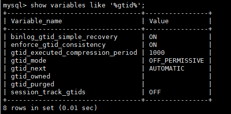
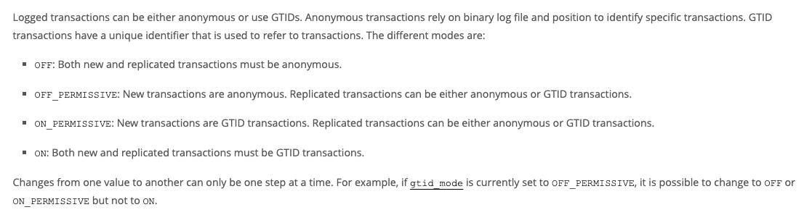
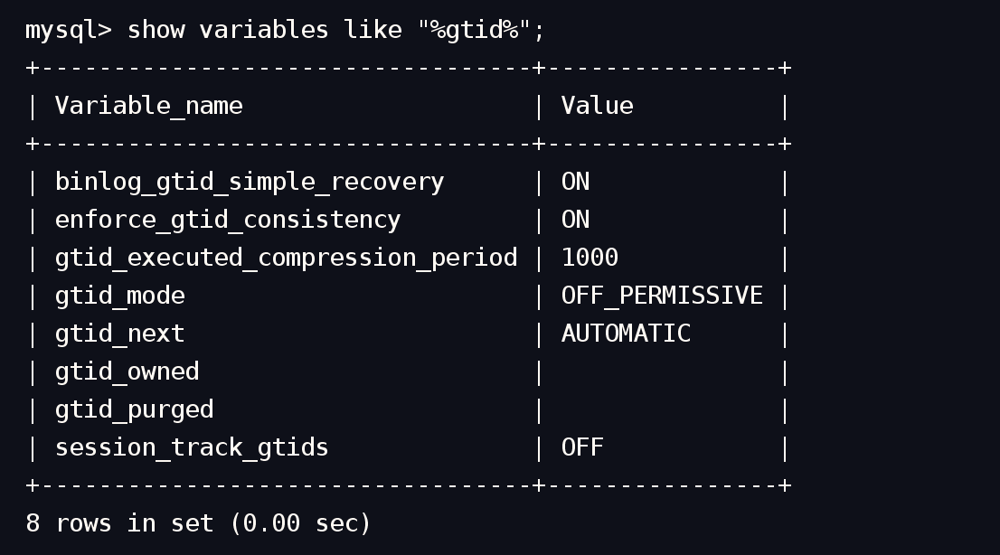
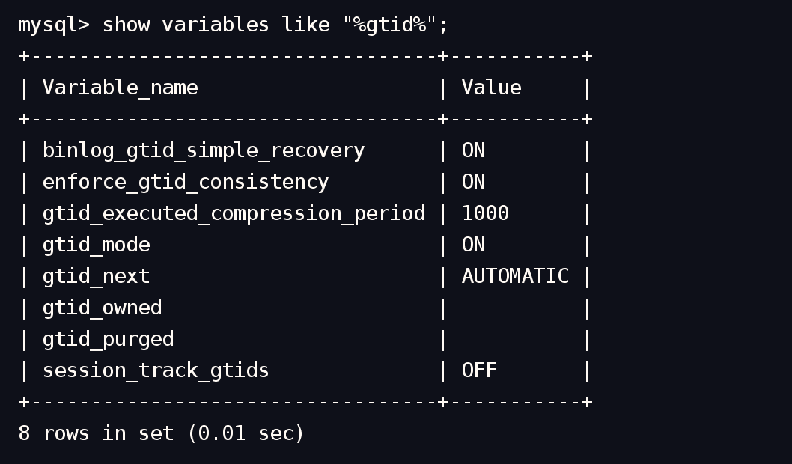
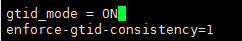

# 技术分享 | 需要小心配置的 gtid_mode

**原文链接**: https://opensource.actionsky.com/20220725-mysql/
**分类**: MySQL 新特性
**发布时间**: 2022-07-24T23:01:23-08:00

---

作者：王雅蓉
DBA，负责 MySQL 日常问题处理和 DMP 产品维护。
本文来源：原创投稿
*爱可生开源社区出品，原创内容未经授权不得随意使用，转载请联系小编并注明来源。
#### 背景信息：
本文章与一次日常运维过程中发现的问题有关。问题如下：
客户给接管数据库进行备份，发生报错：
错误: manual backup error: rpc error: code = Unknown desc = task(manual_backup_manual_mysql-2db0mi_2022_07_09_22_30_33_mysql-2db0mi_2022_07_09_22_30_33) is failed, reason is parse last gtid from file(/dmp/mysql/backup/3306/backup-616678719/tmp/backup.log) failed\n\n回滚日志:\n\t
#### 分析：
因为报错是原因是从文件中解析最后一个 gtid 失败，所以先检查 gtid 参数
数据库中的 gtid 参数：gtid_mode=OFF_PERMISSIVE（接管后数据库重启过）

检查配置文件中gtid_mode相关信息为

通过官网查询相关资料，得知gtid_mode有4个值：OFF；OFF_PERMISSIVE；ON_PERMISSIVE；ON

在此配置下，平台无法开启从库高可用配置，从库复制会报错：
Slave_IO_Running: No            Slave_SQL_Running: Yes......                Last_IO_Errno: 1593                Last_IO_Error: The replication receiver thread cannot start in AUTO_POSITION mode: the master has GTID_MODE = OFF_PERMISSIVE instead of ON.               Last_SQL_Errno: 0               Last_SQL_Error:
而且此时的数据库无法进行备份
本地测试：
1）将数据库配置文件的gtid_mode修改为=1，并重启数据库

2）重启后登录数据库中查看gtid_mode参数值，发现重启后的gtid_mode=OFF_PERMISSIVE

3）将数据库配置文件的gtid_mode修改为=ON，并重启数据库

4)重启后登录数据库中查看gtid_mode参数值，发现重启后的gtid_mode=ON

###### 可得出：gtid_mode = 1效果不等于gtid_mode = ON，而是等于gtid_mode = OFF_PERMISSIVE
###### 因为gtid_mode参数的类型为Enumeration，所以变量具有多个值的别名
| gtid_mode变量 | 配置文件可写值 |
| --- | --- |
| OFF | 0 |
| OFF_PERMISSIVE | 1 |
| ON_PERMISSIVE | 2 |
| ON | 3 |
mysql> show variables like "gtid_mode";
+---------------+-------+
| Variable_name | Value |
+---------------+-------+
| gtid_mode     | OFF   |
+---------------+-------+
1 row in set (0.01 sec) mysql> set global gtid_mode=0;
Query OK, 0 rows affected (0.00 sec) 
mysql> show variables like "gtid_mode";
+---------------+-------+
| Variable_name | Value |
+---------------+-------+
| gtid_mode     | OFF   |
+---------------+-------+
1 row in set (0.00 sec) 
mysql> set global gtid_mode=1;
Query OK, 0 rows affected (0.00 sec) 
mysql> show variables like "gtid_mode";
+---------------+----------------+
| Variable_name | Value          |
+---------------+----------------+
| gtid_mode     | OFF_PERMISSIVE |
+---------------+----------------+
1 row in set (0.01 sec) 
mysql> set global gtid_mode=2;
Query OK, 0 rows affected (0.01 sec) 
mysql> show variables like "gtid_mode";
+---------------+---------------+
| Variable_name | Value         |
+---------------+---------------+
| gtid_mode     | ON_PERMISSIVE |
+---------------+---------------+
1 row in set (0.00 sec) 
mysql> set global gtid_mode=3;
Query OK, 0 rows affected (0.01 sec) 
mysql> show variables like "gtid_mode";
+---------------+-------+
| Variable_name | Value |
+---------------+-------+
| gtid_mode     | ON    |
+---------------+-------+
1 row in set (0.00 sec)
#### 解决方法:
将配置文件中gtid_mode = 1改为gtid_mode = ON

在数据库中输入
mysql> set global GTID_MODE = ON_PERMISSIVE;
Query OK, 0 rows affected (0.02 sec) 
//在主从节点上执行如下命令，检查匿名事务是否消耗完毕，最好多检查几次，以便确认该参数的值是0
mysql> SHOW STATUS LIKE 'ONGOING_ANONYMOUS_TRANSACTION_COUNT';
+-------------------------------------+-------+
| Variable_name                       | Value |
+-------------------------------------+-------+
| Ongoing_anonymous_transaction_count | 0     |
+-------------------------------------+-------+
1 row in set (0.00 sec)  
mysql> set global GTID_MODE = ON;
Query OK, 0 rows affected (0.02 sec)
修改后就可以成功备份数据库了
#### 总结：
###### 日常运维中，我们习惯将设置为ON的参数写成=1，但是gtid_mode=1却不是将gtid_mode设置为ON
###### 所以需注意一定要写gtid_mode=ON，或者gtid_mode=3
### 参考：
[https://dev.mysql.com/doc/mysql-replication-excerpt/8.0/en/replication-options-gtids.html#sysvar_gtid_mode](https://dev.mysql.com/doc/mysql-replication-excerpt/8.0/en/replication-options-gtids.html#sysvar_gtid_mode)
[https://dev.mysql.com/doc/mysql-replication-excerpt/8.0/en/replication-mode-change-online-enable-gtids.html](https://dev.mysql.com/doc/mysql-replication-excerpt/8.0/en/replication-mode-change-online-enable-gtids.html)