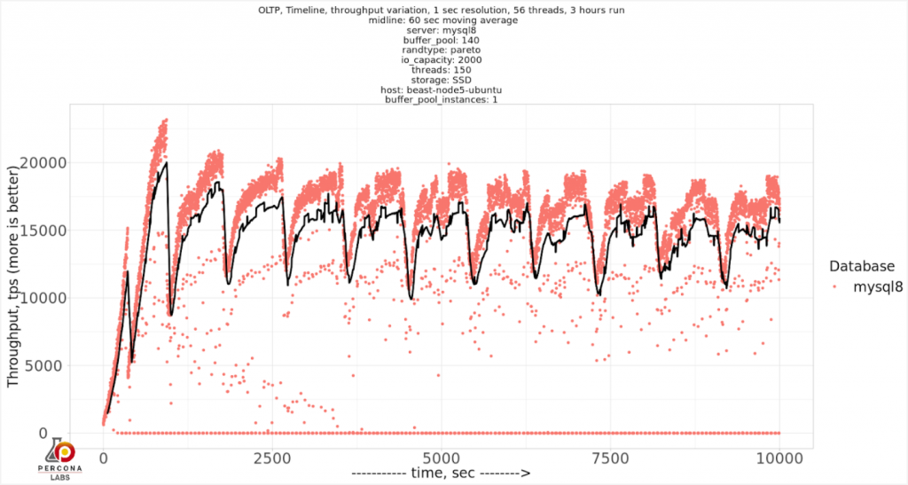
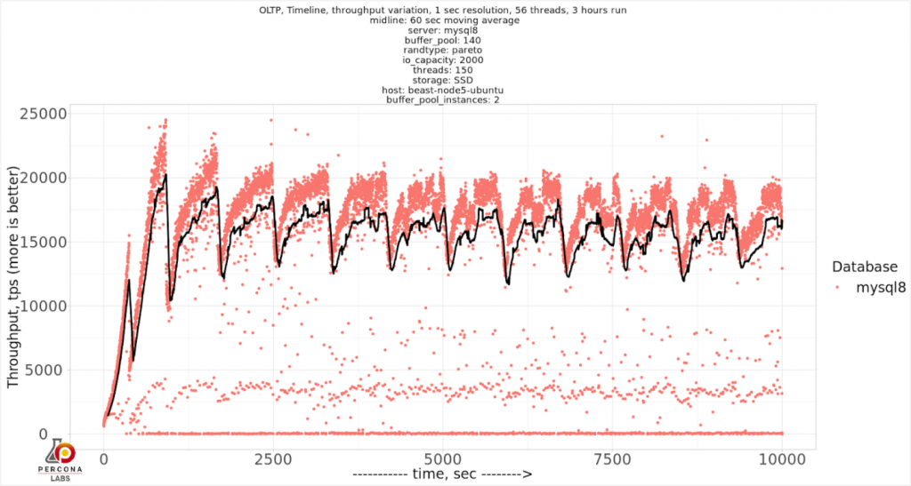
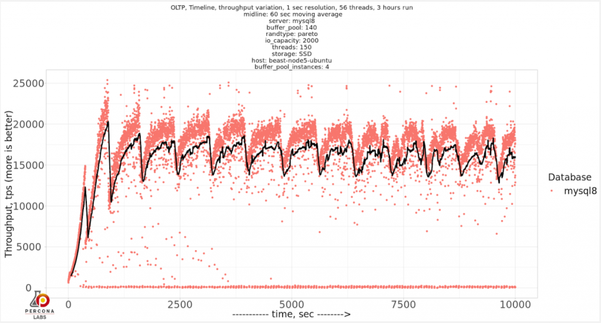
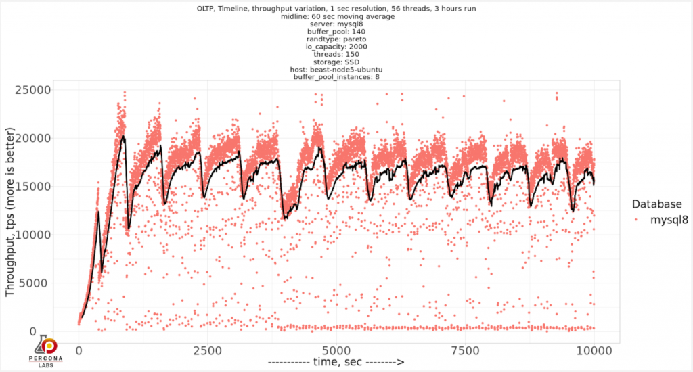
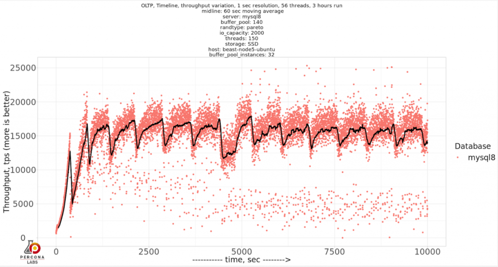
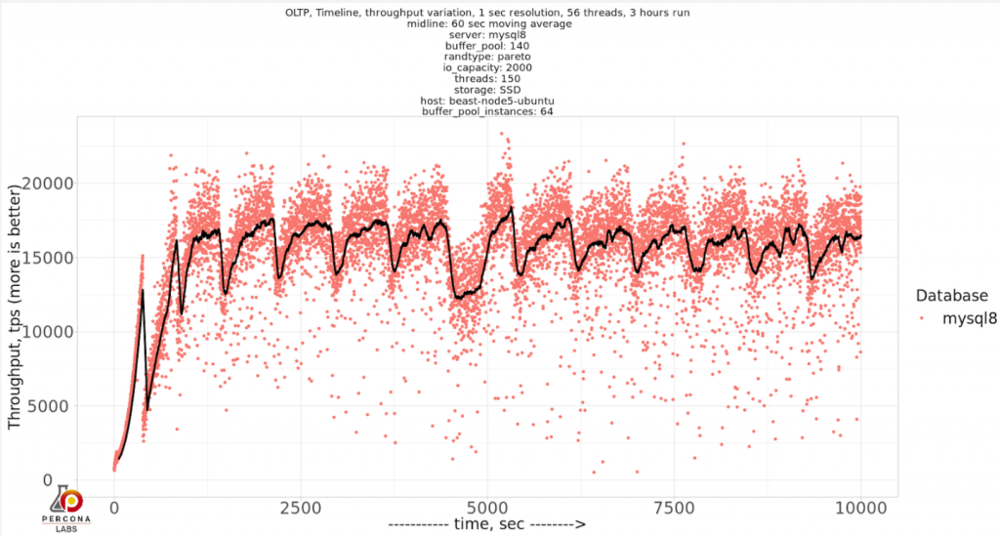
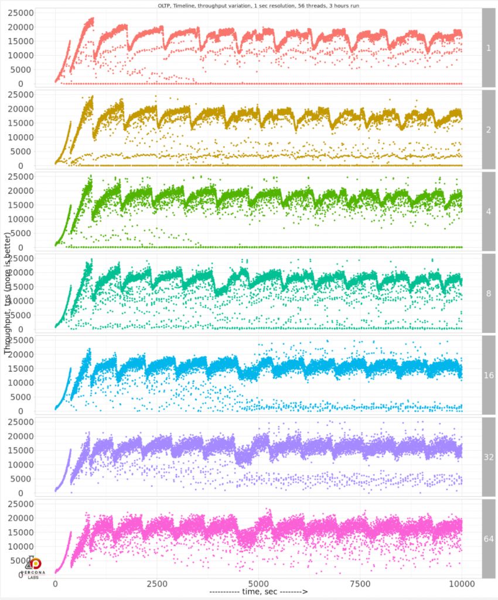
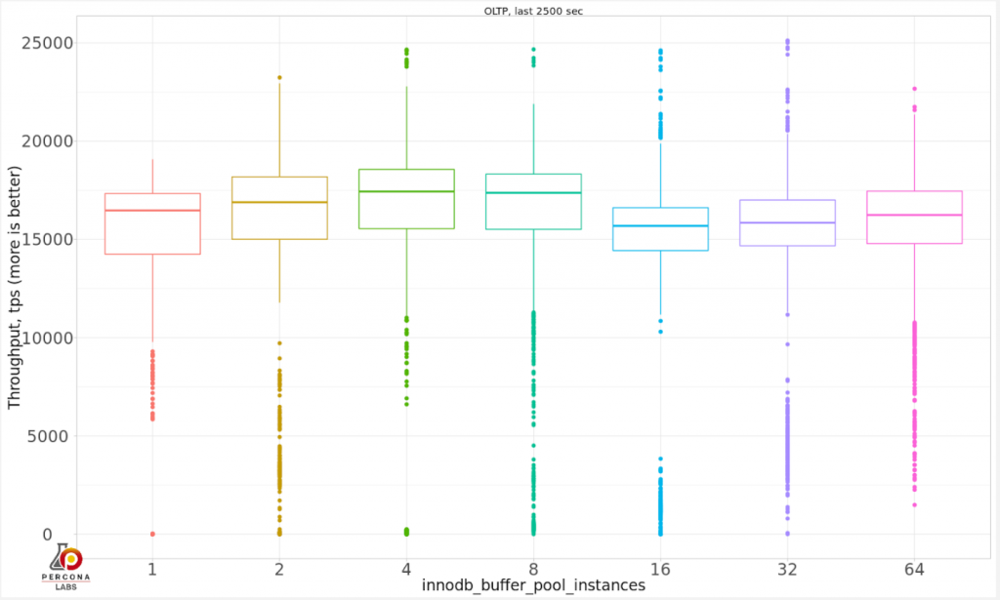

# 技术译文 | MySQL 8 需要多大的 innodb_buffer_pool_instances 值（下）

**原文链接**: https://opensource.actionsky.com/20200818-mysql/
**分类**: MySQL 新特性
**发布时间**: 2020-08-18T00:36:19-08:00

---

作者：Vadim Tkachenko
翻译：管长龙
本文来源：https://www.percona.com/blog/2020/08/13/how-many-innodb_buffer_pool_instances-do-you-need-in-mysql-8/
在[《技术译文 | MySQL 8 需要多大的 innodb_buffer_pool_instances 值（上）》](https://opensource.actionsky.com/20200817-mysql/)中我们在 innodb_buffer_pool_size=25G 的条件下进行了对 innodb_buffer_pool_instances 不同值的测试。
本文将重复该测试，大小为 100GB 的数据库 innodb_buffer_pool_size=140G，这将是 CPU 密集型的情况。
**基准测试**
硬件配置表`System | Supermicro; SYS-F619P2-RTN; v0123456789 (Other)
Platform | Linux
Release | Ubuntu 18.04.4 LTS (bionic)
Kernel | 5.3.0-42-generic
Architecture | CPU = 64-bit, OS = 64-bit
Threading | NPTL 2.27
SELinux | No SELinux detected
Virtualized | No virtualization detected
# Processor ##################################################
Processors | physical = 2, cores = 40, virtual = 80, hyperthreading = yes
Models | 80xIntel(R) Xeon(R) Gold 6230 CPU @ 2.10GHz
Caches | 80x28160 KB
# Memory #####################################################
Total | 187.6G`通过 SATA SSD INTEL SSDSC2KB960G8（英特尔企业级 SSD D3-S4510）上的存储。
简短的设置概述：
- 数据量适合内存大小（数据为〜100GB，服务器上的内存为 188GB，我们为 innodb_buffer_pool_size 分配了 140GB）。
- 存储上工作主要为读写密集型（将从存储中进行读取），并且在 MySQL 中进行了完全的 ACID 兼容和数据安全设置。
- 对于 SATA SSD 存储，innodb_io_capacity 将设置为 2000，而 innodb_io_capacity_max 为 4000。
- 将 innodb_buffer_pool_instances 测试以下值：1、2、4、8、16、32、64。
- innodb_buffer_pool_instances = 64，也是 MySQL 允许的最大值。
测试命令`sysbench oltp_read_write --threads=150 --time=10000 \
--tables=40 --table_size=10000000 \
--mysql-host=127.0.0.1 --mysql-user=sbtest --mysql-password=sbtest --max-requests=0 --report-interval=1 --mysql-db=sbtest --mysql-ssl=off --create_table_options=DEFAULT CHARSET=utf8mb4 --report_csv=yes --rand-type=pareto run`基准测试将运行三个小时，每 1 秒报告一次吞吐量。
**SATA SSD 上的结果**
让我们看看分别为每个 innodb_buffer_pool_instances 得到的结果：
innodb_buffer_pool_instances=1
											
innodb_buffer_pool_instances=2
											
innodb_buffer_pool_instances=4
											
innodb_buffer_pool_instances=8
											
innodb_buffer_pool_instances=16
											
innodb_buffer_pool_instances=32
											
innodb_buffer_pool_instances=64
											
似乎显而易见的是，随着我们增加 innodb_buffer_pool_instances 的值，它对吞吐量的变化产生了积极的影响。我们可以将结果压缩到一个图表中，以便仔细查看：
											
如果要比较吞吐量和偏差，请比较最近 2500 秒的结果：
											
实际上，innodb_buffer_pool_instances = 64 表现出最佳的吞吐量，并且可变性较小，因为即使 innodb_buffer_pool_instances = 32 也会出现明显的停顿。
当 innodb_buffer_pool_instances 从 1 到 8 时，会出现常规停顿，包括几秒钟下降到 0 tps。
另外，将 innodb_buffer_pool_instances 增加到 64 以上似乎没有效果。
**最后的想法**
对于这种特殊情况，innodb_buffer_pool_instances = 64 是最佳选择，但我仍然不建议用一种方法来找到最佳值。请记住，此特定设置取决于硬件（我在有 80 核的 CPU 上进行了测试）和工作负载。