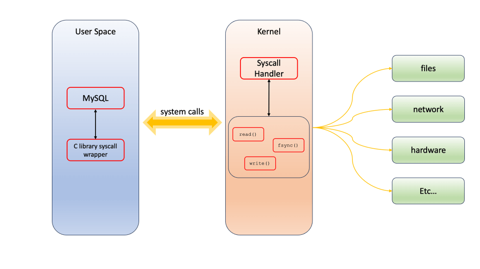

# 技术译文 | MySQL 8.0 引入 innodb_flush_method 等新参数的系统调用分析

**原文链接**: https://opensource.actionsky.com/%e6%8a%80%e6%9c%af%e8%af%91%e6%96%87-mysql-8-0-%e5%bc%95%e5%85%a5-innodb_flush_method-%e7%ad%89%e6%96%b0%e5%8f%82%e6%95%b0%e7%9a%84%e7%b3%bb%e7%bb%9f%e8%b0%83%e7%94%a8%e5%88%86%e6%9e%90/
**分类**: MySQL 新特性
**发布时间**: 2024-01-29T17:55:43-08:00

---

本文我们将讨论如何在操作系统级别验证 `innodb_flush_method` 和 `innodb_use_fdatasync` 修改为默认值之外的其它值（特别是 O_DIRECT 是最常用的）后的效果。
# 介绍
首先，让我们定义该 `innodb_flush_method` 参数的作用。它规定了 InnoDB 如何管理数据刷新到磁盘的行为。文章不会详细说明每个有效值的作用，更多详细介绍请查看[参数值文档](https://dev.mysql.com/doc/refman/8.0/en/innodb-parameters.html#sysvar_innodb_flush_method)。
有效值如下（仅限 Unix）：
- fsync
- O_DSYNC
- littlesync
- nosync
- O_DIRECT
- O_DIRECT_NO_FSYNC
如前所述，我们将重点关注 O_DIRECT。作为最佳实践的一部分，我们建议选择 O_DIRECT 避免双缓冲，绕过操作系统缓存，从而提高写入数据时的性能。下面是从官方文档中摘录的 InnoDB 架构：

在支持 `fdatasync()` 的平台上执行系统调用（System calls，以下简称 Syscalls），MySQL 8.0.26 中引入的 [innodb_use_fdatasync](https://dev.mysql.com/doc/refman/8.0/en/innodb-parameters.html#sysvar_innodb_use_fdatasync) 变量允许使用 [innodb_flush_method](https://dev.mysql.com/doc/refman/8.0/en/innodb-parameters.html#sysvar_innodb_flush_method) 选项来替代。除非后续数据检索需要，否则系统调用不会刷新对文件元数据的更改，从而提供潜在的性能优势。
要操作文件，MySQL 和任何其他软件都必须调用 Syscalls。每当进程需要系统资源时，它都会通过 Syscalls 向内核发送对该资源的请求。从较高层次来看，系统调用是内核向用户应用程序提供的“服务”。它们类似于库 API，被描述为具有名称、参数和返回值的函数调用。下图是此过程的高级说明：

### 问题：为什么不直接访问我们想要的资源（内存、磁盘等）？
这是因为 Linux 将进程的执行分为两个空间。用户运行的进程（一般称为用户空间进程）依赖于内核提供的服务。内核是操作系统的一个特定部分，它以特权运行模式处理各种低级操作。这里详细描述了用户空间和内核空间的概念。如果应用程序可以直接读写内核的地址空间，系统的安全性和稳定性就会受到影响。在给定的场景中，一个进程能够访问另一进程的内存区域。这表明内存隔离存在潜在问题，并可能导致安全漏洞。
### 问题：如何检查我的操作系统是否支持特定的 Syscalls？
`$ man syscalls
`
它将列出可用的 Syscalls 以及其中出现的 Linux 内核。
# 验证
我们将使用 [strace](https://strace.io/) 实用程序和 `/proc/<pid>/fdinfo/<fdinfo>` 中提供的信息来证明前面描述的理论。首先，我将使用默认设置启动一个 MySQL 8.0.33 实例。
*mysqld* 我们可以通过检查 `/proc/<pid>/fd/` 列出进程打开的文件：
`$ ls -l /proc/12006/fd/
total 0
lr-x------. 1 vinicius.grippa percona 64 Jan 15 16:59 0 -> /dev/null
l-wx------. 1 vinicius.grippa percona 64 Jan 15 16:59 1 -> /home/vinicius.grippa/sandboxes/msb_8_0_33/data/msandbox.err
...
lrwx------. 1 vinicius.grippa percona 64 Jan 15 16:59 9 -> /home/vinicius.grippa/sandboxes/msb_8_0_33/data/#ib_16384_1.dblwr
`
我们可以通过运行这个命令，来检查每个文件描述符 `cat /proc/<pid>/fdinfo/<file descriptor number>`：
`$ cat /proc/12006/fdinfo/9
pos: 0
flags: 0100002
mnt_id: 69
lock: 1: POSIX  ADVISORY  WRITE 12006 fd:06:32640985 0 EOF
`
我们对八进制数表示的[标志描述](https://man7.org/linux/man-pages/man2/open.2.html)感兴趣。要解释这些标志，我们可以使用 GitHub 中的 *fdflags* 存储库或在 shell 中使用以下命令：
`$ for flag in APPEND ASYNC CLOEXEC CREAT DIRECT DIRECTORY DSYNC EXCL LARGEFILE NOATIME  NOCTTY NOFOLLOW NONBLOCK PATH RDWR SYNC TMPFILE TRUNC; do printf '%s: ' O_${flag}; echo O_${flag} | gcc -D_GNU_SOURCE -include fcntl.h -E - | tail -n 1; done
`
并使用 *fdflags* 项目来避免手动工作：
`fdinfo_directory="/proc/46211/fdinfo/"
fd_directory="/proc/46211/fd/"
for fd in $(ls ${fdinfo_directory}); do
echo "Processing file descriptor ${fd}" &&
# Read the symbolic link to find out the file name
file_name=$(readlink "${fd_directory}${fd}")
echo "File Name: $file_name"
./fdflags "${fdinfo_directory}${fd}"        
done
`
```
# Output
Processing file descriptor 5
File Name: /home/vinicius.grippa/sandboxes/msb_8_0_33/data/test/sbtest79.ibd
O_LARGEFILE
O_RDWR
...
Processing file descriptor 99
File Name: /home/vinicius.grippa/sandboxes/msb_8_0_33/data/test/sbtest89.ibd
O_LARGEFILE
O_RDWR
```
输出显示文件描述符编号、文件名以及打开时应用于该文件的标志。
接下来，我们可以确认 MySQL 正在使用 *strace* 的 `fsync()` 来写入数据：
`# Attaching strace to the mysqld process
$ strace -f -c  -o ./strace.out -p <pid>
`
```
# Once you exit strace (CTRL+C), a summary of syscalls is written in the strace.out file
$ cat strace.out
% time     seconds  usecs/call     calls    errors syscall
------ ----------- ----------- --------- --------- ----------------
45.38  222.980851        1158    192526     50579 futex
27.50  135.114996      134309      1006           io_getevents
5.90   28.997398     1933159        15        12 restart_syscall
5.69   27.970912      537902        52           nanosleep
5.32   26.117827         122    213323      2088 read
3.86   18.968682         172    109744           write
3.00   14.731474     1133190        13           epoll_wait
1.13    5.565184         574      9688           fsync
0.82    4.050227         134     30132           clock_gettime
0.61    2.974088         148     20089           pwrite64
0.47    2.311729         708      3264           fdatasync
...
0.00    0.000270         135         2           rename
0.00    0.000256          32         8           close
------ ----------- ----------- --------- --------- ----------------
100.00  491.324073                590620     52679 total
```
即使没有启用 `innodb_use_fdatasync`，您也会在 *strace* 输出中注意到 Syscalls。当 *sync_binlog >0* 时，系统调用默认被二进制日志使用。我们可以在 *strace* 中确认：
`$ strace -f  -s2048  -yy  -o ./strace.out -p <pid>
...
47252 fdatasync(70</home/vinicius.grippa/sandboxes/msb_8_0_33/data/binlog.000026> <unfinished ...>
`
> 建议：尝试设置 *sync_binlog=0* 并检查 `fdatasync()` 执行时，MySQL 是否仍然请求系统调用来获取二进制日志。
现在，我们将向 MySQL 添加以下设置并重新启动实例：
`[mysqld]
innodb_flush_method=O_DIRECT
innodb_use_fdatasync = ON
`
再次检查，我们可以看到 O_DIRECT 文件中添加了一个新标志 ：
`Processing file descriptor 96
File Name: /home/vinicius.grippa/sandboxes/msb_8_0_33/data/test/sbtest112.ibd
O_LARGEFILE
O_RDWR
O_DIRECT
…
Processing file descriptor 99
File Name: /home/vinicius.grippa/sandboxes/msb_8_0_33/data/test/sbtest94.ibd
O_LARGEFILE
O_RDWR
O_DIRECT
`
并使用 *strace* 检查，我们将使用以下命令看到我们的表文件（*.ibd）：
`$ strace -f  -s2048  -yy  -o ./strace.out -p 20498
...
20551 fdatasync(48</home/vinicius.grippa/sandboxes/msb_8_0_33/data/test/sbtest23.ibd> <unfinished ...>
20551 fdatasync(26</home/vinicius.grippa/sandboxes/msb_8_0_33/data/test/sbtest5.ibd> <unfinished ...>
20550 fdatasync(34</home/vinicius.grippa/sandboxes/msb_8_0_33/data/test/sbtest15.ibd> <unfinished ...>
20550 fdatasync(24</home/vinicius.grippa/sandboxes/msb_8_0_33/data/test/sbtest1.ibd> <unfinished ...>
`
# 结论
我们研究了 InnoDB 数据刷新机制的技术细微差别以及它们如何与操作系统交互。`innodb_flush_method` 我们可以通过调整参数和 `.sql` 文件 `innodb_use_fdatasync` 来了解优化 MySQL 性能的细节。
我们使用 *strace* 实用程序进行的实验以及检查文件描述符的实验 `/proc/<pid>/fdinfo/` 提供了调整这些设置时行为发生变化的具体证据。使用可以带来更高效的数据写入操作。此外，MySQL 8.0.26 中的引入及其 在特定场景中的偏好说明了 MySQL 的不断发展，以利用特定的系统调用优势来提高性能。