# 技术译文 | MySQL 8.0.35 企业版比社区版性能高出 25%？

**原文链接**: https://opensource.actionsky.com/%e6%8a%80%e6%9c%af%e8%af%91%e6%96%87-mysql-8-0-35-%e4%bc%81%e4%b8%9a%e7%89%88%e6%af%94%e7%a4%be%e5%8c%ba%e7%89%88%e6%80%a7%e8%83%bd%e9%ab%98%e5%87%ba-25%ef%bc%9f/
**分类**: MySQL 新特性
**发布时间**: 2024-02-26T23:02:54-08:00

---

# 前言
说实话，比较一下这两个 MySQL 发行版，并不会让我很兴奋。这是因为在我关于 MySQL 的记忆中，**如果是谈代码库时，两个发行版之间没有真正的区别。**
据我所知，企业版的差异在于附加的插件/组件，因此除非您明确需要使用它们，否则两个版本应该是相同或接近的。
那么你可能会说，为什么要写这篇文章？😉
好吧，在一篇 [Oracle 的博客及其开场白](https://blogs.oracle.com/mysql/post/performance-improvements-in-mysql-8035) 戳中了这一点：**MySQL 8.0.35 的企业版与社区版相比，性能方面是有所提高的。**
以下是该文章的部分结果截图：
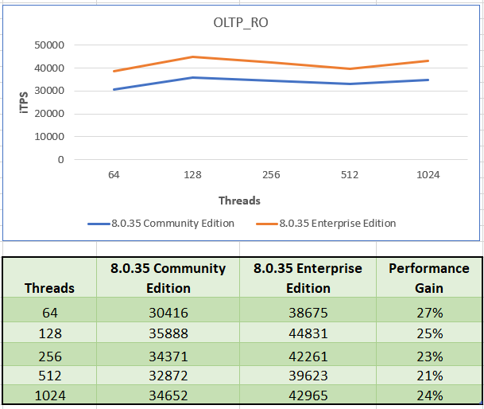
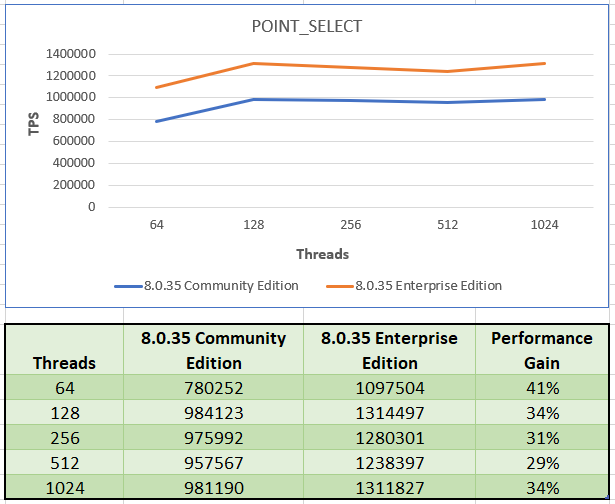
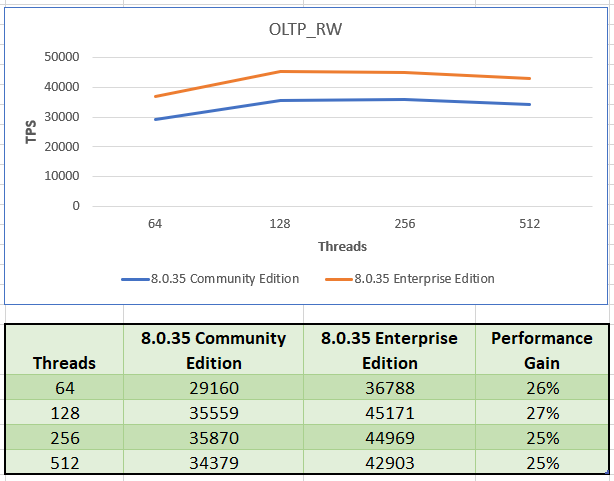
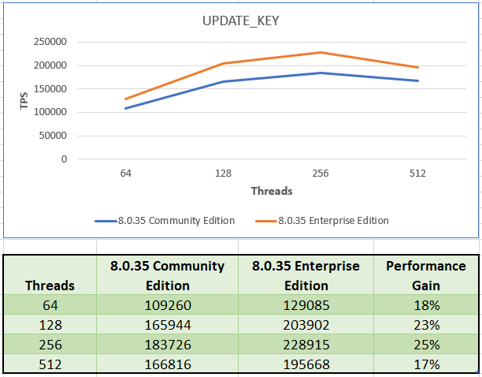
根据显示的结果来看，让我特别想进一步测试一下，但服务器的配置方式有点麻烦。
在博客的测试中，测试数据库总大小为 20 GB，相应的 InnoDB 缓冲池为 124 GB，其他设置与默认值不同，如 `innodb_undo_log_truncate=FALSE`。
简而言之，这意味着所有工作都在内存中完成，一旦加载数据，磁盘上的任何操作都会减少。设置是为了满足测试基准，而不是基于定制或通用默认值的实际生产而准备。
同样令我感动的是，该文章报告 **企业版的性能提高了 17% 到 25%** 。
25% 的增长是很多了。难道不值得验证一下吗？当然，是的，我接下来就是这么做的。
# 测试环境准备
不测 Oracle，因此我的测试基于一个配置较差的 EC2 实例：m5.xlarge 4 个 CPU、16GB RAM。
我还使用提供的卷作为 MySQL 数据目录的位置，而用于在测试运行之间重置数据的离线数据集位于额外的块存储上。
应用程序节点位于同一网络/子网/区域中，并且也是 m5.xlarge 规格。 没有代理或中间件。
MySQL **企业版** 和 **社区版** 的配置主要基于默认值，但以下内容除外：
`[mysqld]
basedir                                                     =/opt/mysql_templates/mysql-8P/
datadir = /opt/mysql_instances/test-sysbench-my834/data
lc_messages_dir                                             =/opt/mysql_templates/mysql-8P/share/
log-error = /opt/mysql_instances/test-sysbench-my834/mysql-3307.err
pid-file = /opt/mysql_instances/test-sysbench-my834/mysqld.pid
plugin-dir                                                  =/opt/mysql_templates/mysql-8P/lib/plugin/
port = 3307
server-id = 3307
socket = /opt/mysql_instances/test-sysbench-my834/mysql.sock
tmpdir = /opt/mysql_instances/test-sysbench-my834/temp
user                                                        =mysql
default_time_zone='+01:00'
max-connections                                             =2500
innodb-buffer-pool-instances                                =3
innodb-buffer-pool-size                                     =10G
innodb-data-file-path                                       =ibdata1:100M:autoextend
innodb_data_home_dir = /opt/mysql_instances/test-sysbench-my834/data
innodb_redo_log_capacity                                    =3355443200
innodb_log_group_home_dir = /opt/mysql_instances/test-sysbench-my834/logs
skip-log-bin
`
简而言之，禁用 binlog，将 redo log 设置为实际的值。当然，将缓冲池设置为适合 RAM 但不适合数据集的维度。所有其他参数都是指向 日志/二进制文件/库 的指针。
配置差异是：
`:comparing_MYSQL_8_2_Comunity_VS_enterprise marcotusa$ diff mysql_8_2_community_configuration.txt mysql_8_2_enterprise_configuration.txt 
22c22
< basedir    /opt/mysql_templates/mysql-8.2.0-linux-glibc2.17-x86_64/
---
> basedir    /opt/mysql_templates/mysql-commercial-8.2.0-linux-glibc2.17-x86_64/
50c50
< build_id    c935957ee1349a3974baf2ff5568243a6ebbcd18
---
> build_id    c0de3cc4e369f54b5ab004d8731a7d7040597452
63c63
< character_sets_dir    /opt/mysql_templates/mysql-8.2.0-linux-glibc2.17-x86_64/share/charsets/
---
> character_sets_dir    /opt/mysql_templates/mysql-commercial-8.2.0-linux-glibc2.17-x86_64/share/charsets/
301c301
< license    GPL
---
> license    Commercial
629,630c629,630
< version    8.2.0
< version_comment    MySQL Community Server - GPL
---
> version    8.2.0-commercial
> version_comment    MySQL Enterprise Server - Commercial
`
# 测试过程
测试工具是 *sysbench*，以下是测试计划。
正如计划中所表达的，我们将使用两个不同的数据集，一个使用更多的表和每个表更少的数据，另一个使用每个表更多的数据和更少的表。在这两种情况下，数据集维度都远远大于可用内存。
正如上面博客中提到的，我们将在三个时刻进行测试：
- 只读。这也是一个 Pre 操作，它将在数据加载后为我们提供 READ 统计信息，因此完全内部排序。
- 写操作，可能会导致（并且将会）页面拆分/合并和“碎片”。
- 读取后写入以确定第二个时刻的影响。
我使用 MySQL 8.2 作为测试版本，因为如果代码中推送了任何更改，该版本应该包含。
好的，是时候运行测试了。我们开始做吧！
# 测试结果
我知道我剥夺了所有的乐趣和悬念，但我们必须从这里开始。
### Sysbench
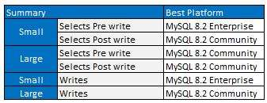
### TPCc
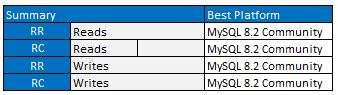
什么？在大多数测试中，MySQL 社区版的表现是最好的，而不是企业版。为何如此？ 好吧，让我们开始深入挖掘并更好地了解这里发生了什么。
## Sysbench 详解
以下是阅读下面图像的方法：
- 绿色正值表示企业版表现更好；算作 +1。
- 红色负值意味着社区版做得更好；算作 -1。
- 空白处带 0 的不计算在内。
需要按列读取，只有在企业版优于社区版 50% 以上的情况下，结果才会是绿色。
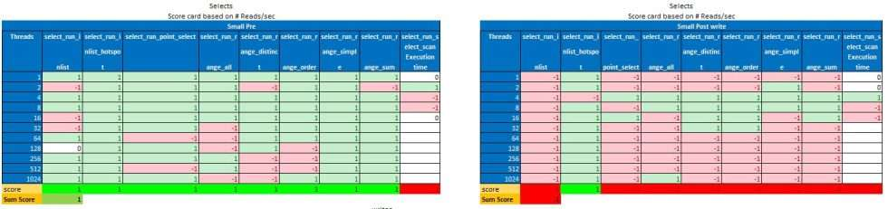
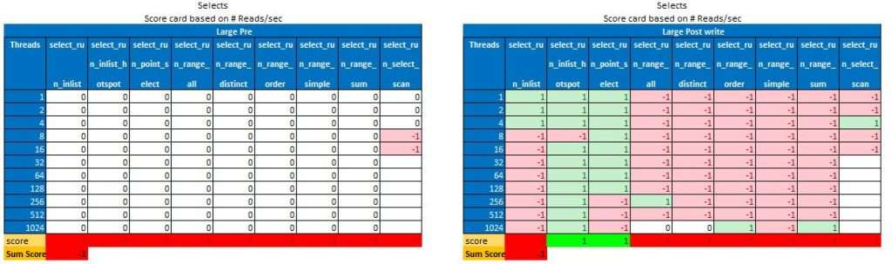
现在，正如我们所看到的，企业版只希望在数据加载后并且仅当负载分布在更多表上时才能做得更好。我已经能听到噪音了…… 请耐心等待，一切很快就会清楚。
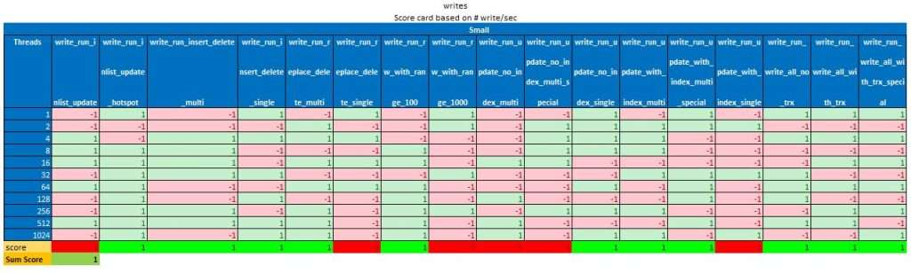
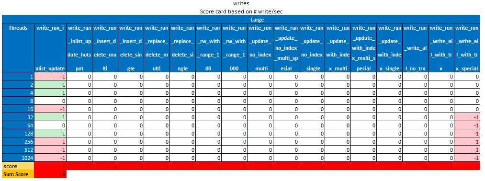
此外，对于写入而言，只有当负载分布在多个表上时，企业版似乎才能做得更好，而在其他情况下社区版更好。
# TPC-c 详解
对于类似 TPC-c 的测试，我使用不同的隔离级别运行了两组测试：
- 使用可重复读 (RR)
- 使用读已提交 (RC)
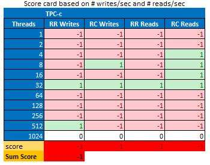
在这方面，MySQL 企业版从来没有比社区版更好。
## 让我们挖掘一下！
真正的差异是什么？两者有什么区别？为了回答这个问题，我将在这里通过测试展示读取和写入图表。
在向您展示测试结果时，我不会对其进行评论。我坚信图像会说话，在这种情况下，如果 100% 真实，我只会在最后发表评论。
## 读操作
### select_run_list
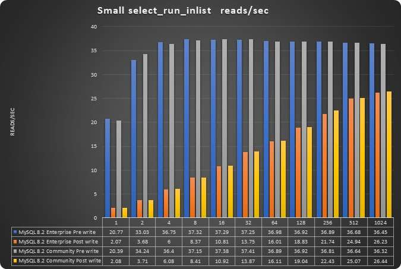
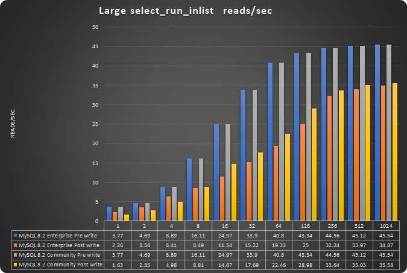
### select_run_inlist_hotspot
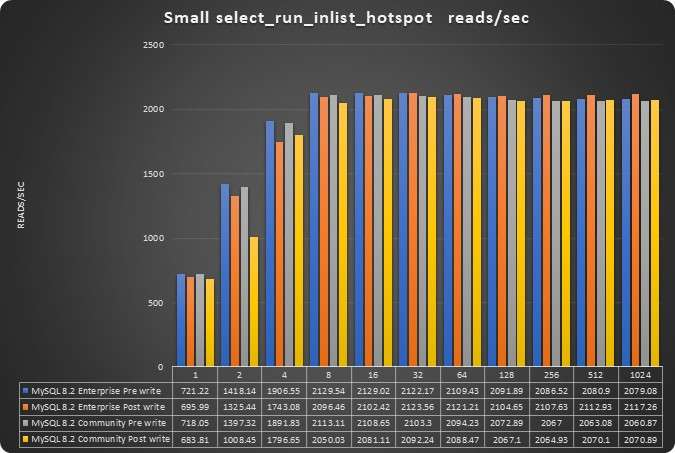
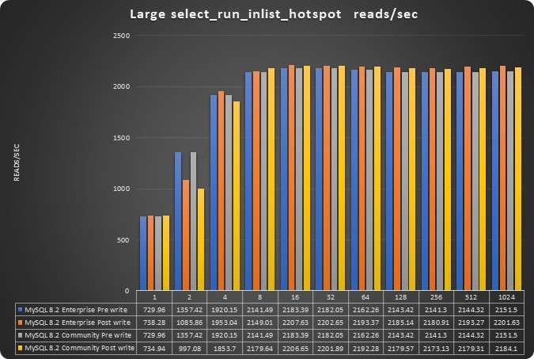
### select_run_point_select
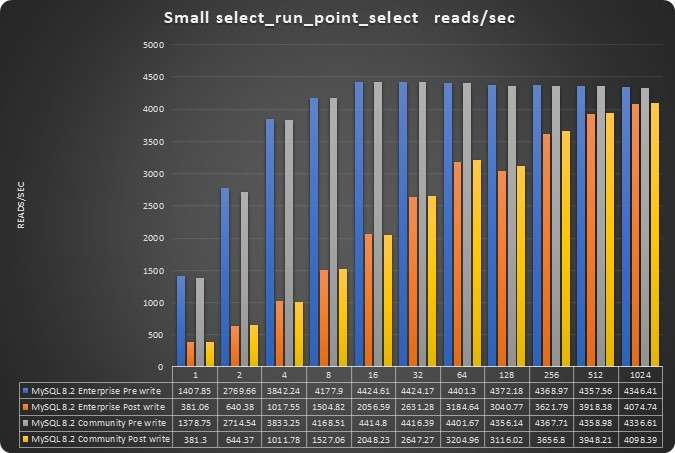
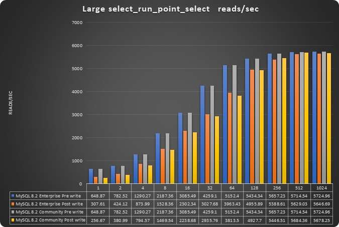
### select_run_range_all
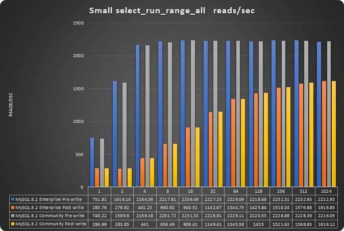
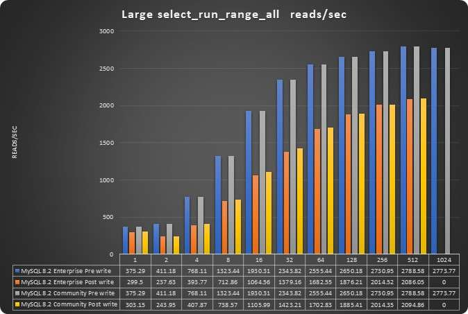
### select_run_range_distinct

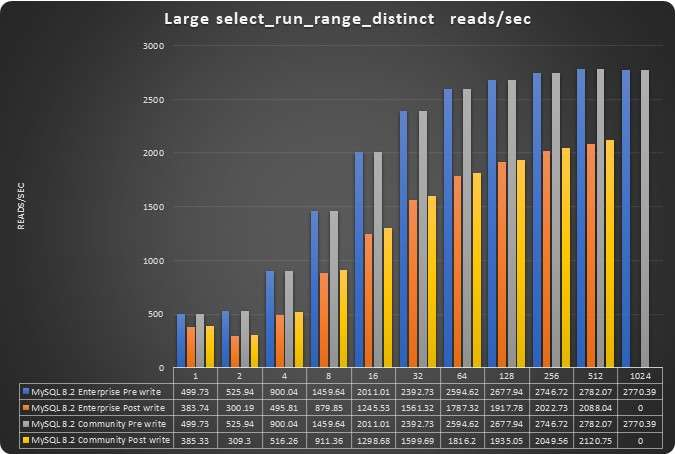
### select_run_range_order

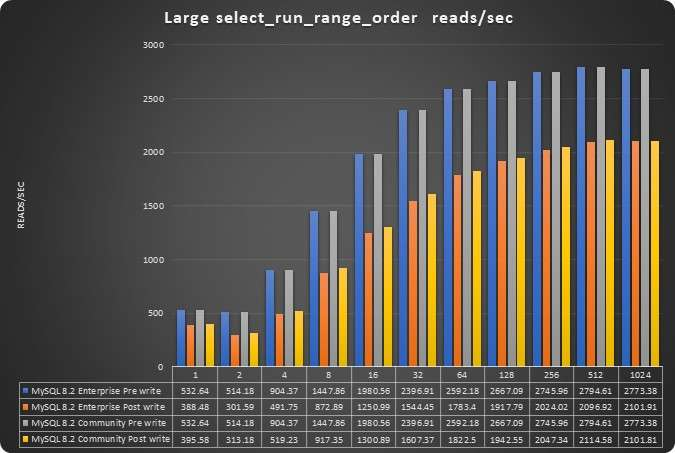
### select_run_range_simple
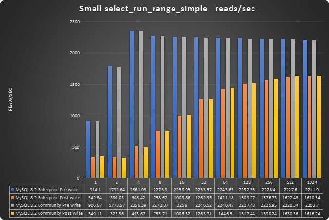
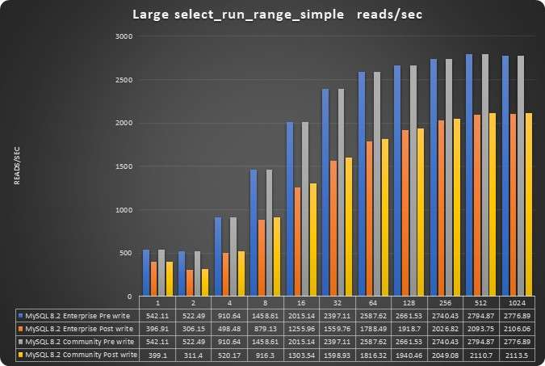
### select_run_range_sum
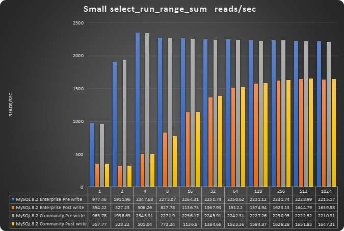
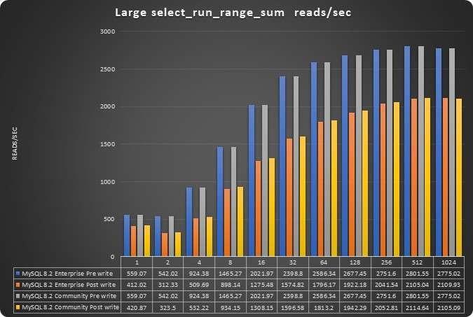
### select_run_select_scan

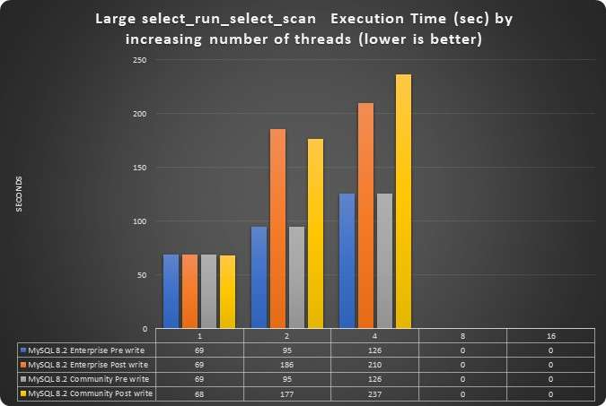
## 写入
对于写入，我将在本文仅显示累积测试，但您可以在给定的 [GitHub 链接](https://github.com/Tusamarco/blogs/tree/master/2024_mysql_ent_VS_mysql_community_V820/graphics) 中查看每个测试的图表。
### write_run_write_all_with_trx
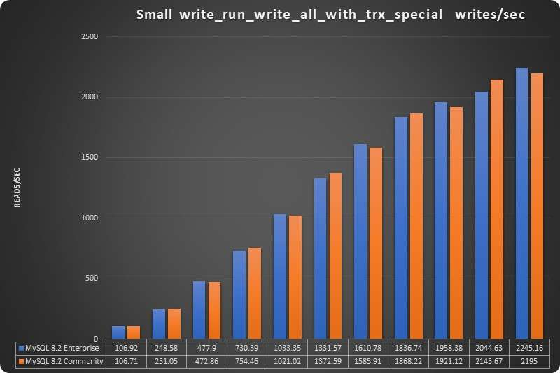
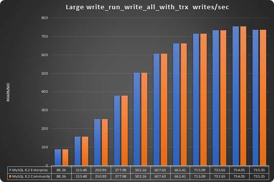
### write_run_write_all_no_trx
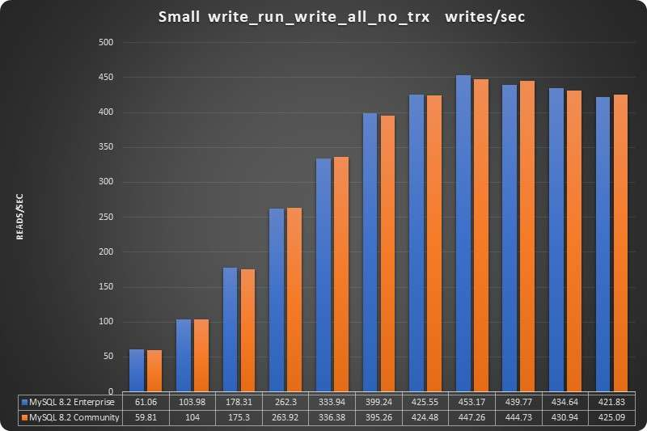
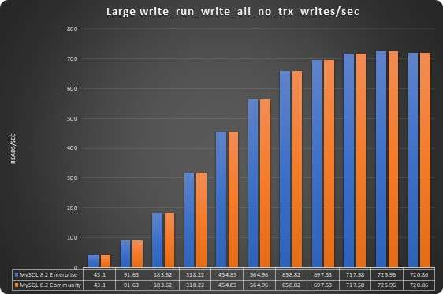
### TPC-c
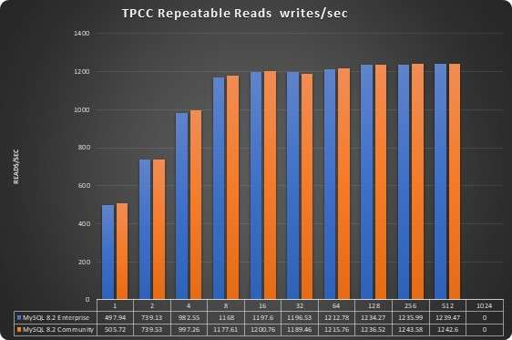
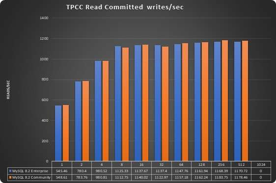
如果你到了这一步，你自己应该已经明白了。
图表显示，这两种解决方案几乎是相同的，每当社区版或企业版有一个小的优势时，它只是线程数量的暂时性优势，因此微乎其微，无关紧要。
# 结论
正如所怀疑的，如果您使用普通配置/场景使用默认值来测试社区版和企业版，那么 MySQL 社区版和 MySQL 企业版之间的性能没有差异。
一些额外的组件会导致功能或性能的改进，例如线程池。
因此，除非 Oracle 使用与注册用户可用的版本不同的企业版，否则我真的不知道如何才能通过简单配置在企业版中获得 25% 的性能提升。
目前为止，我没有看到性能的显著变化。我希望 Oracle 公司继续做它迄今为止所做的事情，使用附加组件而不是闭源模式的核心来增强企业版本。