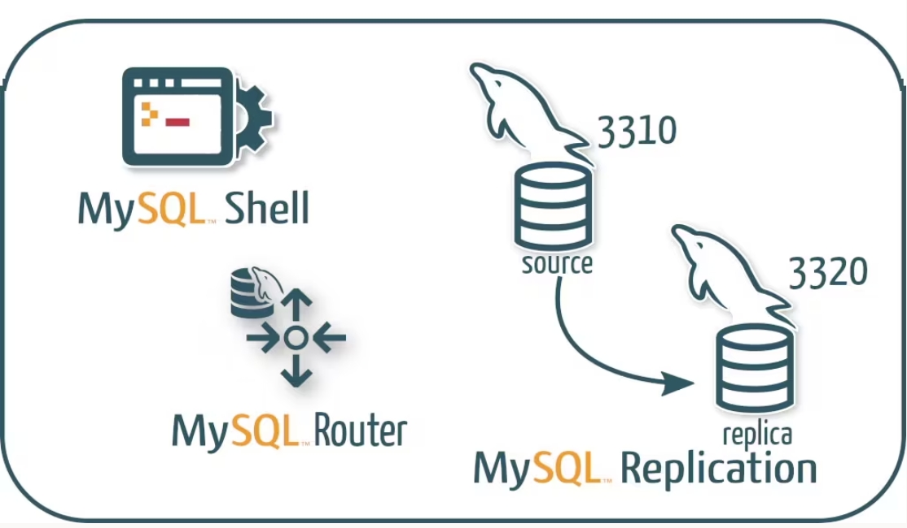
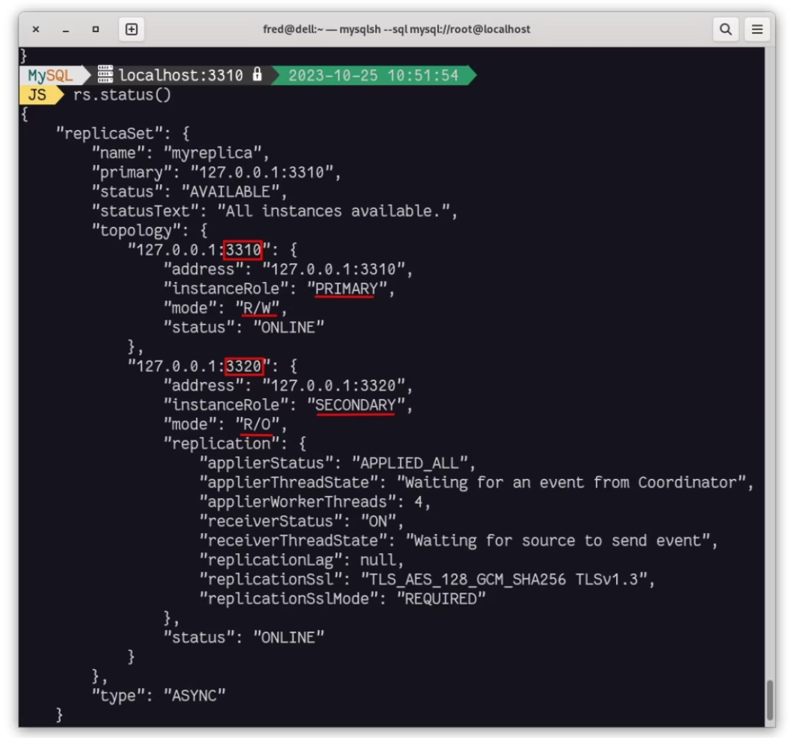
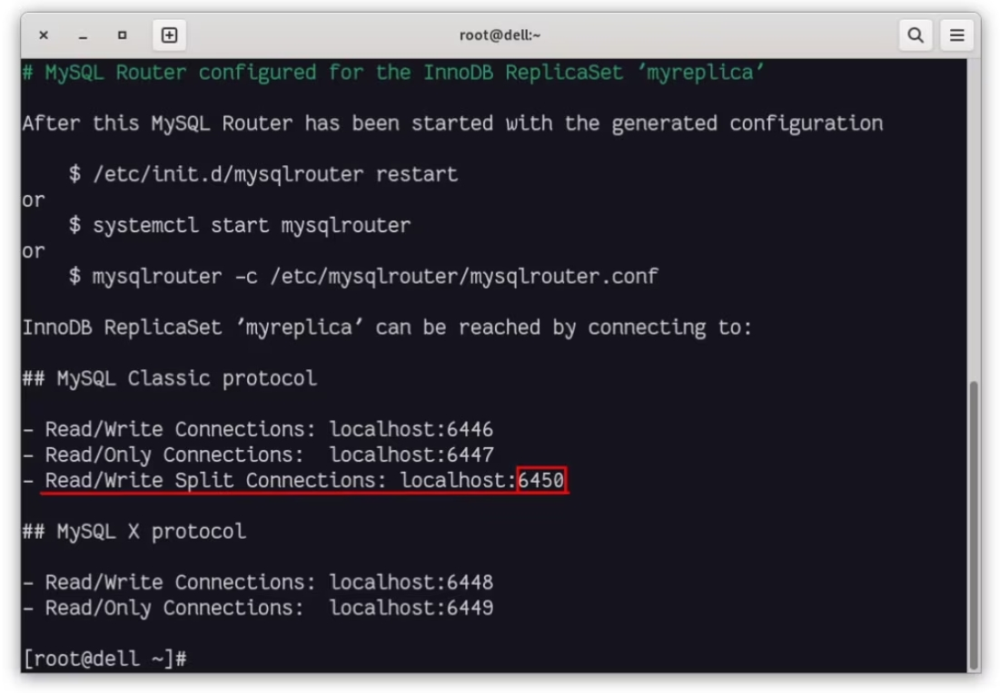
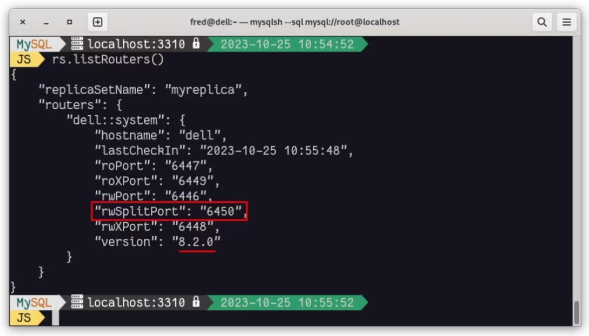
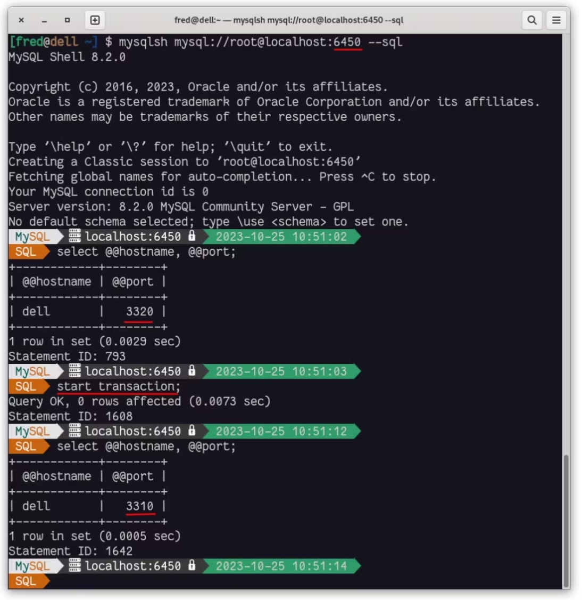
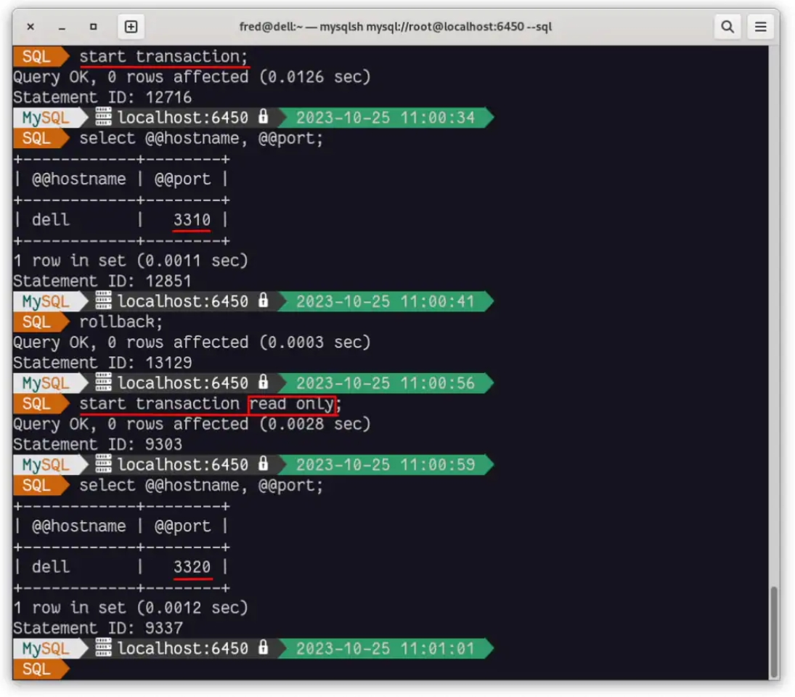
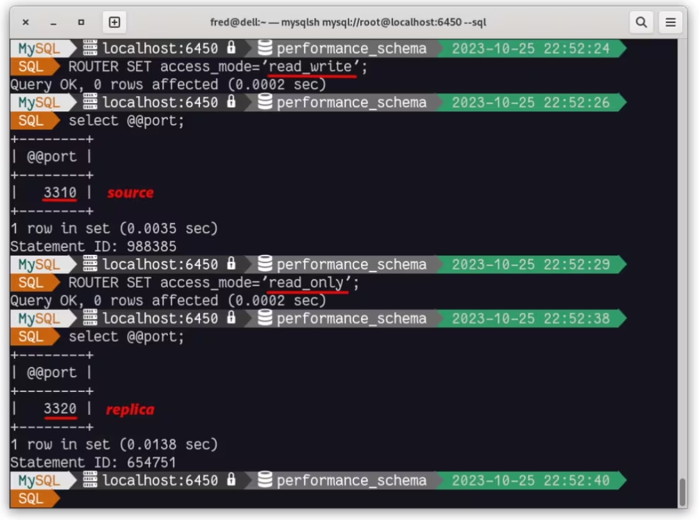

# 技术译文 | MySQL 8.2 支持读写分离！

**原文链接**: https://opensource.actionsky.com/%e6%8a%80%e6%9c%af%e8%af%91%e6%96%87-mysql-8-2-%e6%94%af%e6%8c%81%e8%af%bb%e5%86%99%e5%88%86%e7%a6%bb%ef%bc%81/
**分类**: MySQL 新特性
**发布时间**: 2023-10-30T00:30:06-08:00

---

我们一直在等待的 MySQL [读/写分离功能](https://dev.mysql.com/doc/mysql-router/8.2/en/router-read-write-splitting.html) 现在终于可以使用了！
在规模上，我们在副本之间分配读取，但这必须在应用程序中以某种方式进行管理：指向在某个地方写入并在其他地方读取。
在 [MySQL 8.2](https://dev.mysql.com/doc/relnotes/mysql/8.2/en/) 中，MySQL Router 现在能够识别读取和写入，并将它们路由到主实例（如果是 InnoDB 集群），或者路由到异步复制源以进行写入，将其路由到辅助实例或副本以进行读取。
为了说明这一点，我部署了最简单的架构：MySQL InnoDB ReplicaSet。
# MySQL InnoDB ReplicaSet
这只是一个复制源实例和一个（或多个）异步副本：

这是 MySQL Shell 中 ReplicaSet 对象的状态：

# 启动 MySQL Router 8.2
让我们配置（启动）MySQL Router：

我们还可以在 MySQL Shell ReplicaSet 对象中看到 Router：

使用读/写端口 ( 6450 ) 连接到 MySQL：

我们可以看到，默认情况下，如果执行读操作，我们将访问到副本，但如果启动事务，我们将到达复制源（主），而无需更改端口并使用相同的连接。
我们还可以看到使用只读事务时的差异：

我们可以在 MySQL Router 的配置文件中看到生成的读写分离的设置：
`[routing:bootstrap_rw_split]
bind_address=0.0.0.0
bind_port=6450
destinations=metadata-cache://myreplica/?role=PRIMARY_AND_SECONDARY
routing_strategy=round-robin
protocol=classic
connection_sharing=1
client_ssl_mode=PREFERRED
server_ssl_mode=PREFERRED
access_mode=auto
`
您还可以使用命令 `ROUTER SET access_mode=` 在会话中定义要访问的实例类型：

# 结论
综上所述，MySQL Router 8.2 支持读写分离。这是一项很有价值的功能，可以优化数据库性能和可扩展性，而无需对应用程序进行任何更改。
通过此配置，您可以将所有读取流量定向到只读实例，并将所有写入流量定向到读写实例。
此功能不仅增强了整体用户体验，还简化了数据库管理和部署。
读写实例是主实例或源实例。只读实例是副本（InnoDB Cluster ReplicaSet、ReplicaSet 辅助实例或副本群集中的辅助实例）。
原文：[https://blogs.oracle.com/mysql/post/mysql-82-transparent-readwrite-splitting](https://blogs.oracle.com/mysql/post/mysql-82-transparent-readwrite-splitting)