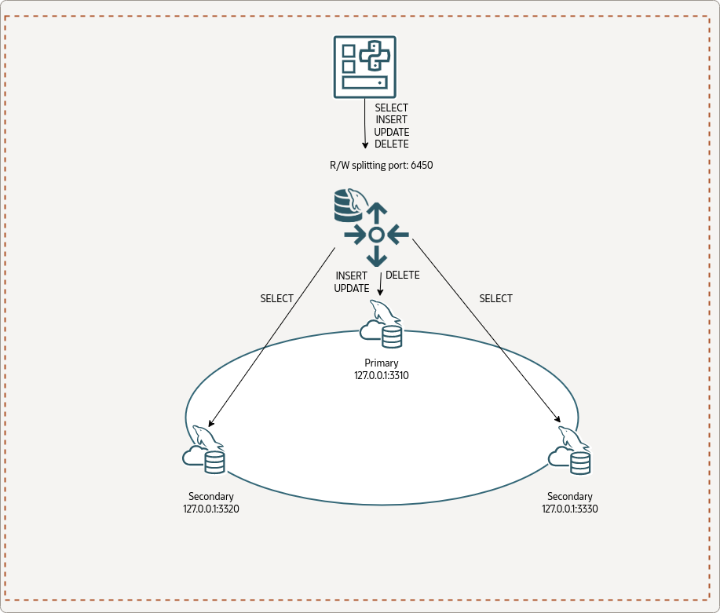

# 技术译文 | Python 程序如何使用 MySQL 8.2 读写分离

**原文链接**: https://opensource.actionsky.com/%e6%8a%80%e6%9c%af%e8%af%91%e6%96%87-python-%e7%a8%8b%e5%ba%8f%e5%a6%82%e4%bd%95%e4%bd%bf%e7%94%a8-mysql-8-2-%e8%af%bb%e5%86%99%e5%88%86%e7%a6%bb/
**分类**: MySQL 新特性
**发布时间**: 2023-11-20T00:30:25-08:00

---

pre {
overflow-y: auto;
max-height: 300px;
}
在这篇文章中，我们将了解如何将 MySQL 8.2 的读写分离功能与 MySQL-Connector/Python 一起使用。
> 作者：Frederic Descamps，MySQL 社区经理
本文和封面来源：[https://blogs.oracle.com/，爱可生开源社区翻译。](https://blogs.oracle.com/，爱可生开源社区翻译。)
本文约 1200 字，预计阅读需要 4 分钟。
如您所知，MySQL 8.2 发布了最令人期待的功能之一：[读写分离](https://blogs.oracle.com/mysql/post/mysql-82-transparent-readwrite-splitting)。
在这篇文章中，我们将了解如何将它与 [MySQL-Connector/Python](https://dev.mysql.com/doc/connector-python/en/) 一起使用。
# 架构
为了使用我们的 Python 程序，我们将使用 InnoDB Cluster。

以下是在 MySQL Shell 中查询 Cluster 的状态：
`JS > cluster.status()
{
"clusterName": "fred", 
"defaultReplicaSet": {
"name": "default", 
"primary": "127.0.0.1:3310", 
"ssl": "REQUIRED", 
"status": "OK", 
"statusText": "Cluster is ONLINE and can tolerate up to ONE failure.", 
"topology": {
"127.0.0.1:3310": {
"address": "127.0.0.1:3310", 
"memberRole": "PRIMARY", 
"mode": "R/W", 
"readReplicas": {}, 
"replicationLag": "applier_queue_applied", 
"role": "HA", 
"status": "ONLINE", 
"version": "8.2.0"
}, 
"127.0.0.1:3320": {
"address": "127.0.0.1:3320", 
"memberRole": "SECONDARY", 
"mode": "R/O", 
"readReplicas": {}, 
"replicationLag": "applier_queue_applied", 
"role": "HA", 
"status": "ONLINE", 
"version": "8.2.0"
}, 
"127.0.0.1:3330": {
"address": "127.0.0.1:3330", 
"memberRole": "SECONDARY", 
"mode": "R/O", 
"readReplicas": {}, 
"replicationLag": "applier_queue_applied", 
"role": "HA", 
"status": "ONLINE", 
"version": "8.2.0"
}
}, 
"topologyMode": "Single-Primary"
}, 
"groupInformationSourceMember": "127.0.0.1:3310"
}
JS > cluster.listRouters()
{
"clusterName": "fred", 
"routers": {
"dynabook::system": {
"hostname": "dynabook", 
"lastCheckIn": "2023-11-09 17:57:59", 
"roPort": "6447", 
"roXPort": "6449", 
"rwPort": "6446", 
"rwSplitPort": "6450", 
"rwXPort": "6448", 
"version": "8.2.0"
}
}
}
`
# MySQL Connector/Python
Python 程序使用 MySQL-Connector/Python 8.2.0。
初始化测试脚本代码：
`import mysql.connector
cnx = mysql.connector.connect(user='python',
passowrd='Passw0rd!Python',
host='127.0.0.1',
port='6450')
cursor = cnx.cursor()
query = ("""select member_role, @@port port
from performance_schema.replication_group_members
where member_id=@@server_uuid""")
for (role, port) in cursor:
print("{} - {}".format(role, port))
cursor.close()
cnx.close()
`
我们可以测试一下：
`$ python test_router.py
PRIMARY - 3310
`
很好，我们可以使用读/写分离端口（6540）连接到集群并执行查询……。哦 ？！但为什么我们会直达主实例呢？
我们不应该是去访问只读实例（副本实例）之一吗？
## autocommit
Connector/Python 默认禁用自动提交（请参阅 [MySQLConnection.autocommit](https://dev.mysql.com/doc/connector-python/en/connector-python-api-mysqlconnection-autocommit.html) 属性）。并且读写分离功能必须启用自动提交才能正常工作。
在第 8 行上方添加以下代码：
`cnx.autocommit = True
`
然后我们可以再次运行该程序：
`$ python test_router.py
SECONDARY - 3320
$ python test_router.py
SECONDARY - 3330
`
太棒了，达到预期效果工作！
# 查询属性
现在让我们看看如何在主节点上强制执行查询。
MySQL Router 提供了使用查询属性来强制执行读/写拆分决策的可能性：router.access_mode。
在执行查询 ( cursor.execute(query) ) 之前添加以下行：
`cursor.add_attribute("router.access_mode", "read_write")
`
让我们再执行一次：
`$ python test_router.py
PRIMARY - 3310
`
`router.access_mode` 可接受的值为：
- auto
- read_only
- read_write
# 测试 DML 语句
让我们尝试一些不同的东西，我们将向表中插入行。
我们将使用下表：
`CREATE TABLE `t1` (
`id` int unsigned NOT NULL AUTO_INCREMENT,
`port` int DEFAULT NULL,
`role` varchar(15) DEFAULT NULL,
`timestamp` timestamp NULL DEFAULT CURRENT_TIMESTAMP,
PRIMARY KEY (`id`)
) ENGINE=InnoDB ;
`
我们将使用以下 Python 脚本：
`import mysql.connector
cnx = mysql.connector.connect(user='python',
password='Passw0rd!Python',
host='127.0.0.1',
port='6450',
database='test')
cnx.autocommit = True
cursor = cnx.cursor()
for i in range(3):
query = ("""insert into t1 values(0, @@port, (
select member_role
from performance_schema.replication_group_members
where member_id=@@server_uuid), now())""")
cursor.execute(query)
cursor.close()
cnx.close()
for i in range(3):
cnx = mysql.connector.connect(user='python',
password='Passw0rd!Python',
host='127.0.0.1',
port='6450',
database='test')
cnx.autocommit = True
cursor = cnx.cursor()
query = ("""select *, @@port port_read from t1""")
cursor.execute(query)
for (id, port, role, timestamp, port_read) in cursor:
print("{} : {}, {}, {} : read from {}".format(id,
port,
role,
timestamp,
port_read))
cursor.close()
cnx.close()
`
让我们执行它：
`$ python test_router2.py
1 : 3310, PRIMARY, 2023-11-09 17:44:00 : read from 3330
2 : 3310, PRIMARY, 2023-11-09 17:44:00 : read from 3330
3 : 3310, PRIMARY, 2023-11-09 17:44:00 : read from 3330
1 : 3310, PRIMARY, 2023-11-09 18:44:00 : read from 3320
2 : 3310, PRIMARY, 2023-11-09 18:44:00 : read from 3320
3 : 3310, PRIMARY, 2023-11-09 18:44:00 : read from 3320
1 : 3310, PRIMARY, 2023-11-09 17:44:00 : read from 3330
2 : 3310, PRIMARY, 2023-11-09 17:44:00 : read from 3330
3 : 3310, PRIMARY, 2023-11-09 17:44:00 : read from 3330
`
我们可以看到没有错误，并且我们写入了主节点并从所有辅助节点读取。
请小心，如果在写入之前将 `router.access_mode` 的查询属性设置为 `read_only`（第 16 行），您将收到错误，因为副本节点上不允许写入：
`_mysql_connector.MySQLInterfaceError: The MySQL server is running with the --super-read-only option so it cannot execute this statement
`
# 事务
现在我们要玩一下事务。我们创建一个新脚本来执行多个事务：
- 自动提交中的读操作
- 事务中的读操作（默认情况下，这是读/写事务）
- 只读事务中的读操作
- 具有多次插入和回滚的事务
这是程序的源码：
`import mysql.connector
cnx = mysql.connector.connect(user='python',
password='Passw0rd!Python',
host='127.0.0.1',
port='6450',
database='test')
cnx.autocommit = True
cursor = cnx.cursor()
query = ("""select member_role, @@port port
from performance_schema.replication_group_members
where member_id=@@server_uuid""")
cursor.execute(query)
for (role, port) in cursor:
print("{} - {}".format(role, port))
cnx.start_transaction()
query = ("""select member_role, @@port port
from performance_schema.replication_group_members
where member_id=@@server_uuid""")
cursor.execute(query)
for (role, port) in cursor:
print("{} - {}".format(role, port))
cnx.commit()
cnx.start_transaction(readonly=True)
query = ("""select member_role, @@port port
from performance_schema.replication_group_members
where member_id=@@server_uuid""")
cursor.execute(query)
for (role, port) in cursor:
print("{} - {}".format(role, port))
cnx.commit()
cnx.start_transaction()
for i in range(3):
query = ("""insert into t1 values(0, @@port, (
select member_role
from performance_schema.replication_group_members
where member_id=@@server_uuid), now())""")
cursor.execute(query)
cnx.rollback()
cursor.close()
cnx.close()
`
让我们执行脚本：
`$ python test_router3.py
SECONDARY - 3320
PRIMARY - 3310
SECONDARY - 3320
`
我们可以看到，第一个操作到达了副本实例，第二个操作（即事务）到达了主节点。
只读事务到达副本节点。
对于作为我们回滚事务一部分的多次写入，我们没有收到任何错误。
# 结论
我们已经看到将 MySQL Connector/Python 与 MySQL 8.2 读写分离一起用于 InnoDB Cluster 是多么容易。
享受通过 MySQL Connector / Python 使用 MySQL 读写分离！