# 技术译文 | XtraBackup 8.0.33-28 prepare 速度提升 20 倍！

**原文链接**: https://opensource.actionsky.com/%e6%8a%80%e6%9c%af%e8%af%91%e6%96%87-xtarbackup-8-0-33-28-prepare-%e9%80%9f%e5%ba%a6%e6%8f%90%e5%8d%87-20-%e5%80%8d%ef%bc%81/
**分类**: 技术干货
**发布时间**: 2023-07-31T00:58:29-08:00

---

在这篇博文中，我们将描述 Percona XtraBackup 8.0.33-28 的改进，这显著减少了备份准备所需的时间，以便进行恢复操作。 Percona XtraBackup 中的这一改进显着缩短了新节点加入 Percona XtraDB 集群（PXC） 所需的时间。
Percona XtraDB Cluster 使用 Percona XtraBackup 在节点之间执行 SST（状态快照传输）。当一个新节点加入集群时，会从 DONOR 到 JOINER 执行 SST。 JOINER 使用 PXB 从 DONOR 流式传输数据目录。 JOINER 必须在使用它之前准备备份。 观察到，当 DONOR 拥有大量表空间（一百万个）时，JOINER 一侧的 XtraBackup 无法完成数据准备阶段（`xtrabackup -prepare`）。
## Prepare 阶段
Percona XtraBackup 复制 InnoDB 数据文件。数据在服务器并发修改数据文件时内部不一致，因为服务器并发地修改数据文件。 Percona XtraBackup 对文件执行崩溃恢复，以再次创建一致的可用数据库。 这称为 Prepare 操作（`xtrabackup -prepare`）。
XtraBackup Prepare 操作分两个阶段进行：
- Redo Log 应用
- Undo Log 应用
### Redo Log 应用阶段
将 Redo Log 文件修改的更改应用于页面。 此阶段没有行或事务的概念。Redo 应用阶段不会使数据库与事务一致。服务器可以刷新或写入未提交事务的更改到 Redo Log 中。 XtraBackup 仍应用记录在 Redo Log 中的修改，并且 Redo Log 应用阶段不会撤消这些更改。为此，我们必须使用 Undo Log。
### Undo Log 应用阶段
Undo Log 应用阶段（也称为回滚阶段），将读取 Undo Log 页面中的更改以撤消事务。然后它们再次应用于页面（例如，再次写入旧值），并写入磁盘。在此阶段之后，备份过程中所有未提交的事务都会被回滚。
Undo Log 记录有两种类型：INSERT Undo Log 记录和 UPDATE Undo Log 记录。 删除记录标记被视为 UPDATE UNDO Log 记录的子类型。
格式如下所示：
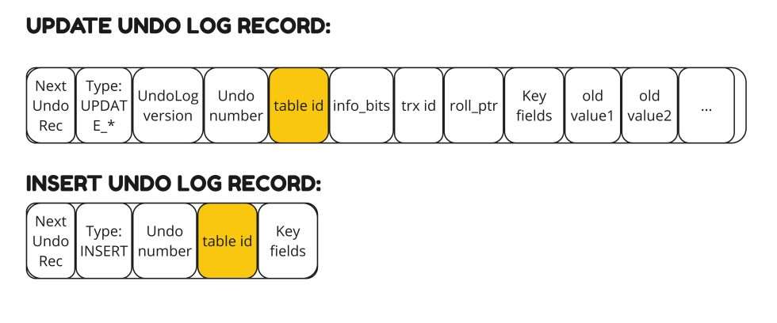
当服务器写入这些记录时，它不会与每个记录一起写入索引/表信息。它只将“table_id”写入作为 UNDO LOG 记录的一部分。 `table_id` 用于获取表架构。 从 Undo Log 记录中获取表架构和关键字段用于创建索引搜索元组（Key）。 此搜索元组（Key）用于查找要执行撤消操作的记录。
所以，给定一个 `table_id`，你如何获取表架构/定义?
在服务器上初始化“数据字典”（DD）引擎和 DD 缓存后，存储引擎可以请求表定义。例如，InnoDB 根据也称为“se_private_id”的 `table_id` 请求表定义。
与服务器不同，Percona XtraBackup 无法访问“数据字典”（DD）。初始化 DD 引擎和缓存会增加复杂性和其他服务器依赖项。XtraBackup 不会简单地像服务器一样访问表对象。
**为何 Percona XtraBackup 受到数以千计的企业信赖？**
Percona XtraBackup 初始化 InnoDB 引擎，并需要所有目的（回滚、导出等）的“InnoDB 表对象”，也称为 `dict_table_t`。XtraBackup 依靠序列化字典信息（SDI）。 这是表的 JSON 表示形式。 对于 InnoDB 表空间，该信息存储在表空间内。从 8.0 开始，IBD 文件是“自描述的”；例如，表架构在 IBD 文件中可用。
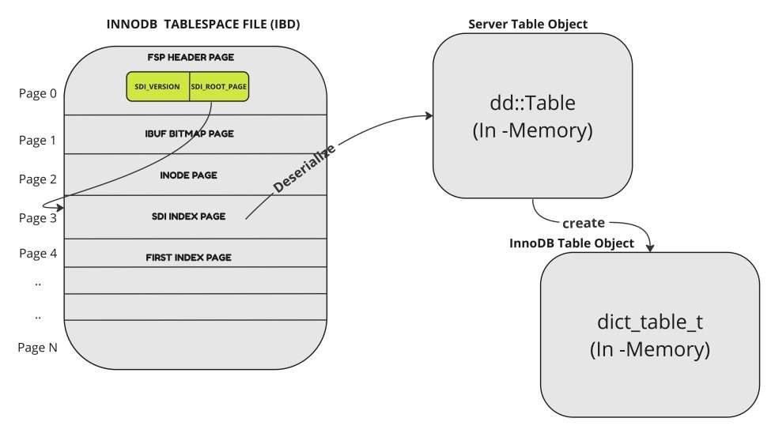
让我们看一个示例表。
`CREATE TABLE test.t1(a INT PRIMARY KEY, b INT);
`
CREATE TABLE 语句在 `test` 目录中创建一个名为 `t1.ibd` 的文件。例如，`mysql datadir/test/t1.ibd`。 因此 `t1.ibd` 包含有关表结构（列、它们的类型、索引数量、索引中的列、外键等）的信息作为 SDI。 使用名为“ibd2sdi”的工具从 IBD 文件中提取 SDI。
`ibd2sdi data/test/t1.ibd > t1.sdi
`
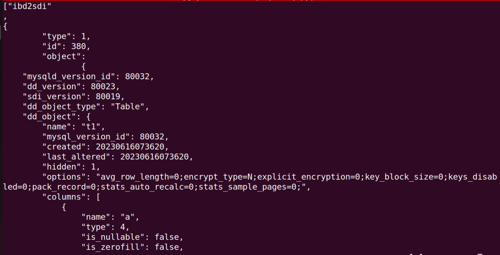
如您所见，表名在“dd_object:name”字段中，列信息存储在“dd_object:columns”数组中。
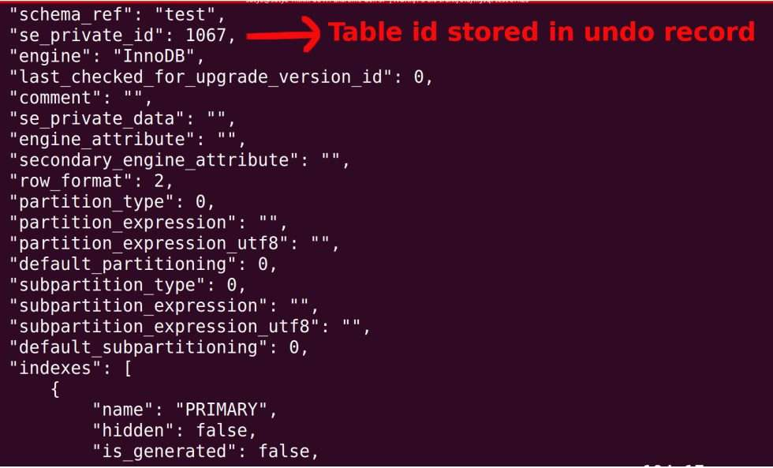
## 以往的设计（8.0.33-28 之前）
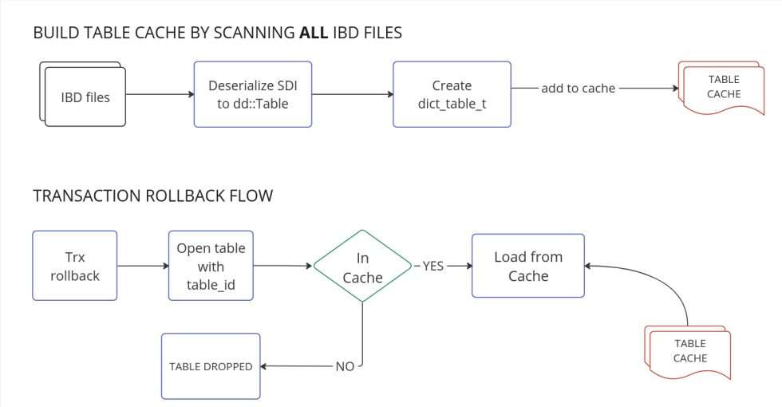
XtraBackup 从每个 IBD 读取 SDI 并将 **每个** IBD 中的所有表加载到缓存中作为不可驱逐的。本质上，通过将表加载为不可驱逐来禁用 LRU 缓存。 每个表保留在内存中，直到 XtraBackup 退出。
这种方法的问题：
- 加载不需要回滚的表。
- 从读取表的 SDI 页面进行不必要的 IO 操作。
- 加载不必要的表会增加准备所需的时间。
- 占用内存可能导致 OOM。
- 如果备份目录包含大量 表/IBD 文件，则会导致 XtraBackup Prepare 操作崩溃。
- 加入 PXC 集群的节点需要更多内存并花费很长时间加入集群。
为什么 XtraBackup 会将表加载为“**不可驱逐**”？我们可以只是将它们加载为可驱逐来解决问题吗？假设一个表被驱逐，必须再次加载它。XtraBackup 将如何知道包含被驱逐表的表空间（IBD）？它必须再次扫描每个 IBD 才能找到被驱逐的表。
## 新的设计（8.0.33-28 开始)
为了将表加载为可驱逐的，必须建立 `table_id` 和包含表的表空间 `space_id` 之间的关系。它是通过扫描数据字典表 `mysql.indexes` 和 `mysql.index_partitions` 的 B 树页面完成的。
建立此 **table_id→space_id** 关系后，它将在事务回滚期间使用。在这种新设计中，只有在它们上面有事务回滚时，才会加载用户表。
新设计如下：
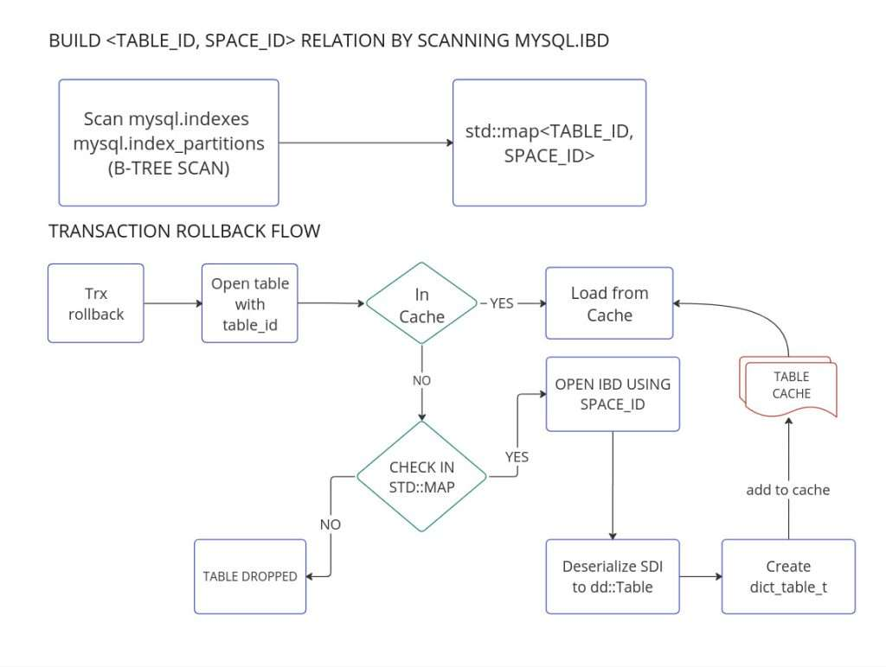
当达到缓存大小限制或由后台主线程时，缓存中的表将被逐出。
新设计的好处（`xtrabackup -prepare`）：
- 使用更少的内存
- 使用更少的 IO
- 更快的准备
- 即使有大量表也能成功完成
- 节点更快地完成 SST 过程并快速加入 PXC 集群
- 节点需要更少的内存才能加入 PXC 集群
## 压测
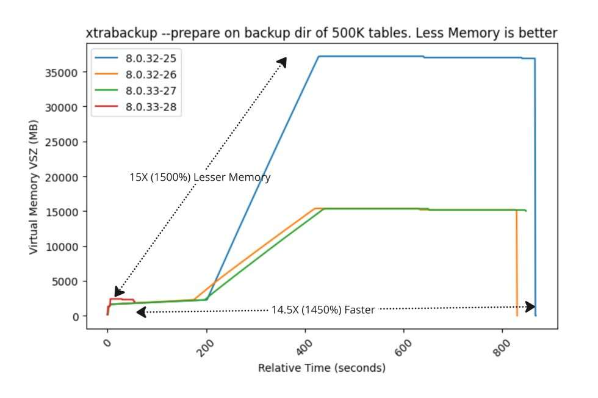
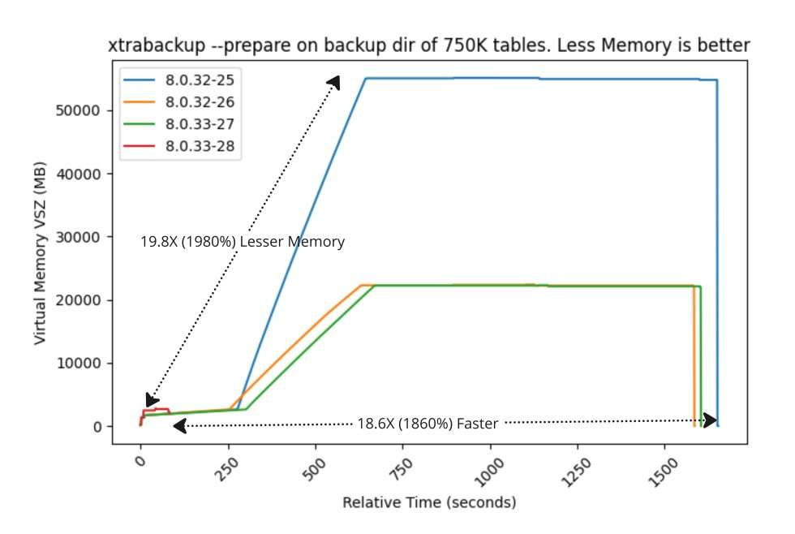
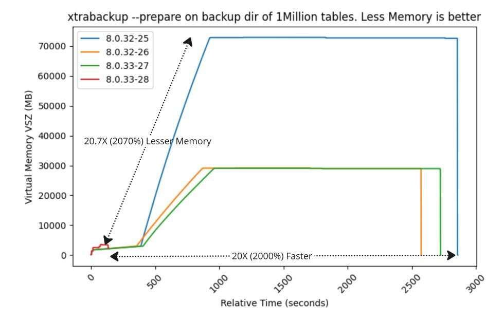
在其他大小的备份目录上对 `xtrabackup -prepare` 进行基准测试，如 10K、50K、100K 和 250K 表。性能改进如下：
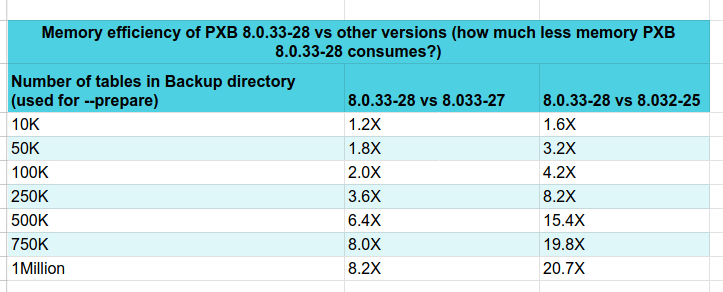
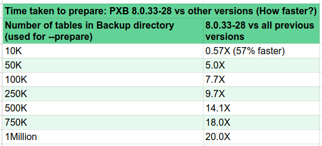
## 结论
正如您所见，从 Percona XtraBackup 8.0.33-28 开始，具有字典缓存的 `xtrabackup -prepare` 更快、更高效。 改进将取决于备份目录中的表空间文件（IBD）数量。 新节点加入 PXC 集群所需的时间也大大减少，因为 SST 过程将更快完成。