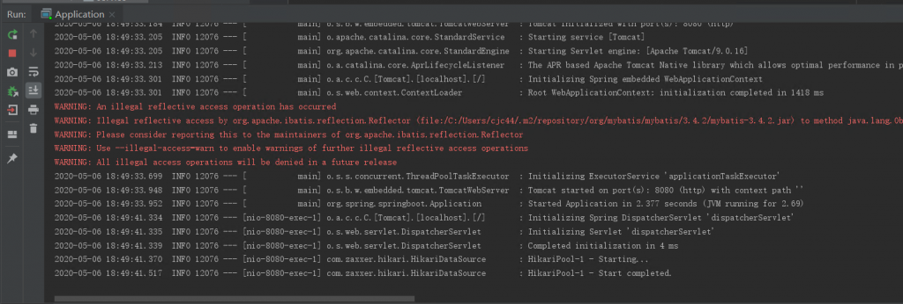
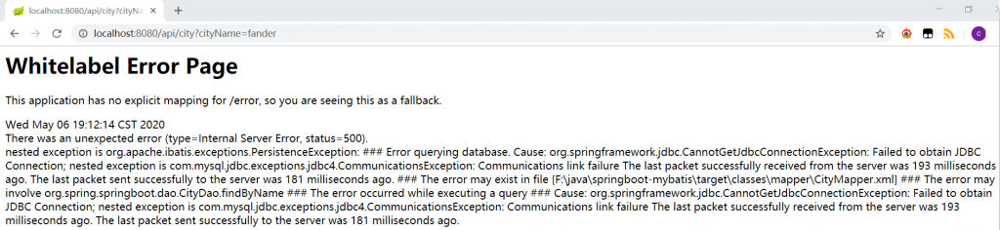
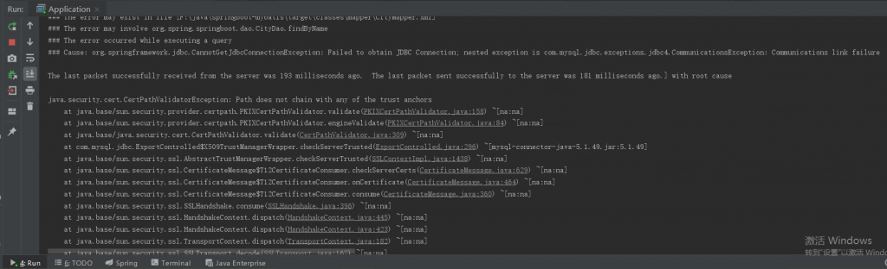
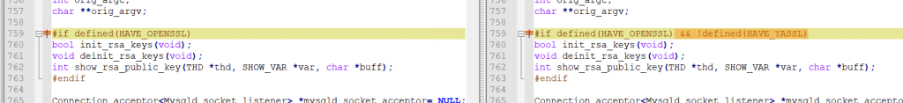

# 故障分析 | Bad handshake，升级 5.7.28 引起的“血案”

**原文链接**: https://opensource.actionsky.com/20200514-mysql/
**分类**: MySQL 新特性
**发布时间**: 2020-05-14T01:34:27-08:00

---

作者：陈俊聪
任职于中移信息基础平台部数据库组，负责 MySQL 数据库运维工作。
本文来源：原创投稿
*爱可生开源社区出品，原创内容未经授权不得随意使用，转载请联系小编并注明来源。
**引言**
作为一名 DBA 碰到过升级出问题需要回退么？碰到过回退还解决不了问题么？我有幸遇到了一次凶险的升级“血案”。问题来自协助客户升级 MySQL，以修复一个安全漏洞。升级版本为 5.7.30，但这个问题源于 5.7.28，并且影响 5.7.28 以上的版本，所以文章主要对比 5.7.27 和 5.7.28 版本。> 注意不是 bug，后面会详细说明！
**一、现象**
MySQL 从 5.7.27 升级到 5.7.30。完成后应用连接测试发现页面异常，mysql error 日志显示：- `2020-05-05T22:10:57.976402+08:00 2 [Note] Bad handshake`
没有报错，但这条 Note 级别的日志，引起了我的注意，之前从来没有见过。由于时间紧急，决定先回退 MySQL 版本。**回退后，问题未能解决。**Bad handshake，&#8221;不好的握手&#8221;，网上查了资料，发现和 SSL 可能有关。这时业务也发来应用日志，日志有明显的 SSL 相关报错。然后，我们去检查了 jdbc 连接串，连接串使用了 `useSSL=true`，改为 `useSSL=false` 后解决了。
**二、分析**
我们搭建了一套 java 应用环境，在 5.7.27 版本和 5.7.28 版本分别测试了发生故障时的 jdbc 串：- `spring.datasource.url=jdbc:mysql://192.168.199.198:3307/springbootdb?useUnicode=true&useSSL=true&characterEncoding=utf8`
**5.7.27 版本**
1. 默认关闭了 SSL- `mysql> select @@version;`
- `+------------+`
- `| @@version  |`
- `+------------+`
- `| 5.7.27-log |`
- `+------------+`
- `1 row in set (0.00 sec)`
- 
- `mysql> show variables like '%ssl%';`
- `+---------------+----------+`
- `| Variable_name | Value    |`
- `+---------------+----------+`
- `| have_openssl  | DISABLED |`
- `| have_ssl      | DISABLED |`
- `| ssl_ca        |          |`
- `| ssl_capath    |          |`
- `| ssl_cert      |          |`
- `| ssl_cipher    |          |`
- `| ssl_crl       |          |`
- `| ssl_crlpath   |          |`
- `| ssl_key       |          |`
- `+---------------+----------+`
- `9 rows in set (0.00 sec)`
2. 应用页面正常
											
3. tomcat 日志正常
											
4. 抓包，确实没有用到 SSL，SQL 的明文被我抓出来了- `[root@fander ~]# tcpdump -i ens33 port 3307 -l -s 0 -w - | strings`
- `tcpdump: listening on ens33, link-type EN10MB (Ethernet), capture size 262144 bytes`
- `^rY`
- `^,]`
- `select`
- `                id, province_id, city_name, description`
- `                from city`
5. mysql err log 正常
**小结**5.7.27 版本下，jdbc 连接串错误地配置了 `useSSL=true`，并不会有问题，因为数据库不支持 SSL，所以连接实际上并不会使用到 SSL，一切正常。
5.7.28 版本
1. 升级后，默认居然开了 SSL- `mysql> show variables like '%ssl%';`
- `+---------------+-----------------+`
- `| Variable_name | Value           |`
- `+---------------+-----------------+`
- `| have_openssl  | YES             |`
- `| have_ssl      | YES             |`
- `| ssl_ca        | ca.pem          |`
- `| ssl_capath    |                 |`
- `| ssl_cert      | server-cert.pem |`
- `| ssl_cipher    |                 |`
- `| ssl_crl       |                 |`
- `| ssl_crlpath   |                 |`
- `| ssl_key       | server-key.pem  |`
- `+---------------+-----------------+`
- `9 rows in set (0.00 sec)`
2. 应用页面异常
											
3. tomcat 日志异常
											
- `上面日志，能看出是 SSL 相关异常。`
- `并且能发现一个关键的报错，是握手异常，并且有证书相关的报错。`
- 
- `    Caused by: javax.net.ssl.SSLHandshakeException: java.security.cert.CertPathValidatorException: Path does not chain with any of the trust anchors`
- 
- `后面我证实了，jdbc 连接要求 SSL 和 证书认证要一起使用。`
4. 抓包显示有加密信息，没有抓取到 SQL- `[root@fander ~]# tcpdump -i ens33 port 3307 -l -s 0 -w - | strings`
- `tcpdump: listening on ens33, link-type EN10MB (Ethernet), capture size 262144 bytes`
- `@8q=*`
- `8q=+P`
- `@8q=+`
- `5.7.30-log`
- `=LQIKF7`
- `mysql_native_password`
- `8q=}P`
- `@8q=}`
- `B 8q=}P`
- `@8q=}`
- `@8q=}`
- `0<1:08`
- `1MySQL_Server_5.7.30_Auto_Generated_CA_Certificate0`
- `200506110938Z`
- `300504110938Z0@1>0<`
- `5MySQL_Server_5.7.30_Auto_Generated_Server_Certificate0`
- ` 2nh`
- `=zFx`
- `3[x=`
- `o(*c0`
- `Ty5B`
- `0A,IY`
- `-{u6`
- `0<1:08`
- `1MySQL_Server_5.7.30_Auto_Generated_CA_Certificate0`
- `200506110938Z`
- `300504110938Z0<1:08`
- `1MySQL_Server_5.7.30_Auto_Generated_CA_Certificate0`
- `>*[]dG`
- `^!!$`
- `y[(j`
- `kh(nPjd`
- `VU{h`
- `MMojb`
- `U38P`
- `3.^Z`
5. mysql err log 显示 &#8220;Bad handshake&#8221;- `2020-05-06T19:12:13.107321+08:00 2 [Note] Bad handshake`
**小结**5.7.28 版本下，jdbc 连接串错误地配置了 `useSSL=true`，会有问题，因为数据库支持 SSL，所以连接实际上应用连接会真的去使用 SSL，但是因为证书问题，导致连接失败，造成了这次升级故障。
**不加 useSSL 试试**
有一些客户的连接串，是没有使用 useSSL 参数的。
于是，我去掉 `useSSL=true`，把连接串改为- `spring.datasource.url=jdbc:mysql://192.168.199.198:3307/springbootdb?useUnicode=true&characterEncoding=utf8`
发现一切正常，但 tomcat 日志有以下的 warnings：Wed May 06 20:54:47 CST 2020 WARN: Establishing SSL connection without server&#8217;s identity verification is not recommended. According to MySQL 5.5.45+, 5.6.26+ and 5.7.6+ requirements SSL connection must be established by default if explicit option isn&#8217;t set. For compliance with existing applications not using SSL the verifyServerCertificate property is set to &#8216;false&#8217;. You need either to explicitly disable SSL by setting useSSL=false, or set useSSL=true and provide truststore for server certificate verification.
翻译：- 不建议在未经服务器身份验证的情况下建立 SSL 连接。
- 根据 MySQL 5.5.45+、5.6.26+ 和 5.7.6+ 的要求，如果未设置显式选项，则默认情况下必须建立 SSL 连接。
- 为了符合不使用 SSL 的现有应用程序，verifyServerCertificate 属性设置为“false”。
- 您需要通过设置 `useSSL=false` 显式禁用 SSL，
- 或者设置 `useSSL=true` 并为服务器证书验证提供 truststore。
从这里的报错，我发现了另外一个连接串参数，verifyServerCertificate，这个参数默认为 true，表示要验证服务器证书。
测试得出了以下表格：
											
**三、原因**
原因就是连接串错误地设置了 `useSSL=true`。在 5.7.27 版本由于实际上不支持 SSL 连接，所以设置 useSSL 居然不会报错，而会降级使用非 SSL 连接；而在 5.7.28 版本，实际上支持了 SSL 连接，所以根据 jdbc 配置 `useSSL=true`，连接会真的采用 SSL，但应用服务器并没有为服务器证书验证提供 truststore 文件，所以报错了。
**问题一：为什么 5.7.28 才支持 SSL？**
翻阅官方文档 5.7.28 的 release notes，并没有发现新支持 SSL 的描述，所以应该原本也是支持 SSL 的。实际上的确如此，对于非 openssl 编译的 MySQL(5.7.27 及之前版本)，可以采用 Linux 自带的 openssl 和 MySQL 自带的工具 mysql_ssl_rsa_setup，来生成&#8221;SSL 密钥和证书文件&#8221;，以支持 SSL 连接。
注意：Only OpenSSL
> 以往 MySQL 社区版默认是使用 yassl 编译，企业版默认使用 openssl 编译，手动编译时可以选择 yassl 或 openssl。目前仅支持 OpenSSL，yassl 被移除了，默认编译用的是 openssl，社区版和企业版支持并且只支持 openssl 作为其 SSL 库。至于为什么要使用 openssl 替代 yassl，我们不展开讨论。
在 mysqld.cc 源码里可以看到相关的一些代码改动，
											
左边 5.7.28，定义了 openssl，则 init-rsa_keys右边 5.7.27，定义了 openssl，并且没有定义 yassl，才 init_rsa_keys。由于 5.7.27 默认是 yassl 编译的，所以实际上不会执行 init_rsa_keys 那段代码。怀疑就是这个改动致使 5.7.28 才支持 SSL。> 准确地说，是 5.7.28 才默认支持 SSL，之前版本需要手动使用工具 mysql_ssl_rsa_setup 来生成&#8221;SSL 密钥和证书文件&#8221;，以支持 SSL 连接。
1. 5.7.28 启动数据库时，会在数据目录自动生成以下文件，而 5.7.27 版本并没有。
- `ca-key.pem`
- `ca.pem`
- `client-cert.pem`
- `client-key.pem`
- `private_key.pem`
- `public_key.pem`
- `server-cert.pem`
- `server-key.pem`
这些文件实际上就是&#8221;SSL 密钥和证书文件&#8221;，用于支持 SSL 连接。
2. 那么为什么 5.7.28 会自动生成这些文件？- `mysql --verbose --help |less`
- `  --auto-generate-certs`
- `                      Auto generate SSL certificates at server startup if --ssl`
- `                      is set to ON and none of the other SSL system variables`
- `                      are specified and certificate/key files are not present`
- `                      in data directory.`
- `                      (Defaults to on; use --skip-auto-generate-certs to disable.)`
在 5.7.28 版本，存在该服务器参数，但 5.7.27 未见此参数。参数写的很清楚，默认是开的，用于自动生成&#8221;SSL 密钥和证书文件&#8221;，如果数据目录没有这堆文件的话。相关的参数，还有这些：- auto_generate_certs
- sha256_password_auto_generate_rsa_keys
- sha256_password_private_key_path
- sha256_password_public_key_path
- Rsa_public_key
官方文档并没有告诉我们这些参数是 5.7.28 新增的，原因是因为这些参数压根就不是新增的！这些参数是一直都有的！如果你的 MySQL 源码编译时用 openssl，替代 yassl，那就有这些参数！**所以 Only OpenSSL 这个新特性，实际上影响比官方文档写的要大，因为他实际上影响了 MySQL 参数！影响了 MyS****QL 默认开启了 SSL 的支持！**
**问题二：为什么降级回退 MySQL 没有解决问题？**
MySQL 5.7.28 启动的时候，会自动生成这些&#8221;SSL 密钥和证书文件&#8221;，所以实际上开启了 SSL 支持。回退 MySQL 5.7.27 时，这些文件和元数据无关，mysql_upgrade 程序是不会帮你删除这些&#8221;SSL 密钥和证书文件&#8221;的，所以回退后，5.7.27 实际上也开启了 SSL 支持！这导致我那个错误配置 useSSL=true 但没有配置 truststore 文件的应用程序报错。
讨论解决办法
既然，有没有这堆文件，会导致实际上是否开启 SSL，那么解决办法可以是：1. 删除这堆文件，然后重启 MySQL。在回退后的 5.7.27 版本是可以这么操作，但我们总归要升级回去 5.7.28 的，而5.7.28 启动又会自动生成这堆文件，开启 SSL，所以这方法不行。2. 删除这堆文件的某个文件，然后重启 MySQL。这个方法看起来是可行的，例如删除了 ca.pem 这个文件，文件不全会导致 SSL disabled，并且 mysqld 判断数据目录有部分 pem 文件，于是不会重新生成。但这方法忽略了一个可能，就是如果数据库通过 Xtrabackup 物理热备重做数据库后，因为 Xtrabackup 实际上不会备份任何 pem 文件，所以数据库重做启动后，因 mysqld 判断数据目录没有&#8221;SSL 密钥和证书文件&#8221;，这堆文件会全部重新生成。所以这方法不可行。3. 配置 auto_generate_certs=off让不生成 cert 文件，即可默认 SSL disabled。
建议的解决办法
因为 5.7.27 之前实际上默认是不支持 SSL 连接的，所以为了升级数据库保持原样，只需要配置文件新增以下配置即可。- `[mysqld]`
- `skip_ssl`
这方法，可以忽略&#8221;SSL 密钥和证书文件&#8221; ，不启用 ssl 。
**总结**
文章分享了 jdbc 应该如何配置，并且分享了一起官方文档没有提及的&#8221;默认参数变化&#8221;引起的升级故障，建议大家升级之前测试一下，对比一下参数，不要过度依赖于官方 release notes 文档。