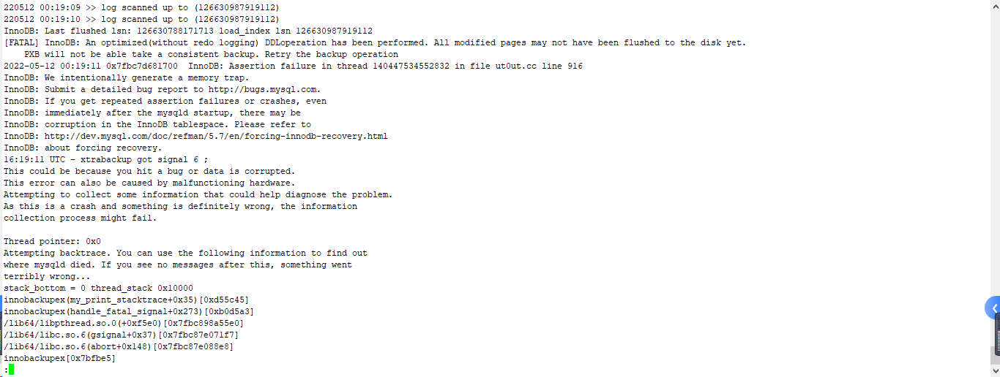
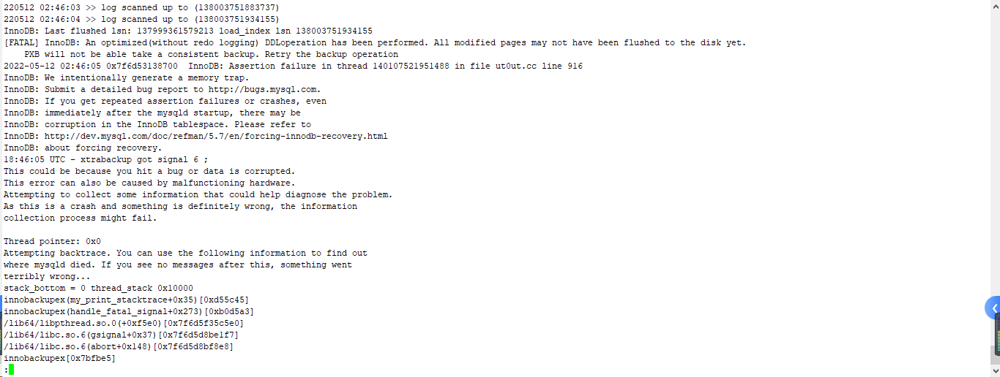
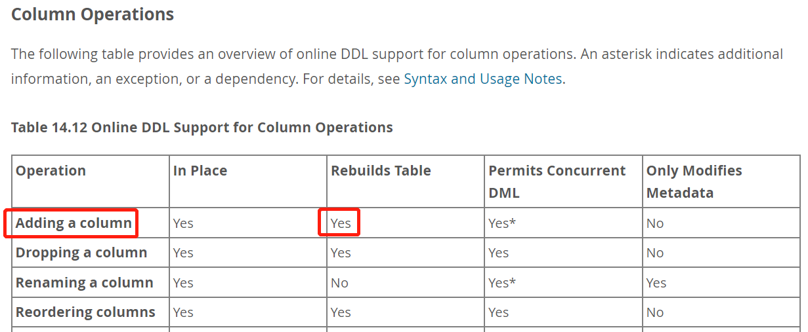
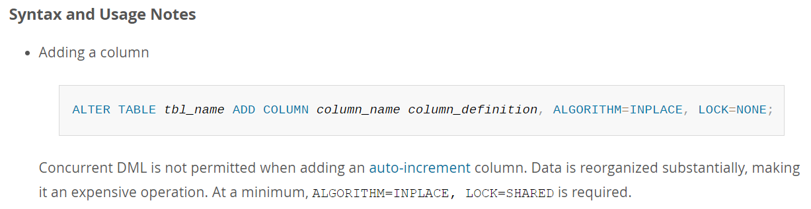
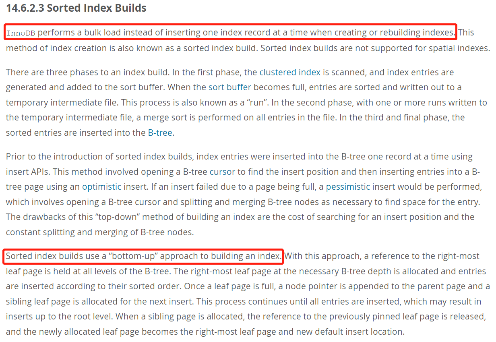
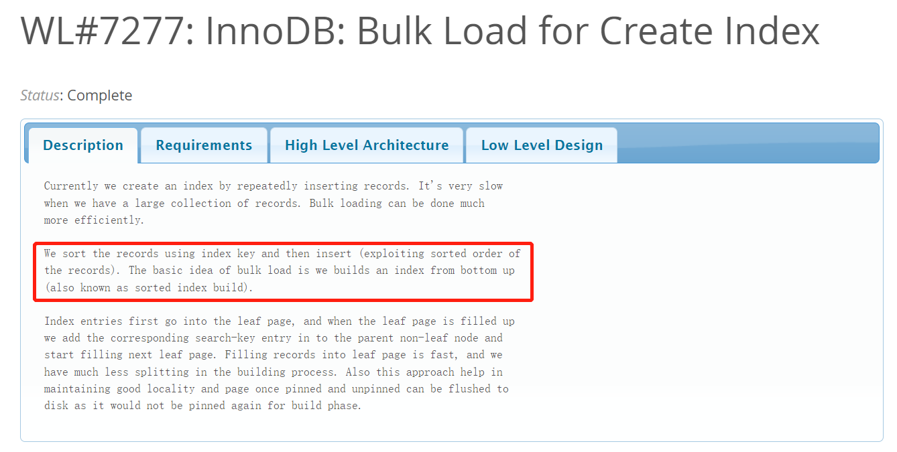
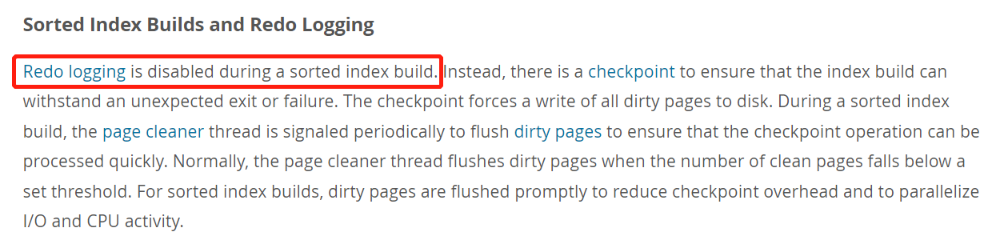

# 故障分析 | DDL 导致的 Xtrabackup 备份失败

**原文链接**: https://opensource.actionsky.com/20220526-mysql/
**分类**: MySQL 新特性
**发布时间**: 2022-05-26T00:54:44-08:00

---

作者：赵黎明
爱可生 MySQL DBA 团队成员，熟悉 Oracle、MySQL 等数据库，擅长数据库性能问题诊断、事务与锁问题的分析等，负责处理客户 MySQL 及我司自研 DMP 平台日常运维中的问题，对开源数据库相关技术非常感兴趣。
本文来源：原创投稿
*爱可生开源社区出品，原创内容未经授权不得随意使用，转载请联系小编并注明来源。
## 背景
近日，客户反馈某生产业务系统凌晨的物理备份都失败了（一主二从的集群，仅在两个从库上做 Xtrabackup 全备，主库不参与备份），需排查备份失败的原因。
## 案例分析
由于客户使用的是我司爱可生的 DMP 数据库管理平台，当备份失败时，在备份目录中会写入一个 FAIL 的标志文件，然后回滚掉残留文件，此时 Xtrabackup 自身的日志已无法查看，不过可以通过 urman-agent 组件（负责备份恢复）日志来获取备份失败的信息，以下是当时两个从库上的报错信息
- 从库1日志

- 从库2日志

两个从库虽然报错的时间不同，但报错的内容一致，都指向了“不记录 redo 日志的 DDL 操作”：
[FATAL] InnoDB: An optimized(without redo logging) DDLoperation has been performed. All modified pages may not have been flushed to the disk yet.
PXB will not be able take a consistent backup. Retry the backup operation
经确认，客户的确是在凌晨执行了 DDL 业务变更，变更的内容为创建一张新表，并给现存的两张表添加字段，加字段的表大约有几百万行记录，这一信息与日志给出的内容吻合，看来问题大概率是出在加字段的 DDL 操作上
那什么是不记录 redo 的 DDL 的操作呢？为何会存在不记录 redo 的 DDL ？
首先，我们知道，在 MySQL 5.7 中给表加字段属于 ONLINE DLL ，会重建表，但允许并发 DML（PS：MySQL 8.0 加字段不需要重建表）

由于 MySQL 采用的是索引组织表（IOT），表上的索引当然也需要重建，由于采用了 ALGORITHM=INPLACE 的方式，允许并发 DML

在 MySQL 5.7 中，对索引有一个优化，即 Sorted Index Builds ，会在创建或重建索引的时候通过 bulk load 、bottom-up 的方式来填充索引记录

采用 Sorted Index Build 方式创建索引时，不会记录到 redo 日志中，而这就是之前 Xtrabackup 报错中所描述的“An optimized(without redo logging) DDL operation”的场景

Percona 称这是 Xtrabackup 2.4.x 的一个 bug ，主要是为了避免得到一个错误的备份集，一旦检测到有不记录 redo 的 DDL 操作，就会将备份进程终止，而客户生产环境中的 PXB 版本正是2.4.5
针对这一问题，Percona在Xtrabackup 2.4.8 及之后的版本中，新增了&#8211;lock-ddl，&#8211;lock-ddl-timeout，&#8211;lock-ddl-per-table这几个参数，使其可以在备份时加上备份锁，或给表加上 MDL 锁来阻塞其他的 DDL 操作，使备份顺利完成
原因明确了，就知道如何解决问题了，最后分别在2个从库上执行手动备份，每个实例（500G左右）大约耗时2小时40分钟完成备份
Percona 以增加参数的方式提供了解决备份失败的方法，那如果暂时无法升级 PXB 版本，仅在 MySQL 层面，有没有解决方法呢？其实也是可以的。
对于以上提到的几种场景，我们都来测试一下吧
## 场景测试
### 环境准备
#### 创建测试表
/usr/local/sysbench/share/sysbench# sysbench oltp_insert.lua --db-driver=mysql --threads=256 --time=300 --mysql-host=10.186.60.68 --mysql-port=3332 --mysql-user=zlm --mysql-password=zlm --tables=2 --table-size=2000000 --db-ps-mode=disable --report-interval=10 prepare
sysbench 1.0.17 (using bundled LuaJIT 2.1.0-beta2)
Initializing worker threads...
Creating table 'sbtest2'...
Inserting 2000000 records into 'sbtest2'
Creating table 'sbtest1'...
Inserting 2000000 records into 'sbtest1'
Creating a secondary index on 'sbtest2'...
Creating a secondary index on 'sbtest1'...
#### 准备脚本（batch_ddl.sh）
-- 该脚本的作用是对测试表进行持续的DDL操作（增加/删除字段，模拟客户的业务变更）
dmp2 (master) ~/script# echo > batch_ddl.sh
dmp2 (master) ~/script# cat << EOF > batch_ddl.sh
> #!/bin/bash
> echo "alter table sbtest1 add sid varchar(32);"|/data/mysql/base/5.7.36/bin/mysql -h10.186.60.68 -P3332 -uzlm -pzlm sbtest
> sleep 1
> echo "alter table sbtest2 add sid varchar(32);"|/data/mysql/base/5.7.36/bin/mysql -h10.186.60.68 -P3332 -uzlm -pzlm sbtest
> sleep 10
> echo "alter table sbtest1 drop sid;"|/data/mysql/base/5.7.36/bin/mysql -h10.186.60.68 -P3332 -uzlm -pzlm sbtest
> sleep 1
> echo "alter table sbtest2 drop sid;"|/data/mysql/base/5.7.36/bin/mysql -h10.186.60.68 -P3332 -uzlm -pzlm sbtest
> EOF
### 场景1：备份时并发执行 DDL（无额外参数）
#### 执行脚本
dmp2 (master) ~/script# while true; do bash batch_ddl.sh; done
mysql: [Warning] Using a password on the command line interface can be insecure.
mysql: [Warning] Using a password on the command line interface can be insecure.
... 略
#### 验证脚本是否生效（观察测试表的 sid 字段，时而有，时而无）
zlm@10.186.60.68 [sbtest]> show create table sbtest1\G
*************************** 1. row ***************************
Table: sbtest1
Create Table: CREATE TABLE `sbtest1` (
`id` int(11) NOT NULL AUTO_INCREMENT,
`k` int(11) NOT NULL DEFAULT '0',
`c` char(120) NOT NULL DEFAULT '',
`pad` char(60) NOT NULL DEFAULT '',
PRIMARY KEY (`id`),
KEY `k_1` (`k`)
) ENGINE=InnoDB AUTO_INCREMENT=2000001 DEFAULT CHARSET=utf8
1 row in set (0.00 sec)
zlm@10.186.60.68 [sbtest]> show create table sbtest1\G
*************************** 1. row ***************************
Table: sbtest1
Create Table: CREATE TABLE `sbtest1` (
`id` int(11) NOT NULL AUTO_INCREMENT,
`k` int(11) NOT NULL DEFAULT '0',
`c` char(120) NOT NULL DEFAULT '',
`pad` char(60) NOT NULL DEFAULT '',
`sid` varchar(32) DEFAULT NULL,
PRIMARY KEY (`id`),
KEY `k_1` (`k`)
) ENGINE=InnoDB AUTO_INCREMENT=2000001 DEFAULT CHARSET=utf8
1 row in set (0.00 sec)
#### 执行 Xtrabackup 备份
-- 检查Xtrabackup的版本（客户生产环境为2.4.5）
dmp2 /data/urman-agent/bin# ./xtrabackup --version
xtrabackup: recognized server arguments: --datadir=/var/lib/mysql
./xtrabackup version 2.4.20 based on MySQL server 5.7.26 Linux (x86_64) (revision id: c8b4056)
-- 执行备份
./xtrabackup --defaults-file=/data/mysql/mysql3332/my.cnf \
--user=zlm --password=zlm --target-dir=/data/backup/`date +%F_%H-%M-%S` \
--backup --host=127.0.0.1 --port=3332 --parallel 4 \
--check-privileges --no-version-check
... 略
220512 15:11:11 [01] Copying ./sbtest/db.opt to /data/backup/2022-05-12_15-10-56/sbtest/db.opt
220512 15:11:11 [01]        ...done
220512 15:11:11 [01] Copying ./sbtest/sbtest2.frm to /data/backup/2022-05-12_15-10-56/sbtest/sbtest2.frm
220512 15:11:11 [01]        ...done
220512 15:11:11 [01] Copying ./sbtest/sbtest1.frm to /data/backup/2022-05-12_15-10-56/sbtest/sbtest1.frm
220512 15:11:11 [01]        ...done
220512 15:11:11 Finished backing up non-InnoDB tables and files
220512 15:11:11 [00] Writing /data/backup/2022-05-12_15-10-56/xtrabackup_binlog_info
220512 15:11:11 [00]        ...done
220512 15:11:11 Executing FLUSH NO_WRITE_TO_BINLOG ENGINE LOGS...
xtrabackup: The latest check point (for incremental): '250912794909'
xtrabackup: Stopping log copying thread.
.InnoDB: Last flushed lsn: 250912650797 load_index lsn 250913206547
InnoDB: An optimized (without redo logging) DDL operation has been performed. All modified pages may not have been flushed to the disk yet.
PXB will not be able to make a consistent backup. Retry the backup operation
dmp2 /data/urman-agent/bin#
## 以上步骤，直接复现了客户生产环境的故障场景
#### 终止脚本
mysql: [Warning] Using a password on the command line interface can be insecure.
mysql: [Warning] Using a password on the command line interface can be insecure.
mysql: [Warning] Using a password on the command line interface can be insecure.
mysql: [Warning] Using a password on the command line interface can be insecure.
mysql: [Warning] Using a password on the command line interface can be insecure.
mysql: [Warning] Using a password on the command line interface can be insecure.
^C^C -- query aborted
ERROR 1317 (70100) at line 1: Query execution was interrupted
#### 小结
默认情况下，即使是 Xtrabackup 高版本，如果备份时并发执行 DDL ，并且没有指定 DDL 锁参数（&#8211;lock-ddl，&#8211;lock-ddl-per-table），会导致备份失败
### 场景2：备份时并发执行 DDL（加&#8211;lock-ddl参数）
#### 执行脚本
dmp2 (master) ~/script# while true; do bash batch_ddl.sh; done
mysql: [Warning] Using a password on the command line interface can be insecure.
mysql: [Warning] Using a password on the command line interface can be insecure.
... 略
#### 执行 Xtrabackup 备份
dmp2 /data/urman-agent/bin# ./xtrabackup --defaults-file=/data/mysql/mysql3332/my.cnf --user=zlm --password=zlm --target-dir=/data/backup/`date +%F_%H-%M-%S` --backup --host=127.0.0.1 --port=3332 --parallel 4 --check-privileges --no-version-check --lock-ddl
xtrabackup: recognized server arguments: --datadir=/data/mysql/mysql3332/data --tmpdir=/data/mysql/mysql3332/tmp --open_files_limit=65535 --server-id=31782647 --log_bin=/data/mysql/mysql3332/logs/mysql-bin --innodb_buffer_pool_size=100M --innodb_data_file_path=ibdata1:100M:autoextend --innodb_flush_log_at_trx_commit=1 --innodb_log_buffer_size=8M --innodb_log_file_size=100M --innodb_log_files_in_group=3 --innodb_max_dirty_pages_pct=50 --innodb_file_per_table=1 --innodb_io_capacity=2000 --innodb_flush_method=O_DIRECT --innodb_flush_log_at_trx_commit=1 --parallel=4
xtrabackup: recognized client arguments: --port=3332 --socket=/tmp/mysql3332.sock --user=zlm --password=* --target-dir=/data/backup/2022-05-12_16-02-37 --backup=1 --host=127.0.0.1 --port=3332 --check-privileges=1 --no-version-check=1 --lock-ddl=1
220512 16:02:37 Connecting to MySQL server host: 127.0.0.1, user: zlm, password: set, port: 3332, socket: /tmp/mysql3332.sock
Using server version 5.7.36-log
220512 16:02:37 Error: LOCK TABLES FOR BACKUP is not supported.
## MySQL社区版不支持--lock-ddl参数，直接报错
#### 小结
lock-ddl 其实就是在进行备份的时候，执行备份锁（LOCK TABLES FOR BACKUP）来阻塞 DDL 语句，由于只有 Percona Server 支持该语法，MySQL 社区版暂时无法模拟，MariaDB 分支也同样不支持该语法
### 场景3：备份时并发执行 DDL（加&#8211;lock-ddl-per-table参数）
#### 执行脚本
dmp2 (master) ~/script# while true; do bash batch_ddl.sh; done
mysql: [Warning] Using a password on the command line interface can be insecure.
mysql: [Warning] Using a password on the command line interface can be insecure.
... 略
#### 执行 Xtrabackup 备份
dmp2 /data/urman-agent/bin# ./xtrabackup --defaults-file=/data/mysql/mysql3332/my.cnf --user=zlm --password=zlm --target-dir=/data/backup/`date +%F_%H-%M-%S` --backup --host=127.0.0.1 --port=3332 --parallel 4 --check-privileges --no-version-check --lock-ddl-per-table
xtrabackup: recognized server arguments: --datadir=/data/mysql/mysql3332/data --tmpdir=/data/mysql/mysql3332/tmp --open_files_limit=65535 --server-id=31782647 --log_bin=/data/mysql/mysql3332/logs/mysql-bin --innodb_buffer_pool_size=100M --innodb_data_file_path=ibdata1:100M:autoextend --innodb_flush_log_at_trx_commit=1 --innodb_log_buffer_size=8M --innodb_log_file_size=100M --innodb_log_files_in_group=3 --innodb_max_dirty_pages_pct=50 --innodb_file_per_table=1 --innodb_io_capacity=2000 --innodb_flush_method=O_DIRECT --innodb_flush_log_at_trx_commit=1 --parallel=4
xtrabackup: recognized client arguments: --port=3332 --socket=/tmp/mysql3332.sock --user=zlm --password=* --target-dir=/data/backup/2022-05-12_16-07-12 --backup=1 --host=127.0.0.1 --port=3332 --check-privileges=1 --no-version-check=1 --lock-ddl-per-table=1
220512 16:07:12 Connecting to MySQL server host: 127.0.0.1, user: zlm, password: set, port: 3332, socket: /tmp/mysql3332.sock
Using server version 5.7.36-log
./xtrabackup version 2.4.20 based on MySQL server 5.7.26 Linux (x86_64) (revision id: c8b4056)
xtrabackup: uses posix_fadvise().
xtrabackup: cd to /data/mysql/mysql3332/data
xtrabackup: open files limit requested 65535, set to 65535
xtrabackup: using the following InnoDB configuration:
xtrabackup:   innodb_data_home_dir = .
xtrabackup:   innodb_data_file_path = ibdata1:100M:autoextend
xtrabackup:   innodb_log_group_home_dir = ./
xtrabackup:   innodb_log_files_in_group = 3
xtrabackup:   innodb_log_file_size = 104857600
xtrabackup: using O_DIRECT
InnoDB: Number of pools: 1
220512 16:07:13 >> log scanned up to (250920385317)
xtrabackup: Generating a list of tablespaces 
... 略
220512 16:07:14 Locking MDL for `sbtest`.`sbtest1`  ## 备份sbtest1表数据前，先加上MDL锁
220512 16:07:14 [04] Copying ./sbtest/sbtest1.ibd to /data/backup/2022-05-12_16-07-12/sbtest/sbtest1.ibd
220512 16:07:14 [02] Copying ./sbtest/sbtest2.ibd to /data/backup/2022-05-12_16-07-12/sbtest/sbtest2.ibd
220512 16:07:15 >> log scanned up to (250920494721)
220512 16:07:16 >> log scanned up to (250920494832)
220512 16:07:17 >> log scanned up to (250920494841)
220512 16:07:18 >> log scanned up to (250920494841)
220512 16:07:19 [02]        ...done
220512 16:07:19 >> log scanned up to (250920494841)
220512 16:07:20 >> log scanned up to (250920494841)
220512 16:07:20 [01]        ...done
220512 16:07:20 [04]        ...done
220512 16:07:21 Starting to backup non-InnoDB tables and files
... 略
220512 16:07:21 [01] Copying ./sbtest/sbtest2.frm to /data/backup/2022-05-12_16-07-12/sbtest/sbtest2.frm
220512 16:07:21 [01]        ...done
220512 16:07:21 [01] Copying ./sbtest/sbtest1.frm to /data/backup/2022-05-12_16-07-12/sbtest/sbtest1.frm
220512 16:07:21 [01]        ...done
220512 16:07:21 Finished backing up non-InnoDB tables and files
220512 16:07:21 [00] Writing /data/backup/2022-05-12_16-07-12/xtrabackup_binlog_info
220512 16:07:21 [00]        ...done
220512 16:07:21 Executing FLUSH NO_WRITE_TO_BINLOG ENGINE LOGS...
xtrabackup: The latest check point (for incremental): '250920494832'
xtrabackup: Stopping log copying thread.
.220512 16:07:21 >> log scanned up to (250920494841)
220512 16:07:21 Executing UNLOCK TABLES
220512 16:07:21 All tables unlocked
220512 16:07:21 [00] Copying ib_buffer_pool to /data/backup/2022-05-12_16-07-12/ib_buffer_pool
220512 16:07:21 [00]        ...done
220512 16:07:21 Backup created in directory '/data/backup/2022-05-12_16-07-12/'
MySQL binlog position: filename 'mysql-bin.000012', position '472261259', GTID of the last change '0e795785-0ee5-11ec-9350-02000aba3c44:1-1619'
220512 16:07:21 [00] Writing /data/backup/2022-05-12_16-07-12/backup-my.cnf
220512 16:07:21 [00]        ...done
220512 16:07:21 [00] Writing /data/backup/2022-05-12_16-07-12/xtrabackup_info
220512 16:07:21 [00]        ...done
220512 16:07:21 Unlocking MDL for all tablesxtrabackup: Transaction log of lsn (250920249371) to (250920494841) was copied.  ## 释放所有表上的MDL锁
220512 16:07:22 completed OK!
#### 终止脚本
... 略
mysql: [Warning] Using a password on the command line interface can be insecure.
^C^C -- query aborted
ERROR 1317 (70100) at line 1: Query execution was interrupted
mysql: [Warning] Using a password on the command line interface can be insecure.
^C^C -- query aborted
ERROR 1317 (70100) at line 1: Query execution was interrupted
mysql: [Warning] Using a password on the command line interface can be insecure.
ERROR 1060 (42S21) at line 1: Duplicate column name 'sid'
mysql: [Warning] Using a password on the command line interface can be insecure.
ERROR 1060 (42S21) at line 1: Duplicate column name 'sid'
^C
dmp2 (master) ~/script#
#### 小结
备份时使用 &#8211;lock-ddl-per-table 参数，会在拷贝每个表的 ibd 文件前先加一个 MDL 锁，用于阻塞该表上 DDL 语句的执行，直到备份完成后，DDL 才能继续执行
### 场景4：备份时并发执行DDL（设置MySQL参数：old_alter_table=1）
#### 关闭 ONLINE DDL 特性
zlm@10.186.60.68 [(none)]> set global old_alter_table=1;
Query OK, 0 rows affected (0.00 sec)
zlm@10.186.60.68 [(none)]> show variables like 'old_alter_table';
+-----------------+-------+
| Variable_name   | Value |
+-----------------+-------+
| old_alter_table | OFF   |
+-----------------+-------+
1 row in set (0.00 sec)
zlm@10.186.60.68 [(none)]> exit
Bye
dmp2 (master) ~/script# m3332 -Nse "show variables like 'old_alter_table';"
mysql: [Warning] Using a password on the command line interface can be insecure.
old_alter_table ON
#### 执行脚本
dmp2 (master) ~/script# while true; do bash batch_ddl.sh; done
mysql: [Warning] Using a password on the command line interface can be insecure.
ERROR 1060 (42S21) at line 1: Duplicate column name 'sid'
mysql: [Warning] Using a password on the command line interface can be insecure.
ERROR 1060 (42S21) at line 1: Duplicate column name 'sid'
mysql: [Warning] Using a password on the command line interface can be insecure.
mysql: [Warning] Using a password on the command line interface can be insecure.
... 略
#### 执行 Xtrabackup 备份
dmp2 /data/urman-agent/bin# ./xtrabackup --defaults-file=/data/mysql/mysql3332/my.cnf --user=zlm --password=zlm --target-dir=/data/backup/`date +%F_%H-%M-%S` --backup --host=127.0.0.1 --port=3332 --parallel 4 --check-privileges --no-version-check
xtrabackup: recognized server arguments: --datadir=/data/mysql/mysql3332/data --tmpdir=/data/mysql/mysql3332/tmp --open_files_limit=65535 --server-id=31782647 --log_bin=/data/mysql/mysql3332/logs/mysql-bin --innodb_buffer_pool_size=100M --innodb_data_file_path=ibdata1:100M:autoextend --innodb_flush_log_at_trx_commit=1 --innodb_log_buffer_size=8M --innodb_log_file_size=100M --innodb_log_files_in_group=3 --innodb_max_dirty_pages_pct=50 --innodb_file_per_table=1 --innodb_io_capacity=2000 --innodb_flush_method=O_DIRECT --innodb_flush_log_at_trx_commit=1 --parallel=4
xtrabackup: recognized client arguments: --port=3332 --socket=/tmp/mysql3332.sock --user=zlm --password=* --target-dir=/data/backup/2022-05-12_16-48-00 --backup=1 --host=127.0.0.1 --port=3332 --check-privileges=1 --no-version-check=1
220512 16:48:00 Connecting to MySQL server host: 127.0.0.1, user: zlm, password: set, port: 3332, socket: /tmp/mysql3332.sock
Using server version 5.7.36-log
./xtrabackup version 2.4.20 based on MySQL server 5.7.26 Linux (x86_64) (revision id: c8b4056)
xtrabackup: uses posix_fadvise().
xtrabackup: cd to /data/mysql/mysql3332/data
xtrabackup: open files limit requested 65535, set to 65535
xtrabackup: using the following InnoDB configuration:
xtrabackup:   innodb_data_home_dir = .
xtrabackup:   innodb_data_file_path = ibdata1:100M:autoextend
xtrabackup:   innodb_log_group_home_dir = ./
xtrabackup:   innodb_log_files_in_group = 3
xtrabackup:   innodb_log_file_size = 104857600
xtrabackup: using O_DIRECT
InnoDB: Number of pools: 1
220512 16:48:02 >> log scanned up to (251659945145)
xtrabackup: Generating a list of tablespaces
... 略
220512 16:48:03 [02] Copying ./zlm/t.ibd to /data/backup/2022-05-12_16-48-00/zlm/t.ibd
220512 16:48:03 [03]        ...done
220512 16:48:03 [02]        ...done
220512 16:48:03 [03] Copying ./sbtest/sbtest2.ibd to /data/backup/2022-05-12_16-48-00/sbtest/sbtest2.ibd
220512 16:48:03 [04] Copying ./zlm1/t1.ibd to /data/backup/2022-05-12_16-48-00/zlm1/t1.ibd
220512 16:48:03 [02] Copying ./sbtest/sbtest1.ibd to /data/backup/2022-05-12_16-48-00/sbtest/sbtest1.ibd
220512 16:48:03 [04]        ...done
220512 16:48:03 [04] Copying ./sbtest/#sql-c61_30133.ibd to /data/backup/2022-05-12_16-48-00/sbtest/#sql-c61_30133.ibd
220512 16:48:04 >> log scanned up to (251669706184)
220512 16:48:04 [04]        ...done
220512 16:48:05 >> log scanned up to (251672429294)
220512 16:48:06 >> log scanned up to (251675700622)
220512 16:48:07 >> log scanned up to (251678520383)
220512 16:48:08 >> log scanned up to (251681195105)
220512 16:48:09 [02]        ...done
220512 16:48:09 >> log scanned up to (251683273712)
220512 16:48:09 [01]        ...done
220512 16:48:10 >> log scanned up to (251694062575)
220512 16:48:11 >> log scanned up to (251707703017)
220512 16:48:12 [03]        ...done
220512 16:48:12 >> log scanned up to (251713134341)
220512 16:48:12 Executing FLUSH NO_WRITE_TO_BINLOG TABLES...
220512 16:48:13 >> log scanned up to (251721786959)
... 略
220512 16:48:38 [01] Copying ./sbtest/sbtest1.frm to /data/backup/2022-05-12_16-48-00/sbtest/sbtest1.frm
220512 16:48:38 [01]        ...done
220512 16:48:38 [01] Copying ./sbtest/sbtest2.frm to /data/backup/2022-05-12_16-48-00/sbtest/sbtest2.frm
220512 16:48:38 [01]        ...done
220512 16:48:38 Finished backing up non-InnoDB tables and files
220512 16:48:38 [00] Writing /data/backup/2022-05-12_16-48-00/xtrabackup_binlog_info
220512 16:48:38 [00]        ...done
220512 16:48:38 Executing FLUSH NO_WRITE_TO_BINLOG ENGINE LOGS...
xtrabackup: The latest check point (for incremental): '251977260800'
xtrabackup: Stopping log copying thread.
.220512 16:48:38 >> log scanned up to (252017389382)
220512 16:48:38 Executing UNLOCK TABLES
220512 16:48:38 All tables unlocked
220512 16:48:38 [00] Copying ib_buffer_pool to /data/backup/2022-05-12_16-48-00/ib_buffer_pool
220512 16:48:38 [00]        ...done
220512 16:48:38 Backup created in directory '/data/backup/2022-05-12_16-48-00/'
MySQL binlog position: filename 'mysql-bin.000012', position '472262307', GTID of the last change '0e795785-0ee5-11ec-9350-02000aba3c44:1-1625'
220512 16:48:38 [00] Writing /data/backup/2022-05-12_16-48-00/backup-my.cnf
220512 16:48:38 [00]        ...done
220512 16:48:38 [00] Writing /data/backup/2022-05-12_16-48-00/xtrabackup_info
220512 16:48:38 [00]        ...done
xtrabackup: Transaction log of lsn (251552488790) to (252017389382) was copied.
220512 16:48:38 completed OK!
dmp2 /data/urman-agent/bin#
## Xtrabackup备份日志中没有发现MDL锁，备份也顺利地执行完了，说明启用old_alter_table也能够解决备份失败的问题
#### 终止脚本
... 略
mysql: [Warning] Using a password on the command line interface can be insecure.
^C^C -- query aborted
ERROR 1317 (70100) at line 1: Query execution was interrupted
mysql: [Warning] Using a password on the command line interface can be insecure.
^C^C -- query aborted
ERROR 1317 (70100) at line 1: Query execution was interrupted
^C
04:48 PM dmp2 (master) ~/script#
#### 小结
当关闭 ONLINE DDL 特性时（old_alter_table=1），即执行 DDL 时强制其都采用 ALGORITHM=COPY 来代替 ALGORITHM=INPLACE ，此时即使备份时没有使用 DDL 锁的参数，也不会影响备份执行，但要注意的是，关闭 ONLINE DDL 特性会影响表上的 DML 并发，不推荐使用。
## 总结
- DDL 业务变更操作应尽量避开备份窗口
- Sorted Index Builds 对创建索引的优化与 PXB 2.4.x 备份存在冲突，需要替换为 PXB 高版本，并通过加备份锁或 MDL 锁的参数来避免备份失败
- MySQL 自身也可以通过关闭 ONLINE DDL 特性来解决备份失败的问题，但是会影响 DML 并发，需权衡利弊
## 参考链接
[https://dev.mysql.com/doc/refman/5.7/en/sorted-index-builds.html](https://dev.mysql.com/doc/refman/5.7/en/sorted-index-builds.html)
[https://dev.mysql.com/doc/refman/5.7/en/innodb-online-ddl-operations.html#online-ddl-column-operations](https://dev.mysql.com/doc/refman/5.7/en/innodb-online-ddl-operations.html#online-ddl-column-operations)
[https://dev.mysql.com/doc/refman/5.7/en/server-system-variables.html#sysvar_old_alter_table](https://dev.mysql.com/doc/refman/5.7/en/server-system-variables.html#sysvar_old_alter_table)