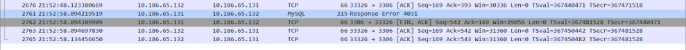

# 故障分析 | MySQL Router：服务器后端那么闲，为什么不让访问？

**原文链接**: https://opensource.actionsky.com/20220803-mysql/
**分类**: MySQL 新特性
**发布时间**: 2022-08-04T00:27:28-08:00

---

作者：杨际宁
爱可生 DBA 团队成员，主要负责 MySQL 日常维护、故障处理和性能优化。对技术执着，为客户负责。
本文来源：原创投稿
*爱可生开源社区出品，原创内容未经授权不得随意使用，转载请联系小编并注明来源。
#### 一、背景说明
开发反馈连 router 报错：&#8217;ERROR 1040 (HY000): Too many connections to MySQL Router&#8217;，
而后端 mysqlserver 上的连接却只有几个。经排查发现，当连接时间超过 wait_timeout 设定的值后，8.0.29 版本 router 的 TCP 连接并不会释放，且 8.0.30 版本的 router 依旧存在这个问题，因此采用降级的方式进行处理。
#### 二、问题复现
mysqlserver 版本
mysql> select version();
+-----------+
| version() |
+-----------+
| 8.0.28    |
+-----------+
1 row in set (0.01 sec)
router 版本
shell> ./mysqlrouter -V
MySQL Router  Ver 8.0.30 for Linux on x86_64 (MySQL Community - GPL)
router 端口设置为 8030 和设置最大连接数 max_connections = 3 方便复现
shell> egrep 'max|port' mysqlrouter.conf 
max_connections = 3
bind_port = 8030
开启 3 个会话
mysql> show processlist;
+-----+-----------------+---------------------+------+---------+--------+------------------------+------------------+
| Id  | User            | Host                | db   | Command | Time   | State                  | Info             |
+-----+-----------------+---------------------+------+---------+--------+------------------------+------------------+
|   5 | event_scheduler | localhost           | NULL | Daemon  | 427243 | Waiting on empty queue | NULL             |
| 146 | haha            | 10.186.65.132:33324 | NULL | Sleep   |    184 |                        | NULL             |
| 147 | haha            | 10.186.65.132:33326 | NULL | Sleep   |     14 |                        | NULL             |
| 148 | haha            | 10.186.65.132:33328 | NULL | Sleep   |      9 |                        | NULL             |
| 149 | root            | localhost           | NULL | Query   |      0 | init                   | show processlist |
+-----+-----------------+---------------------+------+---------+--------+------------------------+------------------+
5 rows in set (0.00 sec)
所有会话设置 wait_timeout = 10，超时断开连接
MySQL [(none)]> show databases; set wait_timeout=10;
+--------------------+
| Database           |
+--------------------+
| information_schema |
| mysql              |
| performance_schema |
| sys                |
+--------------------+
4 rows in set (0.00 sec)
Query OK, 0 rows affected (0.00 sec)
MySQL [(none)]> 
查看会话（ 客户端已经断开连接，但不做任何操作将占有 router 的连接 ）
mysql> show processlist;
+-----+-----------------+-----------+------+---------+--------+------------------------+------------------+
| Id  | User            | Host      | db   | Command | Time   | State                  | Info             |
+-----+-----------------+-----------+------+---------+--------+------------------------+------------------+
|   5 | event_scheduler | localhost | NULL | Daemon  | 427509 | Waiting on empty queue | NULL             |
| 157 | root            | localhost | NULL | Query   |      0 | init                   | show processlist |
+-----+-----------------+-----------+------+---------+--------+------------------------+------------------+
2 rows in set (0.00 sec)
新建连接报错
shell> mysql -uhaha -p1 -h10.186.65.132 -P8030
ERROR 1040 (HY000): Too many connections to MySQL Router
查看 router 和 mysqlclient 的连接，并未释放
[root@router ~]# netstat  -lntpa |grep 8030
tcp        0      0 0.0.0.0:8030            0.0.0.0:*               LISTEN      15045/./mysqlrouter 
tcp        0      0 10.186.65.132:8030      10.186.65.137:56308     ESTABLISHED 15045/./mysqlrouter 
tcp        0      0 10.186.65.132:8030      10.186.65.137:56312     ESTABLISHED 15045/./mysqlrouter 
tcp        0      0 10.186.65.132:8030      10.186.65.137:56310     ESTABLISHED 15045/./mysqlrouter 
[root@mysql ~]# netstat  -lntpa |grep 8030
tcp        0      0 10.186.65.137:56308     10.186.65.132:8030      ESTABLISHED 3992/mysql          
tcp        0      0 10.186.65.137:56310     10.186.65.132:8030      ESTABLISHED 3990/mysql          
tcp        0      0 10.186.65.137:56312     10.186.65.132:8030      ESTABLISHED 3935/mysql 
### 三、抓包分析
先看看 mysqlserver端的包有没有什么异常

三次握手

超时断开连接

进行四次挥手，发现没有收到 router 说拜拜的信号

看下 router 端的抓包，可以看到的确没有说拜拜

没有收到 router 说拜拜的信号，router 的连接应该为 close_wait 的状态

那么 mysqlserver 端没有收到 router 回复的 [FIN, ACK]，是不是只能一直在 FIN_WAIT2 的状态呢？ TCP 没有对这个状态的处理，但是Linux 可以调整 tcp_fin_timeout 参数来设置一个超时时间。
那么 router 和 mysql_client 的连接呢？可以看到没有任何一方发送断开的请求

因此就会产生 mysqlserver 端已经断开了所有会话，但是 router 和 mysqlclient 并未断开，导致新建连接无法通过router 连接后端的 mysqlserver
8.0.28 版本的 router 并不会出现上述问题，可以看到 mysqlserver 端发送断开连接请求的时候，router 回复了[FIN, ACK]，看一下 router 端的抓包

至于为什么四次挥手只抓到3个包，是因为把第2，3个包合并一起发送了，具体可以参考 RFC793 的3.5小节。
来看一下 mysqlserver 端的抓包

怎么 mysqlserver 端抓了4个包？ 别被迷惑，其实 643 的包是 641 的回包

到这里， router 到 mysqlserver 端的连接是可以正常关闭的。
再看一下 8.0.28 版本的 router 和 mysqlclient 的连接呢， mysqlclient 端的抓包 （测试端口：6446）

可以看到 router 主动发送了断开的请求。
#### 四、总结
测试发现 8.0.29 和 8.0.30 版本的 router 都会有此问题。
8.0.28 和 8.0.21 版本的 router 经过测试是不存在此问题的，其他版本有兴趣的可以测试一下。
可能和 router 8.0.29 版本的新功能 &#8216;Added connection pooling functionality to reuse server-side connections&#8217; 有关系。
最后，因个人能力有限，如有错漏之处，敬请指正。