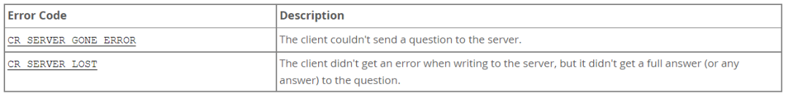
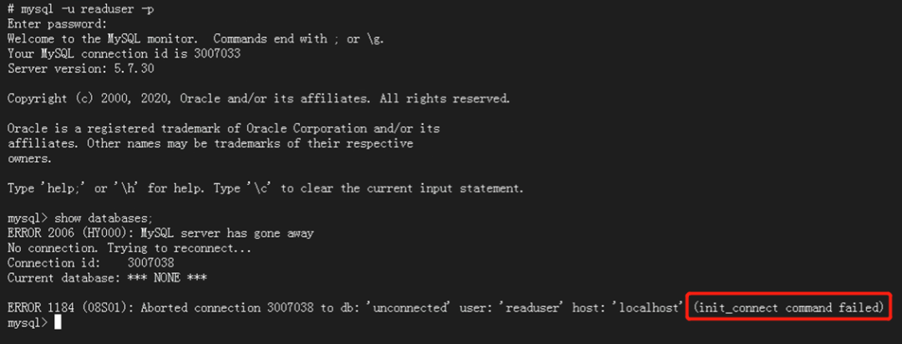
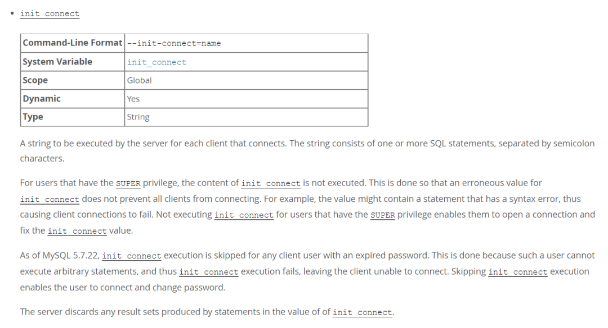

# 故障分析 | MySQL 中新建用户无法登陆的一种特殊场景

**原文链接**: https://opensource.actionsky.com/20220524-mysql/
**分类**: MySQL 新特性
**发布时间**: 2022-05-23T19:16:03-08:00

---

作者：刘晨
网名 bisal ，具有十年以上的应用运维工作经验，目前主要从事数据库应用研发能力提升和技术管理相关的工作，Oracle ACE ，腾讯云TVP，拥有 Oracle OCM & OCP 、EXIN DevOps Master 、SCJP 等国际认证，国内首批 Oracle YEP 成员，OCMU 成员，《DevOps 最佳实践》中文译者之一，CSDN & ITPub 专家博主，公众号&#8221;bisal的个人杂货铺&#8221;，长期坚持分享技术文章，多次在线上和线下分享技术主题。
本文来源：原创投稿
*爱可生开源社区出品，原创内容未经授权不得随意使用，转载请联系小编并注明来源。
同事提了个问题，某套5.7的MySQL，新建一个只读的用户，执行如下操作，
create user  'readuser'@'%' IDENTIFIED BY 'readuser';
GRANT SELECT ON *.* TO 'readuser'@'%' IDENTIFIED BY "readuser";
但是当使用该用户登录的时候，
mysql -ureaduser -preader

提示&#8221;MySQL server has gone away&#8221;，很诡异的一个错，以前没碰到过：
其他现象，
- MySQL进程存在。
- 使用root账号，可以正常登录。
- 通过TCP/IP登录该用户，仍然报错，
mysql -ureaduser -preaduser -h127.0.0.1 -P3306
官方文档谈到了这个错误，
https://dev.mysql.com/doc/refman/5.7/en/gone-away.html
P. S. 这篇文章翻译了一下，可以参考，
https://blog.csdn.net/ldlovemm/article/details/7257528
**B.3.2.7 MySQL server has gone away**
This section also covers the related Lost connection to server during query error.
The most common reason for the MySQL server has gone away error is that the server timed out and closed the connection. In this case, you normally get one of the following error codes (which one you get is operating system-dependent).

If you have a script, you just have to issue the query again for the client to do an automatic reconnection. This assumes that you have automatic reconnection in the client enabled (which is the default for the mysql command-line client).
Some other common reasons for the MySQL server has gone away error are:
-You (or the db administrator) has killed the running thread with a KILL statement or a mysqladmin kill command.
-You tried to run a query after closing the connection to the server. This indicates a logic error in the application that should be corrected.
-A client application running on a different host does not have the necessary privileges to connect to the MySQL server from that host.
-You got a timeout from the TCP/IP connection on the client side.
This may happen if you have been using the commands:
mysql_options(…, MYSQL_OPT_READ_TIMEOUT,…)
or mysql_options(…, MYSQL_OPT_WRITE_TIMEOUT,…). In this case increasing the timeout may help solve the problem.
-You have encountered a timeout on the server side and the automatic reconnection in the client is disabled (the reconnect flag in the MYSQL structure is equal to 0).
-You are using a Windows client and the server had dropped the connection (probably because wait_timeout expired) before the command was issued.
The problem on Windows is that in some cases MySQL does not get an error from the OS when writing to the TCP/IP connection to the server, but instead gets the error when trying to read the answer from the connection.
The solution to this is to either do a mysql_ping() on the connection if there has been a long time since the last query (this is what Connector/ODBC does) or set wait_timeout on the mysqld server so high that it in practice never times out.
-You can also get these errors if you send a query to the server that is incorrect or too large. If mysqld receives a packet that is too large or out of order, it assumes that something has gone wrong with the client and closes the connection. If you need big queries (for example, if you are working with big BLOB columns), you can increase the query limit by setting the server&#8217;s max_allowed_packet variable, which has a default value of 4MB. You may also need to increase the maximum packet size on the client end. More information on setting the packet size is given in Section B.3.2.8, “Packet Too Large”.
An INSERT or REPLACE statement that inserts a great many rows can also cause these sorts of errors. Either one of these statements sends a single request to the server irrespective of the number of rows to be inserted; thus, you can often avoid the error by reducing the number of rows sent per INSERT or REPLACE.
-It is also possible to see this error if host name lookups fail (for example, if the DNS server on which your server or network relies goes down). This is because MySQL is dependent on the host system for name resolution, but has no way of knowing whether it is working—from MySQL&#8217;s point of view the problem is indistinguishable from any other network timeout.
You may also see the MySQL server has gone away error if MySQL is started with the skip_networking system variable enabled.
Another networking issue that can cause this error occurs if the MySQL port (default 3306) is blocked by your firewall, thus preventing any connections at all to the MySQL server.
-You can also encounter this error with applications that fork child processes, all of which try to use the same connection to the MySQL server. This can be avoided by using a separate connection for each child process.
-You have encountered a bug where the server died while executing the query.
You can check whether the MySQL server died and restarted by executing mysqladmin version and examining the server&#8217;s uptime. If the client connection was broken because mysqld crashed and restarted, you should concentrate on finding the reason for the crash. Start by checking whether issuing the query again kills the server again. See Section B.3.3.3, “What to Do If MySQL Keeps Crashing”.
You can obtain more information about lost connections by starting mysqld with the log_error_verbosity system variable set to 3. This logs some of the disconnection messages in the hostname.err file. See Section 5.4.2, “The Error Log”.
If you want to create a bug report regarding this problem, be sure that you include the following information:
-Indicate whether the MySQL server died. You can find information about this in the server error log. See Section B.3.3.3, “What to Do If MySQL Keeps Crashing”.
-If a specific query kills mysqld and the tables involved were checked with CHECK TABLE before you ran the query, can you provide a reproducible test case? See Section 5.8, “Debugging MySQL”.
-What is the value of the wait_timeout system variable in the MySQL server? (mysqladmin variables gives you the value of this variable.)
-Have you tried to run mysqld with the general query log enabled to determine whether the problem query appears in the log? (See Section 5.4.3, “The General Query Log”.)
但是逐一排查，没出现特别对应的场景。
查了一些资料，说是给新增用户一个super权限，尝试了下，确实能解决，但这相当于给用户一个超级权限，不符合只读账号的需求，
grant super on *.* TO 'readuser'@'%';
这是因为什么？
知其然，更要知其所以然。
再看下当时的错误提示，&#8221;init_connect command failed&#8221;引起了注意：

他其实是MySQL的参数，一般默认为空，但此处值是&#8217;SET NAMES utf8mb4&#8217;，请注意，此处有个&#8221;单引号，
> show variables like '%init_connect%';
+---------------+---------------------+
| Variable_name | Value               |
+---------------+---------------------+
| init_connect  | 'SET NAMES utf8mb4' |
+---------------+---------------------+
1 row in set (0.00 sec)
init_connect参数的作用，官方文档有说明，
https://dev.mysql.com/doc/refman/5.7/en/server-system-variables.html

大概意思是，
- 这个参数可以包括一条或者多条SQL语句，用分号隔开，他是每个连接到数据库的客户端都需要执行的指令。
- 但是对具有SUPER权限用户，会忽略这个init_connect，不会执行其中的指令。
- 如果init_connect中包含的语句存在语法错误，则会导致客户端连接失败。
- 只能通过具有SUPER权限用户来修改init_connect的值。
如上环境中init_connect设置的值是&#8217;SET NAMES utf8mb4&#8217;，如果我们直接执行这个指令，提示存在语法上的错误，
> 'SET NAMES utf8mb4';
ERROR 1064 (42000): You have an error in your SQL syntax; check the manual that corresponds to your MySQL server version for the right syntax to use near ''SET NAMES utf8mb4'' at line 1
为了验证，从MySQL的error日志，能看到这些信息，和上述操作的错误提示相同，破案了：

解决方案就很直接了，设置正确的init_connect，就无需给新建用户授予super权限，都可以正常登录，
set global init_connect = "set names utf8mb4";
说起这个参数，可能有些DBA用它来做一些特殊的用途，例如对某些业务账号的限制等，所有非super权限账号都会执行一次，而具有super权限的账号或者DBA账号(通常有super的权限)，登录不会执行init_connect设置的指令。所以针对这个案例来说，很可能在数据库初始化的时候，init_connect就设置错了，但是一直用的是超级账号，只有当创建非super账号的时候，才会暴露这问题。
因此，应急场景下，优先解决问题，但是对问题的根源，还是要充分了解，只有这样，才能举一反三，提高自己的能力。