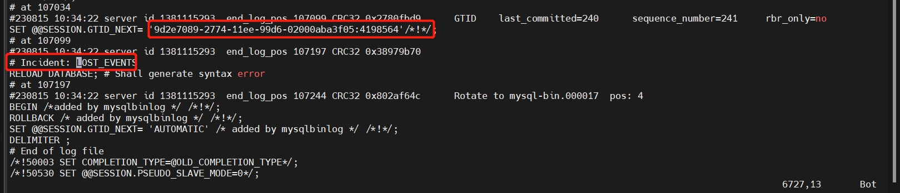

# 故障分析 | MySQL 主从复制遇到 1590 报错

**原文链接**: https://opensource.actionsky.com/%e6%95%85%e9%9a%9c%e5%88%86%e6%9e%90-mysql-%e4%b8%bb%e4%bb%8e%e5%a4%8d%e5%88%b6%e9%81%87%e5%88%b0-1590-%e6%8a%a5%e9%94%99/
**分类**: MySQL 新特性
**发布时间**: 2023-08-15T01:05:55-08:00

---

作者通过一个主从复制过程中 1590 的错误，说明了 MySQL 8.0 在创建用户授权过程中的注意事项。
> 
作者：王祥
爱可生 DBA 团队成员，主要负责 MySQL 故障处理和性能优化。对技术执着，为客户负责。
本文来源：原创投稿
- 爱可生开源社区出品，原创内容未经授权不得随意使用，转载请联系小编并注明来源。
# 故障描述
[DMP](https://www.actionsky.com/cloudTreeDMP) 收到告警：从库的 SQL 线程停止工作，MySQL 版本为 5.7.32，登录到从库查看复制信息报错如下：
`mysql> show slave status\G
*************************** 1. row ***************************
Slave_IO_State: Waiting for master to send event
……
Last_Errno: 1590
Last_Error: The incident LOST_EVENTS occured on the master. Message: REVOKE/GRANT failed while granting/revoking privileges in databases.
Skip_Counter: 0
Exec_Master_Log_Pos: 12531
Relay_Log_Space: 69304
Until_Condition: None
Until_Log_File:
Until_Log_Pos: 0
Master_SSL_Allowed: No
Master_SSL_CA_File:
Master_SSL_CA_Path:
Master_SSL_Cert:
Master_SSL_Cipher:
Master_SSL_Key:
Seconds_Behind_Master: NULL
Master_SSL_Verify_Server_Cert: No
Last_IO_Errno: 0
Last_IO_Error:
Last_SQL_Errno: 1590
Last_SQL_Error: The incident LOST_EVENTS occured on the master. Message: REVOKE/GRANT failed while granting/revoking privileges in databases. 
……
`
从库错误日志信息如下：
`[ERROR] Slave SQL for channel '': The incident LOST_EVENTS occured on the master. Message: REVOKE/GRANT failed while granting/revoking privileges in databases. Error_code: 1590
[ERROR] Error running query, slave SQL thread aborted. Fix the problem, and restart the slave SQL thread with "SLAVE START". We stopped at log 'mysql-bin.000003' position 12531.
`
解析对应 Binlog 信息如下：
`# Incident: LOST_EVENTS
RELOAD DATABASE; # Shall generate syntax error
`
主库错误信息如下：
`[ERROR] REVOKE/GRANT failed while granting/revoking privileges in databases. An incident event has been written to the binary log which will stop the slaves.
`
客户反馈执行了一些授权操作然后复制就出现报错，执行的语句如下：
`mysql> create user test@'%',app@'%' identified by 'Root@123';
ERROR 1819 (HY000): Your password does not satisfy the current policy requirements
mysql> grant all on test.* to test@'%',app@'%';
ERROR 1819 (HY000): Your password does not satisfy the current policy requirements
`
# 故障分析
根据以上报错信息可知：在做权限变更时发生了错误，主库在 binlog 里写一条 INCIDENT_EVENT，备库在解析到 INCIDENT_EVENT 就直接报错。
**那在什么情况下执行授权语句会导致主库在 binlog 写 INCIDENT_EVENT 呢？**
当权限变更操作只处理了一部分并发生错误时，主库会在 binlog 里写一条 INCIDENT_EVENT。
**那什么情况下会发生权限变更只处理一部分而有一部分没处理完呢？**
下面举例说明两种相关场景。
## MySQL 5.7 的问题
在 MySQL 5.7 里使用 GRANT 语句新建用户，其中有部分权限有问题。
使用 GRANT 创建 `test` 用户（MySQL 8.0 版本已经不支持使用 GRANT 创建用户）：
`mysql> grant select,insert,file on test.* to test@'%' identified by 'Q1w2e3E$';
ERROR 1221 (HY000): Incorrect usage of DB GRANT and GLOBAL PRIVILEGES
mysql> select user,host from mysql.user where user='test' and host='%';
+------+--------+
| user | host |
+------+--------+
| test | %    |
+------+--------+
1 row in set (0.00 sec)
mysql> show grants for test@'%';
+--------------------------------------------+
| Grants for test@%                 |
+--------------------------------------------+
| GRANT USAGE ON *.* TO 'test'@'%' |
+---------------------------------------------+
1 row in set (0.00 sec)
`
在创建用户时对 `test` 库授予 SELECT、INSERT、FILE 权限，因 FILE 权限不能授予某个数据库而导致语句执行失败。但最终结果是：`test@'%'` 创建成功，授权部分失败。从上面的测试可知，使用 GRANT 创建用户其实是分为两个步骤：创建用户和授权。权限有问题并不影响用户的创建，上述语句会导致主库在 binlog 写 INCIDENT_EVENT，从而导致主从复制报错。
## GRANT 对两个用户同时授权
使用一条 GRANT 语句，同时给 `test@'10.186.63.5'` 与 `test@'10.186.63.29'` 用户授权，其中 `test@'10.186.63.5'` 用户存在，而 `test@'10.186.63.29'` 不存在。
`mysql> create user test@'10.186.63.5' identified by '123';
Query OK, 0 rows affected (0.00 sec)
mysql> grant all on test.* to test@'10.186.63.5',test@'10.186.63.29';
ERROR 1133 (42000): Can't find any matching row in the user table
mysql> show grants for test@'10.186.63.5';
+----------------------------------------------------------+
| Grants for test@10.186.63.5                              |
+----------------------------------------------------------+
| GRANT USAGE ON *.* TO 'test'@'10.186.63.5'               |
| GRANT ALL PRIVILEGES ON `test`.* TO 'test'@'10.186.63.5' |
+----------------------------------------------------------+
2 rows in set (0.00 sec)
`
根据上面的实验可知：`test@'10.186.63.5'` 用户存在故授权成功，而 `test@'10.186.63.29'` 用户不存在授权失败。上述语句也会导致主库在 binlog 写 INCIDENT_EVENT，从而导致主从复制报错。
但以上两种情况似乎都不符合客户执行语句情况，从报错来看是因为密码复杂度不够而导致创建用户失败了，那到底是什么原因导致从库出现 1590 错误呢？下面我们来看看在使用了密码复杂度插件后使用create语句同时创建两个用户会有什么问题。
`mysql> show global variables like '%validate%';
+--------------------------------------+--------+
| Variable_name                        | Value  |
+--------------------------------------+--------+
| query_cache_wlock_invalidate         | OFF    |
| validate_password_check_user_name    | OFF    |
| validate_password_dictionary_file    |        |
| validate_password_length             | 8      |
| validate_password_mixed_case_count   | 1      |
| validate_password_number_count       | 1      |
| validate_password_policy             | MEDIUM |
| validate_password_special_char_count | 1      |
+--------------------------------------+--------+
mysql> select user,host from mysql.user;
+---------------+-----------+
| user          | host      |
+---------------+-----------+
| universe_op   | %         |
| root          | 127.0.0.1 |
| mysql.session | localhost |
| mysql.sys     | localhost |
| root          | localhost |
+---------------+-----------+
5 rows in set (0.00 sec)
mysql> create user test@'%',app@'%' identified by 'Root@123';
ERROR 1819 (HY000): Your password does not satisfy the current policy requirements
mysql> select user,host from mysql.user;（app@'%'创建成功，test@'%'创建失败）
+---------------+-----------+
| user          | host      |
+---------------+-----------+
| app           | %         |
| universe_op   | %         |
| root          | 127.0.0.1 |
| mysql.session | localhost |
| mysql.sys     | localhost |
| root          | localhost |
+---------------+-----------+
6 rows in set (0.00 sec)
`
上述测试使用 CREATE USER 同时创建 `test@'%'`、`app@'%'`。但因为密码复杂度不合符要求而失败报错（多次测试发现并不是密码复杂度不够，只要同时创建两个用户都会报密码复杂度不符合要求。在未使用密码复杂度插件时是可以同时创建两个用户），正常的话这两个用户应该都会创建失败。但实际上 `app@'%'` 用户创建成功了。
到这里我们就明白文章开始描述故障的触发原因：数据库实例开启了密码复杂度插件，使用 CREATE USER 同时创建两个用户，因为密码复杂度不符合要求而报错，但 `app@'%'` 是已经创建了， `test@'%'` 用户未创建，紧接着又执行了 GRANT 语句给两个用户同时授权，此时因为 `test@'%'` 用户不存在，而导致 GRANT 语句部分执行的问题，最终导致了主从复制报错。
# 故障解决
当主从复制出现 1590 报错时，可以先解析 binlog，找到 INCIDENT_EVENT（搜索关键字 LOST_EVENTS）和对应的 GTID，然后通过跳过这个 GTID 的方式来恢复主从复制。在跳过 GTID 之前还需要先将数据补全，因为主库有一个用户是已经授权成功从库这部分授权是没有执行的。具体操作如下（在从库执行）：
`mysql>set global super_read_only=0;
mysql>set sql_log_bin=0;
mysql>grant all on test.* to test@'10.186.63.5';
`
跳过报错对应的 GTID，具体操作如下：
解析 binlog 找到 INCIDENT_EVENT。
`mysqlbinlog --no-defaults -vv --base64-output=decode-rows mysql-bin.000016 > /root/bin.log
`

跳过 `LOST_EVENTS` 对应的 GTID（在从库执行）：
```
stop slave sql_thread;
set gtid_next='9d2e7089-2774-11ee-99d6-02000aba3f05:4198564';
begin;commit;
set gtid_next='automatic';
start slave sql_thread;
```
# 总结
- 权限变更操作只处理了一部分并发生错误时，会导致 binlog 写一条 INCIDENT_EVENT，从而导致主从复制报错。
- 在使用密码复杂度插件时，使用 CREATE 语句同时创建两个用户，会出现一个用户创建成功另外一个用户创建失败的情况。
# 建议
- 使用了密码复杂度插件，创建用户时一条 CREATE 语句只创建一个用户。
- 授权时一条 GRANT 语句只对一个用户授权，防止因权限错误导致部分授权成功的问题。