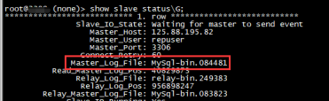
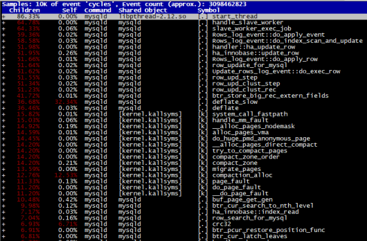
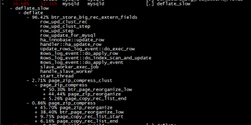
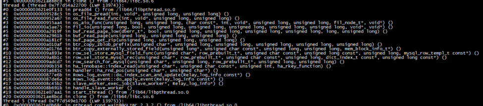
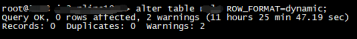
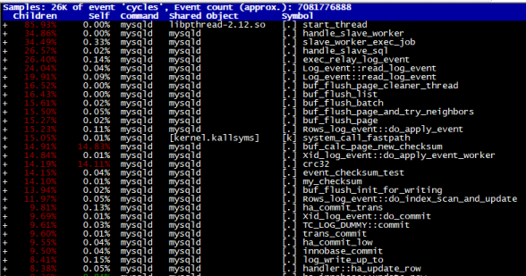
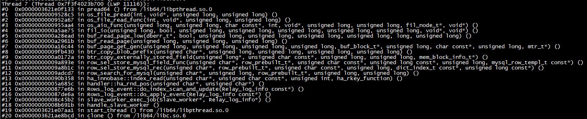

# 故障分析 | MySQL 异地从库复制延迟案例一则

**原文链接**: https://opensource.actionsky.com/20220228-mysql/
**分类**: MySQL 新特性
**发布时间**: 2022-03-02T21:24:19-08:00

---

作者：任坤
现居珠海，先后担任专职 Oracle 和 MySQL DBA，现在主要负责 MySQL、mongoDB 和 Redis 维护工作。
本文来源：原创投稿
*爱可生开源社区出品，原创内容未经授权不得随意使用，转载请联系小编并注明来源。
## 1、背景
线上某核心 MySQL ，版本为 5.6，本地机房1主2从，同时部署了一个异地从库。
从2月14号起异地从库开始报警复制延迟，一开始以为是网络波动导致就没有处理，但是2天后该报警依然存在且延迟越来越高。
## 2、诊断
登录该异地从库，首先甄别是不是IO复制线程引发的延迟。
该步骤很简单，查看 show slave status 的 Master_Log_File 是不是主库当前的 binlog ，如果是说明IO复制线程没有延迟，那就是 SQL 复制 线程引起的。

获取该 mysqld 的进程 ID ，执行 perf record -ag -p 11029 &#8212; sleep 10; perf report
反复执行多次，每次都有 deflate_slow 且占据比例最高

将其展开，和压缩页有关联

pstack 11029 多次抓取现场，也是和压缩页有关。

该实例确实有个大表，并且只有异地从库开启了页压缩，将其行格式转为 dynamic 。

查看 Seconds_Behind_Master，延迟指标开始逐步下降，说明该方案生效了。
再次抓取 perf 和 pstack 现场。
&#8211;perf report

&#8211;pstack

可以看到和页压缩相关的 API 已经消失，再次确认了本次复制延迟和大表开启页压缩有直接关系。
## 3、小结
借助 perf 和 pstack 工具，能很快定位是压缩表引发的 SQL 线程复制延迟，将大表解压缩后最终解决该问题。