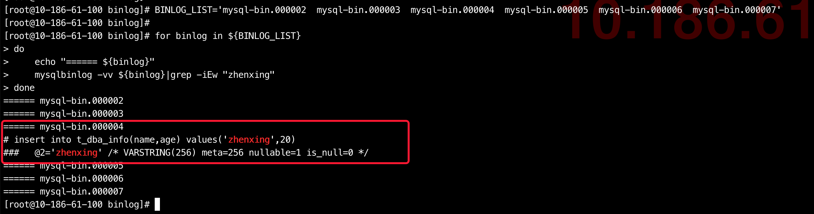
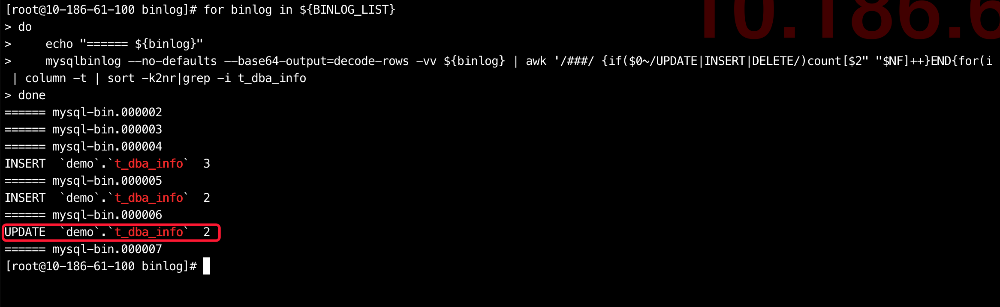
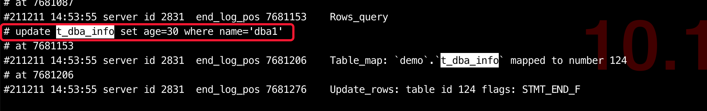
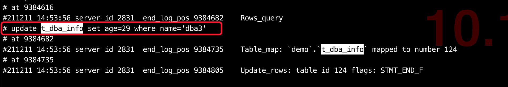
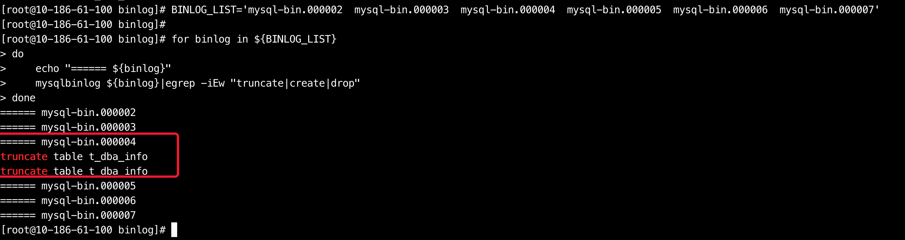

# 故障分析 | MySQL 数据”丢失”事件之 binlog 解析应用一则

**原文链接**: https://opensource.actionsky.com/20211223-mysql2/
**分类**: MySQL 新特性
**发布时间**: 2021-12-22T22:21:25-08:00

---

作者：余振兴
爱可生 DBA 团队成员，熟悉 Oracle、MySQL、MongoDB、Redis，最近在盘 TiDB，擅长架构设计、故障诊断、数据迁移、灾备构建等等。负责处理客户 MySQL 及我司自研 DMP 数据库管理平台日常运维中的问题。热衷技术分享、编写技术文档。
本文来源：原创投稿
*爱可生开源社区出品，原创内容未经授权不得随意使用，转载请联系小编并注明来源。
事件背景
## 事件背景
> 
客户反馈在晚间数据跑批后,查询相关表的数据时,发现该表的部分数据在数据库中不存在,从应用跑批的日志来看,跑批未报错,且可查到日志中明确显示当时那批数据已插入到数据库中,需要帮忙分析这批数据丢失的原因。
备注:考虑信息敏感性,以下分析场景测试环境模拟,相关数据做以下说明
- 
涉及的库表为`demo.t_dba_info`表
- 
丢失的数据为`insert into t_dba_info(name,age) values('zhenxing',20);`这条记录
## 故障分析
### 1. 先登录数据库确认该条记录是否存在
> 
显然,数据确实如客户所说,在数据库中不存在

### 2. 确认该条数据丢失的时间区间并解析binlog
> 
这里我为模拟环境,直接在主库解析,生产环境建议都在从库解析避免对主库造成影响
`BINLOG_LIST='mysql-bin.000002  mysql-bin.000003  mysql-bin.000004  mysql-bin.000005  mysql-bin.000006  mysql-bin.000007'
for binlog in ${BINLOG_LIST}
do 
echo "====== ${binlog}"
mysqlbinlog -vv ${binlog}|grep -iEw "zhenxing"
done
`

> 
可以看到我们通过解析并搜索`zhenxing`这条记录,确实发现数据插入了数据库中,所以接下来从常规的思路来说我们只需要继续解析binlog,找到是否有对该条记录做`DELETE`或`UPDATE`操作即可
### 3. 解析binlog查看对这张表的修改操作
> 
过滤出哪些binlog对该表做了`DELETE`或`UPDATE`
`## 这里我通过已知的故障时间区间将涉及的binlog列出来做循环解析
BINLOG_LIST='mysql-bin.000002  mysql-bin.000003  mysql-bin.000004  mysql-bin.000005  mysql-bin.000006  mysql-bin.000007'
for binlog in ${BINLOG_LIST}
do 
echo "====== ${binlog}"
mysqlbinlog --no-defaults --base64-output=decode-rows -vv ${binlog} | awk '/###/ {if($0~/UPDATE|INSERT|DELETE/)count[$2" "$NF]++}END{for(i in count) print i,"\t",count[i]}' | column -t | sort -k2nr|grep -i t_dba_info 
done
`

> 
通过解析binlog可以看到,对该表的操作只有mysql-bin.000006这个binlog文件有2次UPDATE操作,其他都是INSERT,接下来我们只需要继续解析这个mysql-bin.000006文件并搜索看是否对zhenxing这条记录是否做了修改即可
### 4. 解析定位的binlog
`## 用最简单的命令直接解析并搜索对demo.t_dba_info表插入的zhenxing这条记录
[root@10-186-61-100 binlog]# mysqlbinlog -vv mysql-bin.000006|less
`

> 
通过解析发现这个binlog文件做对demo.t_dba_info表的UPDATE操作并不是针对zhenxing这条记录的,**分析到这里发现比较迷惑了,数据明明插入了,也没做修改怎么就不见了,难道做了一些特殊操作**
### 5. 排除一些特殊操作的可能性
- 
在插入这条数据时,主库binlog明确有记录,那是否有可能在删除这条记录时做了`set session sql_log_bin=off`不记录binlog
这个只需在从库查询下这条记录是否存在即可初步排除,客户生产环境是一主多从的架构,从库均没有这条记录存在, **可能性被排除**
- 
有没有可能这张表除了DML行为,还有DDL行为,如重建了,但重建后这批数据没有被重新插入该表,于是尝试解析binlog看对该表的DDL操作行为是否存在
`BINLOG_LIST='mysql-bin.000002  mysql-bin.000003  mysql-bin.000004  mysql-bin.000005  mysql-bin.000006  mysql-bin.000007'
for binlog in ${BINLOG_LIST}
do 
echo "====== ${binlog}"
mysqlbinlog ${binlog}|egrep -iEw "truncate|create|drop"
done
`

发现了一些端倪,在mysql-bin.000004中有对该表的2次truncate操作,等等,好像发现了什么,那条丢失的数据也是在这个mysql-bin.000004文件中,梳理下逻辑,难道那条记录在2次truncate之间,于是单独对这个binlog做详细解析,得到以下信息
`#211211 14:52:47 truncate table t_dba_info
#211211 14:53:00 insert into t_dba_info(name,age) values('zhenxing',20)
#211211 14:53:18 truncate table t_dba_info
`
**到此基本了解了这条记录为何会诡异丢失了**,与客户确认跑批灌数据的逻辑,了解到会对该表做truncate,但由于`误操作`,在跑批开始后,又触发了一轮truncate行为,导致已经插入到该表的部分数据再次被清理了,也就导致了在解析binlog时部分记录丢失了,但并未观测到有删除的行为,而是被truncate方式清理.
### 6. 故障总结
> 
本文是对binlog解析的一个实践案例,binlog记录的信息非常多,可以对binlog进行不同维度的解析,同时binlog在线上环境的配置使用上也有着一些技巧,如本案例中,线上环境因为是规范化部署,参数设置合理,不会由于单个binlog文件过大导致binlog解析时间过长,以及如binlog_rows_query_log_events参数的开启,使得在row模式下也可以明确记录下具体的SQL语句
`max_binlog_size = 250M
binlog_rows_query_log_events = 1
`
`备注`:虽然binlog记录的信息足够多,但当故障原因定位后,由于其并未记录`对该操作的IP及用户`信息,如果不开审计,也只能知道发生了该行为,但无法具体定位触发该行为的&#8221;人&#8221;.
### 7. binlog解析技巧
- 
尽可能在从库解析,避免对主库造成影响
- 
先粗略定位涉及相关的库表操作的binlog,再单独解析对应的binlog中的数据
- 
在解析DDL时无需加-v输出详细信息(加快解析速度)
- 
如果开启了binlog_rows_query_log_events参数,需要用-vv参数才可显示具体的SQL语句