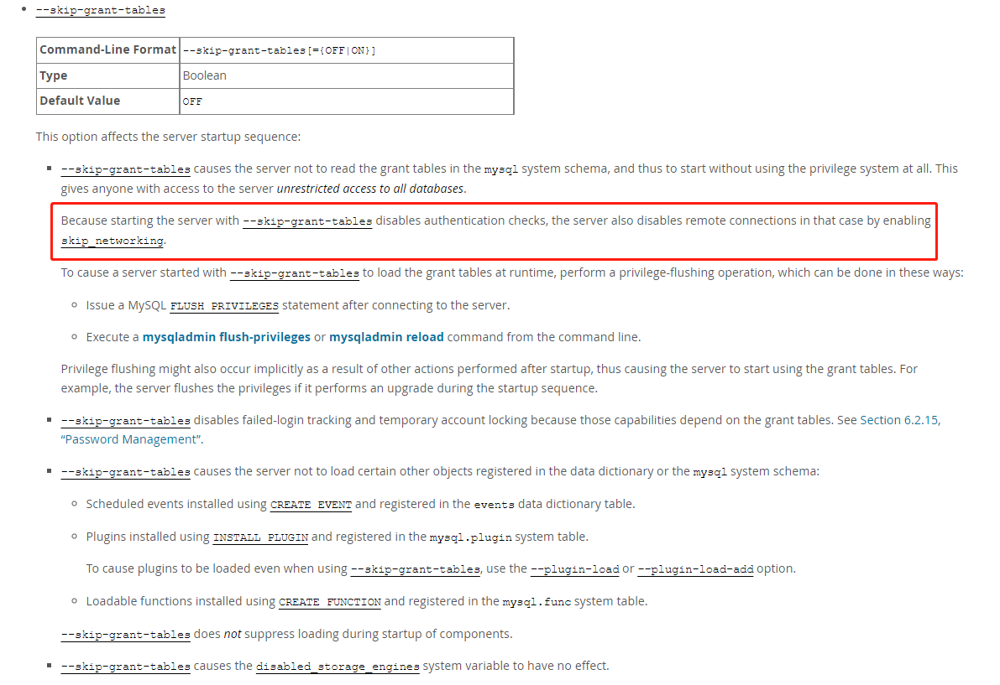

# 故障分析 | MySQL 无监听端口故障排查

**原文链接**: https://opensource.actionsky.com/20220908-mysql/
**分类**: MySQL 新特性
**发布时间**: 2022-09-07T23:09:02-08:00

---

作者：王向
爱可生 DBA 团队成员，负责公司 DMP 产品的运维和客户 MySQL 问题的处理。擅长数据库故障处理。对数据库技术和 python 有着浓厚的兴趣。
本文来源：原创投稿
*爱可生开源社区出品，原创内容未经授权不得随意使用，转载请联系小编并注明来源。
#### 前言
最近解决了一个比较基础的问题故障，由于排查过程挺有意思，于是就以此为素材写出了本篇文章。
#### 故障现场
防火墙什么的均正常但是无法被远程访问到。简单的使用客户端登录了一下。
ERROR 2003 (HY000): Can't connect to MySQL server on '127.0.0.1' (111)
根据以往经验大脑中浮现了几个常见的排查此类故障手法
- 排查进程存在
[root@wx ~]# ps -ef|grep [m]ysql 
mysql 25973 1 1 8月30 ? 02:43:20 
/mysqldata/mysql/base/8.0.24/bin/mysqld --defaults-
file=/mysqldata/mysql/etc/3308/my.cnf --daemonize --pid-
file=/mysqldata/mysql/data/3308/mysqld.pid --user=mysql --
socket=/mysqldata/mysql/data/3308/mysqld.sock --port=3308
2. 排查端口绑定情况，居然没有绑定端口
[root@wx ~]# lsof -i:3308
[root@wx ~]# ss -nltp|grep 3308
3. 查看启动日志发现，监听端口等于0
2022-09-06T07:30:41.090649-00:00 0 [Note] [MY-010304] [Server] Skipping generation of SSL certificates as certificate files are present in data directory. 
2022-09-06T07:30:41.094320-00:00 0 [Warning] [MY-010068] [Server] CA certificate ca.pem is self signed. 
2022-09-06T07:30:41.094806-00:00 0 [System] [MY-013602] [Server] Channel mysql_main configured to support TLS. Encrypted connections are now supported for this channel. 
2022-09-06T07:30:41.095177-00:00 0 [Note] [MY-010308] [Server] Skipping generation of RSA key pair through --sha256_password_auto_generate_rsa_keys as key files are present in data directory. 
2022-09-06T07:30:41.095500-00:00 0 [Note] [MY-010308] [Server] Skipping generation of RSA key pair through -- caching_sha2_password_auto_generate_rsa_keys as key files are present in data directory. 
2022-09-06T07:30:41.124942-00:00 0 [System] [MY-010931] [Server] /mysqldata/mysql/base/8.0.24/bin/mysqld: ready for connections. Version: '8.0.24' socket: '/mysqldata/mysql/data/3306/mysqld.sock' port: 0 MySQL Community Server - GPL.

4. 使用show variables命令查看确实是0
mysql> show variables like 'port'; 
+---------------+-------+ 
| Variable_name | Value | 
+---------------+-------+ 
| port              | 0 | 
+---------------+-------+

秉承着无从下手先谷歌的想法在谷歌一番搜索多篇文章均指向 skip-networking 这个参数；查看我方配置文件并未配置 skip_networking 参数。但是发现了 skip-grants-tables 。
#### 官方文档寻找答案

大概意思就是因为使用 skip-grants-tables 参数禁用了权限表，这种情况下 mysql 会默认开启 skip-networking 来禁用远程连接。目的是为了安全。
#### 解决方案
因为配置 skip-grants-tables 引起无法远程连接 mysql 服务端的故障，解决方法也是非常的简单注释重启。