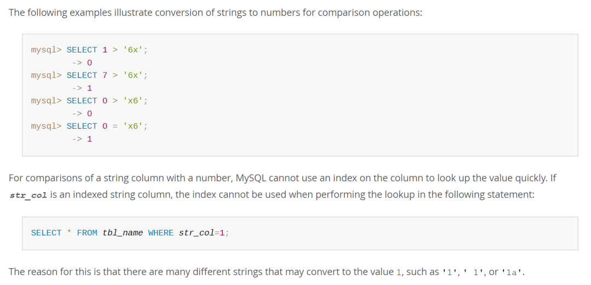

# 故障分析 | MySQL 的隐式转换导致诡异现象的案例一则

**原文链接**: https://opensource.actionsky.com/%e6%95%85%e9%9a%9c%e5%88%86%e6%9e%90-mysql-%e7%9a%84%e9%9a%90%e5%bc%8f%e8%bd%ac%e6%8d%a2%e5%af%bc%e8%87%b4%e8%af%a1%e5%bc%82%e7%8e%b0%e8%b1%a1%e7%9a%84%e6%a1%88%e4%be%8b%e4%b8%80%e5%88%99/
**分类**: MySQL 新特性
**发布时间**: 2023-08-29T00:58:12-08:00

---

正是因为 MySQL 对字符串进行隐式转换时会截断再转，而不是像 Oracle、SQL Server 这些数据库针对这种问题直接报错，所以才出现了这个诡异的问题。
> 作者：刘晨
网名 bisal ，具有十年以上的应用运维工作经验，目前主要从事数据库应用研发能力提升和技术管理相关的工作，Oracle ACE（Alumni），腾讯云TVP，拥有 Oracle OCM & OCP 、EXIN DevOps Master 、SCJP 等国际认证，国内首批 Oracle YEP 成员，OCMU 成员，《DevOps 最佳实践》中文译者之一，CSDN & ITPub 专家博主，公众号”bisal的个人杂货铺”，长期坚持分享技术文章，多次在线上和线下分享技术主题。
本文来源：原创投稿
* 爱可生开源社区出品，原创内容未经授权不得随意使用，转载请联系小编并注明来源。
# 背景
同事问了个 MySQL 的问题，现象上确实诡异。大致意思是 SELECT 表的数据，WHERE 条件是 `"a=0"`，其中 `a` 字段是 VARCHAR
类型，该字段存在 NULL 以及包含字符的记录，但是并无 `"0"` 的记录，然后执行 SQL 返回的记录恰恰就是所有包含中文字符的记录。
明明没有 `"0"` 值记录，却可以返回，而且有规律，这是什么现象？
`select * from test where a = 0;
`
# 问题分析
为了比对说明，我们分别用 MySQL、Oracle 和 SQL Server 进行模拟。
## 2.1 准备测试表
三种数据库建表和插入数据的语句。
### MySQL
`create table test (id int, a varchar(3000), b varchar(2000));
insert into test values(1, '测试a', '测试b'),(2, NULL, '测试');
`
### Oracle
```
create table test (id NUMBER(1), a varchar2(3000), b varchar2(2000));
insert into test values(1, '测试a', '测试b');
insert into test values(2, NULL, '测试');
```
### SQL Server
```
create table test (id numeric(1,0), a varchar(3000), b varchar(2000));
insert into test values(1, '测试a', '测试b');
insert into test values(2, NULL, '测试');
```
## 2.2 对比查询结果
预期 `test` 表返回的记录都应该是这样的。
| id | a | b |
| --- | --- | --- |
| 1 | 测试a | 测试b |
| 2 | NULL | 测试 |
我们看下三种数据库中，都执行如下语句，得到的是什么。
`select * from test where a = 0;
`
### MySQL
执行返回如下带字符的记录，但实际逻辑上肯定是错的。
| id | a | b |
| --- | --- | --- |
| 1 | 测试a | 测试b |
执行时，还会抛出一个 `warning:Truncated incorrect DOUBLE value: '测试a'`。
### Oracle
执行直接报错，提示&#8221;无效数字&#8221;，因为 `a` 是 VARCHAR2、`0` 是数字，因此报错是针对字段 `a` 的，需要将 `a` 转成数字，但字符是无法转成数字的，所以提示 &#8220;无效数字&#8221; 是合情合理的。
`ORA-01722: 无效数字
`
### SQL Server
执行直接报错，但是提示信息更加清晰明了，说的就是字段 `a` 的值 `"测试a"` 不能转成 INT 数值型。
`SQL 错误 [245] [S0001]: 在将 varchar 值 '测试a' 转换成数据类型 int 时失败。
`
### 小结
通过以上对比，可以知道 Oracle 和 SQL Server 对 **&#8220;字符型=数值型&#8221;** 的条件，会自动将字符型类型转成数值型，如果因为值的问题不能转成数值型，就会提示错误，而 SQL Server 给出的提示，比 Oracle 更具体。
相比之下，MySQL 针对 **&#8220;字符型=数值型&#8221;** 的条件，不仅能执行，而且执行是错的，这就很拉垮了。毕竟对产品来说，避免错误可能比表面上能执行更加重要，但就这个问题上，Oracle 和 SQL Server 可以说更胜一筹的。
## 2.3 问题分析
MySQL 为什么在这里会给出错误的结果？
从[官方文档](https://dev.mysql.com/doc/refman/5.7/en/type-conversion.html) 的这几段内容，我们可以得到一些线索，

MySQL 中将 VARCHAR 转成 INT，会自动截断字符串，例如 `"1测试"` 会截成 `"1"` ，通过如下判断，可以证明。
`bisal@mysqldb 23:26:  [test]> select 1="1测试a";
+--------------+
| 1="1测试a"   |
+--------------+
|            1 |
+--------------+
1 row in set, 1 warning (0.00 sec)
`
上述例子中 `"测试a"` 会截成 `""`，因此 `a=0` ，才会返回字段不为空的。
`bisal@mysqldb 23:27:  [test]> select 0="测试a";
+-------------+
| 0="测试a"   |
+-------------+
|           1 |
+-------------+
1 row in set, 1 warning (0.00 sec)
`
通过 `0` 和 `""` 进行比较，则可以进一步证明这个问题。
`bisal@mysqldb 23:29:  [test]> select 0="";
+------+
| 0="" |
+------+
|    1 |
+------+
1 row in set (0.00 sec)
`
因此，正是因为 MySQL 对字符串进行隐式转换时会截断再转，而不是像 Oracle、SQL Server 这些数据库针对这种问题直接报错，所以才出现了这个诡异的问题。
# 总结
我不知道这种设计是出于什么考虑，但这种&#8221;容错性&#8221;不可取，毕竟返回了错误的结果集。
当然，这个问题也和数据类型的使用有关，SQL 条件中 `"a=0"` 实际上是 `"varchar=int"`。两边类型不一致，所以才导致了数据库的隐式转换。
有可能是数据库设计的问题，比如，字段应该是 INT，但是定义成了 VARCHAR；还可能使开发人员的问题（SQL 条件右值应该用字符类型，例如 `"0"`，但实际上用了 INT 数值类型的 `0`）。
**总之，按照数据库设计开发规范的要求，`"="` 号两边的数据类型保持一致，这就不会引发数据库的隐式转换。**