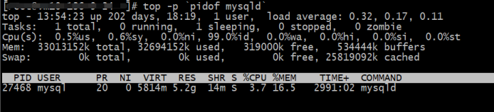

# 故障分析 | MySQL 耗尽主机内存一例分析

**原文链接**: https://opensource.actionsky.com/20220704-mysql/
**分类**: MySQL 新特性
**发布时间**: 2022-07-04T00:19:04-08:00

---

作者：付祥
现居珠海，主要负责 Oracle、MySQL、mongoDB 和 Redis 维护工作。
本文来源：原创投稿
*爱可生开源社区出品，原创内容未经授权不得随意使用，转载请联系小编并注明来源。
#### 异常现象
开发人员反馈，有一台服务器内存几乎被 MySQL 耗尽了，执行 top 命令，输出如下：

这台机器是个测试环境，MySQL 是开发自己安装的，数据库版本 5.6.51 ，机器总内存32G，MySQL 占了29G。
#### 分析过程
查看 MySQL 启动时间发现1个星期前才启动，猜测之前由于主机内存耗尽触发了 OOM ，查看 MySQL 错误日志，发现每隔10几天，MySQL 就异常关闭一次：
2022-02-24 03:03:42 20981 [Note] InnoDB: Database was not shutdown normally!
2022-03-13 02:31:40 4134 [Note] InnoDB: Database was not shutdown normally!
2022-03-31 02:31:08 6846 [Note] InnoDB: Database was not shutdown normally!
2022-04-12 02:31:41 1159 [Note] InnoDB: Database was not shutdown normally!
2022-04-23 04:41:51 6773 [Note] InnoDB: Database was not shutdown normally!
2022-05-04 02:31:52 2499 [Note] InnoDB: Database was not shutdown normally!
2022-05-13 04:56:06 23010 [Note] InnoDB: Database was not shutdown normally!
2022-05-30 02:31:33 3244 [Note] InnoDB: Database was not shutdown normally!
查看操作系统日志，进一步验证了 MySQL 耗尽主机内存，触发 OOM ：
# grep oom-killer /var/log/messages* /var/log/messages-20220605:May 30 02:31:30 vm10-136-9-24 kernel: mysqld invoked
oom-killer: gfp_mask=0x201da, order=0, oom_score_adj=0
查看 my.cnf 配置文件，发现几乎都是默认配置，innodb_buffer_pool_size 等于默认值128M :
mysql> show variables like 'innodb_buffer_pool_size'; 
+-------------------------+-----------+
| Variable_name | Value               | 
+-------------------------+-----------+
| innodb_buffer_pool_size | 134217728 | 
+-------------------------+-----------+
当前数据库有500多个连接，都是 Sleep 状态，从 MySQL 错误日志发现 performance_schema 下的表结构全是错误的，估计 MySQL 版本做了升级，没有执行 upgrade升 级数据字典，意味着一些内存诊断信息便不能从 PS 获取：
2022-06-09 11:19:08 27468 [ERROR] Native table
'performance_schema'.'cond_instances' has the wrong structure
2022-06-09 11:19:08 27468 [ERROR] Native table
'performance_schema'.'events_waits_current' has the wrong structure
2022-06-09 11:19:08 27468 [ERROR] Native table
'performance_schema'.'events_waits_history' has the wrong structure
2022-06-09 11:19:08 27468 [ERROR] Native table
'performance_schema'.'events_waits_history_long' has the wrong structure
2022-06-09 11:19:08 27468 [ERROR] Native table
'performance_schema'.'events_waits_summary_by_host_by_event_name' has the wrong
structure
2022-06-09 11:19:08 27468 [ERROR] Native table
'performance_schema'.'events_waits_summary_by_instance' has the wrong structure
2022-06-09 11:19:08 27468 [ERROR] Native table
'performance_schema'.'events_waits_summary_by_thread_by_event_name' has the wrong
structure
2022-06-09 11:19:08 27468 [ERROR] Native table
'performance_schema'.'events_waits_summary_by_user_by_event_name' has the wrong
structure
2022-06-09 11:19:08 27468 [ERROR] Native table
'performance_schema'.'events_waits_summary_by_account_by_event_name' has the wrong
structure
2022-06-09 11:19:08 27468 [ERROR] Native table
'performance_schema'.'events_waits_summary_global_by_event_name' has the wrong
structure
2022-06-09 11:19:08 27468 [ERROR] Native table
'performance_schema'.'file_instances' has the wrong structure
2022-06-09 11:19:08 27468 [ERROR] Native table
'performance_schema'.'file_summary_by_event_name' has the wrong structure
2022-06-09 11:19:08 27468 [ERROR] Native table
'performance_schema'.'file_summary_by_instance' has the wrong structure
2022-06-09 11:19:08 27468 [ERROR] Native table 'performance_schema'.'host_cache'
has the wrong structure
2022-06-09 11:19:08 27468 [ERROR] Native table
'performance_schema'.'mutex_instances' has the wrong structure
2022-06-09 11:19:08 27468 [ERROR] Native table
'performance_schema'.'objects_summary_global_by_type' has the wrong structure
2022-06-09 11:19:08 27468 [ERROR] Native table
'performance_schema'.'performance_timers' has the wrong structure
2022-06-09 11:19:08 27468 [ERROR] Native table
'performance_schema'.'rwlock_instances' has the wrong structure
.....省略输出.........
mysql> show variables like 'performance_schema'; +--------------------+-------+
| Variable_name | Value | +--------------------+-------+
| performance_schema | ON | +--------------------+-------+
1 row in set (0.00 sec)
mysql> use performance_schema
Database changed
mysql> show tables;
Empty set (0.00 sec)
show engine innodb status ，截取内存信息如下：
BUFFER POOL AND MEMORY
----------------------
Total memory allocated 137363456; in additional pool allocated 0
Dictionary memory allocated 736104382
Buffer pool size 8191
Free buffers 1024
Database pages 6851
Old database pages 2508
Modified db pages 0
Pending reads 0
Pending writes: LRU 0, flush list 0, single page 0
Pages made young 1280745, not young 1337956473
1.59 youngs/s, 0.10 non-youngs/s
Pages read 97753005, created 121179, written 1163360
0.06 reads/s, 0.88 creates/s, 12.12 writes/s
Buffer pool hit rate 1000 / 1000, young-making rate 0 / 1000 not 0 / 1000
Pages read ahead 0.00/s, evicted without access 0.00/s, Random read ahead 0.00/s
LRU len: 6851, unzip_LRU len: 0 I/O sum[597]:cur[0], unzip sum[0]:cur[0]
数据字典分配内存竟然达到700M，通过 lsof 命令发现，MySQL 打开了大量的 MyISAM 表分区文件，每个分区占用2个文件句柄，这应该是其内存使用高的原因：
lsof|grep "#P#"|grep -E "MYD$|MYI$"|wc -l
29826
MyISAM 存储引擎，数据块通过操作系统缓存，索引块由 key buffer 缓存，大小通过参数 key_buffer_size 控制，当前默认值如下：
mysql> show variables like 'key_buffer_size'; 
+-----------------+---------+
| Variable_name | Value     | 
+-----------------+---------+
| key_buffer_size | 8388608 | 
+-----------------+---------+
1 row in set (0.00 sec)
MySQL 默认使用 GLIBC 内存分配器，通过 gdb 调用 malloc_stats()函数分析内存使用情况：
gdb -ex "call (void) malloc_stats()" --batch -p $(pidof mysqld)
上述命令执行完成后，会将内存使用情况打印到 MySQL 错误日志：
Arena 0:
system bytes = 2001301504
in use bytes = 250961264
Arena 1:
system bytes = 12181504
in use bytes = 1000800
Arena 2:
system bytes = 164257792
in use bytes = 8032368
Arena 3:
system bytes = 1363267584
in use bytes = 468958176
Arena 4:
system bytes = 335654912
in use bytes = 708240
Arena 5:
system bytes = 2150400
in use bytes = 254576
Arena 6:
system bytes = 32059392
in use bytes = 1078000
Arena 7:
system bytes = 671559680
in use bytes = 4884688
Arena 8:
system bytes = 44052480
in use bytes = 935904
Arena 9:
system bytes = 43302912
in use bytes = 2630256
Arena 10:
system bytes = 21729280
in use bytes = 618848
Arena 11:
system bytes = 702341120
in use bytes = 2745648
Arena 12:
system bytes = 63066112
in use bytes = 1537360
Arena 13:
system bytes = 467128320
in use bytes = 2199648
Arena 14:
system bytes = 1682067456
in use bytes = 23873712
Arena 15:
system bytes = 1613938688
in use bytes = 929648
Arena 16:
system bytes = 150749184
in use bytes = 1593600
Arena 17:
system bytes = 1554382848
in use bytes = 343840
Arena 18:
system bytes = 514367488
in use bytes = 38418976
Arena 19:
system bytes = 88248320
in use bytes = 3488848
Arena 20:
system bytes = 703705088
in use bytes = 5674256
Arena 21:
system bytes = 469848064
in use bytes = 417632
Arena 22:
system bytes = 172064768
in use bytes = 2259808
Arena 23:
system bytes = 391884800
in use bytes = 763104
Arena 24:
system bytes = 1414455296
in use bytes = 26260272
Arena 25:
system bytes = 316915712
in use bytes = 596432
Arena 26:
system bytes = 702865408
in use bytes = 623840
Arena 27:
system bytes = 516800512
in use bytes = 371040
Arena 28:
system bytes = 175669248
in use bytes = 3301776
Arena 29:
system bytes = 26525696
in use bytes = 1406640
Arena 30:
system bytes = 51970048
in use bytes = 375072
Arena 31:
system bytes = 525869056
in use bytes = 515651936
Arena 32:
system bytes = 363950080
in use bytes = 696912
Arena 33:
system bytes = 1816637440
in use bytes = 13213184
Arena 34:
system bytes = 1470251008
in use bytes = 13774880
Arena 35:
system bytes = 703832064
in use bytes = 2624144
Arena 36:
system bytes = 115941376
in use bytes = 3248720
Arena 37:
system bytes = 777551872
in use bytes = 978896
Arena 38:
system bytes = 45363200
in use bytes = 45081504
Arena 39:
system bytes = 374652928
in use bytes = 341904
Arena 40:
system bytes = 26222592
in use bytes = 25993760
Arena 41:
system bytes = 20140032
in use bytes = 386384
Arena 42:
system bytes = 702484480
in use bytes = 700284096
Arena 43:
system bytes = 54947840
in use bytes = 1650880
Arena 44:
system bytes = 516972544
in use bytes = 3178016
Arena 45:
system bytes = 66084864
in use bytes = 1186080
Arena 46:
system bytes = 1672466432
in use bytes = 3988320
Arena 47:
system bytes = 3727360
in use bytes = 1518624
Arena 48:
system bytes = 471752704
in use bytes = 66314288
Arena 49:
system bytes = 491962368
in use bytes = 2521952
Arena 50:
system bytes = 12431360
in use bytes = 3573216
Arena 51:
system bytes = 58073088
in use bytes = 720512
Arena 52:
system bytes = 24412160
in use bytes = 1166080
Arena 53:
system bytes = 34963456
in use bytes = 1003856
Arena 54:
system bytes = 28745728
in use bytes = 3283728
Arena 55:
system bytes = 703614976
in use bytes = 423398352
Arena 56:
system bytes = 31150080
in use bytes = 30834032
Arena 57:
system bytes = 397848576
in use bytes = 757680
Arena 58:
system bytes = 416169984
in use bytes = 1561520
Arena 59:
system bytes = 702533632
in use bytes = 4707824
Arena 60:
system bytes = 26615808
in use bytes = 8339040
Arena 61:
system bytes = 174006272
in use bytes = 317760
Arena 62:
system bytes = 3846144
in use bytes = 3525664
Arena 63:
system bytes = 26365952
in use bytes = 693104
Total (incl. mmap):
system bytes = 1166893056
in use bytes = 348358880
max mmap regions = 55
max mmap bytes = 1919492096
将上述输出存入临时文件 /tmp/fx.txt ，计算分配给 MySQL 内存和 MySQL 使用内存如下：
# awk '{if($1 == "system") total+=$NF; else if ($1 == "in") used+=$NF }END{print
total/1024/1024/1024,used/1024/1024/1024}' /tmp/fx.txt
28.4044 2.87976
分配给 MySQL 内存28.4G，MySQL 使用内存才2.8G，表明内存碎片化太严重了，使用 google 内存分配器 tcmalloc 重启 MySQL 十几天后，top 命令观察 MySQL 占用内存稳定在5G：

#### 小结
jemalloc 和 tcmalloc 之类的内存分配器在一些场景，尤其是在多核 CPU 和高并发工作负载下能提供更高效的性能，例如我们熟知的 mongodb 使用 tcmalloc ，redis 使用 jemalloc 。