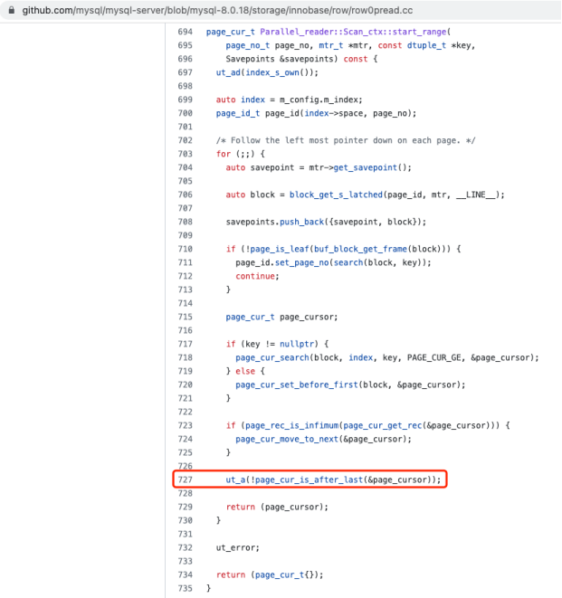
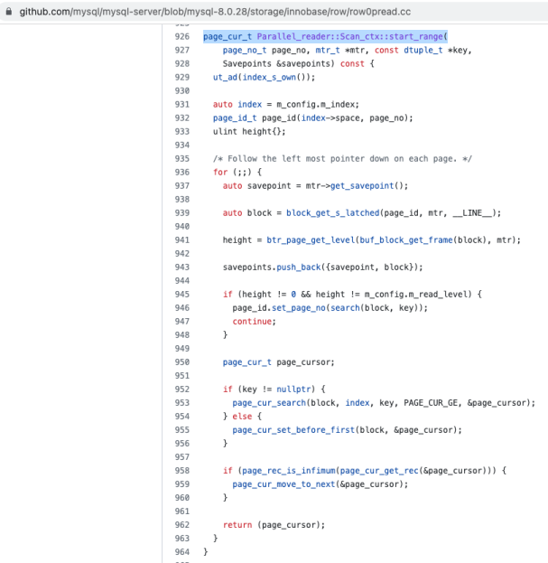
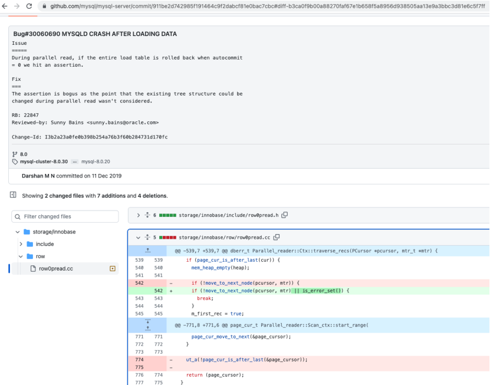

# 故障分析 | MySQL 节点宕机分析一例

**原文链接**: https://opensource.actionsky.com/20221101-mysql/
**分类**: MySQL 新特性
**发布时间**: 2022-10-31T22:02:20-08:00

---

作者：周启超
爱可生北分团队 DBA，主要负责项目前期建设及后期疑难问题支持。做事认真，对事负责。 
本文来源：原创投稿
*爱可生开源社区出品，原创内容未经授权不得随意使用，转载请联系小编并注明来源。
之前遇到一个问题，用户反馈 MySQL MGR 环境发生了故障切换。作为一名运维，首先应该知道从日志信息里面去找信息。我们很幸运，在对应的时间点，有错误日志信息。而且可以明确的是，切换原因就在这段错误日志信息当中。错误日志中堆栈信息如下：
2022-04-12T03:03:36.435579+08:00 0 [ERROR][MY-013183][InnoDB]Assertion failure: row0pread.cc:727:!page_cur_is_after_last(&page_cursor) thread 140441717634816 
InnoDB: We intentionally generate a memory trap.
InnoDB: Submit a detailed bug report to http://bugs.mysql.com. 
InnoDB: If you get repeated assertion failures or crashes, even 
InnoDB: immediately after the mysqld startup, there may be 
InnoDB: corruption in the InnoDB tablespace. Please refer to
InnoDB: http://dev.mysql.com/doc/refman/8.0/en/forcing-innodb-recovery.html 
InnoDB:about forcing recovery.
19:03:36 UTC-mysqld got signal 6;
Most likely, you have hit a bug, but this error can also be caused by malfunctioning hardware. 
Thread pointer:0x0
Attempting backtrace. You can use the following information to find out 
where mysqld died. If you see no messages after this, something went terribly wrong...
stack_bottom=0 thread_stack 0x46000
/usr/sbin/mysqld(my_print_stacktrace(unsigned char const*, unsigned long)+0x41) [0xlefdd01] 
/usr/sbin/mysqld(handle_fatal_signal+0x333)[0xfadec3]
/lib64/libpthread.so.0(+0x12ddo)[0x7fc70518cdd0] 
/lib64/libc.so.6(gsignal+0x10f)[0x7fc7030b099f] 
/lib64/libc.so.6(abort+0x127)[0x7fc70309acf5] 
/usr/sbin/mysqld()[0xd15c02]
/usr/sbin/mysqld(Parallel_reader::Scan_ctx::start_range(unsigned int, mtr_t*, dtuple_t const*, std::vector<std::pair<unsigned long, buf_block_t*>, ut_allocator<std::pair<unsigned long, buf_block_t*>>>&)const+0x27b)[0x211502b]
/usr/sbin/mysqld(Parallel_reader::Scan_ctx: :create_ranges(Parallel_reader::Scan_range const&, unsigned int, unsigned long, unsigned long, std::vector<std::pair<std::shared_ptr
<Parallel_reader::Scan_ctx::Iter>, 
std::shared_ptr<Parallel_reader::Scan_ctx::Iter>>, 
ut_allocator<std::pair<std: :shared_ptr<Parallel_reader::Scan_ctx::Iter>, 
std::shared_ptr 
<Parallel_reader: :Scan_ctx::Iter> >> >&, mtr_t*)+0x706) [0x2117476]
/usr/sbin/mysqld(Parallel_reader::Scan_ctx: :create_ranges(Parallel_reader::Sca_range const&, unsigned int, unsigned long, unsigned long, std::vector<std::pair<std::shared_ptr
<Parallel_reader::Scan_ctx::Iter>, 
std::shared_ptr<Parallel_reader::Scan_ctx::Iter>>, 
ut_allocator<std::pair<std: :shared_ptr<Parallel_reader::Scan_ctx::Iter>, std::shared_ptr
<Parallel_reader::Scan_ctx::Iter>>>>&,mtr_t*)+0xbc0)[0x2117930]
/usr/sbin/mysqld(Parallel_reader::Scan_ctx::partition(Parallel reader::Scan_range const&, unsigned long)+0x17f)[0x2117fbf] 
/usr/sbin/mysqld(Parallel reader::Ctx::split()+0x65)[0x21183a5]
/usr/sbin/mysqld(Parallel_reader::worker(unsigned long)+0x8d) [0x211871d]
/usr/sbin/mysald(std::thread::_State_impl<std::thread::_Invoker<std::tuple<Runnable, void (Parallel_reader::*)(unsigned long), Parallel_reader*, unsigned long> > >::_M_run()+0xd4)[0x210e2b4]
/lib64/libstdc++.so.6(+0xc2b23)[0x7fc703a98b23]
/lib64/libpthread.so.0(+0x82de)[0x7fc7051822de]
/1ib64/1ibc.so.6(clone+0x43)[0x7fc7031754b3] 
The manual page at http://dev.mysql.com/doc/mysql/en/crashing.html contains information that should help you find out what is causing the crash.
通过 mysqld got signal 6 ;可以初步判断为 MySQL 逻辑处理相关问题。根据对应堆栈信息找到对应的报错位置。确认问题代码位置为 row0pread.cc , line 727（其实本例中错误日志中已经提示了问题发生代码位置）：
(gdb) b *0x211502b
Breakpoint 1 at 0x211502b: file 
/usr/src/debug/mysql-community-8.0.18-1.el8.x86_64/mysql-8.0.18/storage/innobase/row/row0pread.cc, line 727.
MySQL8.0.18的row0pread.cc, line 727内容：

对比后续版本MySQL 8.0.28和MySQL 8.0.18差异，可以看到MySQL8.0.28中已经去掉了对应ut_a(!page_cur_is_after_last(&page_cursor));代码。
MySQL 8.0.18：

MySQL 8.0.28：

查找变更历史，找到官方对去掉ut_a(!page_cur_is_after_last(&page_cursor))；的描述。找到MySQL Bug#30060690。涉及到如下bug，详见bug描述。
https://github.com/mysql/mysql-server/commit/911be2d742985f191464c9f2dabcf81e0bac7cbc

根据bug描述，可以看到此bug触发的原因是在MySQL 8.0.18版本，并行读没有考虑到存在的树结构变化的场景。
仅此一例，供大家日后遇到同样问题，查阅参考。