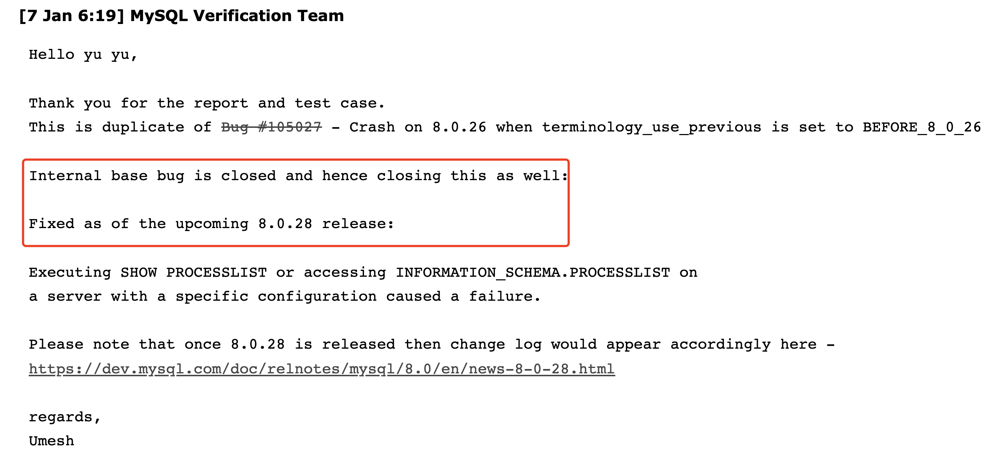

# 故障分析 | MySQL 设置 terminology_use_previous 参数导致数据库 Crash

**原文链接**: https://opensource.actionsky.com/%e6%95%85%e9%9a%9c%e5%88%86%e6%9e%90-mysql-%e8%ae%be%e7%bd%ae-terminology_use_previous-%e5%8f%82%e6%95%b0%e5%af%bc%e8%87%b4%e6%95%b0%e6%8d%ae%e5%ba%93-crash/
**分类**: MySQL 新特性
**发布时间**: 2022-01-12T19:28:31-08:00

---

作者：余振兴
爱可生 DBA 团队成员，热衷技术分享、编写技术文档。
本文来源：原创投稿
*爱可生开源社区出品，原创内容未经授权不得随意使用，转载请联系小编并注明来源。
## 背景信息
由于安全因素,客户需要将 MySQL 升级到 8.0.26 版本,但由于 8.0.26 的`一些术语的不兼容性变更`,对于监控采集的工具/程序会出现异常,针对这个情况，MySQL 官方也提供了解决方案，那就是新增了一个参数`terminology_use_previous`，当将该参数设置为`BEFORE_8_0_26`时，可以保持 8.0.26 版本之前的术语形式，如依旧保持 master,slave 的术语形式，以下是官方文档 8.0.26 release note 的描述片段摘要
`Incompatible Change: From MySQL 8.0.26, new aliases or replacement names are provided for most remaining identifiers that contain the terms “master”, which is changed to “source”; “slave”, which is changed to “replica”; and “mts” (for “multithreaded slave”), which is changed to “mta” (for “multithreaded applier”). Help text is also changed where applicable to use the new names.
If the incompatible changes do have an impact for you, you can set the new system variable terminology_use_previous to BEFORE_8_0_26 to make MySQL Server use the old versions of the names for the objects specified in the previous list. This enables monitoring tools that rely on the old names to continue working until they can be updated to use the new names. The system variable can be set with session scope to support individual functions, or global scope to be a default for all new sessions. When global scope is used, the slow query log contains the old versions of the names.
`
**当升级到 8.0.26 完成后,数据库开启正常监控采集,频繁的触发了 MySQL crash ，需要分析是什么原因导致**，以下的分析日志均为测试环境模拟。
## 故障分析
查看 crash 日志我们可以看到 crash 时 MySQL 最后执行的是一条`select * from information_schema.processlist`命令，从 crash 的堆栈信息来看，基本就是执行一个普通的 sql 触发了 libstdc 这个库的异常，导致数据库发出信号直接 abort MySQL ，个人不太懂代码。从错误信息中`basic_string::_S_construct null not valid`的关键字搜索了解到，这是一个 C++ 的报错,大致含义是：一个实例化的逻辑错误导致程序中止。在 what()函数中不能使用 NULL 来构造 basic_string 的对象.
`terminate called after throwing an instance of 'std::logic_error'
what():  basic_string::_S_construct null not valid
10:11:30 UTC - mysqld got signal 6 ;
Most likely, you have hit a bug, but this error can also be caused by malfunctioning hardware.
Thread pointer: 0x7f9924000c20
Attempting backtrace. You can use the following information to find out
where mysqld died. If you see no messages after this, something went
terribly wrong...
stack_bottom = 7f9980596d80 thread_stack 0x46000
/data/mysql/3320/base/bin/mysqld(my_print_stacktrace(unsigned char const*, unsigned long)+0x2e) [0x2251b8e]
/data/mysql/3320/base/bin/mysqld(handle_fatal_signal+0x323) [0x10fc283]
/lib64/libpthread.so.0(+0xf5f0) [0x7f99908d25f0]
/lib64/libc.so.6(gsignal+0x37) [0x7f998eb1d337]
/lib64/libc.so.6(abort+0x148) [0x7f998eb1ea28]
/lib64/libstdc++.so.6(__gnu_cxx::__verbose_terminate_handler()+0x165) [0x7f998f42da95]
/lib64/libstdc++.so.6(+0x5ea06) [0x7f998f42ba06]
/lib64/libstdc++.so.6(+0x5ea33) [0x7f998f42ba33]
/lib64/libstdc++.so.6(+0x5ec53) [0x7f998f42bc53]
/lib64/libstdc++.so.6(std::__throw_logic_error(char const*)+0x77) [0x7f998f480857]
/data/mysql/3320/base/bin/mysqld() [0xea8720]
/lib64/libstdc++.so.6(std::basic_string, std::allocator >::basic_string(char const*, std::allocator const&)+0x38) [0x7f998f48c998]
/data/mysql/3320/base/bin/mysqld(THD::proc_info(System_variables const&) const+0x43) [0xf35d33]
/data/mysql/3320/base/bin/mysqld() [0x10216b0]
/data/mysql/3320/base/bin/mysqld(Fill_process_list::operator()(THD*)+0x2c8) [0x1024b58]
/data/mysql/3320/base/bin/mysqld(Global_THD_manager::do_for_all_thd_copy(Do_THD_Impl*)+0x220) [0xebc6d0]
/data/mysql/3320/base/bin/mysqld() [0x1020a13]
/data/mysql/3320/base/bin/mysqld(do_fill_information_schema_table(THD*, TABLE_LIST*, Item*)+0x83) [0x1025923]
/data/mysql/3320/base/bin/mysqld(MaterializeInformationSchemaTableIterator::Init()+0x91) [0x14550a1]
/data/mysql/3320/base/bin/mysqld(Query_expression::ExecuteIteratorQuery(THD*)+0x345) [0x1085465]
/data/mysql/3320/base/bin/mysqld(Query_expression::execute(THD*)+0x2c) [0x10856cc]
/data/mysql/3320/base/bin/mysqld(Sql_cmd_dml::execute(THD*)+0x2c5) [0x101a885]
/data/mysql/3320/base/bin/mysqld(mysql_execute_command(THD*, bool)+0xac8) [0xfbc2c8]
/data/mysql/3320/base/bin/mysqld(dispatch_sql_command(THD*, Parser_state*)+0x410) [0xfc0b00]
/data/mysql/3320/base/bin/mysqld(dispatch_command(THD*, COM_DATA const*, enum_server_command)+0x1f10) [0xfc2e90]
/data/mysql/3320/base/bin/mysqld(do_command(THD*)+0x174) [0xfc3bf4]
/data/mysql/3320/base/bin/mysqld() [0x10ed858]
/data/mysql/3320/base/bin/mysqld() [0x2778d4c]
/lib64/libpthread.so.0(+0x7e65) [0x7f99908cae65]
/lib64/libc.so.6(clone+0x6d) [0x7f998ebe588d]
Trying to get some variables.
Some pointers may be invalid and cause the dump to abort.
Query (7f9924019488): select * from information_schema.processlist
Connection ID (thread ID): 9
Status: NOT_KILLED
The manual page at http://dev.mysql.com/doc/mysql/en/crashing.html contains
`
如果是程序逻辑的问题,对于我们就有点无力了,但还是尝试再进一步采集相关信息观测,我们配置在 MySQL crash 时自动生成生成 coredump ，通过整理查看到以下信息(片段有删减,只截取了部分关键片段)，在对`_S_construct`结构做定义时出现了`__throw_logic_error`，基本和 carsh 日志中记录的信息一致(能力有限，未能详细分析其中代码逻辑)，coredump 的生成方式可参考链接：https://opensource.actionsky.com/20200424-mysql/
`Thread 1 (Thread 0x7f1ee80c9700 (LWP 12545)):
#0  0x00007f1efa7e3a01 in pthread_kill () from /lib64/libpthread.so.0
#1  0x00000000010fc2ad in handle_fatal_signal ()
#2  
#3  0x00007f1ef8a33277 in raise () from /lib64/libc.so.6
#4  0x00007f1ef8a34968 in abort () from /lib64/libc.so.6
#5  0x00007f1ef93427d5 in __gnu_cxx::__verbose_terminate_handler() () from /lib64/libstdc++.so.6
#6  0x00007f1ef9340746 in ?? () from /lib64/libstdc++.so.6
#7  0x00007f1ef9340773 in std::terminate() () from /lib64/libstdc++.so.6
#8  0x00007f1ef9340993 in __cxa_throw () from /lib64/libstdc++.so.6
#9  0x00007f1ef9395597 in std::__throw_logic_error(char const*) () from /lib64/libstdc++.so.6
#10 0x0000000000ea8720 in char* std::string::_S_construct(char const*, char const*, std::allocator const&, std::forward_iterator_tag) ()
#11 0x00007f1ef93a1778 in std::basic_string, std::allocator >::basic_string(char const*, std::allocator const&) () from /lib64/libstdc++.so.6
#12 0x0000000000f35d33 in THD::proc_info(System_variables const&) const ()
#13 0x00000000010216b0 in thread_state_info(THD*, THD*) ()
#14 0x0000000001024b58 in Fill_process_list::operator()(THD*) ()
#15 0x0000000000ebc6d0 in Global_THD_manager::do_for_all_thd_copy(Do_THD_Impl*) ()
#16 0x0000000001020a13 in fill_schema_processlist(THD*, TABLE_LIST*, Item*) ()
#17 0x0000000001025923 in do_fill_information_schema_table(THD*, TABLE_LIST*, Item*) ()
#18 0x00000000014550a1 in MaterializeInformationSchemaTableIterator::Init() ()
#19 0x0000000001085465 in Query_expression::ExecuteIteratorQuery(THD*) ()
#20 0x00000000010856cc in Query_expression::execute(THD*) ()
#21 0x000000000101a885 in Sql_cmd_dml::execute(THD*) ()
#22 0x0000000000fbc2c8 in mysql_execute_command(THD*, bool) ()
#23 0x0000000000fc0b00 in dispatch_sql_command(THD*, Parser_state*) ()
#24 0x0000000000fc2e90 in dispatch_command(THD*, COM_DATA const*, enum_server_command) ()
#25 0x0000000000fc3bf4 in do_command(THD*) ()
#26 0x00000000010ed858 in handle_connection ()
#27 0x0000000002778d4c in pfs_spawn_thread ()
#28 0x00007f1efa7dee25 in start_thread () from /lib64/libpthread.so.0
#29 0x00007f1ef8afbbad in clone () from /lib64/libc.so.6
`
经过一系列排除式验证，发现如果不考虑兼容监控采集的正确性，将`terminology_use_previous`参数设置为默认值`NONE`时，不会触发 crash 的现象,也就是说是由于该参数的配置导致的异常行为，并且通过逐个排除，基本确定以下2个关键点
- 
terminology_use_previous 必须设置为 BEFORE_8_0_26
- 
必须有对 PROCESSLIST 表的访问请求
接下来关注 crash 时记录的对 processlist 表的查询操作，我们查看官方文档对 processlist 表的说明可以看到，对 processlist 表的查询会持有`global mutex`，频繁的查询其实会对性能有一定影响，但理论上并不会造成 crash ，当然官方也提供了一个参数`performance_sche ma_show_processlist`来实现无锁版的进程状态采集
`The default SHOW PROCESSLIST implementation iterates across active threads from within the thread manager while holding a global mutex. This has negative performance consequences, particularly on busy systems. The alternative SHOW PROCESSLIST implementation is based on the Performance Schema processlist table. This implementation queries active thread data from the Performance Schema rather than the thread manager and does not require a mutex.
The SHOW PROCESSLIST statement provides process information by collecting thread data from all active threads. The performance_schema_show_processlist variable determines which SHOW PROCESSLIST implementation to use:
The alternative SHOW PROCESSLIST implementation is based on the Performance Schema processlist table. This implementation queries active thread data from the Performance Schema rather than the thread manager and does not require a mutex.
`
尝试开启`performance_schema_show_processlist=on`参数及设置`terminology_use_previous=BEFORE_8_0_26`来规避`global mutex`，但依旧能稳定复现 crash 现象，而使用 performance_schema.threads 表做会话状态的查询则并不会触发 crash ，所以实际上虽然官方文档中提到设置 performance_schema_show_processlist=on 和查询 performance_schema.threads 都是不加锁的实现,但两者的实现方式应该是有差异的。
几番验证下来依旧定位不到问题所在,尝试搜索下 MySQL bug 列表看是否有类似 bug ，以及浏览 release note 看是否新版本有对该问题的修复或描述,得到的情况是并未有相关的 bug 的描述,但在 8.0.27 的 release note 中提到一句有相关性的信息,`当并发的访问 INFORMATION_SCHEMA.PROCESSLIST 表时,会导致 MySQL 故障`(该说明后的 Bug #32625376是 MySQL 内部 BUG 号，我们无法查看到具体信息)
`A SELECT query on the INFORMATION_SCHEMA.PROCESSLIST view with concurrent MySQL Server load caused a failure. (Bug #32625376)
`
尝试在 8.0.26 版本开多个会话，同时执行`select * from INFORMATION_SCHEMA.PROCESSLIST`，并且关闭监控采集的干扰,果然稳定复现 crash 现象，(用 show processlist 也可复现)。 看来确实是这个问题，于是开始将 MySQL 版本升级到 8.0.27 ，再进行验证，遗憾的是，当升级到 8.0.27 以后依旧可以复现这个问题，看来并未彻底解决。
于是尝试给 MySQL 提个 BUG 说明,很快得到了官方回复,确认该现象已在内部确认为 BUG ，会在即将发布的 8.0.28 版本做修复

## 故障总结
- 
本次个人分析因能力有限并未彻底了解该BUG的深层次原因，但从最近的几个版本来看,因为一些术语的变化，实对 MySQL 的使用和兼容性上造成了一定影响
- 
对于一些比较诡异的现象可以尝试搜索 MySQL BUG 列表或向官方提 issue，也行就能快速得到结果
- 
对于监控采集程序,如果需要采集会话信息,推荐使用 performance_schema.threads 表
- 
对会话信息的采集频率不要太高，尤其会话较多的情况下，始终会对性能有一定影响
- 
本文中涉及的 bug 在单个会话或多个会话低频的访问 processlist 表都不会触发 crash